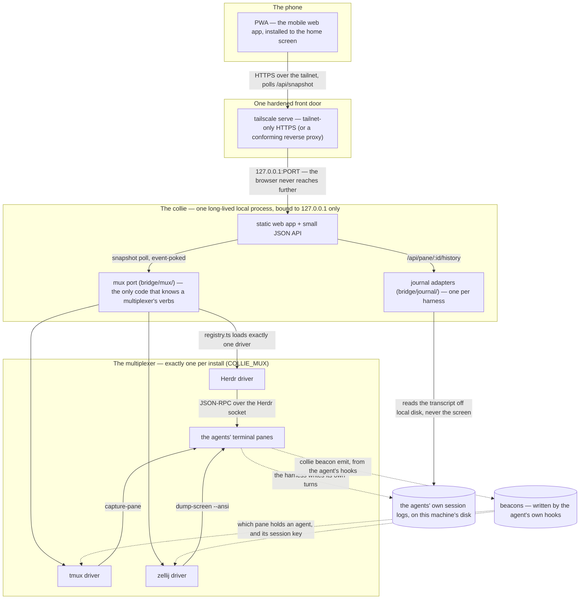

# Architecture — Collie (a phone web UI for a terminal multiplexer, over Tailscale)

> **Why Collie is shaped the way it is.** The deployment model, the interaction loop, and especially
> the security posture — the reasoning the code can't state itself. This describes what is built; a
> few deliberate *non*-decisions are called out as such, and §8 parks ideas that are not built on
> purpose. For how to run it see [`README.md`](./README.md); for repo conventions
> [`CLAUDE.md`](./CLAUDE.md); for the verified socket contract [`HERDR_API.md`](./HERDR_API.md); for
> the multiplexer seam [`MUX_CONTRACT.md`](./MUX_CONTRACT.md); for the lead↔peer wire
> [`PACK_PROTOCOL.md`](./PACK_PROTOCOL.md).

## 1. The problem (real workflow, real pain)

The route Collie replaces: **Termux on Android → SSH into a tailnet machine → run the Herdr TUI.**
Three pains:

1. The on-screen **terminal keyboard is terrible** to type on.
2. **No voice control** in a terminal.
3. **Re-SSHing / re-logging-in every time** is tedious.

The goal: a **mobile web interface, reachable over Tailscale, that you don't have to keep logging
into** — so you can check on and steer your agent herd from a phone with the native keyboard and
voice, no SSH.

## 2. What Collie is

A **collie** — a long-lived local process that

- drives one terminal multiplexer through the **mux port** (`bridge/mux/`, §5) — Herdr's Unix-socket
  API (`$HERDR_SOCKET_PATH`) by default, tmux or zellij by configuration,
- serves a **mobile-first web app**, with live state polled over HTTP (see §5),
- translates browser actions → socket methods,
- sits behind **one hardened front door** — `tailscale serve` (default; tailnet-only HTTPS +
  MagicDNS) or a conforming reverse proxy
  ([docs/deployment.md → Variant C](./docs/deployment.md#variant-c--reverse-proxy-as-the-only-front-door-no-tailscale)) —
  installable as a **PWA**.

The browser never touches the multiplexer directly; the bridge is the only thing that does.

```
   phone / laptop (PWA)
        │  HTTPS over tailnet  (https://herd.<tailnet>.ts.net)
        ▼
   tailscale serve  ── injects identity headers, terminates TLS   (Variant C: a reverse proxy instead)
        │  127.0.0.1:PORT   (bridge binds loopback ONLY)
        ▼
   Collie (this project)
     • static web app + small JSON API (browser polls /api/snapshot)
     • mux port (bridge/mux/ — the ONLY code that knows a multiplexer's verbs)
     • snapshot poll, event-poked (see §5)
        │  the driver's own transport
        ▼
   Herdr / tmux / zellij (owns panes, agents, state)
```

Every operator verb is `bin/collie <verb>`, implemented once in `cli/` — pairing, serving, packs,
speech-to-text, build and update. `scripts/collie-ctl.sh` is a frozen bootstrap shim that compiles
the binary and `exec`s it; it implements nothing
([ADR 0006](./.adr/0006-update-advances-the-checkout-herdr-installed.md)).

### 2.1 One collie is the floor; a **pack** is several of them

Everything above describes one machine. A pack is several machines each running a **full collie**, one
of which — the **lead** — holds the front door the phone talks to. A pack of one is today's install
exactly, and pays no tax for the feature ([`PACK_PROTOCOL.md` §11](./PACK_PROTOCOL.md#11-the-solo-zero-tax-contract)).

```
   phone / laptop (PWA)
        │  HTTPS  /api/*   (the phone talks to the lead and to NOTHING else)
        ▼
   lead collie  ── managed front door, serves the PWA
        │  /pack/v1/*  ── pinned mutual TLS + pack secret, lead dials outbound
        ├──────────────▶ peer collie      (no front door; its own mux, journal, uploads, audit)
        └──────────────▶ deputy collie    (a peer, plus a warrant naming it)
                              ╎  standby door: bound, never published, three routes
   operator ─ ssh ─▶ every member          ← code rides HERE, never the pack link
```

- **The lead consumes a peer's *Collie* HTTP API.** It never dials a peer's multiplexer across a
  machine boundary, and no Herdr (or tmux, or zellij) verb ever crosses the link — that is the
  mux-driver seam ([ADR 0011](./.adr/0011-the-pack-protocol-is-the-mux-driver-seam.md)). What crosses
  is Collie's own domain model: snapshots, pane grids, replies, history, uploads. What never crosses:
  software. `collie pack add` / `pack update` push a git bundle over the **operator's own ssh**
  ([ADR 0016](./.adr/0016-updates-ride-the-operators-ssh.md)), so the link is never a distribution
  channel. A peer may also level itself to the release its lead is running, taking that public tag
  from GitHub over anonymous HTTPS on its own decision (ADR 0016's addendum,
  [`PACK_PROTOCOL.md` §20](./PACK_PROTOCOL.md)); still no code, route or verb on the link.
- **Two independent factors gate `/pack/v1/*`,** before any handler runs: **pinned mutual TLS** and
  the **pack secret** ([`PACK_PROTOCOL.md` §8](./PACK_PROTOCOL.md#8-trust-enrollment-factors-rotation)).
  Neither browser gate of §6 applies there, and a peer publishes nothing — its listener is a path
  prefix on its own bind, not a front door
  ([ADR 0013](./.adr/0013-a-peer-listens-without-becoming-a-front-door.md)).
- **The deputy is named ahead of time, never elected.** The operator names one peer while the pack is
  healthy and the lead signs a **warrant** saying so; a higher generation supersedes it everywhere it
  lands, and revocation is generation *N+1* naming nobody. Nothing infers a dead lead from silence —
  the operator is the quorum ([ADR 0026](./.adr/0026-the-operator-is-the-quorum.md) ·
  [ADR 0027](./.adr/0027-the-deputy-is-named-ahead-of-time.md) ·
  [`PACK_PROTOCOL.md` §18](./PACK_PROTOCOL.md#18-the-deputy-and-the-warrant-added-2026-08-20)).
- **The standby door is a second listener that arms on silence and is spent by the operator.** It
  binds `COLLIE_STANDBY_PORT` (absent ⇒ no door), serves three routes and `404`s everything else, and
  arms only while a verified warrant names this machine, the lead has been silent past a threshold,
  and a synced pairing registry is non-empty. Arming grants nothing: the takeover is confirmed with
  the phone's own pairing credential ([ADR 0028](./.adr/0028-the-standby-door-is-a-second-listener.md) ·
  [`PACK_PROTOCOL.md` §18.15](./PACK_PROTOCOL.md#18-the-deputy-and-the-warrant-added-2026-08-20)).

## 3. Deployment model — **systemd user service, not a plugin pane**

This is the clearest call in the design. A plugin **pane** runs inside a terminal pane: if the pane
closes, the user detaches, or Herdr restarts, the bridge dies — exactly when you're on mobile and not
watching the TUI. A long-lived network daemon must be supervised independently.

- **The bridge runs as a `systemd --user` service** (launchd agent on macOS) — starts at login,
  restarts on failure, survives Herdr restarts.
- **The Herdr plugin stays — as a thin registration/launcher,** so Collie shows up in
  `herdr plugin list` and Herdr conventions still apply. Its `[[actions]]` are frozen command strings
  that hand a verb to `scripts/collie-ctl.sh`, which `exec`s the compiled `bin/collie` — start, stop,
  update, **print the tailnet URL**; they do *not* host the server. A
  `[[build]]` step builds the web UI on `herdr plugin install` (GitHub); local `link` installs skip
  it and build lazily on first `start`. Concretely that's `[[actions]]` + `[[build]]` and nothing
  else: `[[panes]]` is what this section argues against, and `[[events]]` would duplicate the
  bridge's own `events.subscribe` stream (§5).
- **The checkout on disk *is* the plugin — in one of two shapes.** `herdr plugin install` does not
  clone: it `git init`s, `git fetch --depth 1 origin HEAD`s and `git checkout --detach FETCH_HEAD`s
  into `~/.config/herdr/plugins/github/<hashed-id>`, so a turnkey install is **detached and shallow**
  with no remote-tracking refs, while a linked clone sits on a branch. The `update` action carries
  both ([ADR 0006](./.adr/0006-update-advances-the-checkout-herdr-installed.md)) because Herdr has no
  `plugin update` of its own — its refresh is a reinstall, which replaces the checkout but does not
  restart the service.
- **Endpoint discovery is per driver.** A non-Herdr-launched daemon won't get `$HERDR_SOCKET_PATH`
  injected, so the Herdr driver resolves the path from a well-known location
  (`~/.config/herdr/herdr.sock` default, or the bridge's own config) and re-resolves on reconnect in
  case it moves. The other drivers take `COLLIE_MUX_ENDPOINT_<NAME>` in their own words — a tmux
  server socket, a zellij session name ([`MUX_CONTRACT.md`](./MUX_CONTRACT.md) → *Pointing a collie at
  a multiplexer*). A unit file that drops `XDG_RUNTIME_DIR` breaks zellij discovery; the same file is
  where a plugin action's minimal environment bites.

## 4. The core interaction loop

Deliberately **not** full terminal mirroring. The loop:

```
agent goes blocked
   → PUSH notification  (which agent, which workspace — see the gap below)
   → tap → app opens to that agent
   → the pane, with recognised prompts parsed into tappable blocks
       (prompt-select · preview-select · wizard)   ← structured, not a raw screenful
   → reply:  plain text box (the phone keyboard's own dictation works in it;
                             an in-app mic appears only after `collie stt setup`)
             + quick actions + a special-key strip
   → explicit Send button  → typeText + Enter, verified
   → "Sent ✓" + card flips blocked → working   ("did it land?" confirmation)
```

Product details that shaped the loop:

- **Don't show a raw screenful.** A "last screenful" is often a mid-stack-trace — the actual
  question is lines above. Collie parses recognised prompts out of the pane text into interactive
  blocks (`web/src/lib/blocks.ts`), so answering a permission dialog or a menu is a tap, not a
  transcription exercise. The raw pane stays below for context.
  - **Where this stops short of the design.** The original intent was for the *bridge* to capture the
    output chunk at the moment Herdr says an agent went blocked, and hand the client a structured
    `BlockingMessage`. That was never built: parsing is client-side and pattern-based, over whatever
    the current pane happens to show. It works because agent prompts are formulaic, and it degrades
    to "read the pane" when they aren't.
- **Dictation needs zero special build; the in-app mic is opt-in.** The reply box is a plain text
  field, so the phone keyboard's own mic works in it with nothing built, and Send stays an explicit
  button — dictated text is reviewable before it goes. Beyond that, `collie stt setup` switches on
  Collie's own record button through a provider seam (`bridge/stt/`, CLI `cli/stt.ts`,
  [docs/voice-and-push.md → Voice input](./docs/voice-and-push.md#voice-input-optional)). The seam is **absent until that verb
  runs**: no key, no outbound path, no child process, no button. Turning it on is what buys the
  credential in the state dir and the outbound path carrying microphone audio — a local engine keeps
  that egress on loopback, and hands-free sends go through the same guarded reply path a typed reply
  takes ([ADR 0029](./.adr/0029-speech-to-text-is-a-provider-seam-collie-owns.md)).
- **Quick replies are heuristics, not guarantees.** Different agents expect different input (a Y/n
  prompt vs a numbered menu vs an approval phrase), so there is always a **"send exactly what I
  type"** fallback.
- **Opinionated triage.** The home screen leads with **"NEEDS YOU"** — blocked agents at top,
  working/idle collapsed below. Simultaneous blocks batch into one summary notification, not three
  races. The split rests on the `agentDetection` capability: a driver that cannot tell an agent from a
  shell says so, and the screen is panes rather than a triage it would have to invent.
- **Close the trust loop.** A "Sent" state on the `POST`'s HTTP response, then the visible
  blocked→working transition. Without it, latency makes users double-tap.
- **Manage a pane in place.** Long-pressing a pane pill in the tab's pane switcher opens a small
  actions sheet — rename it (the label then leads its cards/headers), close it, or **show it in the
  operator's own terminal**. All three are declared capabilities (`renamePane`, `closePane`,
  `setFocus`), greyed out where a driver declines them, and all three are writes the security posture
  already covers (`web/src/components/pane-actions-sheet.tsx`). Moving the operator's terminal happens
  on that one named tap and never as a side effect of navigation
  ([ADR 0031](./.adr/0031-freshness-is-a-declared-promise.md)).

**Known gap — the notification body doesn't carry the question.** The design called for putting the
agent's question *in* the notification, so a tap is actionable even before the app loads (§7 explains
why that matters on Android). What ships identifies **which** agent needs you — title `<agent>
<verb>`, body `<workspace> · <cwd>` (`bridge/notifications.ts`) — and you read the question in the
app. Closing this needs the server-side blocking-message capture described above.

## 5. Architecture notes

The shape of one collie, end to end — the ASCII sketches in §2 stay the precise ones; this is the
overview the rest of this section fills in.



- **`bridge/mux/` is a port with three drivers, and nothing above it knows which one is loaded.** The
  port is Collie's own contract (`types.ts`), not Herdr's shape renamed
  ([ADR 0022](./.adr/0022-the-mux-seam-is-a-port-collie-owns.md)); the drivers are `herdr/`, `tmux/`
  and `zellij/`, and `registry.ts` is the one place `COLLIE_MUX` becomes an adapter. A driver is the
  only code that knows its multiplexer's verbs (`pane.read`, `capture-pane -p -e`,
  `dump-screen --ansi`, …) and it translates to/from the internal domain model (`AgentStatus`,
  `AgentView`, `SnapshotResponse` — `bridge/types.ts`), so a Herdr API rename is a one-driver fix.
  - **Each driver declares what it can do** (`capabilities.ts`) and the declaration is **fail-closed**:
    an unprobed cell is never declared supported. The UI asks the capability, never the multiplexer's
    name — `setFocus`, `gridScrollback`, `createSpace` and the rest are read out of `/api/config`
    (`web/src/lib/mux-capability.ts`). `unsupported` is a refusal shape the UI explains, not an error.
  - **Freshness, focus and shape are declared promises, not folklore**
    ([ADR 0031](./.adr/0031-freshness-is-a-declared-promise.md)): `topologyLatency` says `push` or
    `bounded {ms}` — a ceiling, so the phone can say "synced Ns ago" and offer `POST /api/refresh`
    (a read: it mutates nothing); `MuxPane.focused` means exactly *the pane the operator's own
    terminal is showing*, and moving it is the separate `setFocus` capability behind one named tap,
    never a side effect of navigation; `spaces: "one" | "many"` is why zellij renders no space strip.
  - **A shared conformance suite** (`conformance.ts`, run per driver) holds every adapter to the
    contract's floor and to its own declaration. The capability matrix, with the probe behind each
    cell, is [`MUX_CONTRACT.md`](./MUX_CONTRACT.md); adding a driver is
    [`MUX_CONTRIBUTING.md`](./MUX_CONTRIBUTING.md).
- **One protocol, two dialers** (the Herdr driver's transport). Herdr's control socket is AF_UNIX on
  Linux/macOS and a *named pipe*
  on Windows (named after the full socket path). `bridge/dial.ts` is the only place that knows the
  difference: `Bun.connect({unix})` on POSIX, `node:net` on Windows. The wire protocol is identical —
  the `interprocess` crate Herdr uses inserts no framing or metadata, so the same newline-delimited
  JSON-RPC speaks to both, streaming `events.subscribe` included. `COLLIE_HERDR_DIAL=net` forces the
  Windows dialer anywhere, which is how that branch stays tested off Windows.
- **Output model: poll, not stream — event-poked.** The port's floor is `snapshot()` plus `watch()`
  ("tell me to look again"); whether a driver keeps `watch()` by a push or a census is what
  `pushTopologyEvents` / `pushPaneEvents` declare, and `bridge/event-poker.ts` consumes the
  declaration rather than the name. Herdr, the default driver, exposes `pane.read` (snapshot) and
  `pane.output_matched` (regex event) but **no raw output-stream event**, so there is nothing to
  stream even if we wanted to; the live pane view is poll-on-status-change + caching. Its poll ticks
  `session.snapshot` — one RPC returning every workspace/tab/pane/agent/
  layout — falling back to the `workspace.list` + `pane.list` (+ `tab.list`) trio on older servers
  (full contract in [`HERDR_API.md`](./HERDR_API.md)). A long-lived `events.subscribe` stream runs
  alongside purely to **poke** that poll: lifecycle events plus a per-agent-pane
  `pane.agent_status_changed` subscription trigger an immediate debounced re-poll, while the interval
  relaxes to `COLLIE_POLL_IDLE_MS` (12 s default) whenever the stream is healthy and drops back to
  the fast `COLLIE_POLL_MS` when it isn't. **The snapshot poll stays the source of truth throughout —
  a missed event costs one interval, never correctness.**
- **Scrollback comes from the transcript, not the terminal.** An agent's TUI runs on the *alternate
  screen* (`ESC[?1049h`), so the emulator keeps no scrollback ring and a grid read can never return
  more than the visible viewport — the live mirror physically cannot scroll back past it. (Screen
  scrollback, where a driver has it, is its own capability — `gridScrollback` — and it is untyped
  screen text, never the agent's turns.) Pane history is therefore read from the agent's **own
  transcript file** off disk (`bridge/journal/`,
  `/api/pane/:id/history`), a separate source from the mirror with different fidelity: turns and
  their text, not a replay of the screen. Each harness writes a different log in a different place,
  so this is a **per-agent adapter** (`bridge/journal/registry.ts` maps the pane's `agent` to one);
  a harness with no adapter simply has no journal. A harness can have **several roots** — one machine
  routinely holds more than one agent home (`CLAUDE_CONFIG_DIR` per Claude profile), so each
  `COLLIE_*_ROOT` takes a comma-separated list, searched in order until a root holds the session id;
  ids are globally unique, so that's a lookup, not a preference. Containment is checked **per root**,
  never against their union. The client fetches the whole conversation in one request
  and renders a window that grows upward, which is what lets find-in-history and jump-to-user-turn
  work across turns you haven't scrolled to. Rationale and the measured numbers are commented at the
  top of `web/src/routes/history.tsx`.
- **The browser polls too.** `useRevalidator` → `/api/snapshot` on an adaptive interval. There is no
  WebSocket fan-out to the browser and no push of state; pulling is what makes the two recovery loops
  below trivial.
- **Two independent recovery loops, designed in from the start** (not retrofitted):
  - *bridge ↔ multiplexer*: the snapshot poll doubles as resync — a failed tick marks the herd
    disconnected (the UI's connection bar names the multiplexer that went away) and keeps retrying;
    the driver's `watch()` reconnects with backoff and re-subscribes, and since it only pokes the
    poll, a dropped watch costs latency, never correctness. A transport that died mid-call answers
    `unreachable`, never `refused` — that distinction is the contract's, not each driver's.
  - *browser ↔ bridge*: polling makes reconnect trivial — failed polls surface in the connection bar
    / offline banner, and the next successful poll heals the UI. No socket lifecycle to manage.
- **Polling moots per-client backpressure.** A push design would need `bufferedAmount` watching so a
  slow phone couldn't OOM the bridge. Each client instead fetches a bounded snapshot at its own pace,
  so there is nothing to buffer or coalesce.
- **Render the pane grid safely** (see §6): strip ANSI **server-side** to plain text and render it as
  React text nodes; never `innerHTML` raw terminal output.
- **PWA cache-busting.** Service workers serve stale clients after an update, so the build stamp
  travels in every response (`X-Collie-Build` header + `/api/config`); on mismatch the footer offers
  "new build — tap to update."
- **The operator's slash-command rows ride `/api/config`** too, read from their `commands.toml`
  behind an mtime check (`bridge/operator-commands.ts`), so editing the file is live like a web
  rebuild. On a pane they address they **replace** the shipped catalog rather than merging into it —
  [ADR 0018](./.adr/0018-operator-command-rows-replace-the-catalog.md). Their **Keys-tray presets**
  ride the same request on the same terms, from `keys.toml` (`bridge/operator-keys.ts`), and their
  **Quick-dock groups** from `quick-replies.toml` (`bridge/operator-quick-replies.ts`); the three
  share one reader (`bridge/operator-file.ts`) and one scope ladder
  (`web/src/lib/operator-scope.ts`). Their **launcher rows**, from `launchers.toml`
  (`bridge/operator-launchers.ts`), share the reader but NOT `/api/config`: a launcher row creates
  its own pane rather than addressing an existing one, so it carries no scope, and its rows ride
  their own session-scoped `GET /api/launchers` instead — rows must come from the host that runs
  them, which a lead-only `/api/config` field cannot say in a pack (PACK_PROTOCOL.md §5).

- **UI strings are translated by a typed dictionary, not a library** (`web/src/lib/i18n/`, six
  locales, English the compile-time source of truth) — `t()`/`tn()` plus the `useLocale()` hook
  (`web/src/hooks/use-locale.ts`), lazy per-locale chunks with an English fallback while one loads.
  **The bridge answers every refusal with a stable `code`** — plus an optional `detail` carrying the
  machine half (the multiplexer's own words, a limit, a reason) — from `bridge/error-codes.ts`,
  mirrored at `web/src/lib/api-error-codes.ts` because the two trees cannot import each other; a
  drift test (`bridge/error-codes.test.ts`) fails the build if the two catalogues disagree. The phone
  translates the **code** and falls back to the bridge's own English sentence for one it doesn't know
  ([ADR 0030](./.adr/0030-the-ui-is-translated-by-a-typed-dictionary-not-a-library.md)).

## 6. Security model

Driving a multiplexer equals **arbitrary code execution on the host** — `typeText` / `sendKeys` type
into live terminals, whichever driver is loaded. The posture is single-user, behind one hardened front
door (tailnet-only by default; one per **pack** — §2.1). These four are genuine RCE vectors and are
**load-bearing — do not regress them:**

- **The bridge binds `127.0.0.1` only** and lets its single front door proxy it. Binding `0.0.0.0`
  makes the whole access check theater. But be exact about what that bind buys: it bounds **remote**
  reach, not local. A multiplexer's own socket is a filesystem object, so its permissions bound
  callers to the owning uid; a TCP port bounds callers to the network namespace, which every uid on the host shares.
  So a process running as a *different* user — an agent you deliberately put under
  `sudo -u agent-review` to contain it — cannot open your herdr socket but **can** open
  `127.0.0.1:$COLLIE_PORT` and drive any pane in the herd. Installing Collie removes that uid
  boundary; if it is the containment you were relying on, the device gate below makes that port
  **read-only** — the one write gate that doesn't rest on "local means trusted". Note its scope: it
  gates writes and only writes, so that uid keeps reading snapshots, pane output and transcript
  history. It bounds damage, not disclosure. Closing the read side is outside what the bridge does —
  it needs the port not to be shared in the first place (its own network namespace, or a uid
  owner-match filter such as nftables `meta skuid`); a plain port firewall rule won't stop a
  same-host peer (raised in [#33](https://github.com/AltanS/collie/issues/33)).
  **Named exception: the pack listener.** When pack federation is enabled, a peer's `/pack/v1/*`
  prefix shares the bridge's one listener and one bind — `COLLIE_HOST`, the operator's to set, with
  a loud warning on a wildcard bind — and admits a request only past two independent factors, pinned
  mutual TLS plus the pack secret, before any handler runs. See [`PACK_PROTOCOL.md` §3](./PACK_PROTOCOL.md#3-roles-and-modes)
  (amended 2026-08-08, F3) and
  [ADR 0013](./.adr/0013-a-peer-listens-without-becoming-a-front-door.md).
  Under `tailscale serve`, the `Tailscale-User-Login` header is the person gate — trusted **only**
  when the request source is loopback (i.e. it came from tailscaled). `COLLIE_TRUSTED_USER` rejects a
  *mismatching* login **and an absent one**: `serve` injects no header for a tagged node, so
  tolerating the absence let any tagged node write. `COLLIE_TRUSTED_USER_OPTIONAL=1` restores the old
  pass, for host-local development. The header exists **only** under `tailscale serve` ingress, so
  under `COLLIE_SKIP_SERVE` only a mismatch is rejected. Under a reverse-proxy front door
  ([docs/deployment.md → Variant C](./docs/deployment.md#variant-c--reverse-proxy-as-the-only-front-door-no-tailscale))
  there is none, and the equivalent write gate is **per-device auth** (`COLLIE_DEVICE_HEADER`) with
  the proxy contract (docs/deployment.md Variant B/C requirements) as the load-bearing piece. That gate **fails
  closed since 0.15.0**: with `COLLIE_DEVICE_HEADER` set, a request arriving without the header is
  read-only, so reaching the port is no longer sufficient to write. Device ids are names your proxy
  asserts, not secrets — treat them as guessable and keep the front door and its ACL as the real
  containment.
  **Device pairing (`bridge/pairing.ts`) is the second, independent write factor**, and the one that
  needs no proxy at all: `collie pair` mints a one-time code out of band (the operator's own
  terminal), the phone trades it at `POST /api/pair` for a 256-bit bearer token, and the bridge keeps
  only its SHA-256. It is enforced exactly when the registry is non-empty, so an install that never
  pairs anything is unchanged, and revocation (`collie devices revoke`) lands on the running service
  without a restart because the registry is re-read per request. The two gates compose by AND —
  neither weakens or replaces the other — and neither touches `/pack/v1/*`, whose two factors are its
  own. Where the header gate answers *is this device on the operator's list*, pairing answers *does
  this device hold a credential I issued*: a claim no proxy, DNS name or tailnet identity can forge.
- **The `Host` header is validated, on by default, and fails closed.** A request whose `Host` is not
  the tailnet name, a loopback name, `COLLIE_PUBLIC_HOSTS` or a configured origin is refused, so a
  DNS-rebound `Host: evil.example` cannot reach the API. `collie start` discovers the node's MagicDNS
  name and Tailscale IPs into `COLLIE_TAILSCALE_HOSTS` and bakes them into the service unit, so a normal tailnet install configures
  nothing; behind your own front door `COLLIE_PUBLIC_HOSTS` is **required**.
  `COLLIE_ALLOW_ANY_HOST=1` is the opt-out, and re-opens rebinding. `/pack/v1/*` is exempt: a lead
  addresses a peer by its own hostname, and that surface carries its own two factors (ADR 0013).
- **The bridge refuses a non-loopback bind.** A `COLLIE_HOST` outside loopback does not start unless
  `COLLIE_ALLOW_NON_LOOPBACK_BIND=1`, and a non-loopback TCP peer is rejected — every gate above
  trusts headers that are only untamperable while the sole client is the local front door. A **pack
  peer** is the one machine that must listen wide, so a pack-configured instance carries the same
  permission implicitly (`bridge/pack/config.ts`) and `/pack/v1/*` is exempt from the peer check.
- **Pane-grid output renders safely** — it's attacker-influenceable (filenames, agent output,
  fetched web content). Never `innerHTML`; it renders as React text nodes under a **strict CSP**
  (`default-src 'self'`), so an escaping miss can't run injected script that calls back into the
  socket.
- **A same-origin gate on every API request** — accepted only when the browser's `Origin` host equals
  the `Host` header the bridge receives (loopback always allowed), so a page on any other tailnet
  device can't CSRF the bridge. With a plain `tailscale serve` on the MagicDNS name these match
  automatically (no config). When Collie is fronted by a *different* public hostname or an extra
  reverse proxy / TLS terminator (custom domain, load balancer, Headscale + upstream TLS, or a
  reverse-proxy front door — [docs/deployment.md → Variant C](./docs/deployment.md#variant-c--reverse-proxy-as-the-only-front-door-no-tailscale)),
  the public origin no longer matches the forwarded `Host` — list that exact origin in
  `COLLIE_ALLOWED_ORIGINS` (the only sanctioned way to widen the gate; never bind off-loopback to
  "fix" it).
Also shipped, as defence in depth:

- **Audit log** — every write-level action appends a JSONL line (timestamp, method, truncated params)
  to `<stateDir>/audit.log`, mode 0600 since it may echo reply text. An audit failure never fails the
  user's action. `COLLIE_AUDIT_CONTENT=none` keeps the trail and drops the bodies — what survives is
  an allowlist of action parameters, documented at the list itself (`bridge/audit.ts`).
- **Destructive-action confirm** — a browser-side prompt when input pattern-matches `rm`, `sudo`,
  `git push --force`, `dd`, etc. (`web/src/lib/destructive.ts`). Prevents catastrophic mistaps.

Considered, not built:

- **Tailscale ACL scoping** to your specific devices (`src: tag:my-phone → dst: this:bridge`).
  Promote this to mandatory the moment the tailnet has any device you don't fully control.
- **A short PIN** gating reconnection — friction against a grabbed phone. This, not the idle lock, is
  where that friction would have to live: the lock is a pause on an unattended screen and deliberately
  gates nothing ([ADR 0007](./.adr/0007-the-idle-lock-is-a-pause-not-a-gate.md)).

Full passthrough (no command allow-list) is acceptable for a personal tool — an allow-list would
defeat the purpose. **Never use `tailscale funnel`** (public exposure).

## 7. Tailscale & PWA

- `tailscale serve` → tailnet-only HTTPS on a stable MagicDNS hostname; the node cert doesn't rotate,
  so the PWA stays signed in. No login screen; the front door itself is the identity. `collie serve`
  publishes exactly this one mapping and tears down only a mapping it recorded
  ([ADR 0001](./.adr/0001-one-managed-front-door.md)). Pairing (§6) adds a credential the phone holds,
  minted once at a keyboard — not a login, and off until the operator pairs something.
- Install as a PWA (Add to Home Screen) → app icon, instant open, persistent.
- Known failure mode (accept, don't engineer around): if `tailscaled` is down, the bridge is reachable
  on localhost but not via MagicDNS. On **Android specifically**, the OS backgrounds Tailscale
  aggressively — a notification tap may hit the app before the tunnel is up, and you wait. The
  intended mitigation (the agent's question in the notification body, so the tap is at least
  informative) is the gap noted at the end of §4.

## 8. Future ideas

Not planned, not scheduled — a parking lot for ideas surfaced while reading Herdr's socket surface,
so they don't get re-discovered from scratch or acted on by accident.

- **`herdr terminal session observe` / `control` (new in 0.7.2).** A CLI subcommand pair that streams
  a pane as NDJSON live ANSI frames — `observe` is read-only; `control` additionally accepts stdin
  commands (`terminal.input`, `terminal.resize`, `terminal.scroll`, `terminal.release`) with
  one-controller-at-a-time semantics (`--takeover` to steal control). Consuming either would mean
  running a terminal emulator, and **Collie doesn't** — the emulation already happened one process
  upstream, so `pane.read` hands us a rendered grid rather than a byte stream. Latency is a transport
  question and cursor position is an upstream ask; `control` would resize the *shared* PTY and fight
  the desktop. The full argument, the costs the proposal hides, and the narrow shape that would be
  admissible if this is ever revisited:
  [ADR 0008](./.adr/0008-collie-does-not-run-a-terminal-emulator.md).
