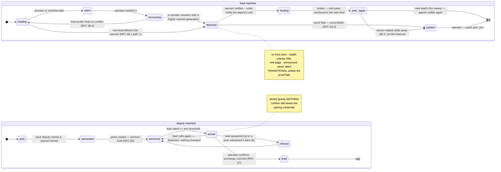

# Pack deputy & takeover — design spec (accepted 2026-08-20)

**Status: draft for operator review. Nothing here is implemented, and nothing here amends
[`PACK_PROTOCOL.md`](./PACK_PROTOCOL.md) until it is folded in (§15).** This file is uncommitted on
purpose: it is a proposal, not a contract.

Sibling to [`PACK_PROTOCOL.md`](./PACK_PROTOCOL.md), whose section numbers this document cites bare
(`§14` means that document's §14; sections of *this* document are cited as `RFC §n`).

**Provenance convention**, mirroring `PACK_PROTOCOL.md`:

- **Verified** — read first-hand out of this repo at the cited `file:line` on 2026-08-20.
- **Specified** — normative for the feature if it is accepted. Nothing here has been built, so
  *nothing* below is Verified except the explicitly marked citations of existing behaviour.

---

## 1. The problem, stated narrowly

**A lead that dies takes the operator's only window with it.** §14 is honest about this and §15
declares transparent failover a non-goal: today's recovery is `collie promote --force` on a peer, at
a keyboard, followed by a re-join of every remaining member (§14.4). That is the correct answer for
"the machine is not coming back". It is the wrong answer for the case that actually happens: **the
operator is holding a phone, the lead is a box at home that has wedged, and the agents on three
other machines are still running and still asking questions.**

The gap is not consensus. It is **reach**: the phone has no authenticated way to say "use the other
machine now", because every other machine deliberately publishes nothing (ADR 0013) and every
promotion path deliberately requires consent minted on the machine being demoted (ADR 0014, §14.1)
— which is exactly the machine that is unreachable.

So this proposal changes **one** thing and nothing else: it lets the operator **pre-designate**,
while everything is healthy, the one machine that may be taken over to, and it gives that machine a
door the operator's phone can knock on **only when the lead has gone quiet**.

**§15's "no election" non-goal stands and is reinforced.** Nothing here promotes itself. Silence
*arms* a door; only the operator's credential *opens* it. There is no timer that ends in a
leadership change, no vote, no quorum, and no third voter.

---

## 2. Vocabulary added

| Term | Meaning |
|---|---|
| **deputy** | The one peer the lead has named as eligible to take over. A deputy is a peer in every other respect. **At most one exists in a pack at any instant** (RFC §3). |
| **warrant** | A short, lead-signed object naming the deputy: pack id, generation, deputy member id, deputy certificate fingerprint, issue time (RFC §4). It is a *standing permission*, not a command. |
| **warrant generation** | A monotonic integer on the lead. A higher generation supersedes every lower one, everywhere. Revocation is generation *N+1* naming **no** deputy (RFC §4.4). |
| **armed** | The deputy's state when its lead has not dialled it for at least the arming threshold (RFC §6.2). Armed is a property of *silence*, not of intent. |
| **standby door** | The minimal, unpublished browser listener a deputy binds when it holds a warrant naming itself. It serves one page and one action, and only while armed (RFC §6). |
| **takeover** | The operator-confirmed exchange in which an armed deputy becomes the lead (RFC §7). |
| **deposed** | The state of a former lead that has learned, from evidence it can verify itself, that the crown has moved (RFC §8). A deposed collie serves no front door and fails health checks. It is **transitional**: it self-heals to `peer` under the new lead (RFC §8.3), and parks only when the proof does not verify. |
| **self-heal** | The deposed machine completing its own demotion all the way to `peer` — on materials both sides already hold, with no operator step and no new trust (RFC §8.3). |
| **witness** | A peer answering "my lead dialled me *X* ago". Not a voter — it answers for itself only (RFC §7.3). |

These words follow ADR 0012's rule: plain English, greppable, and no new metaphor. *Deputy* was
chosen over *standby* (which names the door, not the role), *successor* (implies the transition has
happened) and *failover partner* (implies automation §15 forbids).

---

## 3. The deputy role, and the single-warrant invariant

**`collie pack deputy <member>` on the lead names exactly one deputy.** It is a membership verb and
behaves like every other one: it writes the trust store and restarts the lead (§8.1's 2026-08-07
amendment — a collie reads its trust store at most once per process, `trust-store.ts`'s `loaded`
latch, so a verb that does not restart writes a fact the running process will never see).

- **At most one standing warrant exists at any time.** Naming a second deputy does not add one; it
  mints generation *N+1* naming the new member, which invalidates the old warrant everywhere it
  lands. This is the safety invariant, and it is what keeps §15's non-goal honest: with one
  candidate there is nothing to rank, nothing to race, and no split-brain one level down (RFC §13).
- **The deputy must be an enrolled peer of this pack, in `enrolled` status, holding the current
  secret generation.** Naming a member the lead does not pin is a typo, not a consent — the same
  validation `pack approve-promote` already performs (§14.1).
- **A deputy is still a peer.** It publishes no managed front door, serves no PWA and no `/api/*`,
  and answers `/pack/v1/*` exactly as before (§3, ADR 0013). The standby door is a *separate,
  narrow, unpublished* listener and is argued as its own exception in RFC §6.
- **A lead cannot name itself.** A solo lead has no peers and the verb refuses (`EXIT.STATE`).

### 3.1 Why pre-designation rather than "any peer may claim"

Because the alternative is an election with extra steps. If any peer could claim leadership on
lead-silence, then **an attacker who can take the lead offline chooses the new lead** — ADR 0014
already refused exactly this shape ("letting a peer accept a claim *because the lead is
unreachable* is a fallback an attacker can *cause*"). Pre-designation moves that choice back to the
operator, made in advance, while the lead is healthy enough to sign it. The signature is what
survives the lead's death; the lead's *availability* is what does not.

---

## 4. The warrant

### 4.1 Materials — no new crypto

**Verified:** a member's trust store already holds `SelfIdentity.{certPem, keyPem, fingerprint}` —
a P-256 key pair and its self-signed certificate, minted once by `mintIdentity()`
(`bridge/pack/identity.ts:253`), whose profile deliberately includes `keyUsage: digitalSignature`
*because* it is "the end-entity key for the handshake and for §8.6's request signatures"
(`identity.ts:145-163`). §8.6's signing helpers (`bridge/pack/signing.ts`) are pure functions of
strings and bytes: `signRequest` signs with a PKCS#8 PEM, `verifyRequestSignature` verifies against
the public key of a **pinned** certificate.

**The warrant reuses those primitives unchanged.** Base64 ECDSA-P256-SHA256, made with
`SelfIdentity.keyPem` on the lead, verified with `TrustedMember.certPem` — the certificate the
verifier already pinned. **No new key, no new algorithm, no new trust anchor, and no CA.** A peer
verifying a warrant is asking the one question it can already answer: *did the member we pinned as
our lead sign this?*

### 4.2 Contents

```ts
/** A standing, lead-signed permission for ONE member to take the crown (RFC §4). */
interface Warrant {
  readonly packId: string;
  /** Monotonic on the lead. Higher supersedes lower, everywhere. Never reset, never reused. */
  readonly generation: number;
  /** The deputy, or `null` — a revocation warrant names nobody (RFC §4.4). */
  readonly deputyMemberId: string | null;
  /** The deputy's pinned certificate fingerprint. `null` iff `deputyMemberId` is null. */
  readonly deputyFingerprint: string | null;
  /** The issuing lead's member id — so a verifier knows whose key to check it with. */
  readonly leadMemberId: string;
  /** When this GENERATION was minted. Does not move on a refresh. */
  readonly issuedAt: number;
  /**
   * When this generation was last re-signed by a healthy lead (RFC §4.5). The warrant is dead at
   * `refreshedAt + WARRANT_TTL_MS` (30 days). On a fresh mint, equal to `issuedAt`.
   */
  readonly refreshedAt: number;
  /** Base64 ECDSA-P256-SHA256 over {@link canonicalWarrant}. */
  readonly signature: string;
}
```

**The fingerprint is in the warrant, and that is the load-bearing field.** §14.2 already learned
this the hard way: *"consent names who may take over" is only true if the key that takes over is the
one already pinned.* A warrant naming only a member id would let anything presenting that id be
accepted; naming the fingerprint binds the certificate, and `parseRosterEntry` already enforces
`fingerprint === sha256(certPem)`, so the binding is complete without carrying the certificate
itself.

**No address, and no roster.** An address is a hint the operator may re-point (§4), so binding one
would make roaming a warrant failure. A roster would make the warrant a second source of truth about
membership. **Validity is `refreshedAt + 30 days`, and the shape of that decision is RFC §4.5** — it
is not a fixed expiry from issue, and it is not standing forever.

### 4.3 The canonical string — and why it is domain-separated

```
collie-pack-warrant-v1\n<packId>\n<generation>\n<leadMemberId>\n<deputyMemberId>\n<deputyFingerprint>\n<issuedAt>\n<refreshedAt>
```

Eight LF-separated fields, the first of which is a **fixed domain tag**. `deputyMemberId` and
`deputyFingerprint` are the literal string `-` in a revocation warrant — an empty field would make
two different objects share a string.

§8.6's canonical request string has four fields and §16 reserves a five-field handover string,
and both rely on **field-count disjointness** so "the two never verify as one another under a shared
key". That property is real but it degrades: it is an argument that gets weaker with every signed
object added, and the key here is genuinely shared (a lead signs `hello` probes, `leave`, `lead`
*and* warrants with one private key). **A fixed domain tag makes the disjointness structural rather
than arithmetic**, and costs one string.

> **Recommendation, out of scope for this RFC:** if §16's reserved signed handover is ever built, it
> should gain the same tag. Retrofitting §8.6's request string is **not** proposed — it is deployed,
> and changing a canonical string is a flag day (§7's exact-1 window). The tag is for new objects.

### 4.4 Supersession and revocation

- **A peer keeps exactly one warrant: the highest generation it has verified, and within that
  generation the highest `refreshedAt`.** A warrant with a lower generation is discarded silently;
  so is one of the same generation with a `refreshedAt` no newer than the stored one. That is the
  replay defence (RFC §12, F8), and it is monotone on both axes so a refresh can never walk a
  warrant backwards.
- **`collie pack deputy --revoke`** mints generation *N+1* with `deputyMemberId: null` and
  distributes it. Revocation is therefore a **positive, verifiable statement**, not an absence: a
  peer that never hears about the revocation still holds the old warrant, but a peer that hears it
  can prove it heard it. An absence could never be distinguished from a lost message.
- **Naming a new deputy is a revocation of the old one**, by the same mechanism and in one step.
- **The generation counter lives on the lead and never resets.** It survives revocation, promotion
  (§14 — the new lead adopts `warrantGeneration` from the roster it is handed, then increments) and
  restart. A reset would make an old warrant verify again.

### 4.5 A standing generation, re-signed while healthy, dead 30 days after its last refresh

**Settled (RFC §16, decision 3).** Two readings were on the table and the answer takes the useful
half of each.

**Why not a fixed expiry from issue.** An expiring warrant expires precisely when it is needed: the
lead is the only party that can re-issue one, so a warrant with a *T*-from-issue lifetime is
worthless for any outage beginning after the lead's last re-issue. An operator whose lead died on
holiday would find the deputy disarmed at the one moment it mattered. That is also the distinction
from §14.1's ten-minute approval, which is a *consent to a promotion happening now*, minted by an
operator standing at the machine; a warrant is a *standing eligibility* whose whole value is
surviving the event. The two are different objects and must not share a lifetime.

**Why not standing forever, either.** A capability that outlives the operator's memory of granting
it is a liability, and a pack that quietly retired three years ago should not still have a machine
that can be taken over to.

**So: the generation is standing; the signature is refreshed.**

- **The lead re-signs the current generation on every healthy sweep** — same generation, same
  deputy, same fingerprint, new `refreshedAt`, new signature — and the refreshed warrant rides the
  same push that already carries it (RFC §5). Re-signing is one ECDSA-P256 operation over ~150 bytes;
  it is not a cost worth optimising, but the *push* is: a peer already holding this generation with
  a `refreshedAt` inside its last-hour window is not re-pushed, so the steady-state wire cost is one
  small body per member per hour, not per sweep.
- **`WARRANT_TTL_MS = 30 days from `refreshedAt`.** So the warrant is only ever as old as the last
  time the pack was healthy — which is exactly the property wanted. A pack in daily use never
  approaches it; a pack that has been dark for a month disarms itself and says so.
- **An expired warrant is dead everywhere it sits**: the standby door refuses to arm, a peer drops
  the second anchor at its next restart, and the takeover route refuses. `pack status` renders the
  remaining validity on both sides (`deputy: nas — warrant valid 29d`), so it is a number the
  operator sees rather than a trap they meet.
- **Expiry is not revocation.** A revocation is a *higher generation naming nobody* (RFC §4.4) — a
  positive statement, deliverable and provable. An expiry is a clock running out locally on every
  member independently, with no message. Both are needed and neither substitutes for the other: a
  revocation is immediate but only reaches machines that are up; an expiry reaches every machine but
  takes 30 days.
- **The one clock-skew consequence, stated:** validity is evaluated on each verifier's own clock, and
  §8.6 already establishes that a peer's clock is never trusted for freshness (§10). A machine whose
  clock is a month fast disarms its own door early. That is the fail-closed direction and is accepted;
  a machine whose clock is a month *slow* honours a dead warrant, which is bounded by the fact that
  holding one still grants nothing (below).

**What bounds a warrant regardless of its lifetime:** the single-warrant invariant (only one machine
is ever eligible), the generation-based revocation (one operator verb, pack-wide), the fingerprint
binding (only that key can spend it), and — decisively — the fact that **holding a warrant grants
nothing by itself**: a takeover additionally requires lead silence, a witness round, *and* the
operator's pairing credential (RFC §12).

---

## 5. Distributing the warrant, and the two-phase arming nobody can skip

This is the sharpest edge in the whole design and it is stated first, before the happy path.

**Verified, and it decides the shape of everything below:** a peer's listener is built with
`ca: [<its lead's certificate>] · requestCert · rejectUnauthorized`
(`bridge/pack/transport.ts:53-64`, `peerListenerTls`) — *exactly one anchor*. And
**`server.reload({ tls })` does not swap a pinned `ca`** (`transport.ts:25-28`, §8.1's amendment);
membership changes take effect only through the restart every membership verb performs.

Therefore: **a deputy cannot dial a peer at all** — its TLS handshake is refused before HTTP exists
— **unless that peer's listener was already built with the deputy's certificate in its anchor
list.** This is the same wall §14.5 and ADR 0014 describe for a promoted lead, and no
application-layer route, signature or warrant can climb it. A warrant that arrives at a peer over
the pack link lands **on disk**, and is **inert at the transport until that peer restarts**.

So arming is explicitly two-phase, and both phases are the operator's business:

| Phase | What happens | When it takes effect |
|---|---|---|
| **1 — stored** | The lead pushes the warrant to every peer over the pack link (`POST /pack/v1/warrant`, RFC §11). Each peer verifies the lead's signature, checks the generation and persists it beside its trust material. | Immediately. The peer now *knows* who the deputy is. |
| **2 — anchored** | The peer's next restart builds its listener with `ca: [leadCert, deputyCert]`. | At the restart. Until then a takeover from that peer's side is **impossible**, not merely refused. |

- **`peerListenerTls` widens from one anchor to at most two, and only that.** The second anchor
  exists **iff** the stored warrant verifies against the pinned lead's certificate and names a
  deputy whose fingerprint is in this peer's own... — no: a peer has no roster beyond its lead, so
  the certificate cannot come from a roster it does not have. **The warrant push therefore carries
  the deputy's certificate PEM alongside the warrant**, and the peer accepts it only if
  `sha256(certPem)` equals the warrant's `deputyFingerprint`. This is the identical rule §8.2 uses
  at enrollment ("the certificate travels with its fingerprint … so what is pinned is provably what
  the sender will present"), and for the identical reason: a hash cannot be enforced, because
  BoringSSL anchors on certificates.
- **The certificate is inside the signature by proxy, not by inclusion.** The warrant signs the
  *fingerprint*; the certificate is checked against it on arrival. Signing the PEM directly would
  put a ~700-byte blob under a canonical string for no additional guarantee.
- **`pack deputy` must therefore restart the peers, and it does it over the operator's SSH.**
  **Settled** (RFC §16, decision 7). ADR 0015/0016's channel, `pack-ops.json`'s remembered route,
  `cli/remote.ts`'s legs — the same transport `pack add` and `pack update` already use. **The pack
  link is not a control channel** (ADR 0016; ADR 0024's beacon rule generalises), so the restart is
  never a wire message.

  **One consent covers the batch, not one per machine.** The verb lists exactly what it will restart
  and asks once — *"restart collie on `attic`, `nas` to arm the deputy? [y/N]"* — then proceeds, per
  ADR 0015's adopted pattern of a y/N before every disruptive step and a legible abort when
  non-interactive. Per-machine prompting on a four-machine pack is four chances to answer wrong for
  one decision the operator already made when they typed the verb, and `pack update --all` already
  restarts remote machines under a single consent. A restart here is also the *least* disruptive
  remote act in the CLI's repertoire: it moves no code (contrast `pack update`) and drops one poll.
- **A peer the operator cannot SSH into is reported, not silently skipped.** `pack deputy` prints,
  and `pack status` shows thereafter, `warrant stored, anchor INACTIVE — restart <member>` — the
  exact shape §8.2's "enrolled but INACTIVE" note already established for the same class of
  problem, driven off the same `pack-runtime.json` marker (`bridge/pack/staleness.ts`).
- **A peer that is offline at `pack deputy` time gets the warrant on the next successful dial.** The
  lead re-pushes on any poll where the peer's reported `warrantGeneration` / `warrantRefreshedAt`
  (RFC §10, on `hello` and `snapshot`) is behind. This is a two-field comparison on an exchange that
  already happens; it adds no dial. **The same mechanism carries RFC §4.5's refresh** — a peer whose
  stored `refreshedAt` is over an hour old is re-pushed, and one that is current is not, so the
  refresh costs one small body per member per hour rather than one per sweep. It still leaves a
  newly-warranted peer un-anchored until its restart.

**Read this as the honest cost:** a deputy is *provisioned*, not *declared*. Naming one touches
every machine in the pack, exactly once, and until it has, the pack is in a partially-armed state
that `pack status` names.

---

## 6. The standby door — a narrow exception to ADR 0013

ADR 0013's decision is that **a peer publishes nothing** and that its pack listener "is not a front
door". This section proposes the one exception, and it is spec'd as its own subsection because it
needs its own ADR — **0028**, subordinate to ADR 0026 and amending ADR 0013 (RFC §15.2).

### 6.1 Why it cannot ride the existing listener

**Verified:** §8.1's amendment states plainly that **`COLLIE_PEER_BROWSER=1` and a pinned listener
are mutually exclusive** — "a browser cannot present the lead's client certificate, so on a pinned
peer that flag's surface is unreachable." That is not a policy; it is BoringSSL refusing a handshake.

A phone is a browser. So a page the phone can reach **cannot** be served on the deputy's
pack listener under any design, and the choice is between a second listener and no feature.

### 6.2 What it is

**The standby door is a second HTTP listener on the deputy, bound only when this collie holds a
warrant naming itself, and serving a page only while armed.**

- **Bind:** `COLLIE_STANDBY_HOST` (default `127.0.0.1`) and `COLLIE_STANDBY_PORT`. **Absent
  `COLLIE_STANDBY_PORT` means no standby door at all** — the feature is off, the listener is not
  bound, and the deputy is a plain peer that can still be taken over from a keyboard via §14. Absent
  means closed.
- **Plain HTTP by default, behind the operator's own ingress.** The deputy holds a self-signed
  certificate, and a phone will not accept one; the deployment this door is designed for is the
  two-backend failover proxy of RFC §14.2, which terminates TLS and is the operator's, exactly as
  docs/deployment.md Variant C/E already prescribes. **Collie publishes nothing here** — no
  `tailscale serve`, never `funnel`, no ownership record. ADR 0001's criterion (*we manage only what
  we run and can test*) is untouched: the standby door is bound, not published.
- **Two routes and no more:**

  | Method | Path | Gate | Answer |
  |---|---|---|---|
  | `GET` | `/standby/health` | none | `503` + `{"state":"cold"}` while the lead is fresh; `200` + `{"state":"armed", …}` once armed. Never a body a stranger can learn a member id from. |
  | `GET` | `/standby` | none (read) | The page. While cold: a bare "this machine is a deputy; its lead answered *X* ago". While armed: the page with the action. |
  | `POST` | `/standby/takeover` | **pairing bearer credential** (RFC §6.4) | Runs RFC §7. `409` while cold. |

  Nothing else is served. No PWA, no `/api/*`, no SPA fallback, no `/auth` placeholder. **A route
  that does not exist cannot be mis-gated** (ADR 0013's own words).
- **`/standby` and `/standby/*` are reserved paths** — added to the service worker's denylist
  (`web/src/lib/sw-routes.ts`) alongside `/pack/v1/`, and to the reserved set that must not collide
  with `/auth`, `/auth/*` or `/cdn-cgi/` (`bridge/server.ts:1347`). In the same-origin failover
  deployment, an installed service worker from the *lead's* origin is what the phone hits first, so
  this reservation is not hygiene — it is the difference between reaching the door and being served
  a cached shell.

### 6.3 Armed — the definition, and its one subtlety

```
armed  ⇔  now - max(lastDialledAt, processStartedAt) >= COLLIE_STANDBY_ARM_MS

COLLIE_STANDBY_ARM_MS  default = max(30_000, 2.5 × COLLIE_POLL_IDLE_MS)      (RFC §16, decision 1)
```

**The default is a formula, not a number, and that is the point.** At today's defaults
(`COLLIE_POLL_IDLE_MS = 12000`) both terms are 30 s and the value is 30 s. An operator who relaxes
the idle poll to save battery on a laptop pack moves the arming threshold with it automatically,
instead of discovering months later that their idle pack arms its own standby door every night. The
`30_000` floor keeps a very tight poll from producing a hair-trigger door.

- **`lastDialledAt` is Gap A's fact, and there is only one of it** (RFC §10). The deputy's door and
  a peer's `pack status` line read the same number.
- **`processStartedAt` is in the max on purpose.** A deputy that has just restarted has never been
  dialled by anyone, and without this clause it would arm instantly on every reboot. Including boot
  time gives the lead one full threshold window to make its first call.
- **A landed call of any kind refreshes it** — a poll, a proxied pane read, a forwarded write. This
  mirrors §10.2's "every landed call is a receipt" rule (`registry.ts` → `recordExchange`) and for
  the same reason: the sweep relaxes to `COLLIE_POLL_IDLE_MS` (12 s) while a phone watching a pane
  polls at 1.5 s, so a receipt only the sweep refreshed would arm a perfectly healthy deputy on an
  idle pack. **The threshold must be above `COLLIE_POLL_IDLE_MS`** or an idle pack arms itself. The
  default formula guarantees it; an operator who *overrides* `COLLIE_STANDBY_ARM_MS` below that line
  gets a boot warning and the same line in `pack status`, and is not refused — §3's posture is that
  Collie warns about the operator's own decision rather than vetoing it.
- **Arming is reversible and instantaneous.** The lead's next call disarms it. Nothing is persisted;
  no state machine survives it. A door that arms and disarms as the lead's connectivity flaps is
  correct — it grants nothing.

### 6.4 What authenticates the confirm

**The phone's pairing credential** (`bridge/pairing.ts`), and nothing else.

**Verified:** pairing is "a bearer credential the device itself holds", enforcement is not a setting
but the fact that *the registry is non-empty* (`pairing.ts:369-372`, `PairingStore.enforced()`),
tokens are stored only as SHA-256, and the registry is re-read at request time behind an mtime
cache so a revocation from another process needs no restart (`pairing.ts:287`).

Two consequences, both fail-closed:

- **A pack whose lead has no paired device gets no standby door.** With an empty registry there is
  no credential to check, and an ungated takeover button on an unpublished port is a takeover button
  for anyone who reaches the port. So: **the standby door refuses to arm when its synced registry is
  empty**, says so in `pack status`, and `pack deputy` refuses to designate a deputy while the lead
  has nothing paired — with the remedy named (`collie pair`).
- **The device-header gate (`COLLIE_DEVICE_HEADER`) is NOT applied to the standby door. Settled**
  (RFC §16, decision 2): **pairing only.** The two gates compose by AND on `/api/*` and that stays
  true; the standby door is the deliberate exception, and the reason is that **the failover path is
  precisely when an ingress is misbehaving**. A header the *broken* proxy should have injected is not
  a second factor there — it is a dependency on the component that just failed. The pairing
  credential does not share that failure mode: the phone holds it, and it is checked by the deputy
  against a registry on the deputy's own disk (RFC §6.5).

  **This is a narrowing and it must be written down where the code is, not only here**, because a
  future reader will otherwise read "device gate + pairing compose by AND" (`bridge/pairing.ts`'s
  header) and take the standby door for a bug.

### 6.5 Syncing the pairing registry to the deputy

The deputy must be able to verify a token minted by the lead, so the lead pushes its registry.

- **`POST /pack/v1/pairing`, lead → deputy only.** A peer refuses the route unless it holds a
  verified warrant naming **itself**. Every other peer that ever receives one refuses it — the same
  role check `/pack/v1/secret` already carries (§5: *admitted* and *allowed to do this* are
  different questions).
- **Sent at designation and on every change** — a `pair`, a `devices revoke`, nothing else. The lead
  already knows when the registry changed: the file has an mtime and the store already caches on it.
- **Only hashes cross.** `{label, tokenHash, createdAt}` per device. No token exists to leak: the
  token was shown once, at claim time, and is not recoverable (`pairing.ts:65-71`). This is the same
  reasoning `PendingInvite` uses for storing `tokenHash` — a store that leaks yields nothing
  spendable.
- **It lands in a SEPARATE file, `standby-devices.json`, and is NEVER merged into the deputy's own
  `paired-devices.json`.** This is not tidiness. `enforced()` is *the registry is non-empty*, so
  merging would silently switch on the deputy's **own** write gate for its **own** operator, on a
  machine where nobody ran `collie pair`. A gate the operator did not arm is a lockout waiting for
  the day they use that machine directly.
- **At takeover commit, and only then, the synced entries are adopted into the deputy's own
  registry** — because after the commit the deputy *is* the lead and the phone must keep working
  against the same credential. **A label collision refuses the sync** (labels are the revoke handle,
  `pairing.ts:225`) and is reported in `pack status`; it is not silently resolved — a silently
  renamed device is one the operator cannot revoke by the name they know it by (RFC §16,
  decision 6).
- **`X-Pack-Device` is untouched.** §12's forwarded-device attribution and this sync are different
  facts and neither substitutes for the other.

> **Collision flagged, not steamrolled.** `bridge/server.ts:361-365` states, deliberately, that
> pairing is "**NOT** threaded into the pack surface … a lead does not hold one of this collie's
> pairing tokens and must never need one." This proposal does **not** violate the letter of that —
> no pack request is ever admitted by a pairing token, and the pack surface's two factors are
> unchanged — but it does put a *browser* credential onto a pack route (`/pack/v1/pairing`) and onto
> a peer's disk, which is adjacent enough that the comment must be amended rather than quietly
> outlived. **Settled** (RFC §16, decision 5): the rule stands verbatim, the comment gains the
> exception and a pointer, and the synced hashes live in their own file.

---

## 7. The takeover exchange

### 7.1 The three steps

**(a) Ask the lead first.** The deputy dials its lead once — `GET /pack/v1/hello`, §8.6-signed
(which `hello` MAY carry, and does when a verb sends it), on §10.4's **patient budget**
(`COLLIE_PACK_HELLO_TIMEOUT_MS`, default 5000 ms). **If the lead answers, the takeover is REFUSED**
and the page says so in the operator's words — *"your lead answered 0.4 s ago; it is alive. Nothing
was changed."* One attempt, no retry: a second attempt is a slower way to get the same answer, and
§10.4 already establishes that a non-timeout failure (refused, DNS, TLS) is never re-probed
patiently.

**(b) Ask the peers, twice.** The deputy dials each surviving peer at `POST /pack/v1/takeover`,
carrying the warrant, its own certificate, and an §8.6 signature over the request. **The route is
two-phase, and the phase is an additive-optional field whose absent reading is `probe`:**

| phase | Peer does | Peer answers |
|---|---|---|
| `probe` (also: field absent) | Verifies the warrant against its pinned lead's certificate; checks the generation; checks its **own** `lastDialledAt`. **Changes nothing.** | `{ok: true, witness: "silent", lastDialledAgoMs}` — or `{ok: false, code: "lead_is_alive", lastDialledAgoMs}` |
| `commit` | Re-pins its lead to the deputy on disk, records the generation, keeps its member id and the pack secret. | `{ok: true, adopted: true, restartRequired: true}` |

**Any peer answering `lead_is_alive` aborts the whole takeover, before the deputy has changed a
byte.** This is the partition defence and it is why the exchange is two-phase rather than one: a
peer that its lead dialled two seconds ago is direct evidence that the deputy's silence is the
deputy's own network problem. **This is not a vote.** No peer is asked what it thinks should happen;
each is asked one factual question about its own inbox, and one honest *no* is decisive. A refusal
is rendered on the page verbatim — *"peer `nas` says the lead called it 2 s ago; you are probably
the one who is cut off."*

**A two-machine pack has no witness, is allowed anyway, and the page says so plainly.** **Settled**
(RFC §16, decision 8). With a lead and a deputy only, step (a) is the entire evidence base and **the
operator is the witness** — which is ADR 0026's whole thesis, not a shortfall against it. The page
says so in the operator's words, above the button: *"There are no other machines to ask. If your
lead is up and you simply cannot reach it, taking over will split your pack."* Refusing to arm a
two-machine pack was considered and rejected: two machines is the pack size this protocol is most
often used at (§14.5, ADR 0014: "this protocol has two roles and frequently two members"), so a rule
that excluded it would exclude the feature.

**(c) Commit locally, last.** Only after every reachable peer has answered `commit` does the deputy
rewrite its **own** trust store: role `lead`, roster adopted (each peer's id, fingerprint,
certificate and address — the deputy already holds none of these, so **the roster must ride the
warrant push**, see RFC §7.4), the old lead carried as a member, `warrantGeneration` adopted, the
synced pairing registry adopted (RFC §6.5). Then it publishes its front door (or, under a failover
proxy, simply starts answering `200` on health) and restarts.

**Partial success is representable and is not a failure.** A peer that was unreachable during (b) is
recorded on the new lead as `pending re-pin` with its last-known address, is rendered as such by
`pack status`, and is reconciled by RFC §9 — automatically, on first contact, with no operator step.
A peer that answered `lead_is_alive` is not partial; it is an abort.

### 7.2 The diagram

```mermaid
sequenceDiagram
  autonumber
  actor P as phone (operator)
  participant D as deputy
  participant L as old lead
  participant A as peer A
  participant B as peer B (down)
  Note over D: armed — lead silent >= 30s (RFC §6.3)
  P->>D: GET /standby  (same origin, via failover proxy)
  D-->>P: "your lead has been silent 47s" + take over
  P->>D: POST /standby/takeover  (pairing bearer credential)
  D->>L: GET /pack/v1/hello — one patient attempt (§10.4)
  L--xD: timeout
  Note over D: (a) lead did not answer. If it had: REFUSE, change nothing.
  par probe round — changes nothing anywhere
    D->>A: POST /pack/v1/takeover {phase: probe, warrant, cert, sig}
    A-->>D: {ok, witness: "silent", lastDialledAgoMs: 51200}
  and
    D->>B: POST /pack/v1/takeover {phase: probe, …}
    B--xD: unreachable — recorded pending, not an abort
  end
  Note over D: any "lead_is_alive" here aborts the takeover
  D->>A: POST /pack/v1/takeover {phase: commit, …}
  A-->>D: {ok, adopted, restartRequired}
  Note over A: re-pinned on disk; its listener's ca<br/>changes at its next restart
  Note over D: (c) commit LOCALLY, last: role=lead, roster,<br/>pairing registry adopted, then restart
  D-->>P: 200 — you are on the new lead now
  Note over B: reconciled on first contact (RFC §9)
```

### 7.3 Why the peer can answer at all — the anchor, again

Step (b) works **only** because the peer's listener was built with the deputy's certificate as a
second anchor at its last restart (RFC §5). A peer that never restarted after the warrant push
refuses the deputy at the TLS handshake and is indistinguishable, from the deputy's side, from a
peer that is down — so it lands in the `pending re-pin` bucket and is reconciled by RFC §9, which
requires the *new lead* to be the dialler. **This is the failure mode `pack status` must make
legible before the outage, not after**, which is why RFC §5 insists the un-anchored state is a named
finding.

### 7.4 What rides the warrant push (and why the roster does after all)

RFC §4.2 says the warrant carries no roster, and that stands — the *signed object* carries none. But
the deputy cannot lead a pack it cannot dial, and it holds exactly one roster entry (its lead). So
**the warrant push to the deputy** (and only to the deputy) carries, beside the signed warrant, the
lead's current roster: each member's id, fingerprint, certificate and address — the identical payload
§14.3's successful demotion already returns (`{demoted, roster}`), for the identical reason ("the
only way the new lead can pin members it has never spoken to").

- It is **refreshed on change** — an enrollment, a removal, a `reconnect`, a rotation — on the same
  push. A stale roster on a deputy is a takeover into a pack it cannot see.
- It is **not signed**, because it does not need to be: it arrives over a two-factor pack link from
  the pinned lead, which is the same trust basis every other lead→peer byte has.
- **A compromised deputy therefore holds the roster in advance**, where today it would only receive
  it at the moment of demotion. That is a real delta and it is named in RFC §12 (F7).

---

## 8. The deposed state

**A former lead that learns the crown has moved stops being a lead, loudly.**

### 8.1 What counts as learning

Exactly one thing: **a warrant of a generation at least as high as its own, naming a deputy other
than nobody, verified against its own certificate's public key.** A lead can verify its own
signature — this is the whole reason the warrant is signed by the lead rather than by the deputy.
Nothing else deposes a machine: not a peer refusing it, not an unreachable roster, not a timeout.

Two delivery paths, in order of reliability:

1. **The new lead tells it, on first contact** (`POST /pack/v1/warrant`, RFC §11), which the new lead
   attempts as soon as it commits and on every subsequent sweep. The old lead's listener pins nothing
   inbound (§8.1: a lead's pack surface rides the front door and terminates TLS ahead of the
   process), so the new lead's dial is admitted on the pack secret plus §8.6's signature — **the old
   lead is the one member a new lead can always reach at the application layer**, if it is up and
   dialable at all.
2. **A peer tells it, when the old lead dials that peer** — the named conflict answer of RFC §10.2.
   This path is **best-effort and time-boxed**: it works only while the peer's anchor list still
   contains the old lead's certificate, i.e. until that peer's next restart, after which the old
   lead is refused at TLS with no chance to be told anything. Do not build the deposed state on this
   path; build it on (1) and treat (2) as a fast-path.

### 8.2 What a deposed collie does immediately

These are the acts of the instant it learns. What happens *next* — and in the ordinary case it
happens within one restart — is RFC §8.3's self-heal.

- **Stops polling.** Its roster is void as a *lead's* roster; dialling it would be a second lead's
  traffic. (It keeps the roster's **contents**: RFC §8.3 needs the deputy's certificate out of it.)
- **Stops serving the app front door — and must FAIL health checks.** `GET /standby/health` and the
  app's own health answer non-`200`, so a failover proxy stops routing to it *before* an operator
  notices. This is the property the whole deposed state exists for.
- **Keeps one page**, at every path, at `200`: *"This machine was the lead of pack «name» until
  «T». The pack is now led by «member». Nothing here is live — this machine is rejoining as a peer."*
  A `200` here and a non-`200` on health is deliberate: a human who reaches it deserves an answer; a
  proxy asking whether to route here deserves a refusal. **The page states which of RFC §8.3's three
  outcomes it is in**, so a human who lands on it never has to guess whether anything is still
  expected of them.
- **Says so in `pack status`, loudly**, with the generation, the new lead's id, and the date — and
  either the self-heal it is performing or the reason it could not.
- **Announces the transition, and never re-enters silently** — an audit line (`pack.deposed`), a log
  line, and the `pack status` banner on **both** machines. A machine rejoining a pack by itself must
  be a thing the operator reads about, not a thing they discover (RFC §12, F11).
- **Tears down its own managed front door?** **No** — not automatically. ADR 0001's rule is that
  Collie tears down only a mapping matching its own ownership record, and that is satisfied here;
  but a `tailscale serve` teardown is a *publishing* act on a machine whose operator may be
  elsewhere, and §14.5 already establishes that the old lead's front door is torn down by the old
  lead's operator running `collie unserve`. The deposed page names that command. Failing health
  checks is what makes the un-torn-down door harmless in the meantime.

### 8.3 Re-entry self-heals — there is nothing to enroll

**A deposed lead rejoins the pack as a peer by itself, on materials both machines already hold. No
SSH, no token, no operator step, and — decisively — no new trust.**

#### Why nothing needs to be minted

Every material a peer link requires is already on both disks the instant the takeover commits:

| Material | Where it already is | Minted when |
|---|---|---|
| The new lead's certificate + fingerprint | the old lead's **own roster** — it enrolled the deputy and has pinned it since | at the deputy's `join` |
| The old lead's certificate + fingerprint + address | the new lead's roster, **adopted whole** at commit (RFC §7.4) | at the deputy's `join`, carried in the roster |
| The pack secret | both, pack-wide by construction (§8.1) | at enrollment; unchanged by a takeover (§14.5: "the pack identity, the pack secret and existing pinned certificates are **reused** — promotion is a role change, not a re-enrollment") |
| The member id | both, stable across role changes | at enrollment |

So an enrollment exchange here would re-mint material that already exists and re-pin certificates
already pinned. §8.2's token exists to bootstrap trust **between strangers**; these two machines are
not strangers, and the warrant is the proof that the role swap between them was authorised.

#### What the self-heal does

On learning of its deposition — the boot gate (RFC §8.4) or the `lead_conflict` answer (RFC §10.2),
in both cases a **warrant verified against its own signature**, which is the same proof it accepts
for self-demotion — the machine completes the demotion **all the way to `peer`**, in one committed
transition:

1. **Resolve the new lead from its own roster.** Take the warrant's `deputyMemberId`, find that
   member in this machine's roster, and require `sha256(certPem) === warrant.deputyFingerprint`.
   **The certificate comes from its own disk, never from the wire** — the warrant names a
   fingerprint, and a fingerprint is only a pin if the certificate behind it was already held.
2. **Rewrite the trust store**: `role: "peer"`, `lead: <that member>`, peers `[]`, pack secret kept,
   own identity kept, `warrantGeneration` advanced to the warrant's. One write, one audit line
   (`pack.deposed`), the same shape `demoteSelf` already has (`bridge/pack/enrollment.ts`).
3. **Restart.** `deriveMode` then reads *a lead, no peers* and resolves `peer`
   (`bridge/pack/mode.ts` — the decision table, unchanged), `peerListenerTls` anchors the listener
   to the new lead's certificate, the app front door is not served, and the health endpoint keeps
   answering non-`200` because a peer has no front door to be healthy about.
4. **Wait to be dialled.** A peer never initiates (§14.5, ADR 0013). The new lead is already polling
   the old lead's roster address — it adopted that entry at commit — so **the first successful
   `hello`/`snapshot` completes the re-entry and that machine's agents reappear in the phone's
   merged snapshot.** Nothing else happens; there is no rejoin handshake, because there is nothing
   to negotiate.

#### `deposed` is transitional, and terminal only when the proof fails

Three outcomes, and `pack status` must name which one this machine is in:

| Outcome | Condition | State |
|---|---|---|
| **healed** | The warrant verifies and the roster holds a certificate matching `deputyFingerprint`. | Transitional. Becomes an ordinary peer at the restart, and a *reachable* one at the new lead's next sweep. |
| **parked — unverifiable** | The warrant's signature does not verify against this machine's own certificate, **or** its roster holds no certificate matching `deputyFingerprint`. | **Terminal.** Exactly the parking lot the earlier draft made the only outcome: one page, failing health, and `pack status` naming *which* check failed. Recovery is `collie pack add` from the new lead (ADR 0015) or `collie join` with a fresh token. |
| **parked — stranded by a rotation** | The self-heal completed, but the pack secret rotated while this machine was away. | Terminal until the operator acts, for §8.4's reason and not this feature's. See below. |

**Why a failed proof parks rather than retries.** A warrant that does not verify is not a stale
message; it is a machine being told something by someone who cannot prove they may say it. Retrying
is how a refusal becomes a poll. And the second condition — no matching certificate in its own
roster — means the warrant names a deputy this machine never enrolled, which is either a hand-edited
store or a pack it does not belong to. Either way the honest answer is to stop and say so.

#### The rotation-while-away question, answered against §8.4 rather than assumed

**There is a real strand risk, and it is not this feature's to fix.** §8.4 is explicit and leaves no
room: rotation "reissues the pack secret and distributes it to every **reachable** peer"; "**a peer
offline during rotation is dropped to `unenrolled`**. The lead marks it so; the peer, next time it is
dialled, fails both factors and stays quiet"; and "**there is no grace window**: any peer offline at
rotation time is dropped and must re-join."

So a `collie pack rotate` run on the **new** lead while the old machine is still down does exactly
what it does to any offline peer: the new lead marks that roster entry `unenrolled`, and the returning
machine — which self-healed correctly, holds the right certificates, and presents secret generation
*N-1* — is refused on the secret factor. **This is not "reachable but secret-stale"; the earlier
draft's guess was wrong.** The per-member secret column §8.4 renders is for a peer that was
*reachable* and is catching up, which a machine that was down never was.

What this document specifies is therefore only that the state is **named, not mistaken for a
failure**:

- The new lead's `pack status` renders that member as `unenrolled — rotated while away (generation
  N-1)`, with the `collie join` remedy, **never** as `unreachable` (§10.2's three states are not to
  be conflated) and never as a self-heal failure.
- The returning machine's own `pack status` says the same from its side: *"the pack secret rotated
  while this machine was away; re-join with a fresh token."*
- **`collie pack rotate` warns when the roster holds a member that is `deposed` or pending re-pin**,
  and names it — the operator rotating five minutes after a takeover should be told they are about to
  strand the machine that is on its way back.

**And the ordering advice, stated once:** rotate *after* the old lead has re-entered, unless the
rotation is a response to suspected compromise — in which case stranding that machine is precisely
the containment you wanted (RFC §12, F11).

#### What stays manual

- **Appointing the recovered machine as the new deputy.** That is a decision, not a repair, and it is
  made at calm time with one command: `collie pack deputy <old-lead>` on the new lead. **The takeover
  leaves the pack with no deputy** — the warrant that authorised it named a member who is now the
  lead — and `pack status` says so on the new lead until one is named.
- **Tearing down the old machine's managed front door** (`collie unserve`, RFC §8.2).
- **Re-pointing the phone**, if there is no failover proxy (§14.5's rule, unchanged).
- **Anything §8.4 already made manual**, per the rotation case above.

**The emergency path still ends when the operator has a working front door again.** What changed is
that the largest piece of the cleanup after it — getting the old machine's agents visible again —
is no longer cleanup.

### 8.4 The boot-time gate that stops the split brain

**The failure this closes:** the old lead was down during the takeover, so nobody could tell it
anything. It comes back up hours later, reads a trust store that still says `lead`, publishes,
answers the failover proxy's health check with `200` — and the proxy swings the operator's phone
back onto a machine with a stale roster and no knowledge of what happened since.

**So: a collie booting into `lead` mode with a non-empty roster probes its members before it
publishes anything.**

- Budget: §10.4's patient budget, concurrent, once.
- **Any member answering with a warrant generation higher than this machine's own, or with the named
  lead-conflict answer, deposes it before it serves a byte** — and the answer carries the warrant, so
  the deposition and RFC §8.3's self-heal happen in the same boot. **A machine that was merely down
  during a takeover therefore comes back up as a working peer**, in one restart, having published
  nothing in between. That is the common case and it is the whole point of putting the gate at boot
  rather than at first conflict.
- **Silence from every member publishes anyway.** Fail-open on *no answer* is forced: the common
  case for "no member answered" is a lead rebooting first after a power cut, and a lead that refuses
  to come up because its peers are still booting is an outage manufactured out of a safety check.
  Fail-closed on a *conflicting answer* is the whole point: an answer is evidence, silence is not.

This is a small, cheap, boot-only probe. It is **not** a peer-side timer and it is not an election —
§15 is untouched.

### 8.5 Lifecycles



---

## 9. Late peers — the reconciliation

**A peer that was down during the takeover still pins the old lead.** It is not broken and it is not
lost; it is behind. Three facts settle its recovery and none of them requires an operator:

1. **It cannot dial anyone.** §14.5 and ADR 0013: a peer answers when dialled and is silent
   otherwise. So the late peer will never initiate anything, and no design here changes that.
2. **The deposed lead will never dial it.** RFC §8.2: a deposed collie stops polling. So the
   pathological case — the old lead reasserting itself against a peer that still pins it — cannot
   arise once the old lead has been deposed, and *can* arise for exactly as long as the old lead has
   not been (which is why RFC §8.4's boot gate exists).
3. **The new lead dials it, and can reach it.** The late peer's anchor list was built at its last
   restart, and (if RFC §5's provisioning was completed) it contains the deputy's certificate. So
   the new lead's handshake succeeds even though the peer's *roster* still says the old lead leads.

The reconciliation is then one exchange, on the new lead's ordinary poll:

> The new lead's **first** request to any member it has not yet confirmed carries the warrant
> (`POST /pack/v1/warrant`). The peer verifies the signature against the **old lead's** certificate —
> which it still holds, because it is still pinned as its lead — checks the generation is higher than
> its stored one, checks the caller's identity against the warrant's `deputyFingerprint`, and re-pins.
> It then serves the request. One extra round trip, once per member, on the first contact after a
> takeover, and never again.

**The generation is what makes this safe against being run backwards.** A peer that has already
re-pinned to generation *N* discards a warrant of generation ≤ *N*, so the old lead — even if it
somehow dialled — cannot present an older warrant to reclaim anything, and there is no warrant that
names the old lead as deputy anyway.

**A peer that never restarted after the warrant push cannot be reconciled**, because the new lead
cannot complete a handshake with it. Its recovery is `collie join` against the new lead with a fresh
token — the same rule §8.4 and §14.5 already state, reached for the same reason.

**The old lead is a late member too, and it uses the same channel.** Once it has self-healed to peer
(RFC §8.3) it is, from the new lead's side, an ordinary roster entry at an ordinary address that has
started answering. The new lead's sweep is already dialling it — the roster entry was adopted at
commit — so no special path exists for it and none is wanted. **One difference, and it runs the other
way:** the old lead is the one member the new lead can reach at the application layer *before* it has
healed, because a lead's listener pins nothing inbound (RFC §8.1 path 1). That is what delivers the
warrant; everything after it is this section's ordinary reconciliation.

---

## 10. Gaps A and B, folded in

Both are pre-existing gaps that this feature needs closed anyway. Neither is a new mechanism; both
are facts already available being *named* and *rendered*.

### 10.1 Gap A — a peer knows when its lead last called

- **`lastDialledAt`: the epoch-ms receipt of the last admitted pack request from this peer's lead,
  stamped on the peer's own clock.** Every admitted request refreshes it — a poll, a proxied read, a
  forwarded write — mirroring §10.2's "every landed call is a receipt".
- **In memory, not persisted.** It describes a *process*, and §7.1's rule for exactly this shape
  applies: a persisted receipt would survive the restart it is meant to report and state a falsehood
  with the authority of the trust store. `processStartedAt` covers the boot case (RFC §6.3).
- **`collie pack status` on a peer prints it**: `lead last called me 4s ago` / `lead has not called
  for 51s` / `lead has not called since this collie started 12s ago`. Today a peer's `pack status`
  can only *probe* its lead; this is the complementary fact, and it is the one that survives a
  network that is down in only one direction.
- **It is the deputy's arming signal — the same number, read once.** There must not be two clocks
  here: a door that arms on a fact `pack status` does not print is a door nobody can explain.

### 10.2 Gap B — a named answer when a peer follows a different lead

**Today:** a lead dialling a peer that follows someone else gets a TLS refusal (if it is no longer
in that peer's anchors) or an admitted request served against a roster that disagrees with it (if it
still is). Neither says what happened.

**Specified:** a peer whose pinned lead is **not** the admitted caller answers
`409 Conflict` — the status §7 already uses for "we do not agree about who we are talking to" —
with:

```json
{ "error": "this collie follows lead \"nas\" since warrant generation 7",
  "code": "lead_conflict",
  "leadMemberId": "nas",
  "warrantGeneration": 7 }
```

- **This is the warrant-conflict answer of RFC §8 and RFC §9, generalized.** It is one answer with
  one code, and both features read it.
- **The dialling side renders it as a state, never as a generic failure.** `pack status` prints
  `this peer follows another lead ("nas", generation 7)` and the merged snapshot marks that member's
  `protocol` state accordingly. It is **not** `unreachable` (§10.2's three states are not to be
  conflated) and it is **not** `incompatible` (§7 reserves that for a protocol mismatch); it is a
  fourth, named state: **`conflicted`**.
- **A `conflicted` member is not polled.** Like `incompatible`, it backs off — there is nothing
  useful to fetch from a machine that belongs to someone else's pack view, and hammering it is how a
  stale lead becomes a nuisance.
- **It names the new lead's member id, and nothing else.** Not its address, not its certificate: the
  answering peer is not a directory, and a member id is already knowable to any admitted caller
  (§5's rule for what `hello` may say).

---

## 11. Wire changes — the enumeration §7.1 requires

Every addition below is stated with its **absent-means-closed** reading, per §7.1's class rule and
ADR 0025's obligation.

### 11.1 New routes

| Method | Path | Direction | Purpose | Absent (route 404s) means |
|---|---|---|---|---|
| `POST` | `/pack/v1/warrant` | lead → any member; **new lead → old lead** (RFC §8.1) | Deliver/refresh the warrant (+ deputy certificate; + roster, to the deputy only) | The member is a pre-amendment build: **not warrant-capable, not takeover-capable, not deposable by this path.** Rendered as a named `pack status` finding, never as an error. |
| `POST` | `/pack/v1/takeover` | deputy → peer | Probe / commit the re-pin (RFC §7.1) | The peer cannot be taken over to; it needs `collie join` against the new lead. Closed. |
| `POST` | `/pack/v1/pairing` | lead → **deputy only** | Sync the paired-device registry, hashes only (RFC §6.5) | No credential to verify ⇒ **the standby door refuses to arm.** Closed. |

Every one is behind §8.1's two factors. `/pack/v1/warrant` and `/pack/v1/pairing` additionally
require the caller to be *this collie's own lead* — the same role check `/pack/v1/secret` carries
and for the same reason (§5). `/pack/v1/takeover` requires an §8.6 signature and a verifying warrant.

**New routes are additive by construction:** an older member answers `404`, which is a closed
reading in every case above. This is the same shape §5's `hello` addition took.

### 11.2 New fields

| Field | On | Optional? | Absent means |
|---|---|---|---|
| `warrantGeneration?: number` | `hello` response, `snapshot` response | yes | *"this member holds no warrant, or is a build that does not know about warrants"* — the lead pushes the current warrant on the next dial. Never read as "up to date". |
| `warrantRefreshedAt?: number` | `hello` response, `snapshot` response | yes | *"unknown refresh"* — the lead re-pushes (RFC §4.5). A missing refresh timestamp is never read as *recently refreshed*. |
| `deputy?: string \| null` | `hello` response (deputy's own id, or null) | yes | *"not a deputy"*. Closed. |
| `phase?: "probe" \| "commit"` | `/pack/v1/takeover` request | yes | **`probe`** — the reading that changes nothing. A commit must be asked for explicitly. |
| `lastDialledAgoMs: number` | `/pack/v1/takeover` probe response | required on that new route | n/a — the route is new, so it may require its own fields. |
| `leadMemberId`, `warrantGeneration` | the `lead_conflict` 409 body (RFC §10.2) | required on that new body | n/a — a new error body; an old caller sees a 409 it renders as a refusal, which is closed. |

### 11.3 New headers

**None.** Every fact above rides an existing header set or a JSON body. §6's table is unchanged, and
that is deliberate: a new header is a new thing a proxy can strip, and the pack surface's header
contract has been stable since v1 shipped.

### 11.4 Local state (not wire)

`Warrant` and the deputy designation land in the trust store as **optional top-level fields**
(`deputy?`, `warrant?`), sibling to `pendingHandover` (§14.1). **`parseTrustStore` builds its result
from an explicit field whitelist** (`trust-store.ts`), so each must be added in **both** the
validator and the returned result literal or it is silently dropped on every read — §14.1 records
this exact trap and it must not be re-learned. **`TRUST_STORE_VERSION` stays `1`**: the fields are
read as optional, and `parseTrustStore` refuses an *unknown* store version, so bumping it would make
an updated collie reject its own pre-amendment store (§14.6's reasoning, verbatim).

`standby-devices.json` is a new file under `stateDir`, 0600 in a 0700 directory, atomic
temp-then-rename — §8.3's discipline, the same one `push-subscriptions.json` and the trust store
already use. **Solo writes none of it** (§11: solo mints nothing and emits nothing).

### 11.5 Verdict — does `X-Pack-Protocol` stay `1`?

**Yes. Every piece above is expressible additive-optional, and one is only barely so.** The analysis,
piece by piece:

- **New routes** — additive; a 404 is closed everywhere (RFC §11.1). ✓
- **New response fields** — additive; verified precedent: `PeerClient.hello` reads `body.member` and
  `body.protocol` **by name** off a `Record<string, unknown>` and passes unknown keys over without
  inspection (§7.1's compatibility note). ✓
- **`phase`, absent ⇒ `probe`** — closed: the field's absence selects the reading that changes no
  state. Note that a pre-amendment peer never sees this field at all, because it has no route to
  receive it on. ✓
- **The `lead_conflict` 409** — a *new* answer on an *existing* route. An old dialler receives a 409
  where it previously received a 200. **This is the one to look at hard.** It is still additive in
  the sense that matters: `409` is a status §7 already assigns to "we disagree about who we are", and
  an old lead's client renders an unexpected 409 as a refusal, not as data. It never turns a refusal
  into a grant. ✓ — but it is a **behaviour change on an existing route**, not merely a new field,
  and review should confirm that reading rather than take this document's word for it.
- **The peer listener's second anchor** (RFC §5) — **not a wire change at all.** It is a transport
  configuration on one side, invisible to the grammar, and it never *removes* an anchor: the lead's
  own certificate stays in the list, so an existing lead's handshake is unaffected. ✓

**Nothing here requires `X-Pack-Protocol: 2`, and bumping it would be actively wrong** — §7's window
is exact-1, so a bump takes **every** route down between differently-updated members in order to add
a feature that degrades gracefully on its own (§14.6's argument, unchanged).

**What is *not* additive, stated plainly so nobody discovers it later:** a pre-amendment peer is
**not takeover-capable**, and no amount of protocol politeness changes that — it has no warrant, no
second anchor, and no route. The migration is a build update plus a restart on every peer (RFC §15.4),
and until then the pack's recovery path is exactly today's §14.4. That is a **capability** gap, not a
**compatibility** gap: nothing breaks, one thing is unavailable, and `pack status` says which
members it is unavailable for.

**ADR 0025 compliance:** these changes touch `admission`, `enrollment`, `router`, `peer-client` and
`signing`, so the implementing commits must stage `PACK_PROTOCOL.md` (RFC §15.1's amendments) —
which is the pass condition, and which is exactly what this RFC's fold-in produces.

---

## 12. Security — adversarial

Continuing the finding series of the **2026-08-08 pack security review** (F1 closed by the invite
fingerprint, §8.2; F2 closed by ADR 0014, §8.5; F3 corrected the bind claim, §3's amendment). New
findings are **F5–F10** and each is stated as *what the attacker holds → what they reach → what
stops them*.

### F5 — Stolen pack secret

**Holds:** the pack-wide bearer secret (§8.1's second factor), from any member's disk or a
compromised member.
**Reaches:** everything the secret already reached before this proposal — which, alone, is nothing:
pinning is the other factor, and a peer's listener refuses an unpinned certificate at the handshake.
**On the new surfaces:** `/pack/v1/warrant` and `/pack/v1/pairing` refuse a caller who is not this
collie's pinned lead. `/pack/v1/takeover` refuses a caller whose warrant does not verify against the
pinned lead's public key **and** whose presented certificate does not match the warrant's
fingerprint.
**Stopped by:** the warrant is verified against the **lead's signing key**, which the secret is not
and cannot produce. And the standby confirm needs the **operator's pairing credential**, which the
pack secret is also not. **A stolen pack secret buys no takeover.** This is the single most important
property in this document and it is why the warrant is signed rather than merely transmitted.

### F6 — Stolen warrant

**Holds:** the warrant object, verbatim. It is not a secret — it travels to every peer and sits on
every peer's disk.
**Reaches:** nothing. A peer verifying a takeover checks the **dialler's mTLS certificate against the
warrant's `deputyFingerprint`**, and the dialler's certificate is proven by the handshake to be
backed by a private key the attacker does not hold.
**Stopped by:** the fingerprint binding (RFC §4.2) plus §8.6's signature over the takeover request.
**Design consequence:** the warrant is deliberately treated as public. It gets no 0600 special-casing
beyond the file it lives in, and no attempt is made to keep it confidential — a secret that is
distributed to every machine is not a secret, and pretending otherwise is how a control gets credited
with protection it does not provide (ADR 0007's failure mode, ADR 0013's own caution).

### F7 — Compromised deputy

**Baseline:** §8.5's compromised *peer* — the pack secret, and its own machine's terminals, journal,
uploads and audit. It cannot impersonate another peer (pinning is pairwise).

**The delta this proposal adds, named honestly — it is real:**

1. **A standing path to lead**, where a compromised peer previously had none that did not route
   through an operator at the old lead's keyboard (§14.1).
2. **The roster in advance** (RFC §7.4) — every member's id, address and certificate, held before
   any demotion rather than handed over at one. Under ADR 0014 the roster was the *prize* of a
   successful capture; here it is provisioned. Certificates are public and addresses are hints, so
   this is reconnaissance rather than capability — but it is reconnaissance the attacker did not
   previously have.
3. **The paired-device token hashes** (RFC §6.5). Hashes, so nothing is spendable *against the
   lead*; but the deputy can now *verify* a token, which is exactly the capability the feature grants
   and therefore exactly the capability an attacker inherits.
4. **A second anchor in every peer's `ca`**, so the compromised deputy can complete a TLS handshake
   with peers it previously could not reach at all.

   > **Corrected 2026-08-20, during implementation.** The sentence that stood here — *"It still faces
   > every route-level check"* — **was false as written, and the gap it hid was larger than anything
   > else in this section.** A peer's admission gate resolved identity from a *boolean* ("the
   > handshake was pin-enforcing"), because Bun exposes no accessor for the certificate a caller
   > presented and a one-anchor list made the boolean sufficient. With a second anchor it stops being
   > sufficient: an unsigned request from the deputy would have been resolved **as the lead**, so a
   > compromised deputy would have reached what a compromised lead reaches — every terminal on every
   > anchored peer, plus secret rotation — **without waiting for a takeover, without the operator's
   > pairing credential, and without lead silence.** That would have defeated F5, F9 and the "no
   > single credential is sufficient" rule at once.
   >
   > **It is closed, and it is closed in the shipped code rather than in this paragraph.** A
   > two-anchored peer resolves its caller by **signature**: every lead→peer dial carries a
   > domain-tagged attestation binding the method, the path, the timestamp and *the member being
   > dialled*, identity is whichever anchored certificate verifies it, and an unattested request is
   > refused. A single-anchor peer is unchanged byte for byte, and the requirement is additive because
   > only a post-amendment lead can issue the warrant that creates a second anchor in the first place.
   > The specification is `PACK_PROTOCOL.md` §8.1's and §8.6's 2026-08-20 amendments.
   >
   > **So what the second anchor now buys a compromised deputy is a completed TLS handshake and
   > nothing behind it**: every route in the protocol refuses a caller admitted as the deputy, and the
   > takeover and witness routes of RFC §7 will have to declare themselves as accepting one. The
   > original sentence is true of the shipped design — but it was an assumption when it was written,
   > and it took a mechanism to make it so.

**What stops it, in order of strength:**

- **The takeover needs the operator's pairing credential.** A compromised deputy cannot mint one and
  cannot forge one: it holds hashes. This is the primary control and it is the same class of control
  ADR 0014 chose — consent is a thing an operator does, not a thing a machine asserts.
- **The takeover needs lead silence, verified twice** — the deputy's own dial (a) and every reachable
  peer's witness (b). A compromised deputy can lie about its own step (a), but **it cannot make a
  peer lie about its `lastDialledAt`**, so against a healthy lead the peers refuse it. It can, of
  course, *cause* silence by attacking the lead — which is precisely the fallback-an-attacker-can-
  cause that ADR 0014 refused, and the reason the pairing credential is not optional here.
- **The single-deputy invariant** bounds the blast radius to one named machine, chosen in advance,
  while healthy.
- **Revocable generations**: one `collie pack deputy --revoke` on the lead invalidates it pack-wide,
  and a generation can never be replayed downward.
- **§8.4 rotation on suspicion** is unchanged and remains the remedy for a suspected compromise: it
  invalidates the secret, drops every offline member to `unenrolled`, and forces re-join — which
  re-mints nothing the deputy holds.

**The residual, stated plainly:** a compromised deputy that also succeeds in taking the lead offline,
*and* obtains the operator's pairing credential, becomes the lead — with the reach §8.5 already
attributes to a compromised lead ("everything, on every member … inherent"). This proposal does not
make a compromised lead worse; it adds one more machine from which that outcome is reachable, and
the operator's mitigation is the same one §8.5 already names: **make the deputy the second machine
you most trust.** If there is no such machine, do not name a deputy — the feature is opt-in and its
absence is today's behaviour exactly.

### F8 — Replay of an old-generation warrant

**Holds:** a warrant from generation *N-3*, naming a member since revoked or replaced.
**Stopped by:** the generation check. A member discards any warrant whose generation is ≤ the one it
holds, and the counter never resets — not on revocation, not on promotion, not on restart (RFC §4.4).
A revoked deputy's old warrant is superseded by a *higher* generation naming nobody, so a peer that
received the revocation refuses the replay, and a peer that did not receive it was never told to
distrust the deputy in the first place (which is the honest limit of any revocation without a live
channel — the same limit §8.4 accepts for a peer offline during rotation).
**Also stopped by, independently:** §8.6's monotonic per-member timestamp floor on the takeover
request itself (`TrustedMember.signedAt`, persisted). Two independent replay defences on two
different objects.

### F9 — Network partition, no credentials

**Holds:** the ability to drop or delay traffic. No key, no secret, no pairing token.
**Reaches:** they can partition the deputy from the lead, which **arms the standby door**.
**Stopped by:** arming grants nothing. The confirm needs a credential the attacker does not have, and
the peers on the lead's side of the partition answer `lead_is_alive`, so even an operator who
confirms by mistake is refused with the reason spelled out (RFC §7.1). **Arming is not a state
change; it is a page becoming available.**
**Residual:** an attacker who partitions the lead can *deny* the operator their front door — but that
was already true before this proposal and needs no partition to achieve (unplug the lead).

### F10 — The proxy operator

**Holds:** the failover proxy of RFC §14.2 — full control of routing, TLS termination, and any
headers it injects.
**Reaches:** they can route the phone to the deputy at will (making the door *appear*), strip or
forge `COLLIE_DEVICE_HEADER`, and read every byte in both directions — **including the pairing bearer
token in flight**, which is a `POST /standby/takeover` header.
**Stopped by:** nothing new, and nothing needs to be — **this is the pre-existing trust position of a
TLS-terminating front door** and it is stated in docs/deployment.md and §8.5 already. A proxy that can
read the phone's credential could already have used it against the lead's `/api/*` to type into every
terminal in the pack. **The proxy operator cannot mint credentials** — no warrant, no signature, no
pack secret — so it cannot take over *without* the operator's token; it can only steal one that the
operator sends through it.
**Consequence for the deployment:** the failover proxy must be the operator's own, on the operator's
own infrastructure, exactly as Variant C/E already requires. A third-party ingress in this position
is a third party holding a shell on every machine in the pack.

### F11 — Automatic re-entry of the deposed machine

**The question:** RFC §8.3 lets a machine rejoin a pack with no operator in the loop. Does an
automatic membership change belong in a protocol whose every other membership change is a deliberate
operator act (§8.2, §8.4, §14)?

**Why it is safe — three properties, all of which must hold or it should not ship:**

1. **It is strictly privilege-DECREASING.** The machine goes from `lead` — which §8.5 describes as
   reaching "everything, on every member", the lateral-movement hub — to `peer`, which reaches its
   own terminals and nothing else. There is no design in which a machine demoting *itself* to the
   least-privileged role in the protocol is an escalation. Contrast §14's promotion, which moves
   privilege *up* and is therefore gated by a live operator consent on both machines (ADR 0014).
2. **It is driven by a proof the machine itself signed.** The warrant verifies against the deposed
   machine's **own certificate's public key**. This is not a claim it is choosing to believe; it is
   its own past consent being handed back to it. It is the identical proof it already accepts for
   self-demotion — the ADR 0026 rule (RFC §15.2): *every automatic transition must be justified by a
   proof the old lead itself signed, or it does not happen automatically.*
3. **It creates no trust that did not exist before the takeover.** Every certificate involved was
   pinned at the deputy's enrollment; the pack secret is unchanged; no key is minted, no fingerprint
   is learned from the wire, and the deputy's certificate is read out of the healing machine's **own
   roster** rather than from the message that told it (RFC §8.3, step 1). An attacker who could not
   forge a warrant before this feature cannot forge one now, and one who *can* forge a warrant
   already holds the lead's private key — which is game over by §8.5's own account, with or without
   self-heal.

**The residual, stated plainly:** **a machine that was compromised while it was the lead re-enters
the pack automatically, as a peer.** The attacker's foothold on that box is not removed by a role
change, and the box is back on the pack link. Two things bound it and neither is new:

- **Its reach is now a compromised *peer*'s** (§8.5) — the pack secret and its own machine. It cannot
  impersonate another member (pinning is pairwise) and it has no path back to lead: the warrant that
  named the deputy is spent, generations only go up, and naming a deputy is a verb on the lead.
- **The operator's remedy is unchanged and already documented**: `collie pack rotate` (§8.4) plus
  `collie pack remove <member>`. And per RFC §8.3's rotation analysis this composes exactly right —
  a rotation run while the compromised machine is away **strands it**, which is the containment the
  operator wanted rather than an accident to work around.

**Therefore the announcement requirement is part of the security property, not the UX.** A re-entry
the operator does not see is a re-entry they cannot decide about, so it is announced on both machines
— audit line, log line, `pack status` banner, and the deposed page (RFC §8.2). **`pack status` on the
new lead must show a re-entered former lead as such** (`peer — former lead, re-entered <date>`) for
as long as the entry exists, not merely at the moment it happens: an operator who was asleep for the
event reads the state, not the log.

### The rules this section is checked against

Three properties should hold after any change to this feature, and a reviewer can test each in one
sentence:

1. **No single credential is sufficient.** Warrant alone: no (F6). Pack secret alone: no (F5).
   Pairing token alone: no — it needs an *armed* door, which needs lead silence. Lead silence alone:
   no (F9).
2. **Nothing an attacker can *cause* is treated as evidence.** Silence is caused; it arms but does
   not authorise. A peer's `lastDialledAt` is a fact about the past that an attacker can suppress
   (making a takeover *harder*) but not fabricate (making one easier).
3. **Every new capability is revocable by one operator verb on the lead.**
   `collie pack deputy --revoke`, plus `collie devices revoke` for the credential half.

---

## 13. Out of scope — deliberately, and what would change that

**The first two entries are not this feature's calls to make — they are ADR 0026's** (Appendix A),
which is where their reasoning lives and where a future proposal has to go to reopen them. They are
listed here because a reader of this document will want to know they were considered.

- **Auto-promotion / quorum / election.** No timer ends in a leadership change. Anything that
  promotes without the operator needs a **third voter** to distinguish "the lead is dead" from "I am
  cut off", and the pack sizes this protocol actually runs at do not have one. Closed by **ADR 0026**
  (generalising ADR 0014, which rejected the same shape narrowly); §15 declares it a non-goal. **The
  reopening condition is named in the ADR: a third, always-on member.** If it is ever revisited it
  starts from the witness mechanism of RFC §7.1(b), which is the honest kernel of it.
- **A second deputy, or a ranked deputy list.** Ranking is split-brain one level down: two armed
  machines on opposite sides of a partition, each correct about its own silence. The single-warrant
  invariant is the feature, and it is **ADR 0026**'s second closed door.
- **Automatic *enrollment* of anything.** RFC §8.3's self-heal is deliberately **not** an enrollment
  — it mints nothing, learns nothing from the wire, and only works between two machines that already
  pinned each other before the takeover. **No machine ever joins a pack it was not already in**, and
  no path here relaxes §8.2's token. The distinction is the whole safety argument (RFC §12, F11) and
  it must survive any future edit to that section.
- **Automatic appointment of a new deputy after a takeover.** The pack is left with none, and naming
  one is a calm-time decision (RFC §8.3, "what stays manual"). A pack that re-armed itself
  automatically would be one warrant away from the election §15 forbids.
- **Snapshot / state persistence across a takeover.** The new lead starts with an empty health
  registry and an empty last-good cache, exactly as a restarted lead does today (§14.5: "nothing else
  follows the crown"). Push subscriptions, the audit log, notification tags and activity ledgers are
  host-local by rule (§2) and stay on the old machine. **The phone re-subscribes.**
- **Automatic front-door teardown on the deposed machine.** RFC §8.2.
- **A deputy of a deputy**, a deputy in a pack it does not belong to, or a machine that is deputy of
  two packs. §3's mode table permits exactly one role per collie (`deriveMode`, and it resolves
  ambiguity toward *peer* on purpose); nothing here relaxes that.

---

## 14. The operator's experience

### 14.1 Setting it up, once, while everything is healthy

```
# on the lead
collie pair                          # if nothing is paired yet — the door needs a credential
collie pack deputy nas               # names the deputy; restarts the lead; pushes the warrant;
                                     # restarts each peer over your ssh (pack-ops.json)
collie pack status                   # confirm: "deputy: nas (generation 3) — anchored on 2/2 peers"
```

On the deputy, `.env` gains `COLLIE_STANDBY_PORT=8788` (and `COLLIE_STANDBY_HOST` if the failover
proxy is not co-located), then `collie restart`.

### 14.2 The failover proxy — a sketch

Two backends behind **one hostname**, so the phone's origin never changes. That is not cosmetic: the
pairing credential and the installed PWA are **per-origin**, so a takeover page on a different origin
would be a page the phone cannot authenticate to.

**A same-origin failover proxy is an accepted prerequisite of this feature** (RFC §16, decision 4).
A pack without one still gets everything else in this document — the warrant, the deposition, the
self-heal — and its recovery path is §14's keyboard promotion, unchanged. What it does not get is the
phone-first half, and `pack deputy` says so once when no `COLLIE_PUBLIC_URL`-shaped shared origin is
configured. **Collie does not grow a second credential to work around this**: a pair-to-deputy path
would be a second registry to mint, sync, revoke and forget, forever, to avoid one line of proxy
config the operator already runs a proxy for.

```yaml
# Traefik — generic shape, adapt to your ingress. Hostnames are placeholders.
http:
  routers:
    collie:
      rule: "Host(`collie.example.com`)"
      service: collie-pack
      tls: {}                      # your ingress terminates TLS; both backends speak plain HTTP

  services:
    collie-pack:
      failover:
        service: collie-lead       # primary
        fallback: collie-deputy    # used only while the primary fails its health check

    collie-lead:
      loadBalancer:
        servers:
          - url: "http://lead.internal:8787"
        healthCheck:
          path: /standby/health    # the LEAD answers 200 here while it leads,
          interval: 5s             # and NON-200 once deposed (RFC §8.2)
          timeout: 2s

    collie-deputy:
      loadBalancer:
        servers:
          - url: "http://deputy.internal:8788"   # COLLIE_STANDBY_PORT
        healthCheck:
          path: /standby/health    # 503 while the lead is fresh — so the fallback
          interval: 5s             # is only "up" once the deputy has armed
          timeout: 2s
```

**Read the race off that config, because it is real:** the proxy fails the lead over after
`interval × failures` (here, seconds) while the deputy arms after `COLLIE_STANDBY_ARM_MS` (default
30 s). In between, **both backends are unhealthy and the phone gets a 503.** That is honest — the
lead really is down and the deputy really is not yet sure — but it means the arming threshold and
the proxy's health-check aggressiveness are one tuning decision, not two. The arming default is a
formula for exactly this reason (RFC §6.3; RFC §16, decision 1) — but the proxy half is the
operator's, so **tune the health check to the arming threshold, not the reverse.**

Nothing in this config is Collie's to write. Collie publishes no mapping and owns no ingress record
for either backend (ADR 0001, ADR 0013).

### 14.3 The six-step phone flow, on the bad day

1. The phone's Collie stops answering. The app shows its own connection state (amber at 4 s, red at
   15 s — §14's "when the lead dies").
2. The operator pulls to refresh, or reopens the app. The proxy has failed the lead over; the request
   lands on the deputy.
3. **`/standby` answers.** One page, one sentence: *"Your lead `desk` has not called this machine for
   47 seconds. This machine (`nas`) is the deputy."*
4. **One button: take over.** No options, no roster editor, no address fields — a page with choices on
   it is a page nobody can use one-handed at 23:00.
5. **The confirm sends the phone's pairing credential.** The deputy asks the lead (a), asks the peers
   (b), and either refuses with a sentence naming the evidence — *"peer `attic` says the lead called
   it 2 s ago"* — or commits.
6. **The page reloads onto the real app**, now served by the new lead. Panes from every reachable
   member are there; the old lead is listed as unreachable; anything pending is named. The operator
   replies to the agent that was waiting and goes to bed.

**Step 5's refusal is the feature, not the failure.** A takeover that refuses because the lead is
alive is the design working; the page must read that way.

### 14.4 Afterwards, at a keyboard

**Most of the cleanup does itself.** When the old machine comes back up, its boot gate finds the
warrant, it self-heals to peer, and the new lead's next sweep makes its agents visible again — no
command, no token (RFC §8.3).

`collie pack status` on the new lead names what is genuinely left:

```
pack "home" — this collie is the lead (took over 2026-08-20 23:14, warrant generation 3)
  deputy:  none — name one with `collie pack deputy <member>`
  desk     peer — former lead, re-entered 2026-08-21 07:02 · reachable · secret generation 4 ✓
           ⚠ front door still published there — run `collie unserve` on that machine
  attic    peer — reachable
  nas      peer — pending re-pin (was unreachable during the takeover) · retried every sweep
```

Three follow-ups, all of them decisions rather than repairs:

1. **Name a new deputy** — the takeover spent the warrant, so the pack has none.
2. **`collie unserve` on the old machine**, which is the one thing Collie will not do for another
   operator's ingress (ADR 0001, §14.5).
3. **Re-point the phone**, if there is no failover proxy.

And one caution: **do not `collie pack rotate` until the old machine is back**, or §8.4 strands it
and it needs a re-join after all (RFC §8.3). `rotate` warns about this by name.

**The phone's job ended at step 6.**

---

## 15. Rollout

### 15.1 `PACK_PROTOCOL.md` — amended vs. added

| Section | Change |
|---|---|
| **§1 Vocabulary** | **Amend** — add *deputy*, *warrant*, *deposed*. |
| **§3 Roles and modes** | **Amend** — the mode table gains a `deputy` column (a deputy is a peer with a standby listener); the "no second port" sentence gains its named exception, pointing at the new ADR. |
| **§5 The peer surface** | **Amend** — three rows in the membership-routes table (RFC §11.1); `hello`'s optional fields (RFC §11.2); `/standby` added to the reserved-paths paragraph. |
| **§7.1** | **Amend** — add this feature's additions to the list of instances of the class rule, as §14.6 already is. |
| **§8.1 / §8.5** | **Amend** — §8.1's "a peer's `ca` list holds exactly one certificate" becomes *at most two, the second named by a verified warrant*, with RFC §5's argument; §8.5 gains F5–F10. |
| **§8.4 Rotation** | **Amend** — one paragraph: rotation's existing rule is unchanged, and it now has a second way to be reached (a member deposed or pending re-pin after a takeover). `pack rotate` warns before stranding one. **The rule itself is not relaxed** (RFC §8.3). |
| **§8.6** | **Amend** — a note that the warrant is a *second* signed object under the same key, domain-separated (RFC §4.3). |
| **§10.2** | **Amend** — add the fourth state, `conflicted` (RFC §10.2). |
| **§14** | **Amend** — a pointer, and one sentence: `promote` / `promote --force` are the **no-deputy floor** and are unchanged. |
| **§15 Non-goals** | **Amend** — "transparent failover / leader election" stays, with an explicit note that a deputy takeover is neither (it is operator-triggered). |
| **§16 Reserved** | **Amend** — the reserved signed-handover entry gains a note about domain separation (RFC §4.3). |
| **New §18 — Deputy and takeover** | **Add** — RFC §§3–10 folded in, in this document's order. |

`ARCHITECTURE.md` §6 needs the standby listener named as a second scoped exception, on the same
reasoning ADR 0013's Consequences give for the first: **a doc that overstates a control is worse than
one that admits a gap.**

### 15.2 New ADRs — one umbrella and two subordinates

**Numbers verified free on 2026-08-20:** `.adr/` on `v1` ends at **0025**, and `main` is behind `v1`
(its newest is 0020), so **0026, 0027 and 0028 are unclaimed on every branch**. Re-check before
taking them — ADR numbers are claimed across branches and a merge collision is silent.

Three ADRs, in a deliberate hierarchy. The umbrella carries the argument; the two below it carry a
mechanism each and cite the umbrella rather than re-deriving its reasoning — the same relationship
ADR 0013 and ADR 0014 already have to ADR 0001.

- **ADR 0026 — The operator is the quorum.** *(umbrella; draft in Appendix A)*
  The decision for the **whole pack failure architecture**, not for one feature. It records why
  Collie has no election and never will have one at two nodes, and it closes three doors at once:
  leader election / auto-promotion on a timer; more than one standing warrant; and any automatic
  transition not justified by a proof the old lead itself signed. **Supersedes nothing; generalises
  ADR 0014**, which becomes the no-deputy instance of it. What would reopen it is named: a third,
  always-on voter.
- **ADR 0027 — The deputy is named ahead of time, and takes over on the operator's word.**
  *Subordinate to 0026.* The mechanism: warrant contents and signing (RFC §4), the two-phase
  arming forced by the anchor list (RFC §5), the takeover exchange with its probe/commit split and
  witness round (RFC §7), and the self-heal (RFC §8.3). Relates to / narrows ADR 0014, which stays
  the no-deputy floor. Argument to record: why pre-designation instead of any-peer-may-claim
  (RFC §3.1); why the lead signs rather than the deputy attests; why silence arms but never
  authorises; why re-entry mints nothing (RFC §12, F11).
- **ADR 0028 — The standby door is a second listener that arms on silence.**
  *Subordinate to 0026.* **Amends ADR 0013**, exactly as 0013 amended 0001 — 0013's criterion (*a
  peer publishes nothing*) is untouched and still binding; what changes is that a peer may *bind* an
  unpublished, two-route browser listener under a lead-signed warrant. ADR 0013's own "what would
  justify revisiting" anticipates this class of change. Argument to record: why it cannot ride the
  pack listener (RFC §6.1, the `COLLIE_PEER_BROWSER` fact); why bound-but-not-published; why it arms
  on a fact rather than a flag; why the confirm is a pairing credential and not a new secret; and the
  same-origin prerequisite (RFC §16, decision 4).

**Write 0026 first and merge it first.** The other two are legible only against it, and an ADR that
lands after the mechanism it justifies reads as a rationalisation. Per `.adr/README.md`'s rule, all
three are the shape that qualifies: each closes off an option someone will reasonably propose again.

### 15.3 CLI

| Verb | Where | What it does |
|---|---|---|
| `collie pack deputy <member>` | lead | Validates, mints warrant *N+1*, restarts the lead, pushes to every member, **restarts each peer over the operator's SSH under ONE consent for the whole batch** (RFC §16, decision 7), prints what could not be restarted. |
| `collie pack deputy --revoke` | lead | Mints warrant *N+1* naming nobody, distributes it, restarts. Bare flag (`bareFlags: ["revoke"]`, as `approve-promote --cancel` is). Exits `EXIT.OK` with "nothing was armed" if there is no deputy. |
| `collie pack deputy` (no argument) | either | Prints the current warrant: deputy, generation, issue date, and per-member anchor state. |
| `collie pack status` | both | Gains: the deputy line on a lead (including **`deputy: none`** after a takeover); `lead last called me …` on a peer (RFC §10.1); the `conflicted` state; the deposed banner naming which of RFC §8.3's three outcomes applies; `former lead, re-entered <date>` as a standing marker (RFC §12, F11); the un-anchored finding; the `unenrolled — rotated while away` finding. |
| `collie pack rotate` | lead | **Unchanged in behaviour.** Gains one warning: it names any member that is `deposed`, healing or pending re-pin **before** rotating, because §8.4 will strand it (RFC §8.3). The warning does not block — stranding a compromised former lead is sometimes the point (RFC §12, F11). |
| `collie promote` / `--force` | peer | **Unchanged. They remain the no-deputy floor** — the keyboard path, for packs with no deputy, for a deputy that cannot be reached, and for any takeover the operator would rather do at a terminal. §14 is not deprecated by this and must not be described as legacy. |

Registered in `PACK_SUBCOMMANDS` (currently
`["invite","add","update","status","rotate","remove","approve-promote"]`, `cli/pack.ts:1451`) and in
the help block. **The deputy-side takeover confirm has no CLI verb** — it is the web action, and
adding a CLI twin would be a second, weaker path to the same state change on a machine the operator
is by definition not standing at. (`collie promote` already *is* the keyboard path.)

Audited as `pack.deputy.name`, `pack.deputy.revoke`, `pack.takeover` (on the deputy, naming the
confirming device), `pack.deposed` (on the old lead, naming the generation that deposed it and which
of RFC §8.3's outcomes followed) and `pack.rejoined` (on the **new lead**, when a former lead's first
post-takeover call lands). The last one exists because F11's announcement requirement is a security
property: the machine that healed logging it is not enough — the pack's *current* lead must have its
own record, on its own disk, of a member rejoining without an operator.

### 15.4 Migration and the zero-tax contract

- **A pack with no deputy behaves exactly as today.** No warrant, no standby listener, no new file,
  no new route mounted, no changed byte on any existing response. Every new field is
  optional-and-absent, following the `update?` / `servers?` precedent §11 argues for at length.
- **Solo is untouched, and the gate proves it.** `bridge/solo-baseline.test.ts` and
  `web/src/lib/solo-baseline.test.ts` pin the §11 table byte-for-byte, including the exhaustive
  `Record<keyof T, true>` per wire type — so any new response field fails `bun run typecheck` at the
  line it was added. **A failure there is not a stale golden**; if this feature ever trips it, the
  design is wrong, not the test.
- **Adoption is per machine and needs no coordination**, per §7.1 — except for the one capability
  gap RFC §11.5 names: a peer must run an amended build **and be restarted** before it can be part of
  a takeover. `pack status` renders that per member, with the remedy (`collie pack update <member>`,
  ADR 0016).
- **Order of a real rollout:** update every peer (`collie pack update --all`) → update the lead →
  `collie pack deputy <member>` → confirm anchors in `pack status` → set `COLLIE_STANDBY_PORT` and
  restart the deputy → point the failover proxy at both backends → **rehearse it once, deliberately,
  by stopping the lead.** A failover path nobody has exercised is a failover path nobody has.
- **Rehearse the whole loop, not just the takeover.** Stop the lead, take over from the phone, then
  **start the old lead again and watch it self-heal to peer** (RFC §8.3) — its agents should reappear
  in the merged snapshot with no command typed. That second half is where a misprovisioned roster or
  a missing anchor shows up, and it is the half an operator will otherwise first meet at 23:00.
  Finish by naming a deputy again, since the takeover spent the warrant.

---

## 16. Decisions on the open questions

**All eight are settled (2026-08-20).** The analysis is kept rather than deleted — a decision whose
reasoning was thrown away is a decision that gets re-litigated by the next reader, which is the
failure `.adr/` exists to prevent. Each item states the question as it was asked, then the call.

1. **Arming threshold default.** *Asked:* 30 s was proposed. It must exceed `COLLIE_POLL_IDLE_MS`
   (12 s) or an idle pack arms itself, and it is coupled to the failover proxy's health-check
   aggressiveness (RFC §14.2's race): the gap between "proxy fails the lead over" and "deputy is
   armed" is a window of hard 503s.
   **DECIDED: `max(30_000, 2.5 × COLLIE_POLL_IDLE_MS)`** — a formula, not a constant, so an operator
   who relaxes the idle poll moves the threshold with it and cannot accidentally build a pack that
   arms itself nightly. At today's defaults both terms are 30 s. Spec'd at RFC §6.3.

2. **Device-gate header on the standby door.** *Asked:* the two gates compose by AND on `/api/*`;
   requiring the header on `/standby/takeover` is consistent, but the failover path is exactly when
   an ingress is misbehaving.
   **DECIDED: pairing only. No device header on the standby door.** A second factor supplied by the
   component that just failed is not a second factor. This is a deliberate, documented narrowing and
   must be written at the code as well as here, or it reads as a bug. Spec'd at RFC §6.4.

3. **Warrant expiry vs. standing.** *Asked:* standing survives the outage but outlives the operator's
   memory; a fixed expiry expires exactly when it is needed.
   **DECIDED: standing generation, re-signed on every healthy sweep, dead 30 days after its last
   refresh.** The warrant is only ever as old as the last time the pack was healthy. Adds
   `refreshedAt` to the object and the canonical string; expiry and revocation stay distinct
   mechanisms. Spec'd at RFC §4.2, §4.3, §4.4, §4.5, and the refresh's wire cost at RFC §5.

4. **The same-origin requirement.** *Asked:* the phone's credential and PWA are per-origin, so a
   different-origin standby door cannot be authenticated to without hand-pasting a token — is a
   same-origin failover proxy an acceptable prerequisite, or does the deputy need its own pairing
   path?
   **DECIDED: the prerequisite is accepted; no second credential is built.** A pack without a
   failover proxy keeps every other part of this design and falls back to §14's keyboard promotion
   for the recovery itself. `pack deputy` says so once at designation time. Spec'd at RFC §14.2.

5. **`pairing.ts` / `server.ts:361-365`'s stated boundary.** *Asked:* is putting registry hashes on a
   pack route an amendment to that comment, or a line not to cross?
   **DECIDED: keep the rule, amend the comment, keep the files separate.** The rule that survives
   verbatim is *no pack request is ever admitted by a pairing token*, and nothing here admits one.
   What changes is that hashes are synced — into `standby-devices.json`, **never** merged into
   `paired-devices.json`, because `enforced()` is "the registry is non-empty" and a merge would arm
   the deputy's own gate for its own operator. The comment gains the exception and a pointer.
   Spec'd at RFC §6.5.

6. **Pairing-label collisions on adoption.** *Asked:* refuse-and-report, or namespace-and-merge?
   **DECIDED: refuse and report.** Labels are the revoke handle (`pairing.ts:225`); a silently
   renamed device is a device the operator cannot revoke by the name they know it by. The noise is
   the correct cost. Spec'd at RFC §6.5.

7. **`pack deputy` restarting peers over SSH.** *Asked:* it is the first verb that restarts other
   machines as its normal path rather than as a printed instruction — should it, or should it only
   print?
   **DECIDED: yes, it restarts them — under ONE consent for the whole batch.** RFC §5 makes the
   restart load-bearing rather than tidy (the anchor exists only after it), the channel is ADR
   0015/0016's already-built one, and a restart moves no code and drops one poll. One prompt listing
   every machine, then proceed; non-interactive aborts legibly. Spec'd at RFC §5 and RFC §15.3.

8. **Two machines, no witness.** *Asked:* accept it and say so, or refuse to arm a two-machine pack?
   **DECIDED: allowed, and the page states there is no witness.** Two members is the size this
   protocol is most used at (ADR 0014: "frequently two members"), so refusing it would refuse the
   feature. The page says the quiet part above the button: there is nobody else to ask, and taking
   over against a lead that is merely unreachable will split the pack. Spec'd at RFC §7.1.

**Nothing in this section is open.** New questions raised by review should be added below this line
with a date, not folded into the eight above.

---

## Appendix A — draft ADR 0026: The operator is the quorum

Near-final prose for review. On merge this becomes `.adr/0026-the-operator-is-the-quorum.md`, with
the `PACK_PROTOCOL.md` section links resolved once RFC §15.1's fold-in has landed. It condenses the
arguments made at length above rather than restating them; a reader who wants the mechanism reads
the protocol, and a reader who wants the reason reads this.

---

### 0026 — The operator is the quorum

Status: **Proposed** (2026-08-20)

Generalises: [ADR 0014](./.adr/0014-promote-is-a-confirm-on-the-lead.md) — promotion-is-a-confirm becomes
the no-deputy instance of a broader rule. 0014 is not superseded and its gate is unchanged.
Subordinate: ADR 0027 (deputy and warrant), ADR 0028 (the standby door).
Related: [ADR 0013](./.adr/0013-a-peer-listens-without-becoming-a-front-door.md) ·
[ADR 0012](./.adr/0012-every-machine-runs-a-collie-and-the-pack-has-a-lead.md) ·
contract: [`PACK_PROTOCOL.md`](./PACK_PROTOCOL.md) §14, §15, §18

#### Context

A pack has one lead and it is a single point of failure by design (§14, §15). Every proposal to
soften that lands on the same rock, and the rock is not implementation difficulty — it is
information. **A machine cannot distinguish "the lead is dead" from "I cannot reach the lead."**
Silence is identical in both cases, and the two demand opposite responses: take over, or do nothing.

At three or more always-on machines, distributed systems answer this with a quorum: a majority that
can see each other is the partition that gets to act. Collie cannot use that answer, for a reason
that is a fact about its deployments rather than a preference. **A pack is frequently two machines**
(ADR 0014 says so in as many words), and often those two are a desktop and a NAS on the same
switch — the exact topology where a majority does not exist and where the two "sides" of a partition
are one machine each. A quorum scheme at N=2 is a coin flip with ceremony.

There is, however, always a third party with a complete view, and it is the one the whole product is
built around: **the operator, holding a phone, who can see that their lead is not answering and
knows whether they are on hotel wifi.** They are not a fast tie-breaker and they are not always
awake. They are the only one that is *correct*.

Three proposals recur and each is a different way of trying to route around this, so the decision has
to close all three at once rather than one at a time.

#### Decision

**The operator is the quorum. Every leadership transition in a pack is authorised by a human
decision or by a proof the outgoing lead signed — never by a timer, a majority, or an inference from
silence.**

Three doors close, and the reasoning for each is different:

**1. No leader election, and no auto-promotion on a timer.** Nothing promotes itself. Silence may
*arm* a surface — make an action available to the operator — but it may never *authorise* one. The
distinction is the load-bearing one in this whole architecture: arming is reversible, grants nothing
and is safe to trigger on a fact an attacker can manufacture; authorising is neither. This also
closes a security shape ADR 0014 already refused in a narrower form: **a fallback an attacker can
cause is a fallback an attacker controls.** Anything that promotes on lead-unreachability hands the
choice of the new lead to whoever can take the old one offline.

**2. At most one standing warrant.** A pack may pre-designate exactly one machine as eligible to be
taken over to. Ranking deputies — a first choice, a second, a third — is split-brain one level down:
two armed machines on opposite sides of a partition, each correct about its own silence, each with a
rule that says it is next. One candidate means there is nothing to rank and no race to observe.

**3. No automatic transition without a pre-signed consent chain.** Every state change a machine makes
about leadership *without an operator present* must be justified by a proof **the old lead itself
signed** — its own certificate's key, verified against material already pinned before the event.
This covers self-demotion on an approved promotion, deposition at the boot gate, and a deposed lead's
self-heal back to peer. A machine may act on its own past consent; it may not act on a conclusion it
drew. Where no such proof exists, the transition waits for a human, and the machine says so rather
than guessing.

The corollary that makes rule 3 tolerable rather than paralysing: **an automatic transition that is
strictly privilege-decreasing, justified by such a proof, and creating no trust that did not already
exist, is permitted and is preferred to an operator step.** Demanding a keyboard for a machine
demoting itself buys no safety and costs an outage of that machine's agents.

#### Consequences

- **Recovery is bounded by the operator's availability, and that is the trade, stated once.** A pack
  whose lead dies while nobody is looking stays down until somebody looks. Collie's answer is to make
  that look cheap — a phone, a page, one button (ADR 0028) — not to remove the human.
- **A two-machine pack is fully supported and has no witness.** Its takeover rests on the operator's
  own judgement, and the surface says so at the point of decision instead of implying a check it
  cannot perform.
- **Peers may be asked what they observed; they are never asked what should happen.** A peer
  answering "my lead called me two seconds ago" is reporting a fact about its own inbox, and one such
  answer is decisive against a takeover. That is evidence, not a vote — no peer's agreement is
  required for a takeover, only the absence of a contradiction from those that answer.
- **Every leadership object is signed by the lead, not attested by the claimant.** Warrants, handover
  approvals and demotions all verify against material pinned before the event, so a compromised
  claimant gains nothing by asserting more loudly.
- **The pack link never carries a control instruction.** Restarts and code ride the operator's own
  SSH (ADR 0015, ADR 0016) and beacons stay hints (ADR 0024). This ADR is the reason those three
  hold together rather than being three separate preferences.
- **Nothing here is a performance decision, so nothing here is negotiable for speed.** A faster
  failover that infers is a slower incident with a worse cause.

#### Alternatives considered

- **Raft / Paxos / any quorum protocol.** Rejected: needs three always-on voters, which the
  deployments do not have. It would also put a distributed-agreement failure mode inside an operator
  verb whose entire design is "a deliberate operator action, not an election" (§14, ADR 0014).
- **A cheap majority over the peers themselves.** Rejected for the same reason plus a worse one:
  peers are frequently laptops that sleep. A quorum whose members are asleep is a quorum that
  produces a wrong answer confidently.
- **A cloud witness / third-party arbiter.** Rejected: it is a dependency on someone else's uptime
  for the recovery path of a self-hosted tool, and it is an outbound path on a host whose whole
  security posture is "publish nothing" (ADR 0001, ADR 0013).
- **Auto-promote after a long timer (an hour, a day).** Rejected: the timer's length does not change
  the epistemics, only the blast radius of being wrong. An attacker who can sustain a partition for
  five minutes can sustain one for a day.
- **Let the operator opt in to auto-promotion.** Rejected for now, and it is the most sympathetic of
  the five: it puts the choice where this ADR says choices belong. But the failure it enables —
  two leads, two rosters, two front doors, divergent agent state — is one the operator cannot detect
  from the phone and cannot easily undo, and an opt-in to an undetectable failure is not informed
  consent. It becomes reasonable the moment a third voter exists, which is the reopening condition
  below.

#### What would justify revisiting

- **A third, always-on machine as a standing member of the pack** — not a laptop, not a phone: a
  machine whose availability is comparable to the lead's. That is the precondition every rejected
  alternative above was missing, and with it a real quorum becomes both possible and cheap, and
  "opt-in auto-promotion" becomes a rule with evidence behind it rather than a timer.
- **Collie growing a real identity model** — the same trigger ADR 0013 and ADR 0014 both name. Once a
  request carries a *person* rather than a machine credential, "the operator consented" can be a
  property of a request rather than a place someone stood, and the shape of this decision changes
  even though its conclusion may not.
- **Evidence that operators are routinely running packs of four or more with distinct operators per
  machine.** Single-operator consent is the model here; a multi-operator pack is a different question
  and the one that would make quorum machinery worth its cost.
