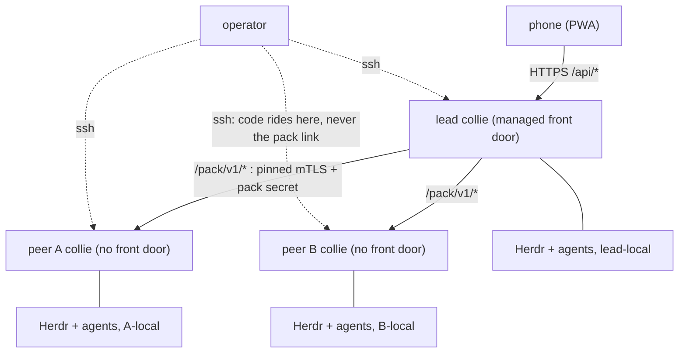
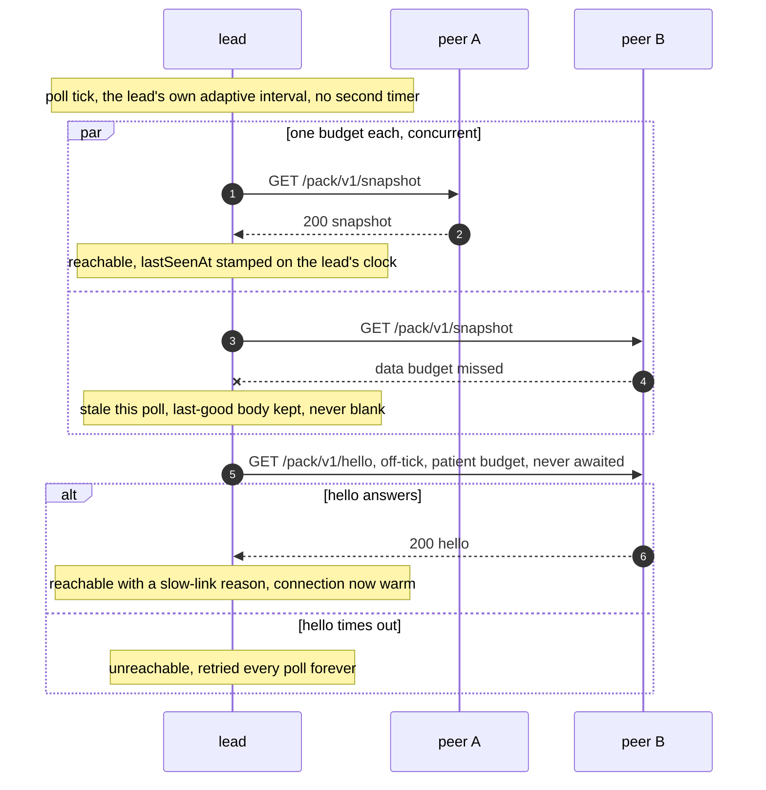
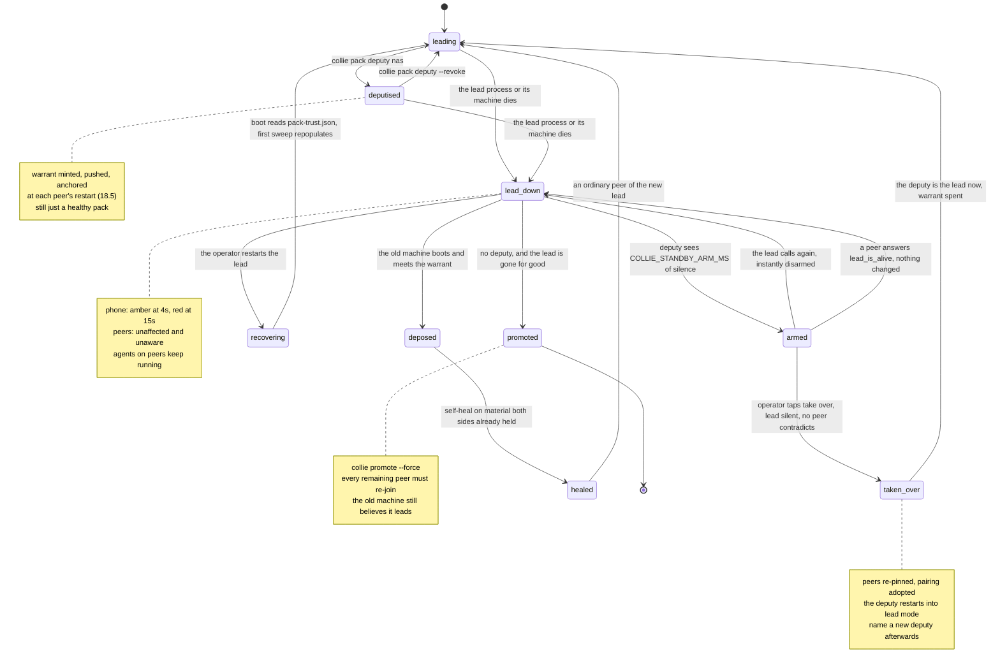

# Pack protocol v1 — the lead↔peer contract

The wire contract for **pack federation**: several machines each running a full Collie, one of them
holding the phone-facing front door. Sibling to [`HERDR_API.md`](./HERDR_API.md), which documents the
contract *below* Collie (the Herdr socket); this documents the contract *between* Collies.

**Provenance convention**, mirroring `HERDR_API.md`:

- **Verified** — read first-hand out of this repo at the cited `file:line`. Existing behaviour.
- **Specified** — normative for v1. The protocol **is implemented** on the v1 line (`bridge/pack/`,
  `cli/`), so a requirement below is generally probeable — but only the spots carrying a **Verified**
  marker have been read back against the code. Nothing here records a full document-wide
  verification pass.

Unmarked prose is Specified. Where a rule extends existing behaviour, the existing behaviour is
cited so a reviewer can check the extension is faithful.

---

## 1. Vocabulary

| Term | Meaning |
|---|---|
| **collie** | One Collie instance — one server process on one machine. Every pack member runs a full one. |
| **lead** | The one collie that holds the managed front door. The phone talks to the lead and to nothing else. |
| **peer** | A collie with no front door, reached only by the lead over an authenticated pack link. |
| **pack** | The lead plus its enrolled peers. One lead per pack, always. |
| **member** | A collie enrolled in a pack — lead or peer. Identified by a **member id**. |
| **solo** | A pack of one: a lead with zero enrolled peers. Today's Collie, exactly. |
| **deputy** | The one peer the lead has named as eligible to take over. A deputy is a peer in every other respect. **At most one exists in a pack at any instant** (§18). |
| **warrant** | The short, lead-signed object that names the deputy: pack id, generation, deputy member id, deputy certificate fingerprint, issue and refresh times (§18). A *standing permission*, never a command. |

These are the shipped words. Earlier drafts said *alpha* for *lead* and *bridge* for *collie*; both
are dead. The vocabulary decision and the rename rules for operator-visible surfaces are
[ADR 0012](./.adr/0012-every-machine-runs-a-collie-and-the-pack-has-a-lead.md).

## 2. Shape of the thing

```
  phone ──HTTPS──▶ lead ── /api/*  (unchanged, today's handlers)
                    │
                    ├── pinned mTLS + pack secret ──▶ peer A  /pack/v1/*
                    └── pinned mTLS + pack secret ──▶ peer B  /pack/v1/*
```

The same shape with the operator's own path drawn in, because it is the one people get wrong — code
never rides the pack link:



The lead is the only dialler: a peer never calls the lead except at `join`, `leave` and `promote`
(§8.6), and publishes nothing for the phone to reach ([ADR 0013](./.adr/0013-a-peer-listens-without-becoming-a-front-door.md)).
The dotted edges are `collie pack add` / `collie pack update`, which push a git bundle over the
operator's own ssh ([ADR 0016](./.adr/0016-updates-ride-the-operators-ssh.md)); the pack link carries
runtime data and never software.

Three rules generate most of this document:

1. **The lead consumes a peer's *Collie* HTTP API.** The lead **never dials a peer's Herdr socket**,
   and no Herdr method name ever crosses a pack link. This is the mux-driver seam — a peer fronting
   something other than Herdr is invisible to this protocol. Argument:
   [ADR 0011](./.adr/0011-the-pack-protocol-is-the-mux-driver-seam.md).
2. **A peer publishes nothing.** No `tailscale serve`, never `tailscale funnel`, no PWA, no browser
   gates. A peer's pack listener is not a front door.
3. **Solo pays zero tax.** With zero peers enrolled, every observable byte is what it is today (§11).

### Why peers run a full Collie

The cheaper design is obvious and will be re-proposed: let the lead dial a *remote Herdr socket* over
a forwarded connection and skip the second Collie entirely. It does not work, for reasons that are
structural rather than aesthetic:

- **The journal is host-local by rule.** `bridge/journal/` reads the agent's own session log off the
  disk it was written to, and every path goes through `containedRealpath()`
  (`bridge/journal/files.ts:39`). A forwarded socket moves the terminal and strands the transcript.
- **Uploads are host-local by necessity.** `uploadPane()` writes into `<stateDir>/uploads` and returns
  the **absolute local path** to be typed at the agent (`bridge/server.ts:1075-1090`). Herdr on *that*
  machine must be able to open it. A file on the lead's disk is useless to an agent on the peer.
- **Audit is host-local by design.** `<stateDir>/audit.log` is the record of what happened on *these*
  terminals (`bridge/audit.ts:64-67`). A forwarded socket writes every peer's history into the lead's
  log and leaves the peer's own operator with nothing.
- **It welds Collie to Herdr.** The wire format would become Herdr method names, and the seam in rule
  1 would not exist.

---

## 3. Roles and modes

A collie runs in exactly one mode, decided by its enrollment state, not by a flag the operator
maintains by hand.

| Mode | Front door | Serves the PWA | Browser gates (`checkAccess`) | Pack listener |
|---|---|---|---|---|
| **solo** (lead, 0 peers) | yes | yes | yes | none — nothing is opened |
| **lead** (≥1 peer) | yes | yes | yes | none inbound; dials outbound |
| **peer** | none | **no** | n/a (no browser reaches it) | `/pack/v1/*` only |

In **peer mode the browser-facing surface is disabled**: `serveStatic()` (the SPA fallback,
`bridge/server.ts:386`), the `/auth` reserved placeholder (`:383`, `isReservedAuthPath()` `:1347`) and
the `/api/*` routes are not served to the pack listener. A peer answers `/pack/v1/*` and nothing else.

**There is no second port.** The pack surface is a path prefix on the collie's existing listener, with
its own admission path.

**The bind is `COLLIE_HOST`, and the operator owns it** *(amended 2026-08-08 — see below)*. The pack
listener answers on the one address `COLLIE_HOST` names (`bridge/config.ts` `host`, default
`127.0.0.1`); `Bun.serve` takes a single `hostname`, so there is exactly one bind, not a pair.
`join` does not touch it — reachability is the operator's to own here exactly as it is at §8.2 and
everywhere else in this design. The bind bounds only **which interface the listener answers on**; it
is **pinned mutual TLS + the pack-secret admission that actually gates** every request (§8.1). A
wider bind therefore widens *who can attempt* the gate, never *who passes* it.

Concretely: a peer reachable only over an overlay or a LAN must set `COLLIE_HOST` to that interface
— a loopback-only bind refuses the lead's dial. `COLLIE_HOST=0.0.0.0` (or `::`, or empty) binds all
interfaces; that is not a hole — the two factors still gate — but it is worth stating, so a peer on a
wildcard bind emits a loud one-line startup warning naming the effective bind, and `collie pack
status` shows the resolved bind so an operator can see it rather than infer it. Collie **warns, it
does not refuse to start** (ADR 0013's posture: a startup refusal it cannot justify is paternalism).

> **Amendment (2026-08-08, F3).** Earlier drafts of this section claimed a peer "binds loopback plus
> exactly the address the operator supplied at `join` time — nothing wildcard, no `0.0.0.0`". That
> dual-bind was never implemented and is not expressible (`Bun.serve` takes one `hostname`); the real
> bind is `COLLIE_HOST` alone, and nothing warned on a wildcard. The claim overstated a control — the
> exact failure ADR 0013 names — so it is corrected here to match the code, and the guardrail its
> intent wanted (the wildcard-bind warning + the `pack status` bind line) is now built.

The posture argument (front door vs. pack listener, and what an off-loopback bind costs) is
[ADR 0013](./.adr/0013-a-peer-listens-without-becoming-a-front-door.md), which amends ADR 0001 to
*one managed front door **per pack***; this document takes its conclusion as given.

---

## 4. Addressing — the host dimension

**Verified today:** session selection is one line. The bridge reads `?session=<name>` off the URL
(`bridge/server.ts:172`) and resolves it through the registry — absent or blank selects the primary,
unknown returns `undefined` and the caller 404s (`bridge/sessions.ts:154-157`). In the browser the
same value travels as the short `?s=` (`web/src/lib/session.ts:10,28-31`) and `withSession()` renames
it to `session=` on the wire (`web/src/lib/api.ts:70-77`).

**Specified:** a pane is addressed by the triple **`(host, session, paneId)`**.

- Browser URL: **`?h=<member-id>`**, alongside the existing `?s=<session>`.
- Wire (phone → lead): **`host=<member-id>`**, alongside `session=<name>`, exactly as `?s=`→`session=`.
- **Absent or blank `h` means the lead itself.** This is the whole backward-compatibility story: every
  URL, every bookmark, every link and every cache key that exists today keeps resolving unchanged, and
  a solo instance never emits the parameter (mirroring `sessionSearch()` returning `""` for the
  primary session, `web/src/lib/session.ts:28-31`).
- A **member id** is `[a-z0-9][a-z0-9-]{0,62}`, minted by the lead at enrollment. It is not a
  hostname, not an address, and carries no routing information.
- **A client-supplied host is only ever a registry key.** It selects among members the trust store
  already holds; it never builds a filesystem path and it never becomes an address the lead dials.
  This is the identical rule the session name has carried since multi-session shipped, and for the
  identical reason (`bridge/sessions.ts:17-20`). An unknown host is a **404**, matching
  `unknownSession()` (`bridge/server.ts:174-175`).
- `?h=` composes with `?s=`: the session named is a session **on that host**. A pack link never
  forwards its own `host=` — a peer has no peers.

The `(host, session, paneId)` triple is also the cache-key shape. Today's pane ETag cache is keyed by
the NUL-joined `(session, paneId)` pair precisely because pane ids collide across servers
(`web/src/lib/api.ts:201-203`); a second Collie is another such server, so the key widens by one
component and the reasoning is unchanged.

---

## 5. The peer surface — `/pack/v1/*`

A peer's pack routes are a **1:1 re-exposure of the routes the phone already calls**, dispatched into
the same handlers. There is no second handler set, no second semantic, and no Herdr vocabulary.

| Method | Path | Backs onto (Verified) | Lead treatment |
|---|---|---|---|
| `GET` | `/pack/v1/snapshot` | `GET /api/snapshot` (`bridge/server.ts:177`) | **merged** — the only merged route |
| `GET` | `/pack/v1/pane/:id` | `GET /api/pane/:id` (`:276`) | proxied byte-for-byte |
| `GET` | `/pack/v1/pane/:id/history` | `GET …/history` (`:277`) | proxied byte-for-byte |
| `POST` | `/pack/v1/pane/:id/reply` | `POST …/reply` (`:279`) | forwarded |
| `POST` | `/pack/v1/pane/:id/keys` | `POST …/keys` (`:280`) | forwarded |
| `POST` | `/pack/v1/pane/:id/upload` | `POST …/upload` (`:281`) | forwarded (§13) |
| `POST` | `/pack/v1/pane/:id/close` | `POST …/close` (`:282`) | forwarded |
| `POST` | `/pack/v1/pane/:id/rename` | `POST …/rename` (`:283`) | forwarded |
| `POST` | `/pack/v1/pane/:id/focus` | `POST …/focus` | forwarded — additive-optional (§7.1). Shows the pane on **the peer machine's** terminal; a lead that predates it never calls it, and a peer that predates it answers 404 to a lead that does |
| `POST` | `/pack/v1/tab` | `POST /api/tab` (`:218`) | forwarded |
| `POST` | `/pack/v1/tab/:id/rename\|close` | `TAB_ACTION_ROUTE` (`:102`, matched `:234`) | forwarded |
| `POST` | `/pack/v1/workspace` | `POST /api/workspace` (`:225`) | forwarded |
| `GET` | `/pack/v1/config` | `GET /api/config` (`:288`) | consumed by the lead, not proxied |
| `GET` | `/pack/v1/hello` | — (new) | consumed by the lead: liveness + version + member id |

`?session=` is accepted on every session-scoped pack route with today's exact semantics (absent →
primary). It is the peer's *own* session registry that resolves it.

**`hello`'s response body** is the one place both versions cross a link — the wire contract and the
answering build:

```json
{ "protocol": 1,
  "member": "peer-7f3a2c",
  "version": "1.0.0-alpha.11",
  "warrantGeneration": 3,
  "warrantRefreshedAt": 1755600000000 }
```

- `protocol` and `member` are **REQUIRED** (`bridge/pack/router.ts`, the `PACK_HELLO_PATH` branch; a
  reply missing either is `hello: malformed response body`, `bridge/pack/peer-client.ts`).
- `version` is **OPTIONAL**, added 2026-08-12: the answering build's own version string, exactly what
  `collie version` prints (`cli/context.ts`'s `collieVersion` — `1.0.0-alpha.11`, or
  `1.0.0-alpha.11+ab12cd3` when a build stamp is present). **An absent field means "a build older
  than this amendment", never an error** (§7.1). The request side gains nothing: the surface that
  renders skew already dials `hello` in both directions — `collie pack status` probes every member on
  a lead and probes the lead on a peer — so the field rides an exchange that already happens *there*.
  The lead's poll (§10.1) deliberately does **not** dial `hello` — it dials `snapshot`, and gains no
  version leg: N extra round trips per poll to re-learn a fact that changes only on restart would be
  §10.1's budget spent on nothing. If the running bridge ever needs the version continuously (rather
  than at probe time), the road is an additive-optional field on `snapshot`'s response, per §7.1's
  class rule — not a second dial.

- `warrantGeneration` and `warrantRefreshedAt` are **OPTIONAL**, added 2026-08-20 (§18): the warrant
  this member holds, as a monotonic integer and an epoch-millisecond timestamp. **They are sent as a
  pair or not at all**, and **an absent pair means "this member holds no warrant, or is a build that
  does not know about warrants" — never "up to date"** (§7.1). A half-reported pair is exactly as
  unknown as an absent one. Both readings make the lead push the current warrant on its next sweep,
  which is the closed direction: a needless push costs one small body, where reading silence as
  currency costs a member that never receives the operator's designation at all. **The same pair
  rides `/pack/v1/snapshot`'s response**, beside the snapshot body rather than inside it — that body
  is the one this collie serves its own browser, and a pack-only fact has no business in the
  browser's shape. `snapshot` is what the lead's poll already dials (§10.1), which is what makes the
  comparison cost no extra round trip.

- `warrantActiveGeneration` is **OPTIONAL**, added 2026-08-20 (§18.17): the warrant generation that
  member's **listener activated when it bound**, which is the second of §5's two phases and the only
  half the lead cannot observe. **An absent field means "nothing is active there, or this build cannot
  say" — never "armed"** (§7.1), and that reading leaves the lead on the lower bound in its own
  `pack-ops.json`, which is the pre-amendment behaviour unchanged. **It rides `/pack/v1/snapshot`'s
  response too**, beside the body rather than inside it, for the warrant pair's reason. It names no
  secret: one integer, and one the caller itself issued.

- `pairingDigest` is **OPTIONAL**, added 2026-08-20 (§18.14): a digest of the synced paired-device
  registry this member holds, and `null`/absent on every member that holds none — which is every peer
  that is not the deputy. **An absent field means "nothing synced here", never "up to date"** (§7.1),
  and both readings make the lead push, which is the closed direction for the same reason the warrant
  pair's is. **It rides `/pack/v1/snapshot`'s response too**, beside the body rather than inside it,
  because `snapshot` is what the lead's poll already dials. It names no secret: a hash over labels,
  token *hashes* and creation stamps — a digest of digests — and it is admissible here for `member`'s
  reason, being already knowable to anyone who has cleared both factors. The value is **opaque to its
  reader**, which only ever compares it for equality with its own.

- `pairingCollision` is **OPTIONAL**, added 2026-08-20 (§18.14): the labels this member's own paired
  devices share with the synced registry it holds. **Absent or empty means "no finding"** (§7.1), and
  it is re-derived from disk on every answer, so it appears while it is true and clears the moment the
  operator frees the name. It rides `/pack/v1/snapshot` too, beside `pairingDigest`. It names labels
  the operator chose and nothing else — no hash, no token, no count — and it is a **finding, never a
  refusal**: the sync it describes has already been applied, because a receiver that refused it would
  be holding a revoked credential live at its own standby door.

`hello` gains nothing else. It is what an *admitted* member uses to confirm a link, so it must not
become a place to learn something an unadmitted caller wants; a version is admissible there for the
same reason `member` is — it is already knowable to anyone who has cleared both factors. A warrant
generation is admissible for the same reason, and it names no secret: an integer and a timestamp.

**Deliberately not on the pack surface**, because they are properties of the collie the phone talks to
rather than of a herd: `POST /api/subscribe` (`:303`), `POST /api/notifications/snooze` (`:318`),
`GET|POST /api/notifications/prefs` (`:340`), `POST /api/update/check` (`:367`). Push subscriptions
live on the lead; notification policy is one pack-wide setting the lead owns; update checking is
per-machine and is the operator's business on each. A peer's own `/api/*` surface still has them for
its own operator, when that peer is being used directly.

**No upload-read route exists on either surface.** `POST …/upload` stores a file and returns its
absolute local path (`bridge/server.ts:1090`); nothing serves it back over HTTP today (verified: the
pane route family `bridge/server.ts:93` has no read action for uploads). If one is ever added, it is a
proxied byte-for-byte read like the mirror, and it reads from the **owning peer's** disk.

**The membership routes are a separate, smaller table.** They are not re-exposed phone routes and
never will be — they carry no pane data, take no `?session=`, and are addressed to the collie rather
than to anything it fronts. They exist because three operator verbs are otherwise undeliverable:

| Method | Path | Sent by | Meaning |
|---|---|---|---|
| `POST` | `/pack/v1/enroll` | a joining machine | The exchange of §8.2. Admitted by the **token**, not by the two factors — the joining peer holds neither yet. |
| `POST` | `/pack/v1/secret` | the lead | Hands a peer the rotated pack secret (§8.4). Refused unless the caller is *this collie's own lead*: the secret is pack-wide, so any other admitted member accepting one could lock the lead out of its own pack. Authenticated by the **outgoing** secret and carrying the incoming one — there is no instant in which both are accepted. |
| `POST` | `/pack/v1/lead` | the member being promoted | "The member calling you is the lead now" (§14). The old lead demotes itself and answers with its roster (the only way the new lead can pin members it has never spoken to); a peer re-pins and keeps its id and the pack secret. A member may only claim leadership **for itself** — and a claim is **not self-authorising**: the lead demotes only against a live operator approval (§14). |
| `POST` | `/pack/v1/leave` | any member | The caller removes **itself** from this collie's roster (§8.4). The member id is the admitted one, never a body field, and a second call is still `200` — the operator's question has the same answer either way. |
| `POST` | `/pack/v1/pairing` | the lead | Syncs the lead's paired-device registry — **hashes only** — to the **deputy and to nobody else** (§18.14). Refused unless the caller is *this collie's own lead* AND this collie holds a verified warrant naming **itself**. A label that collides with one of this machine's own paired devices refuses the sync with `code: "pairing_label_collision"`, naming the labels; it is never silently renamed. |
| `POST` | `/pack/v1/takeover` | the deputy | The witness question, then the re-pin (§18.16). **Two-phase**, with `phase` additive-optional and **absent meaning `probe`** — the reading that changes nothing. It is the one route a caller admitted **as the deputy** may use, and like `warrant` it has two kinds of recipient: arriving at a collie that still believes it leads, a `probe` answers `lead_is_alive` (it *is* the lead, and it *is* answering) and a `commit` is a deposition (§18.12). |
| `POST` | `/pack/v1/warrant` | the lead | Delivers or refreshes the warrant naming the pack's deputy, with the deputy's certificate beside it (§18). Refused unless the caller is *this collie's own lead* — the same role check `secret` carries, for the same reason. A member that `404`s this route is a **pre-amendment build: not warrant-capable, and therefore not takeover-capable.** That is a closed reading and a named `pack status` finding, never an error. **It is also the one route with two kinds of recipient** — arriving at a collie that still believes it leads, a warrant it signed itself is a *deposition* rather than a push to store (§18.12), exactly as `/pack/v1/lead` is one fact arriving at two kinds of recipient. |

Everything except `enroll` sits behind the same two factors as the rest of the prefix, and each
carries a role check on top: *admitted* and *allowed to do this* are different questions.

**Which routes may be authenticated by a §8.6 signature** is a closed set — `leave`, `lead`, `hello`
and, since 2026-08-20, `warrant` and `takeover`. It is exactly the routes that travel **peer → lead**, the one
direction where the transport cannot pin (§8.1), and `warrant` joined it for the delivery that
matters most: a new lead telling the old one that the crown has moved (§18.12). The proxy surface is
not on the list and must not be — those calls run lead → peer over a pinned handshake, and admitting a
signature there would mean hashing a request body on the security path, turning a streamed upload
(§13) into a buffered one. `enroll` is not on it either: at that instant the joiner is pinned by
nobody (§8.2).

**Reserved paths.** `/pack/v1/` must never collide with `/auth`, `/auth/*` (reserved for a fronting
proxy, `bridge/server.ts:1347`, matched `:383`) or `/cdn-cgi/`. It is also **denylisted in the service
worker's route table** (`web/src/lib/sw-routes.ts`) — a browser never issues a pack request, so a
browser must never be able to cache one.

**`/standby` joins that reserved set (added 2026-08-20, §18.15).** It is not a pack route and never
travels a pack link — it is the deputy's own second listener, on its own port — but it is reserved on
the front door and denylisted in the same service-worker table, and for a sharper reason than
hygiene: in the same-origin failover deployment the phone's first hit on the bad day is an installed
service worker minted from the **lead's** origin, so a precached app shell there is the difference
between reaching the takeover page and staring at the UI of the collie that just died.

---

## 6. Headers

Every request on a pack link, and every response:

| Header | Direction | Meaning |
|---|---|---|
| `Authorization: Bearer <pack-secret>` | request | The pack-wide shared secret (§8). Required on every request including `hello`. |
| `X-Pack-Protocol: 1` | both | Protocol version. Required on every request **and** every response (§7). |
| `X-Pack-Member: <member-id>` | both | Who is speaking. On a request, the lead's id; on a response, the peer's. Informational — identity is proven by the pinned certificate, never by this header. |
| `X-Pack-Device: <device-id>` | request | The operator's device identity, forwarded for the peer's audit trail (§12). Absent when the lead's device gate is off. |
| `X-Pack-Received-At` | response | Omitted deliberately. **A peer's clock is never trusted for freshness** — the lead stamps its own receipt time (§10). |

The pack surface carries **no `Origin` and no `Host` expectation**: `checkAccess()`
(`bridge/server.ts:1113-1151`) is a browser gate — same-origin comparison, optional
`Tailscale-User-Login`, optional device header — and a pack request satisfies none of its
preconditions. The pack admission path is **separate from `checkAccess()`, never a widening of it**.
Consequences, stated so nobody has to infer them:

- A request arriving on `/pack/v1/*` is admitted **only** by the two pack factors (§8). Browser
  credentials never admit one.
- A request arriving on `/api/*` is admitted **only** by `checkAccess()` / `guard()`
  (`bridge/server.ts:1180-1187`). **The pack secret never admits an `/api/*` request** — it is not a
  bypass of a gate the same request would otherwise have faced.
- A phone request for a peer-scoped resource passes the **lead's** gates first — `guard(req, cfg,
  "read"|"write")` exactly as today, including `deviceAuth()` (`:1216-1223`) — and *then* the pack
  link. **A pack link is never an authorisation upgrade.**

---

## 7. Version negotiation

`X-Pack-Protocol` is an **explicit integer on the wire, never inferred from the app version.** Lead
and peer are separately updated machines, so skew is the steady state, not an edge case.
`GET /api/config` reports a build id (`bridge/server.ts:288-300`) but that is a build, not a contract.

- **v1 window is exact: `1` talks to `1`.** There is no forward-compatible range until there is a
  version 2 to define one against; pretending otherwise ships an untested compatibility claim.
- A peer receiving an unknown or mismatched version **refuses with `409 Conflict`** and a body naming
  both sides — never a bare 4xx, never a partial answer:

  ```json
  { "error": "pack protocol mismatch",
    "code": "protocol_mismatch",
    "expected": 1,
    "received": 2 }
  ```

  (The `error`-string field matches today's `jsonError()` body, `bridge/server.ts:1244-1251`; `code`
  and the version fields are the pack additions.)
- The lead applies the same rule to a peer's **response** header: a reply with a version it cannot
  read is a mismatch, not a parse error.
- **An incompatible peer is a distinct state from an unreachable one** (§10). It is not retried on the
  poll cadence, its sessions are shown from last-good state marked incompatible, and the reason string
  is surfaced verbatim in the UI and in `collie pack status`.

### 7.1 Version skew inside a protocol version

Two version numbers ride a pack link and they are **not the same kind of thing**. `X-Pack-Protocol`
is a *contract*: it says which grammar the bytes are in. A Collie build version (`1.0.0-alpha.11`) is
a *fact about a running process*: it says how new the code answering is. Lead and peer are separately
updated machines, so build skew is the steady state (§7), and this section is the class rule for it.

- **The protocol integer is the ONLY thing that refuses.** §7's exact-1 window guards actual wire
  incompatibility, and `admission.ts` enforces it before a handler runs. **A build-version difference
  refuses nothing**: no route behaves differently, no response degrades, no code path branches on it.
  A pack that goes dark because two machines disagree on an alpha number has traded an annoyance for
  an outage.

  The fork worth naming, because it will be re-proposed: *shouldn't a skewed member be refused, to be
  safe?* No. Refusing is only the safe move when the alternative is a **wrong answer**, and inside one
  protocol version there is no wrong answer to prevent — which is true only because of the next rule,
  and stops being true the moment that rule is broken.

- **Every addition inside a protocol version MUST be additive-optional, with absent-means-closed
  semantics.** A new field is optional on the wire; a member that does not send it is read as *not
  claiming the thing*, never as *claiming it permissively*. Concretely: an absent field never grants,
  never approves, never widens, and never makes an older member's silence read as consent. §14.6's
  approval field is one instance (no approval field ⇒ no live approval ⇒ refuse); `hello`'s `version`
  is another (absent ⇒ "older than this amendment", rendered as such); §18's `warrantGeneration` /
  `warrantRefreshedAt` are a third (an absent pair ⇒ "holds no warrant", which makes the lead *push*
  — never "already current"); and §18's `/pack/v1/warrant` route is a fourth (a `404` ⇒ the member
  cannot hold a warrant, which is the closed reading of every question that route answers); and
  §18.10's `lead_conflict` is a fifth, and the only one that is a **new answer on an existing route**
  rather than a new field. It is still additive in the sense that matters: `409` is a status this
  document already assigns to "we do not agree about who we are talking to", an older dialler renders
  an unexpected `409` as a refusal rather than as data, and it never turns a refusal into a grant. An addition that **cannot** be
  expressed this way is a version-2 change and takes `X-Pack-Protocol` with it — it does not get to
  ship inside `1` with a compatibility claim nobody tested.

  This is what makes a member running older code **behind, not incompatible**: it declines new
  optional fields, and declining is a closed reading, so there is nothing a newer member must refuse
  it over.

- **The error bodies the shared session routes serve gained optional `code` and `detail`** (added
  2026-08-24, `bridge/error-codes.ts`): a stable machine name for the refusal and the named values its
  sentence was built from, beside the English `error` that route always sent. The sentence is
  unchanged and stays the fallback, so a peer or a lead that ignores both fields behaves exactly as it
  does today, and a code a reader does not recognise reads as *no code* — which renders that same
  sentence. `PACK_PROTOCOL_VERSION` stays `1`.

- **Skew is an observation, and it is rendered.** `collie pack status` compares each member's reported
  version against this build's and marks a difference as a `warn:`-class finding naming **both**
  versions and the remedy — `collie pack update <member>` on the lead, which levels that machine to
  this build over the operator's own ssh (ADR 0016), or `collie update` on the machine itself. A member that answers `hello` without the field
  renders honestly as pre-amendment (e.g. `version pre-1.0.0-alpha.12 (not reported)`), never as
  `unknown`-shaped noise and never as an error. The `incompatible` state stays reserved for §7's
  protocol mismatch; nothing here produces it.

- **The observed version is NOT persisted.** It lives in the lead's in-memory health registry beside
  reachability (`PeerState`, `bridge/pack/registry.ts`) and is discarded on shutdown and on `prune()`
  exactly as reachability is. A version describes a *process*, and the process is what a restart
  changes: a persisted version would survive the update it is meant to report and state a falsehood
  with the authority of the trust store. **No `TrustedMember` field, and `TRUST_STORE_VERSION` stays
  `1`** (§14.6's reasoning for not bumping it applies unchanged).

- **Where the responder gets the string.** The CLI already has it (`collieVersion()`, from
  `web/dist/build-info.json` falling back to `herdr-plugin.toml`). **The bridge does not** — it reads
  only the bundle's build *id* (`bridge/server.ts`'s `buildId()`), which is not a version. The
  implementation MUST therefore thread the version into `PackRouterDeps` **at boot**, resolved once by
  whoever constructs the router (`bridge/index.ts`), using the same rule the CLI uses so the two never
  print different strings for one machine. It MUST NOT read the manifest per request: a per-request
  disk read on the pack's most frequent route, to answer a question whose answer cannot change without
  a restart, is a cost with no truth behind it.

**Compatibility of this amendment**, in §14.6's terms: an **additive optional response field**, no new
route and no new object. An old member answering a new prober omits it and is rendered as
pre-amendment. A new member answering an old prober sends a sibling the old parser ignores — verified:
`PeerClient.hello` reads `body.member` and `body.protocol` by name off a `Record<string, unknown>` and
passes unknown keys over without inspection. **`PACK_PROTOCOL_VERSION` stays `1`. No trust-store
change, no migration, no re-enrollment.** Adoption is per machine and needs no coordination: each side
starts reporting when it is updated, and until then the other side says so.

---

## 8. Trust: enrollment, factors, rotation

Collie holds no TLS material and mints no credentials today (verified: searched `bridge/` for `tls`,
`cert`, `pem`, `secret` — nothing). Enrollment introduces the first private key Collie owns.

### 8.1 Two independent factors

Every pack request must satisfy **both**, on the pack listener, or it is refused:

1. **Pinned mutual TLS.** Each collie generates a self-signed certificate. Enrollment exchanges and
   pins the two fingerprints; thereafter, an unpinned certificate is simply **not** that member. No
   CA, no directory, no overlay network — the Syncthing model. Pinning is **pairwise**.
2. **The pack secret**, presented as `Authorization: Bearer`. The secret is **pack-wide** (one value
   every member holds), not pairwise.

Neither alone admits a request: pinning survives a leaked secret, and the secret survives an
unexpected certificate chain appearing in front of a peer. The asymmetry is deliberate — pairwise
pinning is what contains a single compromised member's ability to *impersonate* another; a pack-wide
secret is what makes rotation a single operation rather than N².

**Certificates are long-lived (10 years) and expiry is not a trust boundary** — the pin is. A pack
whose members are rarely all online cannot depend on a renewal handshake that may never get a window.

**A refusal is indistinguishable to the caller.** Absent secret, wrong secret, unpinned certificate
and unknown member all produce the identical response — `401` with body `{"error":"unauthorized"}`,
no `code`, no timing branch, no hint about which factor failed. An unauthenticated caller learns only
that something is listening.

> **Amended 2026-08-07 — where the certificate factor is *enforced*, and in what shape.**
>
> **On a peer's listener the TLS factor is enforced at the handshake.** The peer's `Bun.serve` is
> built with `ca: [<its lead's certificate>] · requestCert · rejectUnauthorized`, so BoringSSL
> verifies the presented chain before a byte of HTTP exists. **An unpinned certificate, or none, is a
> transport refusal — not the uniform 401.** That is a deliberate narrowing of the paragraph above,
> forced by a measured fact: Bun 1.3.14 can *enforce* a client certificate on `Bun.serve` but exposes
> no way to *read* one (no accessor on `Server`, on `Request`, or through `node:https`), so a
> fingerprint cannot be compared in the router. It reveals **less**, not more — §8.5's "learns only
> that something is listening and speaks TLS" survives intact, and the uniform 401 still covers the
> secret factor and everything above it.
>
> Two consequences follow, and both are load-bearing:
>
> - **A peer's `ca` list holds exactly one certificate** *(amended 2026-08-20 — see below)*. A peer's
>   roster holds exactly one member
>   (§8.2 step 4), so an admitted connection can only be its lead. Admission therefore takes the
>   transport's verdict as a **boolean attestation** (`transportPinned`) set by the code that built
>   the listener, never read from a header — and resolves it to the pinned lead. A peer that cannot
>   build its anchor sets it `false` and refuses **everything**: down, never single-factor.
> - **The lead's own listener pins nothing, and cannot.** Its pack surface rides the front door, and
>   `tailscale serve` — or any conforming reverse proxy (docs/deployment.md Variant C) — terminates TLS
>   before the process sees the connection. No client certificate survives to a lead under any
>   design. The peer→lead direction re-establishes the second factor at the application layer instead: **§8.6**.
>
> **There is no live re-pin.** `server.reload({ tls })` does not swap a pinned `ca`; a membership
> change takes effect through the restart every membership verb already performs.
>
> **`COLLIE_PEER_BROWSER=1` and a pinned listener are mutually exclusive.** A browser cannot present
> the lead's client certificate, so on a pinned peer that flag's surface is unreachable. The peer
> warns and pins anyway — the pack's factor is not weakened for an opt-in convenience.
>
> **Promotion is bounded by this.** A peer pins its *current* lead, so a newly promoted member's
> handshake is refused by every other peer until that peer re-joins. With two members promotion is
> unaffected (the claim goes to the old lead, over §8.6). With three or more, the peers that are not
> the old lead must be re-enrolled — which is the rule §14 and §8.4 already state for an unreachable
> member, now reached for a second reason.

> **Amended 2026-08-20 — a peer's `ca` list holds AT MOST TWO certificates, and the second is named
> by a warrant.**
>
> The rule above becomes: **its lead's certificate, plus at most one more — the deputy named by a
> warrant this peer has verified against that same lead's key** (§18.5). Every other reading
> of a warrant leaves the list at exactly one anchor, which is the pre-amendment behaviour: a missing,
> malformed, foreign, unsigned, expired or revoked warrant, a certificate that is not the one the
> warrant's fingerprint names, or a warrant naming this peer itself or its own lead. **Never fewer
> anchors than before** — the lead's own certificate is never in question and is never dropped, so an
> existing lead's handshake is unaffected and this is not a wire change.
>
> **The boolean does not survive a second anchor, so it is not used with one.** With one anchor,
> `transportPinned` named a unique member and was sufficient rather than lossy. With two it names
> *one of two*, and Bun still exposes no accessor for the certificate a caller presented — so reading
> it as "the lead" would let a deputy that merely completed the handshake be taken for the lead on
> every route. **A two-anchored peer therefore resolves its caller by SIGNATURE, never by the
> transport's boolean:**
>
> - **Every lead→peer dial carries a dial attestation** (§8.6): base64 ECDSA-P256-SHA256 over a
>   domain-tagged string binding the method, the path, the timestamp and **the member being dialled**,
>   in `X-Pack-Dial` beside the existing `X-Pack-Timestamp`. It covers no body, so a streamed upload
>   (§13) stays a stream and it can therefore ride *every* route rather than a closed set.
> - **Identity is whichever anchored certificate verifies it** — the pinned lead's, or the deputy's.
>   A verified §8.6 *request* signature still wins outright where one is present; it is the more
>   specific claim.
> - **An unattested request is refused** on a two-anchored peer, whoever it claims to be from. A
>   listener that cannot tell its two callers apart must not guess.
> - **A single-anchor peer is unchanged, byte for byte** — the boolean still resolves to its lead, an
>   unattested dial is still admitted, and no pack that has never named a deputy sees any of this.
>
> **This is additive, and the reason is the ordering.** The only lead that can face a two-anchored
> peer is a post-amendment build, because a second anchor exists only where a warrant was issued and
> pushed — and only a post-amendment lead can issue one. So there is no build that could be locked out
> by the requirement that did not create it. An older *peer* ignores the extra headers and loses
> nothing it had.
>
> **What a second anchor buys a compromised deputy is therefore a completed TLS handshake and nothing
> behind it.** Every route this specification defines refuses a caller admitted as the deputy; the
> takeover and witness routes will declare themselves as accepting one, and until they exist the set
> is empty. §8.5's mitigation still applies to what a takeover would grant — *make the deputy the
> second machine you most trust* — but it is no longer load-bearing for the pre-takeover case.

### 8.2 Enrollment — `collie join <lead-address> <token>`

Run **on the peer**, once.

1. The operator mints a token on the lead (`collie pack invite`). The token is **single-use** and
   **short-lived** (10 minutes).
2. The peer dials `<lead-address>`, presenting the token. The token authenticates *the exchange*, and
   nothing after it.
3. The handshake transfers, and both sides persist:

   | Item | Direction | Persisted by |
   |---|---|---|
   | Peer's certificate **and** its fingerprint | peer → lead | lead (pinned) |
   | Lead's certificate **and** its fingerprint | lead → peer | peer (pinned) |
   | Pack secret | lead → peer | both |
   | Pack identity (pack id + human name) | lead → peer | both |
   | Peer's member id (minted by the lead) | lead → peer | both |
   | The address the lead will dial, and the address the peer will listen on | negotiated | both |

4. The lead's roster gains the peer; the peer's roster gains exactly one entry — its lead.

**`<lead-address>` is whatever the operator can reach.** Any network: tailnet, LAN, WireGuard,
someone else's overlay, an SSH tunnel. Collie owns authentication; **the operator owns reachability**.
There is no discovery, no enumeration, and no overlay-network integration — ever.

> **Note, added 2026-08-13 — what a lead advertises when the operator does not say.** The address a
> lead hands a joiner (`collie pack invite`, `collie pack add`, `collie promote`) is resolved in this
> order: an explicit `--address`, taken verbatim; then `COLLIE_PUBLIC_URL`, reduced to its origin
> (scheme + host + port — the pack link mounts at `/pack/v1/*` off it, so a path is dropped with a
> warning, and a value that does not parse warns and falls through); then this node's Tailscale name.
> A machine whose real ingress is a reverse proxy (docs/deployment.md Variant C/E) therefore states that
> ingress once in config instead of on every invite — a derived tailnet name is silently undialable
> from a peer under a one-way tailnet ACL, and nothing in the enrollment names that as the cause. **A peer's
> own listener address is never taken from `COLLIE_PUBLIC_URL`**: a peer publishes no front door (§3,
> ADR 0013), and a public URL is a front door by definition.

> **Amended 2026-08-07 — what actually authenticates an enrollment, stated rather than implied.**
>
> **The token and the payload. Not the transport. Trust-on-first-use, at the moment of `join`.**
>
> This was always true and used to read as though mutual TLS covered it. It cannot: enrollment is
> answered by the **lead**, whose surface sits behind a TLS-terminating front door, so no client
> certificate reaches the process (§8.1's amendment). And it could not be otherwise even in
> principle — at this instant the joiner is pinned by nobody, which is the entire reason an
> enrollment exchange exists.
>
> So the guarantees are exactly these, and no more:
> - the **single-use, ten-minute token** the operator carried out of band is what vouches for the
>   certificate in the payload;
> - the **certificate travels with its fingerprint**, and each side refuses a payload whose
>   certificate does not hash to the stated fingerprint — so what is pinned is provably what the
>   sender will present, and a pin can never be persisted in two disagreeing halves;
> - **the certificate itself is transferred**, not only its hash. A hash cannot be enforced: BoringSSL
>   anchors on certificates, and Bun offers no fingerprint-pinning hook. A member holding only a hash
>   could compare a pin it had no way to check.
>
> Everything *after* the exchange is two-factor (§8.1, §8.6). The exchange itself is one factor, on
> purpose, and it is the operator's ten-minute window that bounds it (§8.5).

> **Note, added 2026-08-07 — the lead must be restarted after an enrollment, and is told to be.**
>
> The enrollment lands in the **running** lead's trust store, through the lead's own
> `/pack/v1/enroll`. That store is read **once per process**, at boot: the mode, the roster the lead
> sweeps and the pinned `ca` a peer's listener enforces are all built from that one read. So a lead
> that answers its first `collie join` persists the peer and goes on merging nothing until it
> restarts. `collie pack invite` restarts the lead so it can *answer* the invite; the enrollment
> arrives afterwards, and no restart follows it.
>
> **v1 does not re-wire in place, and this is the decision, not an omission.** Re-reading the store
> into a live process would mean a second startup path running concurrently with the first — and
> `server.reload({tls})` does not swap a pinned `ca` at all (M4/08's transport investigation), so a
> peer's own listener could not be re-pinned without dropping the port. What v1 does instead is
> refuse to be silent about it:
>
> - the bridge records the roster it wired at boot in `<stateDir>/pack-runtime.json`
>   (`bridge/pack/staleness.ts`), and **logs** when a membership change lands under it;
> - `collie pack status` compares that marker to the store and prints **"enrolled but INACTIVE"**,
>   naming the members that are enrolled and not being served, and the `collie restart` that fixes it;
> - `collie join` ends by naming the same restart, **on the lead** — the joining machine restarts
>   itself, and it is the only party in a position to tell the operator about the other side.
>
> The marker is written only by an instance that **has** a trust store, so §11's zero-tax contract is
> untouched: solo still writes nothing.

> **Amended 2026-08-08 — the invite carries the lead's fingerprint, so the lead is authenticated to
> the joiner (closes F1).**
>
> The 2026-08-07 amendment above admitted the gap plainly: the exchange authenticates *the joiner to
> the lead* (the token) and pins the lead trust-on-first-use, with **nothing authenticating the lead
> to the joiner**. A man-in-the-middle on the enrollment path — or a mistyped/rebound `<lead-address>`
> — could capture the token, relay it to the real lead as its own enrollment, and answer the joiner
> with its *own* certificate as "the lead", pinned permanently in both directions.
>
> The fix is the Syncthing model: **the operator-carried token is now `<token>.<lead-fingerprint>`**,
> where the suffix is the lead's own certificate fingerprint (public material). The wire is unchanged —
> `EnrollRequest.token` is still exactly `<token>`, and the lead still stores only its hash — the
> fingerprint travels only in the operator's out-of-band paste. **`join` refuses a lead whose
> certificate does not hash to the invited fingerprint, before anything is pinned or persisted**, and
> **fails closed on an old-format token that names no lead**. It is the fingerprint, not the transport,
> that authenticates the lead — so `http://` remains allowed on a trusted network.

> **Amended 2026-08-10 — `join` refuses `http://` without `--insecure`.**
>
> The enroll exchange carries the invite **token** to the lead and returns the **pack secret** to the
> joiner. Over a plaintext hop both cross the wire in the clear, so an on-path attacker who reads the
> token can self-enroll **their own certificate** as a member — the lead admits on the token alone —
> before the honest joiner spends it, and walks away holding the pack secret and a pinned link. F1's
> fingerprint pin (above) authenticates the *lead to the joiner*; it does **not** defend the lead
> against a token-thief racing the spend. So `collie join` now **refuses an `http://` address unless
> the operator passes `--insecure`**, making the trusted-hop assumption explicit rather than implied.
> A scheme-less address is treated as `https://`, and an unreachable one whose scheme was assumed says
> so. The wire is unchanged and `PACK_PROTOCOL_VERSION` is not bumped.

### 8.3 Secrets never touch argv

`ps -eo args` and `/proc/<pid>/cmdline` (mode 444) are world-readable — this is not theoretical; it is
the concrete failure recorded in [ADR 0001](./.adr/0001-one-managed-front-door.md). Therefore:

- Tokens and the pack secret are read from **stdin or a 0600 file**, never from a command line
  argument and never from a long-lived process's environment. `collie join <lead-address> <token>` is
  written that way for readability; the token argument accepts `-` (stdin) and `@<path>`, and the
  literal form warns.
- At rest, pack material follows the discipline `push-subscriptions.json` already uses: atomic
  temp-file-then-rename, **file 0600, directory 0700** (`bridge/push.ts:187-192`), under `stateDir`
  (`bridge/config.ts:200-203`: `HERDR_PLUGIN_STATE_DIR` ?? `COLLIE_STATE_DIR` ?? the user state dir).

### 8.4 Rotation — `collie pack rotate`

Run on the lead. Reissues the pack secret and distributes it to every **reachable** peer in one
operation.

- **There is no grace window and no rollback secret.** The old secret stops being accepted the moment
  rotation completes on a member. A rotation whose whole point is to invalidate a leaked value cannot
  keep honouring it for a stated period.
- **Order follows from that.** The rotation lands on the lead **first**, so the lead never hands out a
  value it does not itself hold; distribution then dials each peer with the *superseded* secret, which
  is the one that peer still checks. Between the two steps the lead's ordinary poll of an undelivered
  peer fails — one interval of `stale` (§10.2), which is the price of not keeping a leaked value alive.
- **A peer offline during rotation is dropped to `unenrolled`.** The lead marks it so; the peer, next
  time it is dialled, fails both factors and stays quiet. Recovery is deliberate and explicit: the
  operator runs `collie join` on that peer again with a **fresh token**. There is **no grace window**:
  any peer offline at rotation time is dropped and must re-join, and that is precisely the cost the
  remedy for a suspected secret leak — `collie pack rotate` — pays to invalidate the leaked value.
- `collie pack status` shows, per member, whether it has picked up the current secret — rotation is
  not "done" as a fire-and-forget; it is a state you can read.
- **`collie leave`** (on a peer) drops its roster entry and its pinned material; on the lead,
  `collie pack remove <member>` unpins and forgets. Either side alone is sufficient to end the link —
  a lost disk on one end is handled by removing the member on the other.

### 8.5 Threat model

Stated plainly, because a pack link is remote shell access to a second machine.

- **A compromised peer** reaches: the pack secret (so it can authenticate to the lead as a member) and
  its own machine's terminals, journal, uploads and audit. It **cannot** impersonate another peer —
  pinning is pairwise, and the lead dials a pinned certificate, not a name. It can serve the lead
  arbitrary snapshot and pane content, which the lead renders; that content is already treated as
  attacker-influenceable and rendered as React text nodes under a strict CSP
  (`bridge/server.ts:77-80`, `ARCHITECTURE.md` §6).

  **The promotion path used to reach past "its own machine". It is closed; the attack is kept here
  because the closure is only legible against it (F2, amended 2026-08-08, closed 2026-08-11).**
  Until this amendment, `POST /pack/v1/lead` (§14) accepted a signature-verified **self-claim** from
  **any** enrolled member with **no operator consent on the receiving lead** — the wire could not tell
  an operator-run `collie promote` from a compromised peer running the same verb
  (`bridge/pack/router.ts`, `newLead`). The signature authenticates *which member* is claiming, never
  *that an operator willed it*. Two consequences followed, and neither was contained by "its own
  terminals":
    - **(a) Denial of service against the pack.** The claim forced a leadership change no operator
      consented to: the current lead demoted itself on disk and handed the claimant the **full roster** —
      every member's certificate and address (`demoteSelf`, `router.ts:~449`) — and the front door moved.
    - **(b) The former lead's terminals.** The demoted lead is pinned to the claimant in that same
      write, so after its **next restart** it comes back a peer of the attacker, which then drives the
      **former lead's** panes, journal and uploads — the reach this section otherwise reserves to a
      compromised *lead*, had from a single compromised *peer*.

  **What closes it (§14, [ADR 0014](./.adr/0014-promote-is-a-confirm-on-the-lead.md)): promotion is a
  confirm on the receiver, not a command from the claimant.** The demotion needs the old lead's
  operator. `newLead()` on a leading collie demotes only if a **live handover approval** — minted on
  that machine by `collie pack approve-promote <member>`, ten minutes, single-use — names the
  claimant *and* matches the pinned member's fingerprint, and consumes it in the same committed
  transition. An unapproved claim is refused (§14), so (a) and (b) both require an operator at the
  keyboard of the machine being taken from. The approval is **not a secret**: the claim is already
  signature-authenticated (§8.6), so consent only has to name *who* may take over.

  **The peer branch was never the reachable hole, and the transport already closes it.** A peer
  re-pins a new lead only from a claim its listener let through, and a peer's listener pins
  `ca: [<its lead's certificate>] · requestCert · rejectUnauthorized` (§8.1's 2026-08-07 amendment)
  while its roster holds exactly one member — so the only caller that reaches a peer's adopt branch is
  the peer's own currently-pinned lead's self-claim, which a re-pin already collapses to a no-op. A
  promoted *new* lead is refused at the TLS handshake, not by the route. There is no live peer-re-pin
  path in v1's topology for a signature to close; the route-level rule a broader topology would need
  is reserved, not built (§16).
  **The residual, stated plainly.** A compromised peer can still spend an approval the operator armed
  for it inside that ten-minute window, and can still deny service to itself. A compromised **lead**
  is unchanged — see the next bullet; nothing here constrains the machine that holds the keys to
  everything. And `--force` (§14) strands every peer: a promoted lead a peer does not pin is refused
  at that peer's handshake, and re-enrollment is the recovery path §14 and §8.4 already name.
- **A compromised lead** reaches **everything, on every member**. This is total, and it is inherent:
  the lead holds the pack secret and a pinned link to every peer, and its whole job is driving
  terminals. **The lead is a lateral-movement hub by construction.** Naming it is the mitigation
  available at this layer; the operator's mitigation is to make the lead the machine they most trust.
- **A stolen enrollment token** buys one enrollment, within 10 minutes, and only from someone who can
  reach the lead's address. It never buys steady-state traffic — the token authenticates the exchange
  only. It is single-use: a token spent by an attacker is a token that visibly fails for the operator.
- **An on-path attacker over `http://`** reads the token and the returned pack secret in the clear, and
  can self-enroll their **own** certificate as a member before the honest joiner spends the token (the
  lead admits on the token alone; F1's fingerprint pin authenticates the lead, not the joiner). This is
  why `collie join` refuses an `http://` address unless the operator passes `--insecure` to own the
  trusted-hop assumption explicitly (§8.2).
- **Someone who reaches a peer's pack port with neither factor** learns that something is listening and
  speaks TLS. No PWA, no version banner, no member id, no distinction between refusal causes (§8.1).
- **Local uid reach.** `ARCHITECTURE.md` §6 already documents that every uid in the host's network
  namespace can reach `127.0.0.1:$COLLIE_PORT`. The pack prefix rides that same port; it adds no new
  port, and it is *harder* to use than the existing surface, because it requires two credentials that
  a local uid does not get for free. The `/api/*` surface remains the softer target on that machine,
  and the device gate remains its answer.
- **`tailscale whois` is an optional extra, never a factor.** A `COLLIE_TRUSTED_USER`-shaped narrowing
  on top of a gate that already holds without it (`bridge/server.ts:1144-1149` is the existing shape).
  It is never discovery and the model never depends on it.

### 8.6 Signed membership requests (added 2026-08-07)

The peer → lead direction cannot pin at the handshake (§8.1's amendment), and the two requests that
travel it are the most consequential in the protocol: `leave` removes a member from a roster, and
`lead` moves the crown (§14). The pack secret is **pack-wide**, so with it alone any member could
speak for any other. The second factor is therefore re-established over material both sides already
pinned — no new key, no new trust, the same guarantee the handshake gives the other way.

**`POST /pack/v1/leave`, `POST /pack/v1/lead` and `POST /pack/v1/warrant` MUST carry a signature.**
`GET /pack/v1/hello` MAY, and does when a verb sends it, so `collie pack status` and `collie
reconnect` can probe a lead at all. (`warrant` joined the set on 2026-08-20: §18.12's deposition
travels peer → lead, into a listener that pins nothing inbound.) Nothing else may: the proxy surface
(§5) runs lead → peer over a pinned handshake, and hashing a body to verify a signature there would
pull a streamed upload (§13) into memory on the security path. `/pack/v1/enroll` cannot — at that
instant nobody has pinned the caller (§8.2).

- **`X-Pack-Signature`** — base64 ECDSA-P256-SHA256 over the canonical string, made with the private
  key behind the sender's **pinned** certificate and verified with that certificate's public key.
- **`X-Pack-Timestamp`** — epoch milliseconds, decimal.
- **The canonical string**, exactly:

  ```
  <METHOD>\n<path>\n<sha256(body) hex>\n<timestamp>
  ```

  Four fields, each closing one substitution: the **method** so a signed `POST` is not replayable as
  something else; the **path** so a body cannot be moved from `leave` to `lead`; the **body digest**
  because §14's claim lives *in* the body; the **timestamp** so a capture cannot be re-stamped
  forward. The **query string is deliberately absent** — no signable route takes one, and signing a
  value no route reads is a rule that silently stops holding the day one does. The **host is absent
  too**: an address is a hint the operator may re-point (§4), and binding a signature to it would
  make roaming a signature failure.

- **Skew: ±5 minutes**, both directions. A future timestamp is refused as firmly as a past one —
  parking a captured request for later is what a future stamp buys.
- **Replay: strictly monotonic per member.** A timestamp must be **greater than** the last one this
  collie admitted from that member; the floor is persisted (`TrustedMember.signedAt`), because a
  counter that resets on restart is no counter and every membership verb restarts this collie. The
  floor moves **before** the request is handled. It is advanced only for the membership routes, which
  are the state-changing ones — a replayed `hello` changes nothing and is bounded by the skew window.
- **A failure at any step is the uniform 401** of §8.1 — indistinguishable from a wrong secret, an
  unpinned certificate, or an unknown member. The signature is checked **before** the timestamp, so a
  caller who cannot sign learns nothing about this collie's clock or about what it has already seen.

**The warrant is a SECOND signed object under the same key** (§18, added 2026-08-20). It reuses these
primitives unchanged — base64 ECDSA-P256-SHA256, made with the signer's own key and verified against
the certificate the reader already pinned — and it is a *different canonical string*, never a
different algorithm and never a different trust anchor.

The two are kept apart **structurally**, by a fixed domain tag in the warrant's first field
(`collie-pack-warrant-v1`), rather than by the field-count disjointness the four-field string above
relies on. That disjointness is real but it degrades with every signed object added, and the key is
genuinely shared: a lead signs `hello` probes, `leave`, `lead` *and* warrants with one private key. A
tag makes the property structural and costs one string. **Retrofitting the request string above is
deliberately NOT proposed** — it is deployed, and changing a canonical string is a flag day inside
§7's exact-1 window. The tag is for new objects; §16's reserved signed handover should take one if it
is ever built.

#### The dial attestation — a THIRD signed object, and the lead→peer direction's identity *(added 2026-08-20)*

**Every lead → peer dial carries one, on every route, unconditionally.** It is what a two-anchored
peer resolves its caller from (§8.1's amendment), and it is a *third* canonical string rather than a
reuse of the four-field one above, for two reasons that are both load-bearing:

1. **The body cannot be hashed here.** A proxied write streams `req.body` straight through — up to
   10 MB of multipart, never buffered on the lead (§13). Signing a digest would mean buffering every
   upload in the lead's memory on the security path, which is the exact trade the closed
   `MUST carry a signature` set above was drawn to avoid. So this string omits the body, and what it
   claims is **identity, not integrity**: body integrity on this hop is the pinned mutual TLS's, and
   the attacker it closes — a compromised deputy read as the lead — cannot produce the lead's
   signature over any string at all.
2. **The four-field string names no RECEIVER**, and its own text says a broadening of who-pins-whom
   MUST bind one. A two-anchored peer *is* that broadening: the lead dials the deputy exactly as it
   dials every other member, so the deputy legitimately holds lead-signed traffic and could otherwise
   present it at a sibling peer.

- **`X-Pack-Dial`** — base64 ECDSA-P256-SHA256 over the string below, beside the existing
  `X-Pack-Timestamp` (one stamp per request; one request makes one freshness claim).
- **The canonical string**, exactly — five fields behind the same kind of fixed domain tag the warrant
  carries:

  ```
  collie-pack-dial-v1\n<METHOD>\n<path>\n<timestamp>\n<the member being dialled>
  ```

- **Skew: the same ±5 minutes.** **The replay FLOOR is deliberately not applied**, and that is not an
  omission: the lead dials several members concurrently within one millisecond, so a monotonic floor
  here would refuse all but one of every sweep. What bounds a captured dial instead is the receiver
  field — the only party positioned to capture one is the receiver itself, and the receiver is the
  only collie it verifies at.
- **A failure at any step is the uniform 401**, indistinguishable from every other refusal.

---

## 9. Reads — what is proxied, what is merged

**Exactly one route is merged. Everything else is proxied byte-for-byte.**

### 9.1 Proxied reads (pane mirror, history)

The lead forwards the request to the owning peer and returns the peer's response **unmodified**:
status, body bytes, `content-type`, and — critically — **`etag`**.

- `If-None-Match` from the phone is passed through to the peer.
- **Compression is hop-local: the peer hop is `Accept-Encoding: identity`, and the peer's
  `content-encoding` is never re-emitted.** The lead asks the peer for uncompressed bytes, so the body
  it holds is the body it writes out; whatever the runtime compresses and transparently decompresses
  anyway, it does *not* strip the stale `content-encoding` from the response headers, and re-emitting
  that header describes bytes that no longer exist.
- **The lead→phone hop is compressed by the lead itself**, on the phone's own `Accept-Encoding`, as a
  **stream transform** over the identity bytes (`CompressionStream("gzip")`) — never a buffer, so a
  400-turn history is still never held whole. It applies to JSON and text bodies with a body to send;
  a `304`/`204` and a non-compressible type stream through untouched. When it applies, the lead sets
  `content-encoding: gzip` and merges `accept-encoding` into the peer's `Vary` (setting it when the
  peer sent none) — the same negotiation, and the same `Vary`, a local route already declares
  (`bridge/http-cache.ts`). This is a **lead-side** behaviour only: the peer surface is unchanged.
- **"Unmodified" means status, decompressed-equivalent body bytes, and the ETag — never a transfer
  encoding.** The ETag names the identity bytes on both sides of the lead, which is why compressing
  this hop cannot invalidate it (ADR 0023). `content-length` is never copied, and is absent on a
  compressed hop by construction — a transform cannot know it, and the emitting server frames the
  bytes it actually writes.
- A peer's `304` is returned to the phone as a `304`, with the peer's `etag` echoed. RFC 7232 §4.1 is
  satisfied by the peer's own existing code path (`bridge/server.ts:467-478`).
- The ETag on a proxied read therefore means what it has always meant: *the peer's assertion about its
  own body*. The lead adds nothing to it and must not recompute it — `computeEtag()` is a hash over a
  body (`bridge/http-cache.ts:16-19`), so re-hashing an identical body would be a no-op at best and a
  silently-different value across a version skew at worst.
- The 304-skips-the-transfer win (`bridge/server.ts:460-462`) is preserved end to end, which is the
  entire reason proxying is byte-for-byte rather than parse-and-re-emit.

The phone's per-pane ETag/body cache is keyed by `(host, session, paneId)` (§4) so a `w1:p1` on one
host can never 304 into another host's mirror — the same failure the session component already
prevents (`web/src/lib/api.ts:201-203`).

### 9.2 The merged snapshot

`GET /api/snapshot` on the lead is assembled from the lead's own state plus each peer's
`GET /pack/v1/snapshot`. Two changes to `SnapshotResponse` (`bridge/types.ts:164-186`):

- **`servers?: ServerSummary[]`** — a new **optional** field, following the `update?` precedent
  (`bridge/types.ts:182-184`), **not** the always-present `sessions` precedent (`:175-179`). See §11
  for why the choice is forced.

  ```ts
  interface ServerSummary {
    // The wire spelling is `host=`. `?h=` is the SPA route parameter, which
    // web/src/lib/api.ts translates into `host=` before the request is sent.
    id: string;            // member id (the `host=` value); the lead's own entry is present too
    name: string;          // operator-chosen label
    isLead: boolean;
    reachable: boolean;    // last poll succeeded
    protocol: "ok" | "incompatible" | "unknown";
    protocolDetail?: string; // the peer's refusal reason, verbatim, when incompatible
    lastSeenAt: number;    // epoch ms, stamped by the LEAD on receipt — never the peer's clock
  }
  ```

  `reachable` is not an invention: `SessionSummary.reachable` already models an unreachable member as
  a rendered state with zeroed counts rather than a failed response
  (`bridge/types.ts:133-145`, set at `bridge/sessions.ts:171`). `ServerSummary` is that precedent one
  level up.
- **Every session and every pane is host-tagged.** `SessionSummary` gains `host: string` and the pane
  wire shape gains `host: string`, so the phone can address what it renders. Absent on a solo
  snapshot (§11).

Merging is the *only* place the lead re-serialises. Its ETag over the merged body is **the lead's
assertion about its own merged view**, not any peer's — it necessarily changes when any peer's
contribution changes, and it says nothing about whether a given peer's snapshot changed.

---

## 10. Freshness, partial failure and staleness

### 10.1 Polling (v1)

**v1 is polling. The lead polls each peer's `GET /pack/v1/snapshot` on its own adaptive interval** —
the cadence it already runs (`COLLIE_POLL_MS` 1500 / `COLLIE_POLL_IDLE_MS` 12000,
`bridge/config.ts:212-213`; `ARCHITECTURE.md` §5). There is no events endpoint on Collie's HTTP API
today and v1 does not add one; `events.subscribe` is a *Herdr socket* method (`HERDR_API.md`) and
never crosses a pack link.

- **Peer fetches are concurrent, not serial.** N peers must not add N round trips of latency.
- **Each peer gets a timeout budget strictly below the lead's poll interval** — default
  `COLLIE_PACK_TIMEOUT_MS = 1200` against a 1500 ms poll — so a slow peer can never stall the lead's
  own snapshot. A missed budget is a **stale** poll (§10.4), and the *verdict* that a member is gone
  is decided by a probe on its own budget, never by this one.
- The peer sweep is a *part of* the existing poll, not a second timer. A solo lead runs no sweep at
  all (§11).

### 10.2 Four distinct states, never conflated *(a fourth added 2026-08-20)*

| State | Meaning | Retried on the poll? | Presented as |
|---|---|---|---|
| **reachable** | Last poll succeeded within budget | yes | live |
| **unreachable** | Timeout, connection refused, TLS failure, auth failure | yes | last-good state, **stale**, with `lastSeenAt` |
| **incompatible** | `X-Pack-Protocol` mismatch (§7) | no (probed on a slow backoff) | last-good state, **incompatible**, with the peer's reason |
| **conflicted** *(added 2026-08-20)* | The member answered §18.10's named `409`: it follows a **different lead** | no — there is nothing useful to fetch from a machine that belongs to someone else's view of the pack | last-good state, **conflicted**, naming the lead it follows and that lead's warrant generation |

- **Unreachable is a value, never an error.** A down, slow, skewed or unauthenticated peer **never**
  produces a 5xx for the whole pack and never produces a blank phone. The lead's snapshot always
  answers 200 with whatever it has.
- **A peer's sessions never vanish.** They are listed from the last-good snapshot, marked stale with
  an age derived from `lastSeenAt`. A triage list that flickers is worse than one that is honestly
  stale — panes must not disappear and reappear between polls.
- **Freshness is the lead's receipt time.** A peer's clock is never trusted; `lastSeenAt` is stamped
  when the response lands, which is also why no timestamp header rides the response (§6).
- **Every landed call is a receipt — the sweep is the floor, not the only source.** A proxied read or
  write (§5, §9.1) that the peer *answered* refreshes `lastSeenAt` exactly as a sweep does: same
  clock, same meaning. This matters because the sweep rides the lead's own adaptive interval and
  relaxes to `COLLIE_POLL_IDLE_MS` (12 s), while a phone watching that peer's pane polls at 1.5 s —
  so a receipt only the sweep refreshed made a perfectly healthy peer read stale for most of every
  sweep. The fold is **successes only, for a member already believed `reachable`, and monotone**: how
  a *failure* is classified stays the sweep's and the probe's business (§10.4), so there is still one
  path to the word "unreachable". A `hello` probe remains the exception that stamps nothing (§10.4) —
  it carries no snapshot. (`bridge/pack/registry.ts` → `recordExchange`.)
- **Presented-stale threshold:** a member is rendered stale once its `lastSeenAt` is older than
  `3 × pollMs` **or** 15 s, whichever comes first. Below that, a single missed poll is invisible —
  the same tolerance the herd link already gets. `pollMs` is the *phone's* cadence, and the bullet
  above is what makes measuring the lead's receipt against it sound.
- **Stale is not unreachable, and the UI may not spell it so.** The table's "Presented as" column
  describes the *content* (last-good, labelled), not a verdict on the machine: `reachable: true`
  beside an old receipt is a normal, common state, and writes to such a member are **not** refused
  (§10.3 refuses on the lead's boolean alone). A surface may therefore only print "unreachable", or
  claim that replies and keys are refused, when that boolean is false.
- **`conflicted` is none of the other three, and a surface may not spell it as one.** It is not
  `unreachable` — the member answered, and answered precisely. It is not `incompatible` — this build
  reads that member's protocol perfectly well; the two merely share a `409`, told apart by the body's
  `code` (§18.10). And it is not a refusal of an *action*: it refuses the caller's whole premise about
  who leads. Rendering it as any of the three sends the operator to the wrong remedy — a cable, a
  build, or a verb — when the real one is that the pack has moved on.

### 10.3 Writes to a member that is not reachable

**A write to an unreachable or incompatible peer fails immediately and legibly. There is no queue and
no automatic retry.**

This is [ADR 0010](./.adr/0010-long-sends-are-verified-via-the-paste-placeholder.md)'s reasoning
carried across a lossier link. A send whose outcome is unknown must be *surfaced*, never re-sent: the
bytes may already be in the terminal, and a retry types them twice. Concretely:

- A write to a member the lead currently believes unreachable is refused **before** it is attempted,
  with a message naming the member and its `lastSeenAt`.
- A write that is attempted and then **times out** is reported as *unknown outcome* — explicitly not
  as a failure, and explicitly not retried. The operator re-reads the pane and decides.
- A write to an incompatible member is refused with the protocol-mismatch reason.
- Nothing is buffered for later delivery. A pack is not a message queue, and a pane that has moved on
  is exactly why (the same reasoning that forbids a key queue outliving its dock,
  [ADR 0005](./.adr/0005-a-composed-key-queue-never-outlives-its-dock.md)).

**On the wire** (what the phone renders on — `bridge/pack/forward.ts`): every lead-generated refusal
is JSON with `{ok: false, code, error, host}` and a distinct status — `host_unreachable` (503),
`host_incompatible` (503), `write_outcome_unknown` (504), `image_too_large` (413),
`route_not_federated` (501, for a route outside §5's table). Never a bare 500,
and never a silent success. A peer's *own* answer is never given one of these: it is passed through
as itself (§9.1), including its 403 when the peer's write gate refuses.

### 10.4 The verdict is a probe, not a poll *(added 2026-08-18)*

A healthy peer behind a Tailscale DERP relay (≈350 ms RTT, TLS handshake measured at 1.9 s) read
`unreachable` forever. The arithmetic was at fault, not the peer, and the measurement says why:
Bun's `fetch` **does** reuse a pinned-TLS connection (five sequential dials, one TCP accept), but an
**aborted** attempt leaves none behind — so when the cold handshake alone costs more than the whole
per-request budget, every attempt aborts mid-handshake and the link never bootstraps. One patient
call breaks the deadlock and every strict-budget request after it rides the warm connection.

So the two questions are budgeted separately:

- **Per-poll data requests keep the strict clamped budget of §10.1**, and a miss keeps meaning
  *stale this poll* — never *peer gone*. (Amended by §10.5: a *cold* link's first data request is
  owed one patient attempt, because the deadlock above is not exclusive to `hello`.)
- **The reachability verdict comes from a `hello` probe with its own budget** —
  `COLLIE_PACK_HELLO_TIMEOUT_MS`, default 5000 ms, **not** clamped by the poll fraction (clamping it
  would restore the deadlock) and floored at the data budget. It runs **off the poll's hot path**:
  the lead starts one, never awaited, for a sweep that died on its own clock, at most one per member
  in flight, and arms no timer — §10.1's "no second timer" is untouched. Its answer is also what
  warms the connection the next data request rides.

A member that answers the probe but misses the data budget is **reachable with a slow-link reason**,
beside the `lastSeenAt` of its last real snapshot — the honest rendering of "the machine is there,
its data is old". A probe never stamps `lastSeenAt`: a `hello` carries no snapshot. A failure that
is *not* a timeout (refused, DNS, TLS) is never re-probed patiently — those are answers from the
world, and asking them again slowly is only slower.

### 10.5 A cold link's first data request is patient too *(added 2026-08-19)*

§10.4 budgeted the *verdict* out of the deadlock and left the *data path* in it. Measured on the same
real DERP-relayed link: `hello` cold **1.86 s** → 200, `snapshot` cold *including* the handshake
**1.22 s** → 200, `snapshot` warm **0.12 s**, pane read warm **0.11 s**. Every data request carried
the strict ~1200 ms budget, so a cold one aborted mid-handshake, pooled nothing, and left the next
one cold as well — the peer read `unreachable` and every pane read answered `503 host_unreachable`
after exactly one budget, forever. **Warm budgets were never the problem; only bootstrap was.**

So a data request gets **one patient attempt per cold link**, bounded so it can never become the
steady-state budget (`takeDataBudget`, `bridge/pack/peer-client.ts`):

| link | first data request | after |
|---|---|---|
| never dialled, or dialled and torn down after a success | the patient budget of §10.4, **once** | strict |
| warm (a dial reached the far side, nothing failed since) | strict | strict |
| cold with its one credit already spent | strict | strict |

The credit is spent **at issue**, so concurrent requests and later polls never stack patient dials:
at most one is in flight per link. A host that is genuinely gone therefore still fails in one strict
budget per poll. Warmth is remembered **per address** — a member that moved (`collie reconnect`) is a
different connection and correctly starts cold — is never persisted, and decides a timeout and never
a verdict; losing it costs one patient dial.

**Every reachability finding asks both questions.** `hello` alone was a lie by omission: it runs on
the patient budget while every real read runs on the strict one, so `collie pack status` printed
`reachable` and `collie doctor` printed `member-reach ✓` over a pack that was 503ing every pane. Both
verbs now send one real `GET /pack/v1/snapshot` after the probe, on the same client (so it rides the
warmed connection, which is the bridge's steady state), and report each half with its timing. A
member that answers and then starves is its own finding, with its own remedy: the address is right,
the budget is not.

**The clamp of §10.1 is not silent.** `COLLIE_PACK_TIMEOUT_MS` above 0.8 × `COLLIE_POLL_MS` is still
clamped — that arithmetic is what stops a slow peer stalling the lead — but the bridge warns at boot
and `pack status` prints the same line, naming `COLLIE_POLL_MS` as the other half an operator must
raise. `COLLIE_PACK_TIMEOUT_MS=3000` at the default poll buys exactly nothing, and used to say so
nowhere.

### One sweep, end to end

The whole of §10 in one tick. The two budgets are the thing to read off it: the data budget decides
*this poll*, the patient probe decides *the verdict*.



A protocol mismatch is the one answer that leaves this loop: it is `incompatible`, not `unreachable`,
and it backs off instead of being retried on the poll (§7, §10.2).

---

## 11. The solo zero-tax contract

**With zero peers enrolled, Collie's observable behaviour is byte-for-byte what it is today.** This is
a gate, not an aspiration — M2/05 lands the characterization tests that enforce it before any
federation code exists to break it.

| Surface | Solo behaviour | Decided at |
|---|---|---|
| Routes served to a browser | unchanged; **zero** routes added, zero status codes changed | `bridge/server.ts:165-390` |
| `/pack/v1/*` | **not routed at all** — no pack prefix is registered with zero peers | §5 |
| Snapshot bytes | unchanged — `servers` is **omitted**, and no `host` field is added to sessions or panes | `bridge/types.ts:164-186` |
| Snapshot ETag | **unchanged.** Follows from the row above: no added field, no shifted hash | `bridge/http-cache.ts:16-19` |
| `?session=` with no param | primary session, bit-identical | `bridge/sessions.ts:154-157` |
| `?h=` | never emitted by the client, never present in a URL | `web/src/lib/session.ts:28-31` |
| Notification tags | unchanged — the primary keeps the bare `collie:herd` | `bridge/sessions.ts:33-35` |
| Push payload | unchanged — no `host` field, mirroring how `session` is stamped only for non-primary | `bridge/push.ts:124-131` |
| Poll cadence | unchanged — **no second timer, no peer sweep**, same idle relaxation | `bridge/event-poker.ts`, `bridge/config.ts:212-213` |
| Audit line bytes | unchanged — `host` is omitted, not null, exactly as `session`/`device` are today | `bridge/audit.ts:55-61` |
| Files written | **exactly today's set**: `uploads/`, `audit.log`, `push-subscriptions.json`, `snooze.json`, `notify-prefs.json`, `activity.json`, `update-state.json`. **No key, no certificate, no trust store, no roster.** | `bridge/server.ts:1075`, `bridge/audit.ts:65`, `bridge/push.ts:86`, `bridge/snooze.ts:19`, `bridge/notify-prefs.ts:45`, `bridge/activity.ts:100`, `bridge/update.ts:147` |
| Ports opened | exactly one, loopback, as today. The standby door's second listener (§18.15) is bound only when `COLLIE_STANDBY_PORT` is set **and** a trust store exists, which a solo instance has neither of | `bridge/config.ts:210-211`, `bridge/pack/standby.ts` |

**Why `servers` is optional-and-absent rather than always-present.** An always-present field — even a
single-entry one, the shape `sessions` chose — changes every solo snapshot body, and therefore every
solo snapshot ETag, exactly once. That is a real cost (one forced refetch for every solo user on the
release) paid for a uniformity nothing needs, and it contradicts *byte-for-byte*. `update?` is the
precedent that fits: absent means "no pack", which is precisely true. **Solo mints nothing and emits
nothing.**

**Where the gate lives.** `bridge/solo-baseline.test.ts` (+ goldens under
`bridge/fixtures/solo-baseline/`) and `web/src/lib/solo-baseline.test.ts`. Both were landed in
1.0.0-alpha.1, *before* any federation code existed — written afterwards they would only re-record
whatever the new code does. They pin the table above in two layers: an exhaustive
`Record<keyof T, true>` per wire type (so adding `servers?:`/`host?:` fails `bun run typecheck` at the
line it was added, and `satisfies SnapshotResponse` in `server.ts` closes the loop), plus a
byte-compared golden body and its ETag. **A failure there is not a stale golden** — it is a solo
instance's behaviour moving. Regenerating is a deliberate act
(`COLLIE_REGEN_SOLO_BASELINE=1 bun test bridge/solo-baseline.test.ts`) and **must** be called out in
the PR description with the reason and the row it renegotiates.

**What the unit baseline cannot reach.** Collie deliberately unit-tests only pure/injectable modules —
anything needing `Bun.serve` is out of `bun test`'s reach (CLAUDE.md). So four claims above are pinned
only *indirectly* (route literals, config defaults and payload shapes read out of the source) and need
the M4 integration harness to be asserted for real: **status codes** unchanged per route, **the actual
bound port count**, **the absence of a second timer / peer sweep at runtime**, and the **live push
payload** for a primary-session alert. Those four are the integration harness's charter; everything
else in the table is covered by the unit baseline today.

> **Status 2026-08-07 — the harness landed (`bridge/pack/harness.test.ts`); three of the four rows
> are now measured.**
>
> - **Status codes per route** — measured on a live solo instance: `/api/snapshot`, `/api/config` and
>   a real pane read answer today's codes, and `/pack/v1/*` is **indistinguishable from an arbitrary
>   unknown path** (same status, no version banner). Asserted as indistinguishability rather than as a
>   literal `404`, because the code depends on whether a frontend build is present and the promise
>   does not.
> - **Bound port count** — measured: exactly one, and its neighbour is closed.
> - **No second timer** — measured indirectly, and the indirection is the honest form of the claim:
>   the lead's call rate to its *own* Herdr is recorded while solo and re-measured once it leads a
>   pack, and must not move. A lead that had armed a sweep timer of its own would poll on two clocks.
> - **Live push payload** — **still out of reach.** It needs VAPID keys, a real subscription and a web
>   push endpoint; the harness has none, and `web-push` is an optional dependency. Its shape stays
>   pinned by `push.test.ts` at the unit layer. Closing it properly is M5/M6's, and it needs a
>   loopback push receiver, not a bigger pack harness.

---

## 12. Writes and audit attribution

A write reaches a peer only through the lead, and the peer's own audit log is the record of what
happened on the peer's terminals.

- The lead forwards `X-Pack-Device: <device-id>` — the operator's device identity as the lead resolved
  it via `deviceAuth()` (`bridge/server.ts:1216-1223`). Absent when the lead's device gate is off,
  matching how the field is omitted rather than nulled today (`bridge/audit.ts:55-61`).
- **The header is trusted because the pack link authenticated it**, not because it was sent. It is
  meaningful only on an admitted pack request (§8.1) — exactly the trust basis `COLLIE_DEVICE_HEADER`
  already rests on for a co-located proxy (`bridge/server.ts:1216-1223`).
- The peer writes the entry to **its own** `<stateDir>/audit.log` (`bridge/audit.ts:64-67`), with the
  device carried through as `device` and a new `via: "pack"` marker plus the originating member id, so
  a pack-originated action is identifiable in the peer's log without ambiguity. The peer's operator,
  reading their own log, sees who did it and from where.
- **The lead also records the forward** in its own log — one line, `action` unchanged, plus the target
  `host`. The two logs are independent records of the same event, which is the point: neither machine
  depends on the other's disk to answer "what happened here".
- **A peer is never asked to trust the lead's authorisation decision in place of its own.** The peer
  applies its own write-level checks to a pack request; the lead's gate does not stand in for them.

---

## 13. Uploads

The path is **phone → lead → owning peer's disk**.

- The lead forwards the multipart body to `POST /pack/v1/pane/:id/upload`; the **peer** runs the
  existing handler and writes into **its own** `<stateDir>/uploads` with the existing 0700 discipline
  (`bridge/server.ts:1075-1090`).
- The returned `path` is **peer-local and absolute on the peer's filesystem**. That is the requirement,
  not a leak: the path is typed at an agent running on that machine, and Herdr **on that machine**
  must be able to open it. A path on the lead's disk would be dead on arrival.
- The lead never stores the file and never rewrites the path.
- Upload sweeping stays per-machine (`bridge/uploads.ts`, driven from `bridge/index.ts:195-202`) — the
  peer expires its own files.

---

## 14. Promotion

**`collie promote` is a deliberate operator action, run on the peer that is to become lead.
Transparent failover is a non-goal.**

**Promotion is a confirm on the receiver, not a command from the claimant** (amended 2026-08-11,
closes F2 — [ADR 0014](./.adr/0014-promote-is-a-confirm-on-the-lead.md)). A signature proves *which
member is speaking* (§8.6); it cannot prove *that an operator willed it*. So the crown moves in **two
steps on two machines**, and each step is refused without the one before it:

1. on the **current lead**, `collie pack approve-promote <member-id>` — a ten-minute, single-use
   consent naming who may take over, which **restarts the lead** so the running process
   holds the approval (§14.1);
2. on the **peer**, `collie promote` inside that window — which demotes the lead and takes its roster.

Touching both machines is the design, not friction: consent run on the lead is what proves the
operator controls the machine that is about to lose its terminals, its roster and its front door.

### 14.1 The approval — `collie pack approve-promote <member-id>` (on the lead)

Mints a **pending handover approval** and **restarts the lead** so the running process holds
it. The approval is persisted in the trust store beside the pack's other state:

```ts
/** The operator's consent, on the lead, for ONE named member to take the crown (§14). */
interface PendingHandover {
  readonly memberId: string;   // who may take over. The whole content of the consent.
  readonly createdAt: number;
  readonly expiresAt: number;  // createdAt + 10 minutes
}
```

It sits at the **top level of the trust store, sibling to `invites`** — `pendingHandover?:
PendingHandover | null`. `parseTrustStore` builds its result from an explicit field **whitelist**
(`trust-store.ts`), so the field must be added in **both** the validator and the returned result
literal, or the approval is silently dropped on every read and gate 1 is permanently closed. Absent ⇒
no live approval ⇒ refuse: the fail-closed reading holds through that parser.

- **The mint restarts the lead, and this is load-bearing, not incidental.** A collie reads
  its trust store **at most once per process** (`trust-store.ts`, the `loaded` latch), so an approval
  a CLI writes to the store on disk is invisible to the already-running collie — the promotion would
  then refuse forever. `approve-promote` therefore mints **and** restarts (`applyLocally`, exactly as
  every other membership verb does — "a membership change takes effect through the restart every
  membership verb performs", §8.1's 2026-08-07 amendment), so the process that later fields the claim
  has already read the approval. The honest cost: the restart drops the lead's live pack links and the
  phone's connection for a moment — but it happens **at approve-time**, before the operator walks to
  the peer, so the `promote` itself runs against a lead that already holds the consent. It also
  closes the rebuilt-but-not-restarted skew trap for this verb, because the restart re-execs the
  current binary.
- **Ten minutes**, the same window and the same reasoning as an enrollment token (§8.2, `INVITE_TTL_MS`):
  long enough to walk to the other machine, short enough that an armed approval is not a standing
  capability.
- **Single-use.** Consumed in the same committed transition as the demotion — never before it, so a
  demotion that fails to persist does not burn the consent, and never after, so one approval cannot
  demote twice.
- **At most one live at a time. Minting replaces any prior.** A store is not a queue, and two live
  approvals would mean the operator had armed a race they cannot observe.
- **Swept lazily**, exactly as invites are: an expired approval is read as absent, and the next write
  drops it.
- **It is not a secret and carries no token.** The claim is already signature-authenticated against a
  pinned certificate (§8.6), so consent only has to name *who* may take over. **No new secret material
  crosses the wire**, and a leaked trust store yields nothing spendable from this field.
- **`collie pack approve-promote --cancel`** clears the live approval — and, like the mint, restarts,
  so the collie forgets it. `--cancel` parses as a **bare** flag (`bareFlags: ["cancel"]`) so it
  consumes no following token; with nothing armed it exits cleanly (`EXIT.OK`, "nothing was armed").
  TTL and replacement are the only other ways an approval ends; the operator who armed it and changed
  their mind should not have to wait the window out.
- **Validation.** It refuses when this machine is **not leading** (`EXIT.STATE`) and refuses a member
  id **not in the current roster** (`EXIT.STATE`) — an approval naming nobody the lead pins is a typo,
  not a consent. On success it prints who is approved, the ten-minute window, and the exact next step
  (*now run `collie promote` on `<member>` within 10 minutes*). It registers in `PACK_SUBCOMMANDS` and
  the help block.
- `collie pack status` shows a live approval as its own line — `handover approved: <member-id> —
  expires in Nm` — in the same spirit as §8.4's per-member secret column; a swept (expired) approval
  reads as absent. On a **peer**, where no approval can exist, it shows nothing.
- **Absent field = no live approval, never a default-open reading.** A trust store written before this
  field existed has no approval, so an unamended lead upgrades into *refusing* rather than accepting.

Audited as `pack.handover.approve` and `pack.handover.cancel`; the consumption is recorded inside the
existing `pack.demote` line, which now names the approval it spent.

### 14.2 What each recipient requires

`POST /pack/v1/lead` is still one route with two roles (§5). Only the **lead** role gains a
requirement; the peer role is unchanged.

| Recipient | Was | Now also requires |
|---|---|---|
| the **old lead** (`isLeading`) | a §8.6-signed self-claim | a **live approval naming the claimant**, whose **fingerprint equals the pinned member's** (§14.1), consumed with the demotion |
| a **peer** | a §8.6-signed self-claim from the lead it pins | *unchanged* — a peer adopts only its own pinned lead's self-claim, and the transport already refuses anyone else |

Both requirements are *in addition to* everything §8.1/§8.6 already demand — the two factors, the
signature, and the rule that a member may only claim leadership **for itself**. Neither replaces them.

**Consent must name the certificate, not just the member id.** `newLead` today checks only that the
claimed member id is the admitted one, and then pins the **claim's** certificate — so an approved
member could pin any certificate under their id, including a key they do not hold, which the old lead
would then trust. The demotion therefore additionally requires `claim.fingerprint` to equal the
fingerprint of the **admitted, pinned** member (`from.fingerprint`). Because `parseRosterEntry`
already enforces `fingerprint === sha256(certPem)`, matching the fingerprint binds the certificate:
"consent names who may take over" is only true if the key that takes over is the one already pinned.

**The authorization has an error channel of its own.** The pure demotion transition returns a
**discriminated refusal**, not a bare `null`: `not-leading` (the receiver is a peer, not the lead of
this pack) maps to the existing `400`, and `not-approved` (no live approval names this claimant, or
its fingerprint does not match) maps to §14.3's `403`. A bare `null` — today's "no change" — can only
be the `400`, so the honest `403` needs the discriminant. Reading the approval and demoting are **one
committed transition**: one `next`, the approval consumed in the same write as the role flip, one
audit line naming the approval spent. Because the check runs inside the single serialised
`TrustStore.update` write, there is no pre-read/expiry race — and the refusal path must **not** add a
further store write, since the replay-floor commit for membership routes already wrote before the
handler ran (§8.6); gate 1 must not compound it.

The **peer branch is untouched.** A peer still adopts only a self-claim from the lead it currently
pins, and its listener refuses any other caller at the TLS handshake (§8.1). A pack of three or more
machines re-joins its non-old-lead peers against the new lead (§14.5); there is no peer-side
attestation to carry, and none is needed while a peer pins exactly one lead. The route-level rule a
broader topology would want is reserved (§16).

### 14.3 On the wire

**An unapproved claim, at the lead** — `403`, and free to say why: the caller passed both factors and
§8.6, so §8.1's uniform-401 rule does not apply (it exists to tell an *unauthenticated* caller
nothing). This is the post-admission honest-error family, one status up from `badRequest` because the
caller is *admitted but not permitted* — §5's "admitted and allowed to do this are different
questions", answered on the wire. It carries a machine-readable `code`.

```json
{ "error": "this lead has not approved \"nas\" to take over — run `collie pack approve-promote nas` here, then re-run `collie promote` on that machine within 10 minutes",
  "code": "handover_not_approved" }
```

An approval that names a **different** member — or one whose fingerprint does not match the pinned
member's — produces the byte-identical response. The claimant is not told who *is* approved; that is
the operator's business on the lead, not a fact the wire owes an unsuccessful claimant.

**`collie promote` must surface this refusal honestly, and must not point at `--force`.** The
peer-client today collapses every non-2xx that is not 401/409 into `unreachable` and discards the
body, after which `promote` prints "the current lead did not answer … re-run with `--force`" —
aiming the operator at the destructive remedy for what is actually an *un-approved* promotion. So the
client gains a distinct **`refused`** outcome that carries the body: on a `403` bearing a `code`,
`promote` surfaces the lead's message **verbatim**, exits `EXIT.REFUSED`, and **suppresses the
`--force` suggestion**. `--force` is correct only for genuine unreachability, never for a refusal.

**A successful demotion** answers with the roster it always did — `{ demoted, roster }`, unchanged
from before this amendment:

```json
{ "demoted": "desk",
  "roster": [
    { "memberId": "nas", "fingerprint": "9f2c…", "certPem": "-----BEGIN CERTIFICATE-----\n…", "address": "https://nas.example:8787" }
  ] }
```

The new lead pins the roster it is handed and starts leading. **No signed object travels with the
response**: the demotion is authorised on the lead by the lead's operator, and in v1 there is no third
machine that must be convinced of it — a peer learns a new lead only by re-joining (§14.5, §16).

### 14.4 `--force` strands every peer, and says so

`--force` is for an old lead the operator knows is gone. Promoting past a **reachable** lead is
refused — that would give the pack two front doors and two rosters — so `--force` is the operator
explicitly accepting the risk for a machine they know is down. It sweeps **nobody**: a peer pins its
*current* lead at the handshake (§8.1's 2026-08-07 amendment), so a promoted lead a peer does not yet
pin is refused at that peer's TLS handshake regardless. `collie promote --force` therefore **skips the
peer sweep entirely** and prints the re-join for every member instead. (In the shipped code the forced
path already carries an empty roster, so the sweep had nobody to dial — the promise now matches.
2026-08-12: the *unforced* path's sweep is gone too, for the reason above — it could never land, and a
column of ✗ lines misread as a partial failure is worse than the plain instruction; §14.5 states the
re-enrollment rule both paths now print.)

This is accepted rather than worked around. §15 already declares transparent failover a non-goal, and
§8.4 imposes the identical rule on a peer that misses a rotation. Re-enrollment is the recovery path
for every remaining member: `collie join` against the new lead with a fresh token.

`--force` still leaves the old lead believing it leads, so it must be `collie leave`-d or re-`join`-ed
before it is ever powered back on into the pack.

### 14.5 Unchanged by this amendment

- The pack identity, the pack secret and existing pinned certificates are **reused** — promotion is a
  role change, not a re-enrollment. What changes is which member holds the front door and which
  address the others dial.
- **The claim is signature-authenticated** (added 2026-08-07). `POST /pack/v1/lead` carries §8.6's
  signature, made with the key behind the claimant's pinned certificate, over a canonical string that
  includes the body — so the claim *and* the certificate travelling with it are under the signature.
  A member may still only claim leadership for itself (the claimed id must be the admitted one), and
  the two rules are complementary: the signature proves *who is speaking*, the id check stops them
  nominating a third party. Without this, a pack-wide secret plus a lead whose front door terminates
  TLS (§8.1) would let any member move the crown to any other.
- **Only the old lead is reachable by the promotion itself** (added 2026-08-07). Every other peer pins
  its *current* lead at the handshake, so the new lead's connection is refused until that peer
  re-joins. With two members this changes nothing. With three or more, the peers that are not the old
  lead fall under the re-enrollment rule below. This handshake refusal is the **only** thing between a
  promoted lead and a peer in v1 — there is no application-layer peer-side rule, because a peer pins
  exactly one lead and a route-level adoption rule is needed only once that stops being true (reserved
  — §16, ADR 0014).
- **Every remaining peer re-enrolls; the promotion updates none of them** (corrected 2026-08-12 — an
  earlier draft said reachable peers are updated by the promotion itself, which the previous bullet's
  handshake rule makes impossible: each peer pins its *current* lead's certificate, so the new lead's
  dial is refused at TLS before any application code runs, reachable or not). `collie join` against
  the new lead with a fresh token, for every peer that is not the old lead — the same rule rotation
  uses (§8.4), for the same reason. With two members there are no such peers and nothing to do.
- **The demoted lead's roster entry names an address the demotion itself retires** (added 2026-08-12).
  The new lead carries the old lead into its roster at the address it always dialed it at — the old
  lead's **front door**, which the hand-over's own next step (`collie unserve` there) tears down. And
  a machine that led from behind a front door typically binds loopback, so it has no dialable pack
  listener until its operator sets `COLLIE_HOST` and restarts (§4 — an address is a fact about the
  dialler's network; nothing in the protocol can conjure one for a machine that never had it). The
  repair is two existing verbs, and `promote` MUST print them as steps: on the demoted machine, set
  `COLLIE_HOST` to an address the new lead can dial, then `collie restart` (the same `.env` change
  every peer makes — §8.2); on the new lead, `collie reconnect <old-lead> <host:port>`. Until then
  `pack status` and `collie doctor` here show that member unreachable, and `doctor` there names the
  loopback bind (both by design — the state is visible, not silent). No wire field is added for this:
  a bind is not a name, so nothing the demotion reply could carry is trustworthy as a dialling
  address (§7.1's class rule would permit the field; §4's addressing rule is why it would be wrong).
- **The phone re-points manually.** The front-door URL is bound to a node; nothing rewrites a
  bookmark. This is stated as an operator step, not hidden.
- **The old lead's front door is torn down by the old lead.** Collie tears down only a mapping its own
  ownership record matches ([ADR 0001](./.adr/0001-one-managed-front-door.md)), and that record lives
  beside the CLI on that machine — no process publishes or unpublishes a tunnel on another operator's
  say-so. `promote` prints the exact command (`collie unserve`) to run there; it cannot run it.
- **Nothing else follows the crown.** Push subscriptions, the audit log, outstanding notification tags
  and activity ledgers are host-local by rule (§2) and stay on the old lead. The phone re-subscribes
  against the new one. `promote` enumerates this in its own output.

### 14.6 Compatibility

The change is **additive**: one optional trust-store field, no new wire object.

- **`PACK_PROTOCOL_VERSION` stays `1`.** The approval is a body/field addition, not a new route or a
  changed shape, and §7's window is exact-1 (`admission.ts`) — bumping it would take **every** route
  down between differently-updated members in order to close a hole in one, trading a
  denial-of-service for the escalation.
- **`TRUST_STORE_VERSION` stays `1`.** The field is read as optional, and `parseTrustStore` refuses an
  **unknown** store version — so bumping it would make an updated collie reject its own pre-amendment
  store. Do not bump it.
- **Absent means closed, never open.** No approval field ⇒ no live approval ⇒ an unapproved claim is
  refused. A pre-spec store upgrades into refusing.
- **Updating the lead closes F2 for the whole pack.** The gate lives entirely on the machine being
  demoted, so a pack realizes the fix the moment its **lead** is updated. A pre-spec lead
  (≤ `1.0.0-alpha.9`) simply accepts the unattested claim as it does today; the improvement is
  realized once that lead is updated, and no peer needs the new build for it to hold.
- **Migration is "update the lead".** No state change, no re-enrollment, no rotation.
- The **class rule** this amendment is an instance of — additive-optional, absent-means-closed, and
  build skew never refusing — is §7.1.

### 14.7 Not built, deliberately

- **No claim-then-confirm.** There is no pending-inbound claim on the lead, no polling by the peer,
  and no waiting state anywhere. The operator's second machine is what carries the consent.
- **No quorum.** No countersigned roster generation, no threshold of members agreeing. This protocol
  has two roles and frequently two members (ADR 0014's alternatives).
- **No revocation channel for an approval** beyond TTL, replacement and `--cancel`. Nothing is sent to
  anybody when one is armed or cleared; it is local state on the lead.
- **No change to who may INITIATE a promotion.** Any enrolled member may still ask. Only *execution*
  is gated — which is what makes the refusal a legible operator error rather than a permission model.

> **Note, added 2026-08-07 — the demoted machine needs a restart, and `promote` says so first.**
>
> The old lead adopts its demotion **on disk**, in the request it answers. Its *process* does not
> change: it keeps the lead-mode listener it bound at boot — which, under §8.1's amendment, **pins
> nothing** — and its front door, until something restarts it. So `promote` now prints
> `collie restart`, **then** `collie unserve`, for that machine, in that order: `restart` runs `start`,
> which publishes, so tearing the front door down first would race the thing that re-publishes it (the
> same ordering `collie join` uses). Locally, the demoted machine says it too — in its own log, and in
> `collie pack status`, which reports it as a `peer` on disk and a `lead` in memory (§8.2's note).
>
> **The demoted collie does not restart itself.** Exiting so a supervisor restarts it would work under
> systemd (`Restart=on-failure`) and launchd (`KeepAlive`/`SuccessfulExit=false`) — and would take the
> machine's Collie off the air entirely on the **unsupervised** tier, which nothing restarts and which
> is reached exactly where an operator is least present (a Mac whose `gui/<uid>` bootstrap refused).
> A collie is launched identically on all three tiers and cannot tell which one it is under;
> supervision is the CLI's knowledge. A demotion is not a licence to end a process that may not come
> back, so the honest v1 answer is the operator's restart, named in three places.

### When the lead dies



**Nobody elects anything, and no peer notices.** There is no peer-side timer in the protocol — a peer
answers when dialled and is silent otherwise — so a dead lead is, from a peer's side, a lead that has
not called lately. Agents on peers keep running; only the operator's window onto them closes. The
phone is the only party that reacts, on its own tier-1 connection model: amber at 4 s, red at 15 s.

**The lead role is the trust file.** `pack-trust.json` is read once per process, at boot
(§14.1), and the same machine resumes leading simply because that file still names it so. Nothing is
negotiated on the way back: peers re-admit the returning lead on the pinned certificate, the pack
secret and §8.6's signature, all of which are on disk on both sides. What a restart loses is only
in-memory — last-good snapshots and the health registry (§7.1) — so a restart is indistinguishable
from a network blip except for one poll cycle in which peers render from an empty cache rather than a
stale one.

**Keeping the lead alive is the operator's job, by design.** Collie never restarts itself — except at
the instant a takeover commits (§18.16) — for the reason §14.7's closing note gives: a collie cannot
tell which supervision tier it is under, so exiting to be revived is a bet it may lose. Put the lead
**and the deputy** under `systemd --user` (or launchd) and let that supervise them.

**If the machine is not coming back, the deputy is the answer.** A pack that named one (§18.13) is
recovered from a phone: the door arms itself on silence, the operator's tap spends the warrant, and
the exchange refuses if the lead answers or any peer says it was dialled recently (§18.15, §18.16).
Nothing here is automatic — silence *arms* the surface and never *authorises* the action
([ADR 0026](./.adr/0026-the-operator-is-the-quorum.md)). When the old machine returns it meets the
warrant, deposes itself and heals to `peer` on material both sides already held, with no operator step
(§18.12). Two things it does not do for you: the warrant is **spent**, so name a new deputy; and the
old machine's front door is its own operator's to tear down.

**Without a deputy the floor is unchanged:** §14.4's `collie promote --force` — the path that skips
the consent the old lead can no longer give, and pays for it by stranding every other peer. Read that
section before running it; its costs are not summarised here.

---

## 15. Non-goals

- **Overlay-network integration of any kind.** No Tailscale / NetBird / ZeroTier enumeration,
  discovery or membership sync — ever. An address and a token is the whole contract. This extends
  [ADR 0001](./.adr/0001-one-managed-front-door.md): Collie manages one front door **per pack**, the
  lead's, and peers manage none.
- **A second managed front door.** A peer never runs `tailscale serve` and **never `tailscale
  funnel`** — the prohibition generalises to any tunnel offering a public URL.
- **Transparent failover / leader election.** §14.
- **Write queuing or automatic retry.** §10.3.
- **A pack-wide filesystem, transcript store or audit log.** Journal, uploads and audit are host-local
  by rule (§2).
- **Streaming events in v1.** §16.
- **Standalone-from-Herdr graduation.** This document constrains the protocol's vocabulary so
  graduation stays *possible* ([RFC #67](https://github.com/AltanS/collie/discussions/67)); it does
  not commit to it and adds no driver abstraction.

## 16. Reserved for a future version — explicitly unbuilt

Named here so v1's shape does not foreclose them, and so nobody mistakes a reservation for a plan:

- **Streaming freshness.** A peer→lead push or long-lived stream replacing the poll of §10.1. The
  version header (§7) is what makes adding it a negotiation rather than a flag day. **Nothing in v1
  implements or half-implements this.**
- **An upload-read route** (§5), if a use case ever needs the lead to serve a peer-stored image.
- **A non-Herdr peer.** The seam exists (§2, [ADR 0011](./.adr/0011-the-pack-protocol-is-the-mux-driver-seam.md))
  but **nothing in v1 exercises it** — no peer fronts anything but Herdr, so the seam is a promise,
  not a verified property.
- **A route-level rule letting a peer adopt a lead it does not already pin.** Needed only once a peer
  can pin more than its single lead — roaming, multiple leads, a mesh — where the transport stops
  being the whole answer. It would reuse §8.6's signing primitives as a **signed handover** from the
  outgoing lead over a canonical string binding the new lead's pack id, member id, fingerprint,
  address and a timestamp — field-count-disjoint from §8.6's request string, which has fewer
  LF-separated fields, so the two never verify as one another under a shared key. v1 has no such
  topology: a peer learns a new lead only by re-joining (§14.5), and the transport already refuses a
  claim from any member a peer does not pin, so the rule is unbuilt.

---

## 17. Open items this document does not close

- The **final product vocabulary** for operator-visible surfaces (env keys, action ids, CLI verbs).
  Settled by [ADR 0012](./.adr/0012-every-machine-runs-a-collie-and-the-pack-has-a-lead.md);
  `collie` / `lead` / `peer` / `pack` are the words *this* document
  uses and they must stay greppable.
- ~~**The general policy for a version-skewed pack.**~~ **Closed 2026-08-12 by §7.1** ("Version skew
  inside a protocol version"), which states the class rule this item asked for: the protocol integer
  is the only thing that refuses, every addition inside a protocol version MUST be additive-optional
  with absent-means-closed semantics — which is what makes an older build *behind* rather than a
  downgrade being forced on anyone — and a build-version difference is an observation `collie pack
  status` renders, never a refusal. `hello` carries the observed version as an optional response
  field (§5); §14.6 is now an instance of the rule rather than a statement of its own.
- **Concrete default values** marked as defaults above (`COLLIE_PACK_TIMEOUT_MS = 1200`, the 10-minute
  token lifetime, the 10-minute handover-approval window, the 10-year
  certificate lifetime, the `3 × pollMs` / 15 s staleness threshold) are
  starting points chosen to be consistent with today's cadence, not measured ones. M4 may move them;
  the *shapes* — a budget below the poll interval, a short single-use token, pinning-not-expiry, a
  threshold above one missed poll — are the contract.

---

## 18. The deputy and the warrant *(added 2026-08-20)*

**The problem this closes:** a lead that dies takes the front door with it, and today the only way
back is `collie promote` at a keyboard on another machine (§14.4). A **deputy** is the one peer the
operator names, in advance and while everything is healthy, as eligible to take over. This section
specifies the object that carries that consent — the **warrant** — and how it reaches every member.
It does not specify the takeover itself.

### 18.1 One deputy, one warrant

**At most one standing warrant exists in a pack at any instant.** Naming a second deputy does not add
one: it mints generation *N+1* naming the new member, which supersedes the old warrant everywhere it
lands. With one candidate there is nothing to rank, nothing to race, and no election — which is the
point. Letting any peer *claim* leadership on lead-silence would let an attacker who can take the
lead offline choose the new lead, and ADR 0014 already refused exactly that shape. Pre-designation
moves the choice back to the operator, made while the lead is healthy enough to sign it.

The deputy must be an **enrolled peer of this pack holding the current secret generation** — the same
validation `pack approve-promote` performs (§14.1). A lead cannot name itself.

**A deputy is still a peer.** It publishes no managed front door, serves no PWA and no `/api/*`, and
answers `/pack/v1/*` exactly as before (§3, ADR 0013).

### 18.2 The warrant

```ts
interface Warrant {
  packId: string;
  generation: number;              // monotonic on the lead; higher supersedes lower, everywhere
  deputyMemberId: string | null;   // null ⇒ a REVOCATION warrant, naming nobody
  deputyFingerprint: string | null;// null iff deputyMemberId is null
  leadMemberId: string;            // whose key verifies this
  issuedAt: number;                // when this GENERATION was minted; does not move on a refresh
  refreshedAt: number;             // when it was last re-signed by a healthy lead (§18.4)
  signature: string;               // base64 ECDSA-P256-SHA256 over the canonical string below
}
```

**No new crypto** (§8.6): the lead signs with the private key behind its own pinned certificate, and
a member verifies with the certificate it already pinned as its lead's. No new key, no new algorithm,
no new trust anchor, no CA. A member verifying a warrant asks the one question it can already answer:
*did the member we pinned as our lead sign this?*

**The fingerprint is the load-bearing field.** §14.2 learned this once already: *"consent names who
may take over" is only true if the key that takes over is the one already pinned.* A warrant naming
only a member id would let anything presenting that id be accepted.

**No address and no roster.** An address is a hint the operator may re-point (§4), so binding one
would make roaming a warrant failure; a roster would make the warrant a second source of truth about
membership.

**The canonical string**, exactly — eight LF-separated fields behind a fixed domain tag (§8.6):

```
collie-pack-warrant-v1\n<packId>\n<generation>\n<leadMemberId>\n<deputyMemberId>\n<deputyFingerprint>\n<issuedAt>\n<refreshedAt>
```

`deputyMemberId` and `deputyFingerprint` are the literal string `-` in a revocation warrant. An
**empty** field there would make two different objects share a string.

### 18.3 Supersession and revocation

- **A member keeps exactly one warrant: the highest generation it has verified, and within that
  generation the highest `refreshedAt`.** A lower generation is discarded silently; so is the same
  generation with a `refreshedAt` no newer than the one held. Monotone on both axes, so a refresh can
  never walk a warrant backwards. That is the replay defence.
- **Revocation is generation *N+1* naming nobody** — a positive, verifiable statement rather than an
  absence. A member that never hears about it still holds the old warrant; a member that hears it can
  prove it heard it. An absence could never be told from a lost message.
- **Naming a new deputy revokes the old one**, by the same mechanism, in one step.
- **The generation counter lives on the lead and never resets.** It survives revocation, restart and
  promotion (§14 — a new lead adopts the generation it is handed, then increments). A reset would
  make an old warrant verify again, which is why a revocation is *stored* rather than deleted.

### 18.4 A standing generation, re-signed while healthy, dead 30 days after its last refresh

**Not a fixed expiry from issue.** Such a warrant expires precisely when it is needed: the lead is the
only party that can re-issue one, so an operator whose lead died on holiday would find the deputy
disarmed at the one moment it mattered. That is also what separates this from §14.1's ten-minute
approval, which is a *consent to a promotion happening now*. The two are different objects and must
not share a lifetime.

**Not standing forever, either.** A capability that outlives the operator's memory of granting it is a
liability.

So: **the generation is standing; the signature is refreshed.**

- The lead **re-signs the current generation on a healthy sweep** — same generation, same deputy, same
  fingerprint, new `refreshedAt`, new signature — at most **once an hour**. The refreshed warrant
  rides the same push that already carries it, and a member already holding this generation at this
  refresh is not re-pushed, so the steady-state wire cost is **one small body per member per hour**,
  not one per sweep.
- **A warrant is dead at `refreshedAt + 30 days`**, so it is only ever as old as the last time the
  pack was healthy. A pack in daily use never approaches it; a pack that has been dark for a month
  disarms itself.
- **An expired warrant is not refreshed.** It is dead on every clock that holds it, and re-signing it
  would silently re-arm a pack nobody has touched in a month. `collie pack deputy` is the way back.
- **Expiry is not revocation.** A revocation is immediate but only reaches machines that are up; an
  expiry reaches every machine but takes 30 days. Both are needed and neither substitutes for the
  other.
- **Validity is evaluated on each verifier's own clock**, and §8.6 already establishes that another
  member's clock is never trusted for freshness. A machine whose clock is a month fast disarms early —
  the fail-closed direction, and accepted.

**What bounds a warrant regardless of its lifetime:** the one-warrant invariant, generation-based
revocation, the fingerprint binding, and — decisively — the fact that **holding a warrant grants
nothing by itself**. What a takeover additionally requires is specified with the takeover, not here.

### 18.5 Distribution, and the two-phase arming nobody can skip

A peer's listener is built with **exactly one TLS anchor** — its lead's certificate — and
`server.reload({ tls })` does **not** swap a pinned `ca` (§8.1). Therefore a warrant that arrives over
the pack link lands **on disk**, and is **inert at the transport until that member restarts**. No
route, signature or warrant can climb that wall.

| Phase | What happens | When it takes effect |
|---|---|---|
| **1 — stored** | The lead pushes the warrant to every member (`POST /pack/v1/warrant`, §5). Each verifies the lead's signature, checks the generation and persists it beside its trust material. | Immediately. The member now *knows* who the deputy is. |
| **2 — anchored** | The member's next restart builds its listener with the deputy's certificate as a second anchor — **iff** the stored warrant verifies against the certificate it already pinned as its lead's, is for this pack, names a deputy that is neither itself nor its own lead, arrives with the certificate its fingerprint names, and is not expired on this member's own clock. Any other reading leaves exactly the one anchor it has always had. The full rule, and the honest consequence of a second anchor for §8.1's boolean, are at §8.1's 2026-08-20 amendment. | At the restart. Until then a takeover from that member's side is **impossible**, not merely refused. |

**The push carries the deputy's certificate PEM alongside the warrant**, and the receiver accepts it
only if `sha256(certPem)` equals the warrant's `deputyFingerprint`. This is the identical rule §8.2
uses at enrollment, for the identical reason: BoringSSL anchors on **certificates**, so a hash alone
could never be enforced. The certificate is inside the signature *by proxy, not by inclusion* —
signing a ~700-byte blob would buy no additional guarantee. A revocation names nobody and therefore
carries no certificate; one that arrives with a certificate is refused.

**The receiving order is the rule**, and it runs outside-in: shape, then whose warrant this is, then
the signature, then the certificate that rode with it, then the clock, then supersession. A caller who
cannot sign therefore never learns which generation this collie holds. **A refusal costs no write**:
a warrant that does not verify leaves the member holding exactly what it held before.

**Re-push rides the sweep the lead already runs — there is no second timer** (§10.1, §11). Each poll's
`snapshot` answer carries the member's `warrantGeneration` / `warrantRefreshedAt` (§5), so the
comparison is two fields on an exchange that already happens and costs no dial to *decide*. Only a
member genuinely behind is dialled, which covers three cases with one mechanism: a member that was
offline when the deputy was named, a member that has never heard of warrants, and every member once
an hour when the signature is refreshed. **A member that did not answer is skipped**, not pushed to
blind — it has said nothing about what it holds, and a second dial into a dead link is a second
failure per tick for no information. The push runs off the tick and is never awaited, so a sweep
still costs one strict budget (§10.1).

### 18.6 Local state

The warrant and the lead's designation land in the **trust store** as optional top-level fields
(`deputy`, `warrant`), sibling to `pendingHandover` (§14.1). **No new state file**, and solo writes
none of it (§11). `parseTrustStore` builds its result from an explicit field whitelist, so each field
is named in both the validator and the returned result or it is silently dropped on every read —
§14.1 records that exact trap. **`TRUST_STORE_VERSION` stays `1`**: the fields are read as optional
and an *unknown* store version is refused, so bumping it would make an updated collie reject its own
pre-amendment store (§14.6's reasoning, verbatim). A malformed warrant or designation invalidates the
**whole** store rather than being read around — a hole in a trust file is an unpinned member.

A peer stores the warrant and the deputy's certificate; it does **not** store the `deputy`
designation, which is the operator's decision *on the lead*. Who the deputy is, on a peer, is inside
the warrant.

### 18.7 Compatibility

**`X-Pack-Protocol` stays `1`.** The route is new (a `404` is closed everywhere), and the two response
fields are additive-optional with an absent pair reading as "holds no warrant" — the reading that
makes the lead push rather than assume. Verified precedent: `PeerClient.hello` reads `protocol` and
`member` by name and passes unknown siblings over without inspection (§7.1).

**What is *not* additive, stated plainly:** a pre-amendment member is **not warrant-capable** and no
amount of protocol politeness changes that — it has no warrant, no second anchor and no route. That is
a **capability** gap, not a **compatibility** gap: nothing breaks, one thing is unavailable, and
`pack status` says which members it is unavailable for. Bumping the protocol integer would be
actively wrong — §7's window is exact-1, so a bump takes **every** route down between differently
updated members in order to add a feature that degrades gracefully on its own.

### 18.8 Not specified here

**Nothing.** Every item that was on this list has landed.

*(The deposed state, the self-heal and the boot gate were on it until 2026-08-20 and are now §18.11
and §18.12. The `collie pack deputy` verb was on it until 2026-08-20 and is now §18.13. The pairing
sync, the standby door and the takeover exchange were on it until 2026-08-20 and are now §18.14,
§18.15 and §18.16.)*

### 18.9 A peer knows when its lead last called *(added 2026-08-20)*

**`lastDialledAt`: the epoch-ms receipt of the last **admitted** pack request from this peer's lead,
stamped on the peer's own clock.** Every admitted request refreshes it — a poll, a proxied pane read,
a forwarded write — which is §10.2's *every landed call is a receipt* rule, reached from the other
side of the link and for the same reason: the sweep relaxes to `COLLIE_POLL_IDLE_MS` while a phone
watching a pane polls at 1.5 s, so a receipt only the sweep refreshed would describe a perfectly
healthy link as quiet.

- **In memory, never persisted.** It describes a *process*, and §7.1's rule for exactly this shape
  applies: a persisted receipt would survive the restart it is meant to report and would then state a
  falsehood with the authority of the trust store. The **process start time** covers the boot case —
  a collie that has just started has never been dialled by anybody, so silence is measured from the
  **later** of the last dial and that start, or a reboot would read as maximal silence from its first
  instant.
- **A refusal is not a receipt.** Both factors must pass first; the number describes calls that
  *landed*, not calls that arrived.
- **A refusal on the SECRET is recorded separately, and is not silence either.** A `secret` factor
  means the identity was fine, and on a peer the only identity the transport can attest is its
  lead's — so it is precisely *my lead is calling me and I no longer hold the pack secret*, which is
  §8.4's rotation seen from the side that was dropped. It is what lets §18.12's *stranded by a
  rotation* be **named** rather than guessed at. The request is still refused, exactly as before.
- **There is exactly one of this number.** A door that arms on a fact `pack status` does not print is
  a door nobody can explain, so every reader — the status line, and the deputy's arming rule when it
  lands — reads this one.

**Nothing about it crosses the wire.** It is a fact a peer holds about calls it received; no field,
no header, no route.

**How a different process reads it** *(amended 2026-08-20)*. `collie pack status` is not the bridge —
it is a one-shot verb in its own process, and a number held only in the bridge's memory is a number
it cannot print. So the running process **checkpoints** the two receipts, the generation its listener
actually anchored, and its deposed state (§18.12) into the **runtime marker**
(`pack-runtime.json`, `bridge/pack/staleness.ts`), on the session-refresh tick it already runs and
never on a new timer.

This does not reopen "in memory, never persisted", and the distinction is structural rather than a
promise. Every clause of the refusal above is closed by where it lands: **the marker is not the trust
store**, it is **rewritten whole at every boot with a fresh `bootedAt`**, and silence is computed
from the **later** of the receipt and that boot stamp — so a checkpoint left by a previous process is
dominated by the new boot stamp and can never make a link look quieter than it is. `checkpointedAt`
says how old the checkpoint itself is, which is how a reader distinguishes "the lead is quiet" from
"no bridge is running here". There is still exactly one of each number: the process holds it, and
every reader reads its one copy.

**Still nothing crosses the wire.** The marker is a local diagnostic file, mode 0600 beside the trust
store, and no route reads it or reports it.

### 18.10 `lead_conflict` — a named answer when a peer follows a different lead *(added 2026-08-20)*

**Before this amendment** a lead dialling a peer that follows someone else got either a TLS refusal
(if it was no longer in that peer's anchors) or an admitted request served against a roster that
silently disagreed with it. Neither says what happened.

**Now:** a collie whose pinned lead is **not** the caller answers **`409 Conflict`** — the status §7
already uses for "we do not agree about who we are talking to" — with:

```json
{ "error": "this collie follows lead \"nas\" since warrant generation 7",
  "code": "lead_conflict",
  "leadMemberId": "nas",
  "warrantGeneration": 7,
  "warrant": { "…": "the warrant that deposed the caller, when this collie holds it" } }
```

- **Only a collie that HAS a lead answers it.** A lead pins its members individually and each of them
  is a legitimate caller, so the same comparison on a lead would refuse its whole roster.
- **It is decided on the caller's claimed identity, and that is sound *for a refusal*.** A verified
  §8.6 signature names the member outright; absent one, `X-Pack-Member` is a hint the transport
  cannot corroborate (§6). A hint is never enough to *admit* and nothing here admits anything — the
  caller has already cleared both factors — and the worst a forged header buys is a `409` naming this
  collie's own lead plus a deliberately public object.
- **It names the new lead's member id, its generation, and the warrant — and nothing else.** Not an
  address, not a certificate: the answering member is not a directory, and a member id is already
  knowable to any admitted caller (§5).
- **The warrant rides along only when it IS the proof** — a warrant naming the member this collie now
  follows. A revocation, or one naming somebody else, proves nothing about this conflict. That
  distinction is what turns a deposition into a **self-heal** rather than a park (§18.12).
- **It carries §6's headers.** The status is shared with §7's protocol mismatch; a `409` with no
  version banner would be read as a version skew, which is the one reading it must never get.
- **The dialling side renders it as a state, never as a generic failure** — §10.2's fourth,
  `conflicted` — and does not poll it: there is nothing useful to fetch from a machine that belongs
  to someone else's view of the pack.
- **It survives into the lead's own belief about that member** *(amended 2026-08-20)*. The registry
  holds `health: "conflicted"` with the lead and generation the peer named, and `collie pack status`
  prints **`this peer follows another lead "nas" (warrant generation 7)`**. Folding it into
  `unreachable` would render "this peer belongs to someone else's pack now" as "the laptop is shut",
  and no amount of waiting fixes the first. The generation is carried beside the id rather than only
  in the sentence because the operator's next move depends on it: **higher** than this lead's own is
  a takeover this machine has not heard about; **lower** is a peer that has not caught up.
- **The phone's projection is unchanged, deliberately.** §10.2 shows three states, and a `conflicted`
  member is still one the phone cannot be served from — it renders as unreachable there, carrying the
  answering peer's own sentence as the reason. The fourth state is the **operator's**, on a surface
  where the remedy is a membership decision rather than a retry.

### 18.11 The boot-time gate against a split brain *(added 2026-08-20)*

**The failure this closes:** the old lead was down during a takeover, so nobody could tell it
anything. It comes back up hours later, reads a trust store that still says `lead`, publishes,
answers the failover proxy's health check with `200` — and the proxy swings the operator's phone back
onto a machine with a stale roster and no knowledge of what happened since.

**So: a collie booting into `lead` mode with a non-empty roster probes its members before it
publishes anything.**

- **Budget:** §10.4's patient budget, concurrent, **once**. It arms no timer and it repeats never.
- **A PROVEN conflicting answer deposes it before it serves a byte** *(amended 2026-09-01)* — the
  answer must carry a warrant that passes §18.12's *what counts as learning*: signed by this
  machine's own key, stamped with this pack's id, at a generation at least its own. Because §18.10's
  named answer carries that warrant, the deposition and §18.12's self-heal happen in the **same
  boot**: a machine that was merely down during a takeover comes back up as a working peer, in one
  restart, having published nothing in between. That is the common case and it is the whole reason
  the gate sits at boot rather than at first conflict.
- **An unproven claim warns once and changes nothing** *(amended 2026-09-01)* — a member reporting a
  `warrantGeneration` **higher** than this machine's own but carrying no warrant, a §18.10 answer
  with no warrant, and a warrant stamped for a different pack are each logged once at that boot, and
  the lead keeps publishing. Until 2026-09-01 this section deposed on the bare generation too, and a
  peer that carried one stale deputy field out of a pack it had left could take a new lead's front
  door down with it. An answer is evidence only when it proves something; arrival order and a
  counter are not proof.
- **Silence from every member publishes anyway.** Fail-open on *no answer* is forced: the common case
  for "nobody answered" is a lead rebooting first after a power cut, and a lead that refuses to come
  up because its peers are still booting is an outage manufactured out of a safety check. Fail-closed
  on a *proven* conflicting answer is the point — **a proof is evidence; silence is not, and neither
  is an unproven claim.**
- **An empty roster asks nothing.** A lead with no members has nobody who could contradict it.

**This is not a peer-side timer and it is not an election** (§15). It changes no state on any machine
it asks.

### 18.12 The deposed state, and the self-heal that ends it *(added 2026-08-20)*

**A former lead that learns the crown has moved stops being a lead, loudly — and then finishes its own
demotion all the way to `peer`, on materials both machines already hold.**

### What counts as learning

Exactly one thing: **a warrant of a generation at least as high as its own, naming a deputy other
than nobody, verified against its own certificate's public key.** A lead can verify its own
signature, and that is the whole reason the warrant is signed by the lead rather than attested by the
deputy: what deposes a machine is its own past consent handed back to it. Nothing else does — not a
peer refusing it, not an unreachable roster, not a timeout. *(amended 2026-09-01)* §18.11's boot gate
reads this clause unchanged: a foreign warrant or an unproven higher generation is a warning there,
not a deposition.

**Expiry is deliberately not a clause.** A warrant's 30 days gate what it may *arm* (§18.4), not what
it *proves*: a machine that refused to believe an expired proof would keep leading a pack that has
already moved on, which is the split brain this section exists to close.

Two delivery paths, in order of reliability:

1. **The new lead tells it** — `POST /pack/v1/warrant`, arriving at a collie that still believes it
   leads. The old lead's listener pins nothing inbound (§8.1), so the call is admitted on the pack
   secret plus a §8.6 signature, which is why that route joined the signable set (§5). The caller
   must be the member the warrant **names**: a warrant is public (§8.5), so anyone who ever held one
   could replay it, and requiring the presenter to be the named deputy means a replay by a third
   member proves nothing.
2. **A peer tells it** — §18.10's answer, when the old lead dials that peer. **Best-effort and
   time-boxed**: it works only while that peer's anchor list still contains the old lead's
   certificate, i.e. until its next restart. Do not build on this path; build on (1) and on §18.11.

### What a deposed collie does immediately

- **Stops polling.** Its roster is void as a *lead's* roster; dialling it would be a second lead's
  traffic. It keeps the roster's **contents** — the self-heal reads the new lead's certificate out of
  it.
- **Stops serving the app front door, and FAILS its health check.** `GET /standby/health` answers
  non-`200`, so a failover proxy stops routing to it *before* an operator notices. This is the
  property the whole state exists for.
- **Keeps one page, at every path, at `200`**, naming the pack, the machine that leads now, the
  generation, and **which of the three outcomes below it is in**. A `200` here beside a non-`200` on
  health is deliberate: a human who reaches it deserves an answer; a proxy asking whether to route
  here deserves a refusal. It is `text/plain` — it interpolates an operator-typed pack name, and
  plain text has no escaping question to get wrong on a machine already in a degraded state.
- **Announces the transition, and never re-enters silently** — an audit line (`pack.deposed`) and a
  log line. A machine rejoining a pack by itself must be a thing the operator reads about, not a
  thing they discover; the announcement is part of the security property, not the UX.
- **Does NOT tear down its own front door.** `tailscale serve` is a publishing act owned by
  `collie serve`/`unserve` and by *this* machine's operator, who may be elsewhere (ADR 0001). Failing
  the health check is what makes the un-torn-down door harmless meanwhile, and the page names the
  command.

### The self-heal

On a verified proof the machine completes the demotion in **one committed transition**:

1. **Resolve the new lead from its own roster.** Take the warrant's `deputyMemberId`, find that member
   locally, and require `sha256(certPem) === warrant.deputyFingerprint`. **The certificate comes from
   its own disk, never from the wire** — a fingerprint is only a pin if the certificate behind it was
   already held.
2. **Rewrite the trust store:** `role: peer`, `lead: <that member>`, `peers: []`, **pack secret kept,
   own identity and member id kept**, the proof stored as the warrant it holds (so the generation
   advances and an older one can never be replayed at it), the deputy designation and any pending
   handover cleared. One write, one audit line — §14.5's *a role change, not a re-enrollment*,
   reached from the other direction.
3. **It takes effect at the next process start.** Nothing here restarts the bridge: the supervision
   tier is the CLI's knowledge, and an unsupervised bridge that exited to be revived would simply be
   gone. This is the same shape §14's demotion already has — *demoted on disk, still a lead in
   memory* — and the deposed page plus the failing health check are what make the interval harmless.
   **The exception is §18.11's boot gate**, which runs before anything is wired: a machine deposed
   there resolves its mode from the healed store and comes up a peer in the same boot, with no second
   process involved.
4. **Wait to be dialled.** A peer never initiates. The new lead is already polling this machine's
   address — it adopted that roster entry at the takeover — so the first successful `hello`/`snapshot`
   completes the re-entry. There is no rejoin handshake, because there is nothing to negotiate.

**Nothing is minted and nothing is learned.** Every certificate involved was pinned before the event,
the pack secret is unchanged, and no fingerprint is learned from the message that delivered it. The
transition is strictly **privilege-decreasing** — from the role §8.5 describes as reaching
"everything, on every member" to the one that reaches its own terminals and nothing else — which is
what makes an automatic membership change tolerable here and nowhere else.

### Three outcomes, and `pack status` must name which one

| Outcome | Condition | State |
|---|---|---|
| **healed** | The warrant verifies and the roster holds a certificate matching `deputyFingerprint`. | Transitional. An ordinary peer at the next restart, and a *reachable* one at the new lead's next sweep. |
| **parked — unverifiable** | The signature does not verify against this machine's own certificate, **or** the roster holds no certificate matching `deputyFingerprint`, **or** the conflict arrived with no warrant at all. | **Terminal.** One page, failing health, and the failing check named. Recovery is `collie pack add` from the new lead, or `collie join` with a fresh token. |
| **parked — stranded by a rotation** | Healed, but the pack secret rotated while this machine was away (§8.4). | **Terminal until the operator acts**, for §8.4's reason and not this feature's. |

**Why a failed proof parks rather than retries.** A warrant that does not verify is not a stale
message; it is a machine being told something by someone who cannot prove they may say it, and
retrying is how a refusal becomes a poll. A warrant naming a deputy this machine never enrolled is
either a hand-edited store or a pack it does not belong to. Either way the honest answer is to stop.

**The rotation case is reached AFTER the heal, never at it.** At the instant a takeover commits the
secret is unchanged (§14.5 reuses it), so nothing at heal time can tell that a rotation is coming.
What tells the returning machine is §8.4's own mechanics: the new lead rotated while it was away,
marked it `unenrolled`, and now dials it with a secret it does not hold — so its lead is *identified
and refused on the second factor*, which is exactly the fact §18.9 records. §8.4's rule is **not
relaxed**; what this section adds is that the state is **named** rather than mistaken for silence,
for a failure of the self-heal, or for `unreachable` (§10.2's states are not to be conflated).

### Not specified here

The takeover exchange that produces the deposition in the first place, and the standby door.

### 18.13 `collie pack deputy` — the operator's verb *(added 2026-08-20)*

The verb that mints §18.2's warrant, distributes it and completes §18.5's second phase. **It adds no
wire surface**: the mint is local, the push is `POST /pack/v1/warrant` exactly as §18.5 already
specifies it, and the restart rides the operator's own SSH and is never a pack message (ADR 0016).

- **`collie pack deputy <member>`**, on the lead. Refuses a collie that is not a lead, a member it
  does not pin, an `unenrolled` member, one behind on the secret generation, and itself (§18.1's
  validation, each refusal named separately so the operator knows which one it was). Then: mint,
  restart this lead, push to every enrolled peer, probe every peer read-only over SSH, ask **once**
  for the whole batch, restart each consented machine. Non-interactive aborts; there is no `--yes`.
- **A re-run naming the deputy that is already standing does not mint.** §18.3's rule — naming a
  deputy mints *N+1* — is a rule about a **change**. A re-run is a **retry**, and the common one:
  a machine had no SSH record, the operator fixed it and ran the same command again. Minting there
  would climb the generation on every attempt and make every peer already armed stale, so the re-run
  would undo the arming it was run to finish. An **expired** warrant is not re-used; that one mints.
- **`collie pack deputy --revoke`** mints §18.3's revocation, pushes it, and offers the same restart
  batch — a stored revocation is provable, but a peer keeps *admitting* the old deputy's certificate
  until its listener is rebuilt. Revoking when nobody is named writes nothing and is not an error.
- **A member with no SSH record, or one that could not be restarted, is REPORTED, never silently
  skipped**: `warrant stored, anchor INACTIVE — restart <member>`, in `pack deputy`'s own output and
  in `pack status` thereafter.

**What each side can honestly say about anchoring.** A peer knows it exactly — its own process built
the listener, and §18.9's checkpoint carries the generation it built it from. What a *lead* knows on
its own is what its operator did from this machine, so the armed generation is recorded per member in
`pack-ops.json` beside the SSH route (ADR 0016 — operator-local, never trust, never a wire field). It
is a **lower bound**: a peer that restarted for its own reasons has anchored without it moving.

**This paragraph used to end there, and that was the bug.** It also said no field reports anchoring
*"because a lead could not act on one"* — which a live drill disproved: the lead accused an armed
deputy of being un-armed, and `pack deputy` offered to restart it again. §18.17 amends it. The peer now
reports `warrantActiveGeneration`, the lead prefers that report over this record, and a confirmed
report refreshes the record so the offline view converges. The record survives unchanged as the answer
for a member that is not answering, or is too old to say.

### 18.14 The pairing sync — the lead's device registry, on the deputy *(added 2026-08-20)*

The standby door (§18.15) authenticates the operator's phone with **the pairing credential the phone
already holds** (`bridge/pairing.ts`) and nothing else. The deputy must therefore be able to verify a
token the *lead* minted, so the lead pushes its registry.

| | |
|---|---|
| **Route** | `POST /pack/v1/pairing`, lead → **deputy only** |
| **Gate** | the pack's two factors (§8.1), plus a role check: the caller must be *this collie's own lead*, **and this collie must hold a verified warrant naming itself**. Every other peer that ever receives one refuses it. |
| **Body** | `{ packId, leadMemberId, devices: [{ label, tokenHash, createdAt }] }` — every field required, because the route is new and a new route may require its own fields (§7.1). |
| **Sent** | at designation and on every change — a `pair`, a `devices revoke`, nothing else. |
| **Absent (404)** | no credential to verify ⇒ **the standby door refuses to arm.** Closed. |

- **Only hashes cross.** The token was shown once, at claim time, and is not recoverable
  (`pairing.ts`), so a store that leaks yields nothing spendable — the same reasoning `PendingInvite`
  already runs on. `lastSeenAt` is deliberately **not** sent: it is a fact about the lead's own
  traffic that the deputy could not keep true, and it is stamped on a throttle, so including it would
  make every sixty-second write look like a registry change.
- **No second timer and no dial to decide.** The deputy reports the digest of the registry it
  actually holds — `pairingDigest`, an additive-optional field on `hello` and `snapshot` (§5) — and
  the lead pushes when, and only when, that report differs from what it would send. It rides the
  sweep the lead already runs (§10.1, §11) and costs no round trip to decide.

  **It is a REPORT and not a memory, and that distinction was paid for.** The lead used to remember
  what it had pushed in a process-local field. `collie pack deputy` restarts the local bridge as its
  last step (§18.13), so the process that knew it still owed a sync was replaced by one that had never
  offered it — and nothing ever asked the deputy. A live drill found a designated deputy that never
  received a registry at all, with no error anywhere: the lead believed there was nothing to do. Asked
  rather than remembered, the decision survives a restart on either side, converges after a failed
  push, and corrects a deputy whose file was removed. This is the warrant's own discipline (§18.5),
  applied to the second thing a deputy needs.
- **A replace is wholesale, never a merge**, because a revocation on the lead has to be able to
  *remove* a device on the deputy.
- **It lands in `standby-devices.json`** — its own file, its own version integer, 0600 in a 0700
  directory, temp-then-rename — and is **NEVER merged into the deputy's own `paired-devices.json`.**
  This is not tidiness. `PairingStore.enforced()` is *the registry is non-empty*, so a merge would
  silently switch on the deputy's **own** write gate for its **own** operator, on a machine where
  nobody ran `collie pair`. A gate the operator did not arm is a lockout waiting for the day they use
  that machine directly. The synced entries are adopted into the deputy's own registry **at takeover
  commit and only then** (§18.16), because after the commit that machine *is* the lead and the phone
  must keep working against the credential it already holds.
- **A label collision is a FINDING, and it never refuses the sync** *(amended 2026-08-20, after a
  live drill)*. The receiver applies the sync and reports the clashing labels on the exchange —
  `pairingCollision`, an additive-optional field on `hello` and `snapshot` beside `pairingDigest`,
  with absent or empty meaning *no finding*.

  **Refusing it was a security bug, not a stricter reading.** The refusal froze the deputy's copy at
  whatever it held when the clash first appeared, so a device revoked on the lead stayed valid at that
  machine's standby door **indefinitely** — observed on a live pack: `collie devices revoke` succeeded,
  and thirty-five seconds and many sweeps later the deputy's file still listed the revoked device. It
  protected nothing, either: **a sync never touches the receiver's own registry.** It replaces
  `standby-devices.json`, a separate file holding the hashes the *door* checks against.

  RFC §16 decision 6 is intact and its refusal is where it belongs: labels are the revoke handle
  (`pairing.ts` → `removeDevice`), and a silently renamed device is one the operator cannot revoke by
  the name they know it by — so **the ADOPTION refuses**. That is the takeover commit (§18.16), where
  entries actually enter `paired-devices.json` under a name; it is guarded twice there, and either
  guard aborts the whole takeover and writes nothing. The finding rides the exchange rather than the
  sync's answer for the same reason the digest does: a finding delivered once, on whichever push
  happened to land, is invisible on every sweep that has nothing to push.

  **Compatibility.** A pre-amendment receiver still answers `409 pairing_label_collision`; a lead
  reads it and surfaces the finding, but that build's copy stays frozen until it is updated — a
  capability gap the lead cannot close from its side, and one `pack status` names.
  **The lead reads that `code` and those `labels` off the refusal**, exactly as it reads §18.10's
  `lead_conflict` off the same status. This `409` is a *refusal* and not §7's version skew: the
  deputy read the body perfectly and declined it for a fact on its own disk. Classifying it as a skew
  would blame the protocol for a duplicate device label and would leave the lead — the one machine
  whose operator can rename it — unable to say which label. The labels are the deputy's own device
  names, so they are surfaced by `collie pack status` **there as received**, never re-derived.

> **The boundary this amends, stated rather than quietly outlived.** `bridge/server.ts` records that
> pairing is "**NOT** threaded into the pack surface … a lead does not hold one of this collie's
> pairing tokens and must never need one." **The rule survives verbatim: no pack request is ever
> admitted by a pairing token**, and this route is admitted by the pack's own two factors plus a role
> check like every other one. What is new is that a *browser* credential's hash rides a pack route and
> lands on a peer's disk, which is adjacent enough that the comment there carries the exception and a
> pointer. `X-Pack-Device` (§12's forwarded attribution) is untouched, and neither substitutes for the
> other.

### 18.15 The standby door *(added 2026-08-20)*

**A second HTTP listener the deputy binds, and the one narrow exception to a peer publishing
nothing** (ADR 0013).

It cannot ride the pack listener, and that is a measurement rather than a preference: §8.1's
amendment records that `COLLIE_PEER_BROWSER=1` and a pinned listener are mutually exclusive, because
a browser cannot present the lead's client certificate. A phone is a browser, so the choice was a
second listener or no feature.

- **Bind:** `COLLIE_STANDBY_HOST` (default `127.0.0.1`) and `COLLIE_STANDBY_PORT`. **Absent
  `COLLIE_STANDBY_PORT` means no standby door at all** — nothing is bound, nothing is served, and the
  deputy is a plain peer that can still be taken over from a keyboard by §14's promotion. Absent means
  closed. **A LEAD with the key set binds the port too and answers only the health check**, because a
  failover proxy's fallback backend points at it: a deputy that took over and came back up as the lead
  would otherwise leave the proxy health-checking a closed port and swinging the phone back onto the
  machine that died.
- **Plain HTTP behind the operator's own ingress.** Collie **binds** it and publishes nothing: no
  `tailscale serve`, never `funnel`, no ownership record. ADR 0001's criterion is untouched — we still
  manage only what we run and can test.
- **Three routes, and no more.** No PWA, no `/api/*`, no SPA fallback, no `/auth` placeholder; every
  other path on that port is a bare `404`. *A route that does not exist cannot be mis-gated.*

| Method | Path | Gate | Answer |
|---|---|---|---|
| `GET` | `/standby/health` | none | `503` + `{"state":"cold"}` while the lead is fresh; `200` + `{"state":"armed","silentForMs":…}` once armed. **Never a body a stranger can learn a member id from.** |
| `GET` | `/standby` | none (a read) | The page, in both states. |
| `POST` | `/standby/takeover` | **pairing bearer credential only** | Runs §18.16. `409` with the reason while cold — the credential is not even consulted there. |

**Armed** — the definition, and all three factors are required:

```
armed  ⇔  a VERIFIED warrant on this machine's own disk names THIS machine
        ∧  now - max(lastDialledAt, processStartedAt) >= COLLIE_STANDBY_ARM_MS
        ∧  the synced pairing registry is non-empty

COLLIE_STANDBY_ARM_MS  default = max(30_000, 2.5 × COLLIE_POLL_IDLE_MS)
```

- **The default is a formula, not a number, and that is the point.** At today's defaults both terms
  are 30 s. An operator who relaxes the idle poll to save a laptop's battery moves the threshold with
  it automatically, instead of discovering months later that their idle pack arms its own door every
  night. The threshold **must** exceed `COLLIE_POLL_IDLE_MS` or an idle pack arms itself; the formula
  guarantees it, and an operator who overrides it below that line gets a boot warning and is **not**
  refused.
- **`lastDialledAt` is §18.9's number, and there is only one of it.** The door and `collie pack
  status` read the same value: a door that arms on a fact `pack status` does not print is a door
  nobody can explain.
- **`processStartedAt` is in the max on purpose.** A deputy that has just restarted has never been
  dialled by anyone; without it, every reboot would arm the door instantly.
- **An EMPTY synced registry refuses to arm**, rather than arming ungated: an ungated takeover button
  on an unpublished port is a takeover button for anyone who reaches the port.
- **Arming is reversible and instantaneous.** The lead's next landed call disarms it. Nothing is
  persisted and no state machine survives it — a door that flaps with the lead's connectivity is
  correct, because it grants nothing.

**The device-header gate is NOT applied here, and that is a deliberate, documented narrowing.**
`COLLIE_DEVICE_HEADER` and pairing compose by AND on `/api/*` and that stays true everywhere else. The
standby door is the exception because **the failover path is precisely when an ingress is
misbehaving**: a header the *broken* proxy should have injected is not a second factor there, it is a
dependency on the component that just failed. The pairing credential has no such failure mode — the
phone holds it and the deputy checks it against a registry on its own disk (§18.14).

**The page** is server-rendered from the bridge: one sentence, one button, no external asset, no
framework, `default-src 'none'` with the single inline script admitted by its own SHA-256 hash. That
script exists for exactly one reason — the pairing credential lives in this origin's `localStorage`
and an HTML form post cannot carry an `Authorization` header. Every interpolation is HTML-escaped
without exception. While **cold** the page is a statement of fact with no action on it at all, which
is what lets an operator confirm the door before the bad day rather than during it. **A two-machine
pack has no witness, is allowed anyway, and the page says so above the button** — there, the operator
is the entire evidence base.

**`/standby/health` is answered by three kinds of machine, and the three answers are the feature:** a
**lead** answers `200` while it leads, a **deposed** lead answers `503` (§18.12), and a **deputy**
answers `503` until it arms and `200` after. One name for one question — *should anything route
here?* — asked of both backends behind one failover hostname.

### 18.16 The takeover exchange *(added 2026-08-20)*

The one thing that **spends** a warrant. Three steps, and the order is the safety.

**(a) Ask the lead first.** One `GET /pack/v1/hello` at the lead, on §10.4's patient budget, and no
retry — a second attempt is a slower way to get the same answer. **If the lead answers, the takeover
is REFUSED** and nothing anywhere has changed.

**(b) Ask the peers, twice.** `POST /pack/v1/takeover` at every other member, carrying the warrant and
a dial attestation (§8.6). The route is two-phase and `phase` is additive-optional:

| `phase` | The peer does | The peer answers |
|---|---|---|
| `probe` (**also: field absent**) | Verifies the warrant against its **pinned lead's** certificate, checks the generation and the clock, checks that the caller is the member the warrant names *and* presents the key it names, and reads its **own** `lastDialledAt`. **Changes nothing.** | `{ok: true, witness: "silent", lastDialledAgoMs}` — or `{ok: false, code: "lead_is_alive", lastDialledAgoMs}` |
| `commit` | Re-pins its lead to the deputy on disk, records the generation, keeps its member id and the pack secret. Requires `address` — where it should dial its new lead, a hint and never an identity (§4). | `{ok: true, adopted: true, restartRequired: true, generation}` |

**Any peer answering `lead_is_alive` aborts the whole takeover, before the deputy has changed a
byte.** That is the partition defence and it is why the exchange is two-phase: a peer its lead dialled
inside the arming window is direct evidence that the deputy's silence is the **deputy's own** network
problem. **This is not a vote** — no peer is asked what it thinks should happen; each is asked one
factual question about its own inbox, and one honest *no* is decisive.

**What the peer pins is the certificate its own listener ANCHORED** (§18.5's phase 2), never one off
the wire, so a commit creates no trust that did not already exist. Every clause of the verification is
a question about material the peer already holds: its own pack id, its lead's certificate, the
anchored deputy certificate, its own generation counter and its own clock.

**(c) Commit locally, LAST.** Only after the reachable peers have answered does the deputy rewrite its
**own** store: role `lead`, the roster adopted from the one that **rode the warrant push** (§18.5 —
the deputy holds exactly one roster entry of its own, so without it a takeover would be a takeover
into a pack it cannot see), the old lead carried as an ordinary member, the warrant kept (it carries
the generation counter and it *is* the proof), the designation dropped and the instant it went recorded
(**the pack has no deputy after a takeover** — and `deputySpentAt` is what lets `pack status` say so
rather than reading the deputy off a warrant that names this very machine), and the synced pairing
registry adopted (§18.14). Then it **restarts** — the one place the bridge restarts itself, because
the operator asked from a phone and a machine whose store says `lead` while its process still runs a
peer's pinned listener is a machine nobody can reach.

**It exits NON-ZERO (`75`, `EX_TEMPFAIL`), and that is a correctness requirement rather than a
convention.** `Restart=on-failure` — systemd's common choice — does **not** revive a process that
exited cleanly, so a takeover that exited `0` left the store saying `lead`, the service `inactive`,
and the operator holding a phone with no shell. Both `on-failure` and `always` revive a non-zero
exit, so only a non-zero status is correct under either policy, and the answer's *"reload in a
moment"* is honest only with it.

**Partial success is representable and is not a failure.** Every member that did not answer the commit
round is carried as `rePinPending` on the new lead — an optional, absent-means-closed field on the
roster entry — and is reconciled by §9's rule with no operator step: **the new lead's first contact
carries the warrant** (`POST /pack/v1/warrant`), the member verifies it, checks the caller against the
warrant's `deputyFingerprint`, and re-pins. That is the same decision the `commit` phase makes, reached
through the route §9 names, and both doors run one implementation so they cannot drift apart. A member
whose sweep answer already reports this generation is confirmed **without** a push — it has been told
already, by its own boot gate or by the commit round, and pushing again would be refused as `foreign`
and repeat every sweep forever. **A peer that answered `lead_is_alive` is not partial; it is an
abort.**

**A peer that never restarted after the warrant push cannot be taken over to**, because the deputy's
handshake is refused before HTTP exists (§18.5). From the deputy's side that is indistinguishable from
a peer that is down, so it lands in the pending bucket — which is why §18.13's `pack status` insists
the un-anchored state is a named finding *before* the outage.

**Compatibility: `X-Pack-Protocol` stays `1`.** Both new routes are additive (a `404` is closed in
every case above), `phase`'s absence selects the reading that changes nothing, and every new response
field rides a new route, which may require its own. A pre-amendment member is **not takeover-capable**
and no amount of protocol politeness changes that — it has no warrant, no second anchor and no route.
That is a **capability** gap, not a **compatibility** gap.

### 18.17 The peer reports what its listener activated *(added 2026-08-20)*

**`warrantActiveGeneration`: the generation this collie's listener came up holding — additive-optional
on `hello` and `snapshot` (§5), absent meaning "nothing active here, or a build that cannot say".**

§18.6 recorded the opposite rule — *"a peer never reports which generation its listener was built
with, and a lead could not act on one if it did"* — and a live drill disproved the second half of that
sentence, so this amends it rather than quietly outliving it.

**What went wrong.** The deputy's own `pack status` read `deputy role ACTIVE at this boot`, which was
true. The lead's `pack status` read `warrant stored, anchor INACTIVE — restart <member> … a takeover
from there is impossible`, about the same machine, at the same minute. Both surfaces were reporting
honestly from what they had: the lead's *only* anchor evidence was `anchoredGeneration` in
`pack-ops.json`, which is written **when §18.13's own restart leg completes and at no other time**. A
restart performed any other way — an update, the systemd unit, a hand on a keyboard — arms the machine
and moves nothing on the lead. The wire carried **storage** (`warrantGeneration`) and never
**activation**, so the gap could not close on its own, and `pack deputy` re-run had the same blindness:
it offered to restart a pack that was already armed.

**The rule.** Activation happens in the peer's own process, so the peer is the authority on it and the
lead's record is a **lower bound on what this operator did from here**, never a claim about the
machine. Three readings, and the lead's `pack status` picks between them per member:

| the member's report | the lead prints |
|---|---|
| ≥ the issued generation | armed — *stored, and `its deputy role is ACTIVE`* on the machine the warrant names, *`anchored`* on every other. The lead tells the two roles apart from its own roster; no wire field carries a role. |
| below it | §18.13's `anchor INACTIVE — restart <member>` line, unchanged. **This outranks the record**: the record describes a past restart, the report describes the process running now. |
| absent | the `pack-ops.json` lower bound — exactly today's behaviour, which is what makes the field additive. |

**A confirmed activation is written back to `pack-ops.json`**, by `pack status` and by `pack deputy`,
so the offline view (`--no-probe`, and any member not answering right now) converges instead of
disagreeing until the next designation. It is a **refresh and never a creation**: a member with no
record is one nobody has ever SSH'd to (ADR 0016), and an anchor generation with no route beside it
would be a record inventing a field the operator never supplied.

**`pack deputy`'s re-run asks before it restarts.** A member whose record is behind is dialled
read-only once; a report at or above the generation marks it `already armed for this generation — that
machine reports it active`, and it is not probed over ssh, not restarted, and not counted as a target.
A re-run against a pack that is fully armed therefore asks the operator nothing and exits `0`.

**Compatibility: `X-Pack-Protocol` stays `1`.** One additive-optional integer on two existing
responses, absent-means-closed in the direction that preserves the old sentence (§7.1). It is
admissible on `hello` for `member`'s reason — already knowable to anyone who has cleared both factors —
and it names no secret. It is threaded into the router **once, at boot** (`bridge/index.ts`'s
`activatedGeneration`), never read per request: the field is *defined* as what this listener came up
holding, so a value re-read later would be answering a different question.
