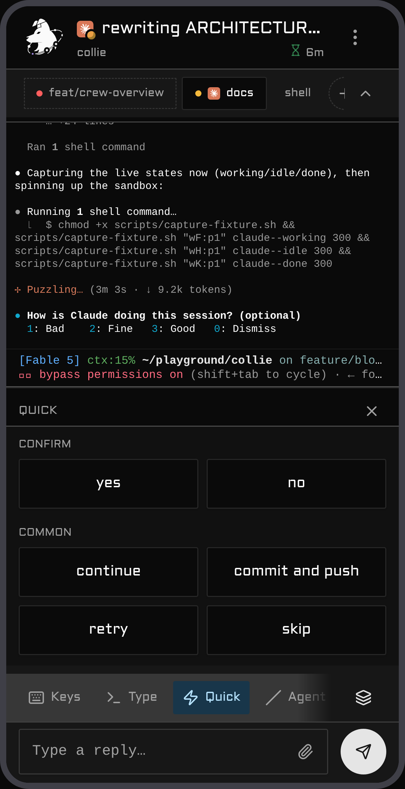

# Collie

<p align="center">
  
</p>

<p align="center">
  <a href="https://colliepwa.dev/demo"><b>Try it in your browser — no install</b></a> ·
  <a href="https://colliepwa.dev">colliepwa.dev</a><br>
  <sub>A real Collie build running in the page against faked data.</sub>
</p>

A mobile web interface for terminal-based AI agents, served over Tailscale. Collie connects to one
multiplexer per instance: [Herdr](https://herdr.dev), [tmux](https://github.com/tmux/tmux), or
[zellij](https://zellij.dev). Open the URL on your phone to check which agent needs input and
respond directly from the mobile keyboard.

The input box uses a standard text field compatible with system voice dictation. Collie also
includes built-in [voice input](./docs/voice-and-push.md#voice-input-optional) that remains disabled
until explicitly configured.

**Features**

- **React Router + Vite** with TypeScript, Tailwind, shadcn, and a Bun bridge
- **Status dashboard** ordered by pending user input rather than recent output
- **Push notifications** when an agent blocks on user input
- **Quick actions and slash commands** configured per agent
- **Keypad for terminal control keys**: `Esc`, `Ctrl+C`, arrows, and modifier combinations
- **Output search** and full conversation history beyond standard terminal scrollback
- **Image uploads** directly from the local camera roll
- **Device pairing** as the write credential: once a device is paired, every write needs its token
- **Packs**: several machines' Collies behind one URL, with operator-triggered failover
- **Six UI languages** and a per-device typeface setting
- **Herdr session switching** managed from the web interface
- **PWA support** running locally on loopback with no external accounts or cloud dependencies

## Demo

Using Collie from a phone: the dashboard places agents that need input at the top. You can inspect
spaces, tabs, and panes. Long-press a pane pill or tab chip to rename or close it; Claude panes
reflect names set via `/rename`. Tap to answer an `AskUserQuestion` prompt, switch between herds,
and receive push notifications when an agent blocks on input.

The [interactive demo](https://colliepwa.dev/demo) runs the web client in your browser against mock
data without installation.

<table>
  <tr>
    <td align="center" width="50%"><br><sub><b>Dashboard</b> — agents needing you float to the top</sub></td>
    <td align="center" width="50%"><br><sub><b>Ask</b> — the agent's own prompts become tappable buttons</sub></td>
  </tr>
  <tr>
    <td align="center" width="50%"><br><sub><b>Space</b> — its tabs and panes, deep-linkable</sub></td>
    <td align="center" width="50%"><br><sub><b>Keys</b> — the special-keys pad, no chords to remember</sub></td>
  </tr>
  <tr>
    <td align="center" width="50%"><br><sub><b>Quick</b> — your own one-tap replies, from <code>quick-replies.toml</code></sub></td>
    <td align="center" width="50%"><br><sub><b>Settings</b> — appearance, language, typeface, per device</sub></td>
  </tr>
</table>

## Motivation

I wanted to check on my agents from my phone. The usual route is [Termux](https://termux.dev) to SSH
in and attach to the terminal multiplexer session. Driving a TUI through on-screen controls is
clumsy: special keys are fiddly, `Ctrl`/`Esc`/arrows require awkward chords, and simple text input
fights the soft keyboard. I wanted a mobile interface instead of a terminal shoehorned onto a
touchscreen. Collie lets you tap the agent that needs input, type normally, and send `Esc` or
`Ctrl+C` with one thumb.

## Who is this for

Collie is for developers running AI agents in a terminal multiplexer who want to resume sessions
from a phone. Herdr is the primary supported target in 1.0. Support for **tmux and zellij is
experimental**: both run, but testing is limited to a single operator on one machine. If you use
either, [bug reports are welcome](./docs/multiplexers.md#pointing-collie-at-a-multiplexer), including
reports of working setups.

The setup assumes a **[Tailscale](https://tailscale.com) tailnet**. Your phone and host must share a
tailnet, with `tailscale serve` configured as the default ingress. Collie is **single-user**: it
supports one operator on one tailnet, with no multi-tenant authentication. Do not use it for shared
or public access. Read the security section below before running it.

## Security — read this first

**Collie provides remote shell access to your machine by design.** A single Collie API call sends
arbitrary keystrokes directly into a live terminal pane. Anyone with access to the URL can read pane
output (source code, secrets, environment variables, agent output) and execute arbitrary commands
with your full user privileges. There is no sandbox and no command allow-list, as these would defeat
the core workflow. Treat the URL as a root login: bind it strictly to your tailnet, set
`COLLIE_TRUSTED_USER`, and pair only the physical phone you are using. Read
[`docs/security.md`](./docs/security.md) for details on the security model, defense layers, and
device gating before running the service.

> 🚫 **Never `tailscale funnel` this**: `funnel` exposes the port to the public internet, whereas
> `serve` limits access to your private tailnet. Do not funnel Collie under any circumstances.

## Quickstart

Run this on the host, not your phone. It requires `curl`, `tar`, and a sha256 utility. It needs no
compiler toolchain and does not ask for `sudo`:

```bash
curl -fsSL https://colliepwa.dev/install.sh | sh
```

The script downloads the latest release for your platform, verifies the sha256 checksum, installs
the files, and puts `collie` on your PATH. It then prints the remaining manual steps: seed a config,
then run `collie start`. You do not need to specify a multiplexer ahead of time. On its first run,
`collie start` detects Herdr, tmux, and zellij, then prompts for your choice. If you prefer to build
from source, **[`docs/install.md`](./docs/install.md)** covers the manual build, Herdr routes, the
requirements table, and what the initial run writes to the host.

## Documentation

| | |
| --- | --- |
| [**Install**](./docs/install.md) | Requirements, the two ways in — fresh install or through Herdr — first run, and opening it on your phone |
| [**Security**](./docs/security.md) | What a Collie exposes, the defenses, and pairing a device as the write credential |
| [**Configure**](./docs/configure.md) | The `.env`, your own slash commands, keys, quick replies and typefaces; appearance, Zen mode, language |
| [**Deployment**](./docs/deployment.md) | Front doors other than the default: an identity-aware proxy, a reverse proxy with no Tailscale, an off-host ingress, several Collies on one host (one per user, or several instances for one user), and a pack's standby door |
| [**Commands**](./docs/commands.md) | Every `collie` verb, putting `collie` on your PATH, and the Herdr actions that mirror the verbs on a Herdr-managed install |
| [**Multiplexers**](./docs/multiplexers.md) | Pointing Collie at Herdr, tmux or zellij, what each backend can answer, and agent beacons. Experimental in 1.0 for tmux and zellij; bug reports wanted |
| [**Packs**](./docs/pack.md) | Several machines' Collies behind one URL: invite, join, deputy, failover |
| [**Voice input and Web Push**](./docs/voice-and-push.md) | The microphone in the composer, and notifications when an agent is waiting on you |
| [**Manage & update**](./docs/upgrading.md) | Update from the phone or the terminal, roll back, update a pack, cross a major, stop, uninstall, and upgrading a 0.x install to 1.0 |
| [**Troubleshooting**](./docs/troubleshooting.md) | Symptoms in the words you would actually search for |

Repository-level specifications live at the root: [`ARCHITECTURE.md`](./ARCHITECTURE.md) ·
[`docs/deployment.md`](./docs/deployment.md) · [`MUX_CONTRACT.md`](./MUX_CONTRACT.md) ·
[`PACK_PROTOCOL.md`](./PACK_PROTOCOL.md) · [`HERDR_API.md`](./HERDR_API.md) ·
[`DESIGN.md`](./DESIGN.md) · [`CONTRIBUTING.md`](./CONTRIBUTING.md).

## Deployment variants

Collie always binds **loopback only**; what changes between deployments is *what sits in front
of it* and *how a request proves who it is*. Variant A is the default and sits below; the other four
are in [`docs/deployment.md`](./docs/deployment.md). Pick one.

### Variant A — `tailscale serve` + person identity (default)

The happy path from [Install](./docs/install.md#install). `tailscale serve` terminates TLS on your MagicDNS name and
injects `Tailscale-User-Login`; set `COLLIE_TRUSTED_USER` to your tailnet login and Collie
rejects anyone else.

```bash
# in your .env
COLLIE_TRUSTED_USER=you@example.com
```

- **Granularity:** the tailnet *person*, not the device.
- **Why it's safe on bare `tailscale serve`:** serve is the *trusted injector* of
  `Tailscale-User-Login` — it sets that header itself and a client can't forge it through the proxy.
- Nothing else to configure; origins match automatically on the MagicDNS name.
- Want *per-device* control without standing up a proxy? [Pair the
  device](./docs/security.md#pair-a-device--the-write-credential) — it composes on top of this variant.

This is the right choice unless you specifically need a proxy in the path. If you do, or if Tailscale
isn't in the path at all, [`docs/deployment.md`](./docs/deployment.md) has the rest:

- **[B — identity-aware proxy, authorised by device](./docs/deployment.md#variant-b--identity-aware-proxy--per-device-authorisation)** — a proxy on this host; some devices drive, others watch.
- **[C — reverse proxy as the only front door](./docs/deployment.md#variant-c--reverse-proxy-as-the-only-front-door-no-tailscale)** — no Tailscale anywhere in the path.
- **[D — off-host identity proxy over the tailnet](./docs/deployment.md#variant-d--off-host-identity-proxy-over-the-tailnet)** — one central ingress node fronting Collie among your other services.
- **[E — any other mesh or tunnel](./docs/deployment.md#variant-e--any-other-mesh-or-tunnel-netbird-zerotier-cloudflare-tunnel)** — NetBird, ZeroTier, Cloudflare Tunnel: you own the ingress, Collie publishes nothing.

## Windows (experimental)

The **bridge** runs on Windows against the Herdr Windows beta; the **launcher** does not. Herdr on
Windows exposes its control socket as a named pipe derived from the full socket path instead of an
AF_UNIX socket. Collie connects via `node:net` rather than `Bun.connect` using a single shim,
[`bridge/dial.ts`](./bridge/dial.ts), which documents the path mapping.

Operational details:

- **Run the bridge directly** with `bun run bridge/index.ts`. There is no systemd unit. Herdr action
  buttons invoke `bash`, requiring Git Bash on `PATH`. The manifest lists only `linux` and `macos`
  support to avoid exposing actions that might fail silently.
- **`tailscale serve` integration is unavailable on Windows.** Follow
  [Variant C](./docs/deployment.md#variant-c--reverse-proxy-as-the-only-front-door-no-tailscale): bind to
  loopback, place your own ingress in front, and set `COLLIE_PUBLIC_HOSTS`. The rules in
  [§Security](./docs/security.md) still apply.
- **Set `COLLIE_MULTI_SESSION=off`**, as session discovery relies on POSIX paths.
- The socket path defaults to `%APPDATA%\herdr\herdr.sock`. Override it with `HERDR_SOCKET_PATH`.
  Explicit `\\.\pipe\…` values pass through directly.

**Lifecycle management:** The bridge added named pipe support in 0.15.0. An unsupported,
community-maintained Task Scheduler configuration for start, stop, and update routines is available
in [`contrib/windows/`](./contrib/windows/README.md).

**Verification:** The bridge logs `[events] stream up` on startup. Event streaming runs over the
pipe, providing real-time updates without falling back to polling.

`COLLIE_HERDR_DIAL=net` forces the `node:net` dialer on Linux and macOS. This allows testing the
Windows connection path without a Windows environment; `bridge/dial.test.ts` relies on it.

## Architecture

A small Bun process sits between your phone and your multiplexer — the browser never touches the
multiplexer.

```
  phone (PWA)
     │  HTTPS over the tailnet
     ▼
  tailscale serve        terminates TLS, injects the identity header
     │  127.0.0.1:PORT    (the bridge binds loopback only)
     ▼
  Collie bridge (Bun)    serves the UI + a small JSON API; polls the multiplexer
     │  one mux adapter, chosen per install
     ▼
  the multiplexer        owns the panes, agents and terminal state
  Herdr · tmux · zellij
```

Under [Variant C](./docs/deployment.md#variant-c--reverse-proxy-as-the-only-front-door-no-tailscale) a
reverse proxy replaces the `tailscale serve` box; everything below the front door is identical.

- **Only the adapter touches the multiplexer** (`bridge/mux/<name>/` — Herdr dials a Unix socket, tmux and zellij shell out to their CLIs); everything else speaks the bridge's HTTP API. What every adapter must answer is [`MUX_CONTRACT.md`](./MUX_CONTRACT.md).
- **Polling is still the model** — the bridge takes one snapshot per tick from the adapter and the browser polls `/api/snapshot`; where the multiplexer offers an event stream (Herdr does) it only pokes the bridge's poll to go faster, it never replaces it. No resync logic.
- **Actions are plain HTTP** — a reply or key `POST`s to `/api/pane/:id/{reply,keys}`, and the adapter types it into a real terminal (hence the security posture).
- **The UI is a static PWA** — Vite builds `web/dist`, served from disk, so a rebuild is live with no restart.
- **A second Collie is a peer, not a second bridge** — one machine's bridge mirrors one multiplexer, and a lead reads its peers over the pack link ([`PACK_PROTOCOL.md`](./PACK_PROTOCOL.md)).

Full design rationale in [`ARCHITECTURE.md`](./ARCHITECTURE.md).

## Developing

Clone and build the repository
([Install → the same result, from source](./docs/install.md#the-same-result-from-source)), then edit
in place.

- **Every verb is implemented once, in `cli/`,** and runs as `bin/collie <verb>`
  ([Commands](./docs/commands.md)). No other layer implements verbs. `scripts/collie-ctl.sh` is a
  bootstrap shim that compiles the binary and passes your argv. The Herdr adapter's
  `herdr-plugin.toml` is a thin registration file whose `[[actions]]` call that shim
  ([Herdr actions](./docs/commands.md#herdr-actions)). Both files contain explanatory comments.
- **Development loop asymmetry:** `web/` rebuilds appear immediately without a restart because the
  bridge serves `web/dist` directly from disk. Changes to `bridge/` require
  `systemctl --user restart collie`. Build, test, and versioning rules live in
  [`CLAUDE.md`](./CLAUDE.md). Versioning is enforced by git hooks, so check the document before
  committing.
- **Multiplexer adapters:** [`MUX_CONTRACT.md`](./MUX_CONTRACT.md) defines the interface an adapter
  must implement, and [`MUX_CONTRIBUTING.md`](./MUX_CONTRIBUTING.md) covers the integration
  boundaries. [`ARCHITECTURE.md`](./ARCHITECTURE.md) §3 explains why Collie runs as a supervised
  service instead of an embedded pane, which keeps the Herdr manifest limited to `[[actions]]` and
  `[[build]]`.
- **Pull requests:** [`CONTRIBUTING.md`](./CONTRIBUTING.md) documents base branches (`main` for
  bugfixes, `v1` for features), CI checks, and version bump requirements.

### The states playground

A development page that renders the web components across mock states (boot, idle, dashboard, pack,
settings) without a running agent. This lets you inspect visual elements like banners, marks, boot
screens, and lock states without manually reproducing each condition.

```
cd web && COLLIE_DEV_HOSTS=bluefin,localhost bun run playground
```

Open `http://<host>:5199/playground.html`. Port 5199 redirects root requests to the playground and
disables `/api`, preventing requests to a live Collie instance. Vite targets only `index.html`
during production builds, keeping `playground.html` and `src/playground/` out of `dist` and the PWA
precache. This exclusion is tested in `src/playground/playground-entry.test.ts`.

To add a state, add a `<Section>` in `src/playground/app.tsx` and the corresponding mock data in
`src/playground/fixtures.ts`.

For Herdr adapter development, refer to upstream documentation for the plugin system:
[authoring](https://herdr.dev/docs/plugins/) ·
[CLI reference](https://herdr.dev/docs/cli-reference/) ·
[example plugins](https://github.com/ogulcancelik/herdr-plugin-examples). Collie's socket
integration is documented in [`HERDR_API.md`](./HERDR_API.md).

## See also

- All how-to pages: [`docs/`](./docs/)
- Deployment variants B through E: [`docs/deployment.md`](./docs/deployment.md)
- Architecture and design rationale: [`ARCHITECTURE.md`](./ARCHITECTURE.md)
- Multiplexer query interface and capabilities: [`MUX_CONTRACT.md`](./MUX_CONTRACT.md)
- Lead-to-peer pack protocol: [`PACK_PROTOCOL.md`](./PACK_PROTOCOL.md) (topology diagram in
  [§2](./PACK_PROTOCOL.md#2-shape-of-the-thing))
- Pack recovery from a phone after lead failure:
  [`docs/deployment.md` → the standby door](./docs/deployment.md#the-standby-door--a-packs-failover-path)
- Verified Herdr socket API: [`HERDR_API.md`](./HERDR_API.md)
- Operations, versioning, and project conventions: [`CLAUDE.md`](./CLAUDE.md)
- Contribution guidelines: [`CONTRIBUTING.md`](./CONTRIBUTING.md)
- Release history: [`CHANGELOG.md`](./CHANGELOG.md)
