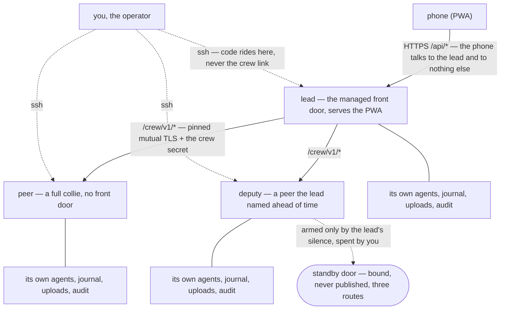

# Crew commands

A **crew** links multiple Collie instances under a single **lead**, exposing every herd to
the phone through one URL. Management runs entirely through the CLI without Herdr UI actions.
Machine-to-machine traffic uses the protocol documented in
[`CREW_PROTOCOL.md`](../CREW_PROTOCOL.md).

Architecture before running commands: only the lead exposes the front door, while peers expose none.



## Herdr machines and the crew

Herdr's saved machines and a Collie crew are two separate lists, and neither feeds the other.

Herdr's machine list belongs to your Herdr window. Herdr 0.9.0 keeps saved ssh targets in its
client and opens each one over ssh every time you use it. You get terminals on those machines, in
that window, on the machine you are sitting at.

A crew is Collie on every machine. The lead reaches each member over Collie's own encrypted link,
set up once by an install that rides your ssh. Your phone reaches the lead and nothing else, and it
never holds an ssh key.

A crew shows terminals too, and it carries more than terminals. It moves uploads. It keeps each
machine's journal and audit log on the machine that ran the pane. It updates the whole crew from one
confirm on the phone. It can hand the front door to a deputy when the lead goes quiet. It works the
same under tmux and zellij, which have no machine list at all.

Three facts keep the two lists apart, and each one is a reason on its own. The phone must never hold
an ssh key. Uploads, the journal and the audit log live on the machine that runs the pane. The crew
link, which is what Collie calls the encrypted line between two machines, needs no ssh once a member
has enrolled.

So you do not set the same thing up twice. You set up ssh once, and both tools use it. Herdr keeps
its list for its own window, and Collie keeps the crew for your phone. Adding a machine to Herdr
does not add it to the crew. Removing it from Herdr does not remove it from the crew. A crew member
running tmux or zellij never appears in Herdr's list.

| what | Herdr's machine list | a Collie crew |
| --- | --- | --- |
| Who makes the link | your Herdr client | the lead Collie |
| What carries it | ssh, on every use | Collie's own encrypted link |
| What you see | terminals | terminals, uploads, journal, audit log, updates, failover |
| Where you see it | your Herdr window | your phone |
| Works with tmux and zellij | no | yes |

`collie crew add` with no target offers candidates from both lists, so you never type a host twice.
It reads `Host` entries in your `~/.ssh/config` and runs `herdr machine list --json`. It merges the
two lists on the ssh target each name resolves to. The command follows an `Include` in that config
one level deep, and only for paths under `~/.ssh/`. It does not offer an alias in a file included
from an included file. Each row shows where the name came from: `ssh config`, `herdr`, or both. A
row for a machine already in this crew carries that member's id instead of a number.

## Two machines, one crew

The lead is the instance your phone already reaches. The joining machine
must have Collie installed and running. On the **lead**:

```bash
collie crew invite        # prints one line: <token>.<lead-fingerprint>
```

Tokens are single-use, valid for ten minutes, and displayed once. The lead stores only the hash.
Running `invite` restarts the lead process so it can accept the incoming enrollment. Copy the output
line to the target machine and run:

```bash
collie crew join lead                     # it asks for the token
```

`crew invite` prints this exact line with the lead name included. In an interactive terminal,
`join` prompts for the token; in a script, pass `-` and provide the token on stdin:

```bash
collie crew join lead.tail1234.ts.net -   # paste the token on stdin
```

Set the lead address to any hostname or `host:port` reachable from this node. An address without a
scheme and port resolves to `https://<host>:8787`, the default port Collie binds. The
`crew invite` output specifies the port if the lead changed it. A default install answers on port
8787 over plain HTTP, with TLS on port 443 in front of it, so `join` may find no TLS on 8787. It prompts
once before sending the token over plain HTTP; `--insecure` confirms this automatically. An
explicit `http://` address still requires `--insecure` and prompts for nothing. Pass `-` to read the
token from stdin or `@<file>` to read from disk. Passing raw tokens directly as arguments prints a
warning, because process listings expose arguments to all local users
([`CREW_PROTOCOL.md` §8.3](../CREW_PROTOCOL.md)).

`join` outputs the final required step: **`collie restart` on the lead.** The lead wrote the
enrollment to disk, but the active process cached the roster at startup and will not proxy traffic
to the new peer until restarted. Restart the lead, then check connectivity:

```bash
collie crew status        # the new member, its address, and whether the link answered
```

`collie crew add <ssh-host>` runs this workflow over **SSH**. It generates the token locally,
provisions Collie on the remote machine, and runs `collie crew join` remotely. Use either
manual enrollment or `crew add` for a given host, not both. `crew add` requires **Herdr preinstalled
on the remote host** and does not support `--insecure`. If the lead uses plaintext HTTP, run
`collie crew join --insecure` manually on the joining machine.

**Multiplexer selection is local to each node.** Configure `COLLIE_MUX` in that node's own `.env`,
at `~/.config/collie/.env` on a binary install or in Herdr's plugin config dir on a Herdr install.
The crew protocol, which is the wire between the machines, contains no multiplexer-specific
fields. Note that peers have only been tested
with Herdr in v1 ([`CREW_PROTOCOL.md` §16](../CREW_PROTOCOL.md)).


## Members that were not installed by install.sh

A crew updates every member from the phone, except the members whose files somebody else owns.

`collie crew update` and the phone's one-tap crew update both stage a new release beside the old one
and swap it in. That works on the two installs the install script and Herdr make, and it does not
work on every install, so the crew reports the others instead of failing them.

**A packaged member waits for its package manager.** Where pacman, nix or brew put the files, that
manager owns them, and Collie will not replace a file it does not own
([a packaged install](upgrading.md#a-packaged-install)). The crew never sends it an update, shows it
as "waits for the package manager" with the command for its prefix where one can be named, and
counts the run as complete without it. It levels when you run that command on that machine, and the
line clears on the next check.

**A packaged LEAD still levels its members.** The lead declines its own move for the same reason,
and that is the whole of the refusal: the phone still levels every member to the version the lead is
running now, and the confirm covers them. After the package manager has moved the lead and you have
run `collie restart` on it, nothing levels by itself; one more confirm on the phone's Updates page
brings the members up to the lead's new version.

**A source checkout is a full member.** A member you cloned and built yourself updates through git
like any other checkout, takes the crew update, and needs nothing said about it here. The lead pulls
the tag, rebuilds and restarts it exactly as it does its own.

So a mixed crew is a normal crew. One tap levels every member the lead can update, names the ones it
cannot, and the crew is level again once you have run their package managers.

| Command | What it does |
| --- | --- |
| `collie crew invite` | Mint a single-use, 10-minute enrollment token (**on the lead**) |
| `collie crew add <ssh-host>` | Install and enroll a peer over **your own SSH** (on the lead) |
| `collie crew update <member>… \| --all` | Preflight every machine, then the lead, then each peer one at a time over **your own SSH**; the first failure stops the run ([details](upgrading.md#updating-the-rest-of-the-crew)) |
| `collie crew status` | Mode, members, reachability, secret pickup — and why a link is refused |
| `collie crew rotate` | Reissue the crew secret and hand it to every reachable peer |
| `collie crew rename <name>` | Give the crew a new name (**on the lead**) |
| `collie crew remove <member>` | Unpin and forget a member (on the lead) |
| `collie crew set-address <member> <host:port>` | Correct where this lead dials a member |
| `collie crew deputy <member>` | Name the ONE peer that may take over, and arm it; `--revoke` names nobody |
| `collie crew approve-promote <member>` | Consent, on the lead, for one member to take over — 10 minutes, single-use; `--cancel` clears it |
| `collie crew join <lead-address> [<token>]` | Join a crew (**on the joining machine**); without a token it prompts for one, or pass `-` for stdin or `@file` |
| `collie crew leave` | Leave the crew; drops the crew secret and every pin on this machine |
| `collie promote` | Make THIS machine the lead (on the peer taking over; `--force` if the lead is gone) |
| `collie reconnect` | A member moved: re-point at its new address without re-enrolling anything |

`collie join` and `collie leave` still work. They are aliases for `collie crew join` and
`collie crew leave`, using the same arguments and exit codes.

`collie pack` still works too, for every verb in this table. It is an alias of `collie crew` with
the same arguments and exit codes. `collie docs pack` prints this page, and the web app's `/pack`
address redirects to `/crew`. All three go away in 2.0.0
([ADR 0038](../.adr/0038-the-group-is-a-crew-the-wire-keeps-pack.md)).

The `deputy`, `approve-promote`, and `promote` commands manage failover. For setup and recovery
instructions, see
[`docs/deployment.md` → the standby door](deployment.md#the-standby-door--a-crews-failover-path) and
[the bad day](deployment.md#the-bad-day--the-runbook).

## The crew's name

A crew's name is display data, and only the lead shows it. `collie crew invite --name "the shed"`
names a crew when it is created, and a crew created without `--name` is called "collie crew". To
change it later, run `collie crew rename <name>` on the lead. The verb rewrites the name in the
lead's own `crew-trust.json` and restarts the bridge, so `collie crew status` and the phone's crew
page show the new name right away.

Nothing is sent to a member. The name travels once, in the lead's answer to an enrollment, and a
member stores it without ever showing it. A machine that joins after the rename receives the new
name, and the members already in the crew keep the old string in a field nobody reads. A name is
trimmed, is at most 64 characters, and carries no control characters. On a peer, or on a machine in
no crew, the verb refuses and says where to run it.

## Updating from 1.7.0

**Update the lead first.** The phone and `collie crew update` already take that order, and 1.8.0
adds a second reason for it.

You do not have to remember which releases those are. From 1.8.0 the update notice tells you when
the release ahead changes the crew link, on the band, on the Updates card and in the daily push, and
it says the same thing there: update the lead first, the members follow.

1.8.0 renames the names a machine reads. The wire paths, the two environment keys, the three state
files and the journal prefix all say crew now
([ADR 0039](../.adr/0039-the-machine-says-crew-too.md)). The link behaves exactly as before, and
nothing you scripted has to move on the same day.

**A 1.8.0 lead keeps a 1.7.0 member following it.** The lead answers the old `/pack/v1/*` paths for
one release, so a member still on 1.7.0 enrols, answers hello and levels itself over the link it
already has. A lead still on 1.7.0 cannot read a 1.8.0 member's status line, which is the reason
lead first was already the order.

A member you update first is not stuck. A 1.8.0 member dials `/crew/v1/*`, falls back to
`/pack/v1/*` once against a 1.7.0 lead, and writes one journal line saying it did. The old paths and
that fallback both go away in 1.9.0, so bring the whole crew to 1.8.0 before that release.

### The new names

| 1.7.0 | 1.8.0 | What happens on your machine |
| --- | --- | --- |
| `COLLIE_PACK_TIMEOUT_MS` | `COLLIE_CREW_TIMEOUT_MS` | The old key is still read while the new one is absent, and Collie logs one warning line at start. Both old keys go away in 1.9.0 |
| `COLLIE_PACK_HELLO_TIMEOUT_MS` | `COLLIE_CREW_HELLO_TIMEOUT_MS` | The same |
| `pack-trust.json`, `pack-ops.json`, `pack-runtime.json` | `crew-trust.json`, `crew-ops.json`, `crew-runtime.json` | Renamed once, on the first start, in `~/.local/state/collie/`. No copy of the old file is kept |
| `[pack]` | `[crew]` | The prefix on the crew's own journal lines |
| `/pack/v1/…` | `/crew/v1/…` | Every path on the lead-to-member link |
| `PACK_PROTOCOL.md` | [`CREW_PROTOCOL.md`](../CREW_PROTOCOL.md) | The wire contract itself |

Rename the two environment keys in your own `.env` when it suits you. Until you do, Collie reads the
old key and prints that warning at every start.

**On a journal that spans the update, grep for both prefixes:**

```bash
journalctl --user -u collie | grep -E '\[(crew|pack)\]'
```

A line written before the update says `[pack]`, and a line written after it says `[crew]`. Once the
whole crew is on 1.8.0, filter for `[crew]` alone.

---

[← back to the README](../README.md)
