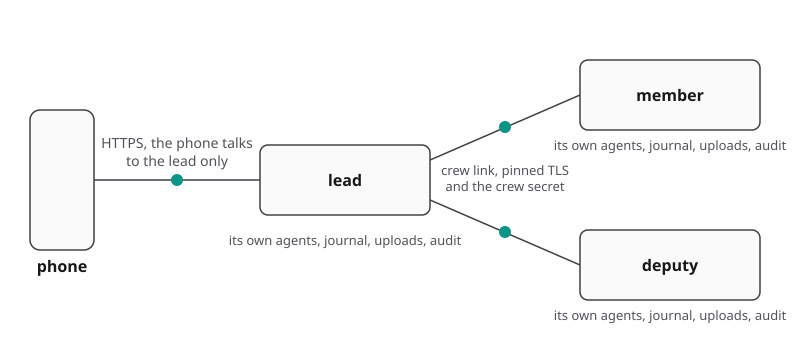
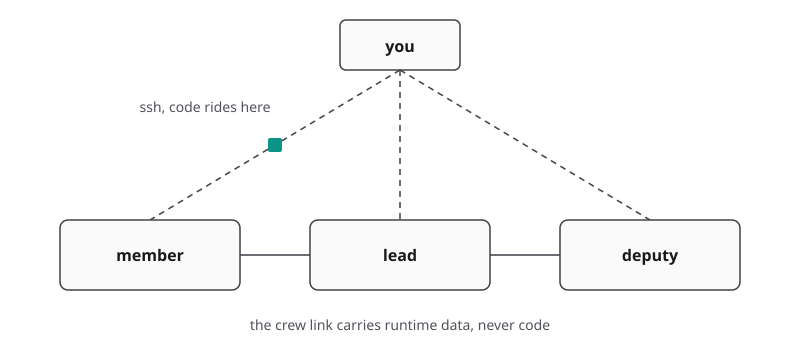
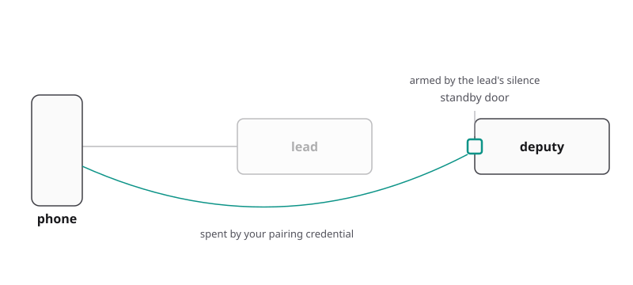

# Crew commands

A **crew** is several machines running Collie under one **lead**, and your phone reaches every
machine's herd through the lead's single URL. The lead is the machine your phone reaches, every
other machine is a member, and the deputy is the one member allowed to take over.

| Command | What it does |
| --- | --- |
| `collie crew invite` | Mint a single-use, 10-minute enrollment token (**on the lead**) |
| `collie crew add <ssh-host>` | Install and enroll a peer over **your own SSH** (on the lead) |
| `collie crew update <member>… \| --all` | Preflight every machine, then the lead, then each peer one at a time over **your own SSH**; the first failure stops the run ([details](upgrading.md#updating-the-rest-of-the-crew)) |
| `collie crew status` | Mode, members, reachability, secret pickup, and why a link is refused |
| `collie crew rotate` | Reissue the crew secret and hand it to every reachable peer |
| `collie crew rename <name>` | Give the crew a new name (**on the lead**) |
| `collie crew remove <member>` | Unpin and forget a member (on the lead) |
| `collie crew set-address <member> <host:port>` | Correct where this lead dials a member |
| `collie crew deputy <member>` | Name the ONE peer that may take over, and arm it; `--revoke` names nobody |
| `collie crew approve-promote <member>` | Consent, on the lead, for one member to take over, 10 minutes, single-use; `--cancel` clears it |
| `collie crew join <lead-address> [<token>]` | Join a crew (**on the joining machine**); without a token it prompts for one, or pass `-` for stdin or `@file` |
| `collie crew leave` | Leave the crew; drops the crew secret and the pinned certificate of every other member on this machine |
| `collie promote` | Make THIS machine the lead (on the peer taking over; `--force` if the lead is gone) |
| `collie reconnect` | A member moved: re-point at its new address without re-enrolling anything |

`collie join` and `collie leave` still work. They are aliases for `collie crew join` and
`collie crew leave`, using the same arguments and exit codes.

`collie pack` still works too, for every verb in this table. It is an alias of `collie crew` with
the same arguments and exit codes. `collie docs pack` prints this page, and the web app's `/pack`
address redirects to `/crew`. All three go away in 2.0.0
([ADR 0038](../.adr/0038-the-group-is-a-crew-the-wire-keeps-pack.md)).

The `deputy`, `approve-promote`, and `promote` commands manage failover. For setup and recovery
instructions, see
[`docs/deployment.md` → the standby door](deployment.md#the-standby-door--a-crews-failover-path) and
[the bad day](deployment.md#the-bad-day--the-runbook).

## Two machines, one crew

Two commands add a machine, one for Herdr and one for Collie, and a manual path is there for a host
`crew add` cannot ssh into and for a lead that serves plain HTTP.

```bash
herdr machine add --label <name> <ssh-target>   # prepare the remote host
collie crew add <ssh-host>                      # install Collie there and enroll it
```

`herdr machine add` runs on the machine you sit at. It puts Herdr on the remote host and saves it in
Herdr's own list, and it does not add the machine to the crew. `collie crew add` runs on the lead.
`<ssh-target>` and `<ssh-host>` are the same host, written as `user@host` or as a `Host` alias from
your `~/.ssh/config`, and `<name>` only labels Herdr's list.

`collie crew add <ssh-host>` installs Collie on the remote host over your own ssh and enrolls it. It
generates the token locally, provisions Collie on the remote machine, and runs `collie crew join`
there. It requires **Herdr preinstalled on the remote host**, which `herdr machine add` puts there,
so the two commands go together. A lead that serves plain HTTP needs one more step by hand, because
`crew add` does not support `--insecure`: run `collie crew join --insecure` on the joining machine.
Use either `crew add` or the manual path for a given host, never both. `collie crew add` with no
target lists the hosts your ssh config and Herdr already know, merged on the host each name resolves
to, so pick from that list rather than typing the host a second way
([below](#herdr-machines-and-the-crew)).

`crew add` takes the route its own install kind names. A lead that runs from a git checkout, as the
Herdr plugin install does, pushes its own commit to the member and builds it there, so that member
needs `git` and Bun. A lead from the [standalone install](install.md#standalone) or from a package
has no commit, so it installs the member from the release it runs itself, with Collie's own
installer sent over the same ssh, and that member needs `curl`, `tar` and `sha256sum` or `shasum`
instead. `--path` names the remote checkout on the first route and the install root on the second.
A member that already runs the other kind of install is refused rather than written over, and the
refusal names the one command that resolves it. On that second route the member downloads the
release from github.com itself, so a member with no route to github.com needs a lead that runs from
a checkout.

The terminal `collie crew update` takes the same two routes, and reads the same fact to pick one: a
checkout lead pushes its own commit to each member, and a lead from the standalone install or from a
package levels each member to the release it runs itself. On a release lead, a member running from a
git checkout is skipped with the one command that moves it named on its row, `collie update --to-tag
v<version>` on that machine. On a checkout lead, a member installed by install.sh is skipped the
other way round: it takes releases, so the phone's Updates page levels it. A skipped member never
stops the run, and the confirm counts it apart.

The manual path is four commands. Use it for a host your ssh cannot reach, or for a lead that
serves plain HTTP, and not because of the lead's install kind: every kind of lead adds a member with
`crew add`. The lead is the instance your phone already reaches, and the joining machine must have
Collie installed and running.

1. On the lead, mint the token.

   ```bash
   collie crew invite        # prints the token, then the join command to run
   ```

   The token is one line: `<token>.<lead-fingerprint>`.

2. On the joining machine, join the crew and paste the token when it asks.

   ```bash
   collie crew join https://lead.tail1234.ts.net
   ```

   Copy the address from the `invite` output. It is your lead's own, not this example.

3. On the lead, restart it so the running process picks up the new member.

   ```bash
   collie restart
   ```

4. On the lead, check that the link answered.

   ```bash
   collie crew status        # the new member, its address, and whether the link answered
   ```

Tokens are single-use, valid for ten minutes, and displayed once. The lead stores only the hash.
Running `invite` restarts the lead process so it can accept the incoming enrollment, and it prints
the join line with the lead name included.

Step 3 is a second restart, and `join` says so on the way out. `invite` restarted the lead so it
could accept the enrollment. `join` then wrote the new member to disk, and the running process does
not proxy traffic to that member until it is restarted again.

In an interactive terminal, `join` prompts for the token. In a script, pass `-` and provide the
token on stdin:

```bash
collie crew join https://lead.tail1234.ts.net -   # paste the token on stdin
```

Pass `@<file>` instead to read the token from disk. Passing raw tokens directly as arguments
prints a warning, because process listings expose arguments to all local users
([`CREW_PROTOCOL.md` §8.3](../CREW_PROTOCOL.md)).

Set the lead address to any hostname or `host:port` reachable from this node. An address without a
scheme and port resolves to `https://<host>:8787`, the port Collie's own listener binds.

What `crew invite` prints depends on how the lead is published. In the default HTTPS mode, the lead
listens on loopback and `tailscale serve` publishes it on port 443. So `invite` prints
`https://<full-tailnet-name>`, which dials port 443. If you moved the front door with
`COLLIE_SERVE_PORT`, it prints `<name>:<port>`. With `COLLIE_SERVE_MODE=http` the lead's own
listener answers on port 8787 over plain HTTP, and `invite` prints the short name, with the port
only if you changed it. `join` prompts once before sending the token over plain HTTP, and
`--insecure` confirms this automatically. An explicit `http://` address still requires `--insecure`
and prompts for nothing.

`crew add` hands the member the same front door, so the member dials port 443 too. A bare name
would mean port 8787, which a lead behind `tailscale serve` does not open to the tailnet.

`--address` on `crew join` is the address the lead dials this machine at, and it needs a port:
`--address <host>:8787`. `join` refuses one without a port, because the lead would dial port 443.
An `https://host:8787` address is still accepted and stored as `host:8787`.

**Multiplexer selection is local to each node.** Configure `COLLIE_MUX` in that node's own `.env`,
at `~/.config/collie/.env` on a binary install or in Herdr's plugin config dir on a Herdr install.
The crew protocol, which is the wire between the machines, contains no multiplexer-specific fields.
Note that peers have only been tested with Herdr in v1
([`CREW_PROTOCOL.md` §16](../CREW_PROTOCOL.md)).

`crew add` settles that value for a new member, because the member cannot always settle it itself. A
member that runs exactly one multiplexer is left alone, and picks that one at its own first start. A
member that runs several is a question the lead asks you, and your answer is written as `COLLIE_MUX`
in that member's `.env`. A member that already names one is left alone too. Pass `--mux <name>` to
answer ahead of time, or to replace a name the member already carries. A member with no multiplexer
running gets a warning and nothing written, because its first start refuses until one runs.

## Herdr machines and the crew

Herdr's saved machines and a Collie crew are two separate lists, and neither feeds the other.

To add a machine, see [Two machines, one crew](#two-machines-one-crew) above.

Herdr's machine list belongs to your Herdr window. Herdr 0.9.0 keeps saved ssh targets in its
client and opens each one over ssh every time you use it. You get terminals on those machines, in
that window, on the machine you are sitting at.

A crew is Collie on every machine, and the lead reaches each member over Collie's own encrypted
link, set up once by an install that rides your ssh. A crew shows terminals too, and it carries more
than terminals. It moves uploads. It keeps each machine's journal and audit log on the machine that
ran the pane. It updates the whole crew from one confirm on the phone. It can hand the front door to
a deputy when the lead goes quiet. It works the same under tmux and zellij, which have no machine
list at all.

| what | Herdr's machine list | a Collie crew |
| --- | --- | --- |
| Who makes the link | your Herdr client | the lead Collie |
| What carries it | ssh, on every use | Collie's own encrypted link |
| What you see | terminals | terminals, uploads, journal, audit log, updates, failover |
| Where you see it | your Herdr window | your phone |
| Works with tmux and zellij | no | yes |

Three facts keep the two lists apart, and each one is a reason on its own.

The phone never holds an ssh key. An ssh key is a full shell on the machine, and a phone gets lost.
The phone holds a pairing token the lead issued instead, which opens the app and nothing else, and
`collie devices revoke <label>` kills that code live, with no restart
([pair a device](security.md#pair-a-device--the-write-credential)).

Uploads, the journal and the audit log live on the machine that runs the pane. And the crew link,
which is what Collie calls the encrypted line between two machines, needs no ssh once a member has
enrolled.

So you do not set the same thing up twice. You set up ssh once, and both tools use it. Herdr keeps
its list for its own window, and Collie keeps the crew for your phone. Adding a machine to Herdr
does not add it to the crew. Removing it from Herdr does not remove it from the crew. A crew member
running tmux or zellij never appears in Herdr's list.

`collie crew add` with no target offers candidates from both lists, so you never type a host twice.
It reads `Host` entries in your `~/.ssh/config` and runs `herdr machine list --json`. It merges the
two lists on the ssh target each name resolves to. The command follows an `Include` in that config
one level deep, and only for paths under `~/.ssh/`. It does not offer an alias in a file included
from an included file. Each row shows where the name came from: `ssh config`, `herdr`, or both. A
row for a machine already in this crew carries that member's id instead of a number.

## How a crew is wired

Only the lead exposes a front door, and every other machine in the crew exposes none.



The lead is the managed front door, and it serves the PWA. The phone reaches it over HTTPS on
`/api/*` and talks to nothing else. The lead reaches each member on `/crew/v1/*`, over pinned mutual
TLS carrying the crew secret. A member is a full Collie with no front door, and it keeps its own
agents, journal, uploads and audit log. Management runs entirely through the CLI, with no Herdr UI
actions. The wire itself is specified in [`CREW_PROTOCOL.md`](../CREW_PROTOCOL.md).



Code rides your own ssh to every machine. `crew add` installs a member that way and `crew update`
levels it. The crew link carries runtime data, and it never becomes a distribution channel.



A deputy is one peer the lead named ahead of time. It binds a standby door with three routes, and
that door is never published. The lead's silence arms it, and your own pairing credential spends it,
so the phone can reach the deputy while the lead is gone.

## Machines

Every Collie measures its own machine, the lead keeps a day of it for each machine in the crew, and
the Machines pages show it and hold the alert rules.

**Open the list from Settings, Machines.** It is there on a collie that runs on its own too, as one
machine. On a lead with a crew, Settings, System has a second row for the same page, and a member's
sheet on the Crew page links to that machine's own page with **Load and alerts**.

Only a lead, or a collie on its own, keeps the list. A crew member opened directly says there is no
machine list on it; open the page on the lead.

Each Collie reads its CPU, memory, disks and network on the same tick that already watches your panes, so
nothing new runs in the background. It reads them about every 15 to 25 seconds. The lead reads its own
every 5 seconds while a phone has the Machines pages or the Crew tab open. Either way, every minute
gets at least one reading. A member sends its last reading with the answer it already gives the lead. The lead keeps one point per minute for
each machine, for 24 hours. A Collie with no crew keeps the same day for its own machine.

| what | Linux | macOS | Windows |
| --- | --- | --- | --- |
| CPU | yes | yes | yes |
| Memory | yes, without the page cache | yes | yes |
| Load average | yes | yes | no |
| Network | yes, physical interfaces only | no | no |
| Disks | yes | yes | yes |

**Disks are the ones that hold your files.** Collie reads the filesystem that holds your home folder,
the one that holds the root (on Windows, the system drive), and the one that holds Collie's state
folder. Two of them on one device count once, and Collie shows at most four. It leaves out a
filesystem under 1 GiB, and one that is read-only with no free space at all. The root of an image-based
system, such as Fedora Atomic, is such a filesystem: it is always 100% full, and it is not a disk that
filled up. Each disk shows the same numbers as `df`: "used" is df's Used, and the percent is df's Use%.
The total is what you can still fill as a normal user, so it can be a few percent under df's Size,
which also counts the space reserved for root. Collie reads the disks once a minute, in the background.
A disk that does not answer, such as a network mount that hangs, never holds up the rest, and Collie
stops showing it after three and a half minutes without an answer. No program is started for it.

**Network counts each byte once.** On Linux, Collie adds up the physical interfaces, such as `eth0`,
`enp3s0` and `wlan0`. It leaves out every interface whose bytes also cross a physical one:

- Loopback: `lo`.
- Bridges: `br*` (also Docker's `br-*`), `docker*`, `virbr*`, `lxcbr*`, `lxdbr*`, `incusbr*`,
  `podman*`, `cni*`, `flannel*`, `cali*`, `cilium*`, `weave*`, `vxlan*`.
- Container and VM ends: `veth*`, `vnet*`, `tap*`.
- Tunnels: `tailscale*`, `wg*`, `tun*`, `zt*`. Tunnel traffic also leaves through the physical
  interface, so the crew link is counted there.
- Bonds and VLANs: `bond*`, `team*`, and any name with a dot, such as `eth0.100`.

The day of points lives in `machine-history.json` in the lead's state folder. The lead writes it at
most once every five minutes, only when a minute changed, and once more when it stops. A day of one
machine takes about 46 KB on disk (54 KB when it reports disks) and about 68 KB of the lead's memory. The
history keeps the fullest disk of each minute, which is the disk an alert watches. A member keeps no history of its own, so
the lead is the only place to look. When the lead is down, nobody records, and the chart shows a gap.

A machine that stops answering keeps its last reading, with the time it was taken, and records no
new minutes. Collie never shows a zero it did not measure. A member that sends the same reading
again, equal in every number, has not measured again. The lead does not record it, and the reading
keeps its old time. A member whose sampler hangs therefore shows a gap, not a flat line.

**The day of points and the rules stay on one lead.**

- **A deputy that takes over starts with no alert rules and no history.** Both files live on the old
  lead. Set the rules again on the new lead.
- **A collie on its own that becomes a lead drops its own history.** On its own it names its machine
  `local`. As a lead it uses its member id, and the `local` points and rules go.
- **A machine removed from the crew takes its history and its alert rules with it.**

A member older than this feature sends no reading at all, and it stays in the crew as before.

### Alerts for a machine

You can set one rule each for CPU, memory and disk on each machine. A rule has a line, from 50% to
99%, and a time, from 5 to 120 minutes. The disk rule watches the fullest disk, and the push names that
disk. The rules live in `machine-alerts.json` on the lead.

The lead sends one push when every minute in that time is at or above the line. It needs a reading
for at least 80% of those minutes. It sends nothing more while the value stays high. The alert ends
after five minutes in a row at least five points under the line, and the next climb sends a new
push. An open alert is saved with the rules, so a restart does not send it twice.

**An alert reports sustained high load only.** It does not report a machine that goes offline. A
machine that is not answering neither starts nor ends an alert. A snooze holds every alert, and
the **Machine load stays high** switch in Settings turns them all off
([which alerts Collie sends](voice-and-push.md#which-alerts-collie-sends)).

Nothing leaves the crew. The readings travel on the crew link and stay on the lead.

### On the phone

| Page | What it shows |
| --- | --- |
| Machines | One card per machine, the lead first: its name, its health, CPU and memory now with a small chart of their last 30 minutes, and in one row the fullest disk ("Disk 66%"), the load, and network down and up, where the machine reports them |
| Dashboard, Crew tab | The same cards, on the dashboard of a lead with a crew. A tap opens the machine, and back returns to the Crew tab |
| One machine, Status | The same numbers large, a bar for each disk with its used and total space and its percent, then a chart each for CPU, memory, the fullest disk and network, over the last hour or the last 24 hours |
| One machine, Alerts | The machine's alert rules for CPU, memory and disk |

**A machine's page has two views, Status and Alerts.** The switch is under the header. Status opens
first, and a push about a machine opens Status too. The "Alert firing" line on Status and on a card
opens Alerts, where the rule is. While a rule fires, the Alerts switch shows a dot. The view is part of
the address (`?tab=alerts`), and switching does not add a step: Back leaves the machine and goes where
you opened it from. Only Status reads the history; Alerts reads nothing.

**A card names what is wrong in words.** A machine that is not answering shows its health and the age
of its last reading, and no numbers, because a stale 12% next to the word "unreachable" reads as a calm
machine. A machine that answers but has sent no new reading for two minutes shows its numbers greyed,
with a clock and the age of its last reading. A member that still runs a Collie from before it reported
load says "Update this machine to see its load", and its page shows no charts. Its Alerts view says the
machine needs an update. A metric whose alert is
firing turns its number and its small chart red, and the card says "Alert firing: CPU". The disk figure
has no small chart, because a disk fills over days, not half hours. The small chart
has a fixed scale from 0 to 100%, a dashed line where a rule is set, a dot for the reading now, and a
gap for a missing minute.

**The pages read only while you look.** The Machines list reads with the dashboard's own refresh. A
machine's page reads the day once when it opens, and then only the newest minutes, once a minute. The
Crew tab reads when you open it and every 15 seconds while it is on screen. Nothing is read for a page
or a tab that is not on screen, or while the phone is locked.

**The charts leave a missing minute empty.** The history has one point per minute. When the lead was
restarted, or a machine went quiet, the line stops and starts again after the hole, and it does not run
across it. CPU draws its average as a line and its peak as a lighter band. The alert threshold is a
dashed line while a rule is set. The network axis has no fixed top: it follows the largest value and
prints its unit. A machine on a platform with no network counters, or with no disk, says so instead of
drawing an empty chart.

**Each chart has one sentence for a screen reader.** It gives the metric, the range, the value now, the
average and the peak. The legend under the chart names every mark, so no chart relies on colour alone.

### Set an alert on the phone

Set a rule on the Alerts view of that machine's page. The rules and their limits are under *Alerts for a
machine* above. The disk rule shows only for a machine that reports its disks.

| Choice | Values |
| --- | --- |
| Switch | On or off, for CPU, memory and disk separately |
| Threshold | 80%, 90% or 95% |
| Duration | 5, 10, 30 or 60 minutes |

A rule set another way, with a line or a time outside these choices, keeps its value and shows it
beside them.

A new rule starts at 90% for 10 minutes. Every change posts the whole set of rules for that machine, so
changing the CPU threshold never drops the memory or disk rule. The card shows Saving, Saved or Could not save
in its own status line, and after a failure it shows the rules the bridge last reported.

The push goes to every device subscribed to this Collie. The card links to Settings, Alerts, where you
choose which alerts you get.

## Starting something on a machine

The New page (**+ New** on the dashboard) has a **Machine** select when you run a crew. The agent, the
command and the folder you pick all belong to the machine you picked, and that machine runs the start.

- **Each machine says which agents it has.** It looks on the `PATH` your login shell uses, so an
  agent installed through nvm or in a home folder counts. An agent a machine lacks stays in the
  select, disabled, marked "not installed". The same agent can be ready on one machine and greyed out
  on the next.
- **Each machine reads its own launchers.** The rows in `launchers.toml`, and the rows a phone added
  there, are not shared across the crew
  ([Your own launchers](configure.md#your-own-launchers)). Its folders list, the Recent and Favourite
  rows, is its own too, and the page checks the folder on that machine's disk.
- **A New worktree is made on the lead only.** On a member the switch stays, off, and says "only on"
  the lead's name.
- **A member from before 1.19.0 starts nothing by name.** The page lists its choices, disabled, with
  the reason "this machine runs an older Collie". Update the member to start agents on it
  ([Update, from the phone or the terminal](upgrading.md#update-from-the-phone-or-the-terminal)).

## Members that were not installed by install.sh

A crew updates every member from the phone, except the members whose files somebody else owns.

`collie crew update` and the phone's one-tap crew update both stage a new release beside the old one
and swap it in. That works on the two installs the install script and Herdr make, and it does not
work on every install, so the crew reports the others instead of failing them.

**A packaged member waits for its package manager.** Where pacman, nix or brew put the files, that
manager owns them, and Collie will not replace a file it does not own
([a packaged install](upgrading.md#a-packaged-install)). The crew never sends it an update, shows it
as "waits for the package manager" with the command for its prefix where one can be named, and
counts the run as complete without it. It levels when you run that command on that machine, and the
line clears on the next check.

**A packaged LEAD still levels its members.** The lead declines its own move for the same reason,
and that is the whole of the refusal: the phone and `collie crew update` both level every member to
the version the lead is running now, and one confirm covers them. After the package manager has moved the lead and you have
run `collie restart` on it, nothing levels by itself; one more confirm on the phone's Updates page
brings the members up to the lead's new version.

**A source checkout is a full member, under a lead that has one too.** A member you cloned and built
yourself takes the crew update from a checkout lead: that lead pushes its commit, rebuilds and
restarts it exactly as it does its own. Under a lead with no commit, `collie crew update` skips it
and names `collie update --to-tag v<version>` to run on that machine.

So a mixed crew is a normal crew. One tap levels every member the lead can update, names the ones it
cannot, and the crew is level again once you have run their package managers.

## The crew's name

A crew's name is display data, and only the lead shows it. `collie crew invite --name "the shed"`
names a crew when it is created, and a crew created without `--name` is called "collie crew". To
change it later, run `collie crew rename <name>` on the lead. The verb rewrites the name in the
lead's own `crew-trust.json` and restarts the bridge, so `collie crew status` and the phone's crew
page show the new name right away.

Nothing is sent to a member. The name travels once, in the lead's answer to an enrollment, and a
member stores it without ever showing it. A machine that joins after the rename receives the new
name, and the members already in the crew keep the old string in a field nobody reads. A name is
trimmed, is at most 64 characters, and carries no control characters. On a peer, or on a machine in
no crew, the verb refuses and says where to run it.

## Updating to 1.9.0 from 1.7.0 or 1.8.x

**Bring every member to 1.8.x before you move the lead to 1.9.0.** 1.9.0 speaks one version of the
crew link, and 1.8.0 is the oldest build that speaks it.

You do not have to remember which releases those are. From 1.8.0 the update notice tells you when
the release ahead changes the crew link, on the band, on the Updates card and in the daily push, and
it says the same thing there: update the lead first, the members follow.

1.8.0 renames the names a machine reads. The wire paths, the two environment keys, the three state
files and the journal prefix all say crew now
([ADR 0039](../.adr/0039-the-machine-says-crew-too.md)). The link behaves exactly as before, and
nothing you scripted has to move on the same day.

**1.8.0 carried a 1.7.0 member for one release, and 1.9.0 does not.** A 1.8.0 lead also answered the
old paths, so a member still on 1.7.0 kept following it. 1.9.0 removed that, which is what ADR 0039
said it would do.

**A member still on 1.7.0 under a 1.9.0 lead shows up twice, and neither is silence.** The lead's
preflight reds the `version` check, naming both versions and the command to run, and that red blocks
the crew update rather than starting a roll that cannot finish. In `collie crew status` the same
member reads `incompatible`, with a reason that ends "this build speaks 2".

**Level that member from its own machine.** A 1.9.0 lead cannot reach it over the link any more, so
run `collie update` there, bring it to 1.8.x or newer, and the lead picks it up on the next poll.

### The new names

| 1.7.0 | 1.8.0 | What happens on your machine |
| --- | --- | --- |
| `COLLIE_PACK_TIMEOUT_MS` | `COLLIE_CREW_TIMEOUT_MS` | Gone in 1.9.0. A 1.9.0 build reads the crew key only, so an unrenamed old key gives you the default budget |
| `COLLIE_PACK_HELLO_TIMEOUT_MS` | `COLLIE_CREW_HELLO_TIMEOUT_MS` | The same |
| `pack-trust.json`, `pack-ops.json`, `pack-runtime.json` | `crew-trust.json`, `crew-ops.json`, `crew-runtime.json` | Renamed once by 1.8.x, in `~/.local/state/collie/`. Gone in 1.9.0: a directory that never saw 1.8.x is named at start and the collie stays solo |
| `[pack]` | `[crew]` | The prefix on the crew's own journal lines |
| `/pack/v1/…` | `/crew/v1/…` | Every path on the lead-to-member link. Gone in 1.9.0 |
| `PACK_PROTOCOL.md` | [`CREW_PROTOCOL.md`](../CREW_PROTOCOL.md) | The wire contract itself |

Rename the two environment keys in your own `.env` before you move to 1.9.0. A 1.9.0 build does not
read the old key and does not warn about it.

**On a journal that spans the update, grep for both prefixes:**

```bash
journalctl --user -u collie | grep -E '\[(crew|pack)\]'
```

A line written before the update says `[pack]`, and a line written after it says `[crew]`. Once the
whole crew is on 1.8.0, filter for `[crew]` alone.

---

[← back to the README](../README.md)
