# Deployment variants B–E

The bridge binds `127.0.0.1`. Deployments differ by ingress and identity verification.
[Variant A](../README.md#variant-a--tailscale-serve--person-identity-default) (plain `tailscale serve`)
lives in the README. Security requirements in [docs/security.md](security.md) apply to all shapes.

- [Variant B — identity-aware proxy + per-device authorisation](#variant-b--identity-aware-proxy--per-device-authorisation)
- [Variant C — reverse proxy as the only front door (no Tailscale)](#variant-c--reverse-proxy-as-the-only-front-door-no-tailscale)
- [Variant D — off-host identity proxy over the tailnet](#variant-d--off-host-identity-proxy-over-the-tailnet)
- [Variant E — any other mesh or tunnel (NetBird, ZeroTier, Cloudflare Tunnel)](#variant-e--any-other-mesh-or-tunnel-netbird-zerotier-cloudflare-tunnel)
- [Front doors, one product at a time](#front-doors-one-product-at-a-time): Tailscale, Cloudflare Tunnel,
  Nginx Proxy Manager, NetBird, Caddy
- [Serving Collie under a path](#serving-collie-under-a-path)
- [Several Collies on one host](#several-collies-on-one-host)
- [Multiple Collie instances on one host](#multiple-collie-instances-on-one-host)
- [The standby door — a crew's failover path](#the-standby-door--a-crews-failover-path)

Individual devices can also be authorized without a proxy via
[pairing](security.md#pair-a-device--the-write-credential).

---

## Variant B — identity-aware proxy + per-device authorisation

Collie reads an opaque device ID from `COLLIE_DEVICE_HEADER` and checks `COLLIE_DEVICE_ALLOWLIST`.
Allowlisted IDs receive write access; missing or unlisted IDs receive read-only access (reads,
snapshots, session lists remain open; terminal input, uploads, and pane actions are blocked).

Collie configuration (`.env`):

```bash
COLLIE_HOST=127.0.0.1                       # keep loopback (default)
COLLIE_DEVICE_HEADER=X-Device-Id            # the header your proxy injects
# ids allowed to drive agents; others → read-only
COLLIE_DEVICE_ALLOWLIST=my-phone,my-laptop
# only if the proxy does NOT forward the public Host
# COLLIE_ALLOWED_ORIGINS=https://collie.example.com
# REQUIRED unless the proxy forwards a Host Collie already knows: loopback, a
# discovered Tailscale host, or an allowed origin's host
# COLLIE_PUBLIC_HOSTS=collie.example.com
# opt out of Host validation entirely (re-opens DNS rebinding)
# COLLIE_ALLOW_ANY_HOST=1
# COLLIE_TRUSTED_USER still composes on top if your ingress also injects
# Tailscale-User-Login
# accept a request carrying no Tailscale-User-Login at all
# COLLIE_TRUSTED_USER_OPTIONAL=1
```

Proxy requirements:
1. **Authenticate the device** (mTLS, SSO, forward-auth).
2. **Override the device header** on every upstream request to prevent client spoofing.
3. **Proxy to loopback** (`127.0.0.1:$COLLIE_PORT`).
4. **Forward the public `Host` unchanged**, or list the public origin in `COLLIE_ALLOWED_ORIGINS` to
   pass the same-origin check.

Example Nginx configuration:

```nginx
location / {
    proxy_set_header X-Device-Id $device_id;
    proxy_set_header Host        $host;
    proxy_pass http://127.0.0.1:8787;
}
```

Verify header injection and override from an external device:

```console
$ curl -s https://collie.example.com/api/snapshot | jq -c .device
{"enforced":true,"device":"my-laptop","authorized":true}

$ curl -s -H 'X-Device-Id: my-phone' https://collie.example.com/api/snapshot | jq -c .device
{"enforced":true,"device":"my-laptop","authorized":true}
```

If the second check returns `"device":"my-phone"`, the proxy is appending rather than overriding.

Operational notes:
- Direct loopback access (`http://127.0.0.1:$COLLIE_PORT`) sends no header and is read-only.
- To execute commands locally via curl, pass the header explicitly to loopback:
  `curl -H 'X-Device-Id: my-laptop' http://127.0.0.1:$COLLIE_PORT/api/...`
- Revoke access by removing the ID from `COLLIE_DEVICE_ALLOWLIST` and restarting (Standalone:
  `bin/collie restart`; Herdr: `herdr plugin action invoke restart --plugin herdr.collie`).
- Do not enable `COLLIE_DEVICE_HEADER` on plain `tailscale serve`; it does not override headers.
- If the proxy runs on another host, see [Variant D](#variant-d--off-host-identity-proxy-over-the-tailnet).

---

## Variant C — reverse proxy as the only front door (no Tailscale)

Use this when running outside Tailscale or behind a dedicated TLS/SSO proxy. `COLLIE_SKIP_SERVE=1`
prevents Collie from managing `tailscale serve`.

The four proxy requirements from [Variant B](#variant-b--identity-aware-proxy--per-device-authorisation)
apply.

Example Caddy configuration:

```caddyfile
collie.example.com {
    reverse_proxy 127.0.0.1:8787 {
        header_up X-Device-Id {your_device_id}
        header_up Host {host}
    }
}
```

Collie configuration (`.env`):

```bash
# proxy is ingress; never run tailscale serve
COLLIE_SKIP_SERVE=1
# REQUIRED — Host validation fails closed, and `collie start` discovers no
# tailnet name here
COLLIE_PUBLIC_HOSTS=collie.example.com
# opt out of Host validation (re-opens DNS rebinding)
# COLLIE_ALLOW_ANY_HOST=1
# exact public origin for the same-origin gate
COLLIE_ALLOWED_ORIGINS=https://collie.example.com
COLLIE_DEVICE_HEADER=X-Device-Id                    # the header your proxy injects…
# …and the ids allowed to drive; others → read-only
COLLIE_DEVICE_ALLOWLIST=my-phone,my-laptop
# optional — status banner, `collie qr`, and the address a lead hands
# joining machines (crew)
# COLLIE_PUBLIC_URL=https://collie.example.com
```

`COLLIE_TRUSTED_USER` has no effect without Tailscale. Per-device headers or the proxy's own auth
serve as the access gate.

### Routing `/auth/` and caching

- Pass `/sw.js` and `index.html` with origin `Cache-Control` (`no-cache`). Do not block static
  assets to unauthenticated clients, or service workers cannot update.
- Route authentication flows under `/auth/*` (or `/cdn-cgi/access/` for Cloudflare Access).
  Service workers bypass caching for `/auth/*`.
- Forward-auth redirects on API requests are treated as 401s to expose the login UI. Authentik
  setups should route `/auth/` to `/outpost.goauthentik.io/start`.

```caddyfile
collie.example.com {
    handle /auth/* {
        reverse_proxy 127.0.0.1:9091
    }
    handle {
        forward_auth 127.0.0.1:9091 { ... }
        reverse_proxy 127.0.0.1:8787 { ... }
    }
}
```

Verify the endpoint and caching rules:

```console
$ curl -s https://collie.example.com/api/snapshot | jq -c .device
{"enforced":true,"device":"my-phone","authorized":true}

$ curl -sI https://collie.example.com/sw.js | grep -i '^cache-control'
cache-control: no-cache
```

---

## Variant D — off-host identity proxy over the tailnet

Use this when routing traffic through a centralized Tailscale ingress node.



The requirements from [Variant B](#variant-b--identity-aware-proxy--per-device-authorisation) apply,
except the proxy targets the host's Tailscale HTTP endpoint instead of loopback.

### Tailscale ACLs (Mandatory)

Because `tailscale serve` forwards client headers without modification, Tailscale ACLs must restrict
direct port access to the ingress node only.

Tailscale / Headscale ≥ 0.29:

```jsonc
"grants": [
  { "src": ["tag:ingress"], "dst": ["tag:agent-host"], "ip": ["tcp:8787"] },
]
```

Headscale ≤ 0.28:

```yaml
acls:
  - action: accept
    src: ["ingress-node"]
    dst: ["agent-host:8787"]
  - action: accept
    src: ["my-phone", "my-laptop"]
    dst: ["agent-host:1-8786", "agent-host:8788-65535"]
```

Collie configuration (`.env`):

```bash
# proxy terminates TLS; this hop is tailnet-internal
COLLIE_SERVE_MODE=http
COLLIE_HOST=127.0.0.1                                 # keep loopback (default)
# header your forward-auth injects — REQUIRED here
COLLIE_DEVICE_HEADER=X-Tailnet-Device
# ids allowed to drive; others + header-less → read-only
COLLIE_DEVICE_ALLOWLIST=my-phone,my-laptop
# REQUIRED — the Host the proxy forwards. COLLIE_TAILSCALE_HOSTS carries the bare
# tailnet name `collie start` found; a rewritten Host is yours to list.
# COLLIE_ALLOW_ANY_HOST=1 opts out.
COLLIE_PUBLIC_HOSTS=host:8787,host.your-tailnet.ts.net:8787
# the public origin the browser actually uses
COLLIE_ALLOWED_ORIGINS=https://collie.example.com
```

`COLLIE_TRUSTED_USER` matches the identity of the ingress node, not the end user behind it.

Verification:

From a non-ingress tailnet peer:

```console
$ curl -s https://collie.example.com/api/snapshot | jq -c .device
{"enforced":true,"device":"my-phone","authorized":true}

$ curl -s --max-time 10 -H 'X-Tailnet-Device: my-phone' http://host.your-tailnet.ts.net:8787/api/snapshot
curl: (28) Connection timed out
```

On the agent host:

```console
$ curl -s http://127.0.0.1:8787/api/snapshot | jq -c .device
{"enforced":true,"device":null,"authorized":false}
```

---

## Variant E — any other mesh or tunnel (NetBird, ZeroTier, Cloudflare Tunnel)

Point the tunnel/proxy to `127.0.0.1:$COLLIE_PORT`.

Collie configuration (`.env`):

```bash
COLLIE_SKIP_SERVE=1                                 # never run tailscale serve
# REQUIRED — exact public host; Host validation fails closed and finds no
# tailnet name here
COLLIE_PUBLIC_HOSTS=collie.example.com
# exact public origin for the same-origin gate
COLLIE_ALLOWED_ORIGINS=https://collie.example.com
```

Rules:
1. Apply [Variant B](#variant-b--identity-aware-proxy--per-device-authorisation) proxy rules.
2. `COLLIE_TRUSTED_USER` is inactive without Tailscale. Use `COLLIE_DEVICE_HEADER` or the tunnel's auth.
3. Use a static hostname so PWA caching and `COLLIE_PUBLIC_HOSTS` remain valid.

---

## Front doors, one product at a time

Rough setups for the front doors people ask about. Each one ends at the same place: HTTPS on one
fixed hostname, forwarded to `127.0.0.1:$COLLIE_PORT` on this host.

> **Note.** Web Push, the microphone and the home screen install need HTTPS with a certificate
> the phone trusts. Over plain HTTP, Collie still reads and replies in a browser tab, and those
> three stay off ([Voice input and Web Push](voice-and-push.md)).

Every front door except Tailscale uses the same three lines in Collie's `.env`, then a restart:

```bash
COLLIE_SKIP_SERVE=1                                 # you own the door, not Collie
COLLIE_PUBLIC_HOSTS=collie.example.com              # the hostname the phone opens
COLLIE_ALLOWED_ORIGINS=https://collie.example.com   # the same, as an origin
```

Run the proxy or tunnel on the same host as Collie. Collie refuses a connection that does not
come from loopback, so a proxy on another machine needs
[Variant D](#variant-d--off-host-identity-proxy-over-the-tailnet) instead.

Then pair the phone with `collie pair`. None of these doors knows which device may type; pairing
does ([Pair a device](security.md#pair-a-device--the-write-credential)).

| Door | Private by default | HTTPS certificate | Extra step |
| --- | --- | --- | --- |
| Tailscale | yes, tailnet only | Tailscale issues it | enable HTTPS certificates once |
| Cloudflare Tunnel | **no, public** | Cloudflare issues it | Cloudflare Access login in front |
| Nginx Proxy Manager | depends on the host | Let's Encrypt | host networking for the container |
| NetBird | yes, mesh only | none of its own | a proxy on the host, DNS challenge |
| Caddy | depends on the host | Let's Encrypt, automatic | a DNS plugin for a private name |

### Tailscale

The default, and the only door Collie manages itself: `collie start` runs `tailscale serve` on
your MagicDNS name.

1. In the Tailscale admin console, open **DNS**, turn on MagicDNS, then **Enable HTTPS**.
2. Start Collie, which publishes itself on the tailnet.

   ```bash
   collie start
   ```

3. Set `COLLIE_TRUSTED_USER` to your tailnet login in `.env`, then restart.

   ```bash
   collie restart
   ```

[Variant A](../README.md#variant-a--tailscale-serve--person-identity-default) has the rest.
Do not set `COLLIE_SKIP_SERVE` for this door.

> **Never** use `tailscale funnel`. Funnel puts the port on the public internet.

### Cloudflare Tunnel

`cloudflared` dials out to Cloudflare, so no port opens on your router. The hostname is public,
so a login has to stand in front of it.

1. Log in, create a tunnel, and point a hostname at it.

   ```bash
   cloudflared tunnel login
   cloudflared tunnel create collie
   cloudflared tunnel route dns collie collie.example.com
   ```

2. Write `~/.cloudflared/config.yml` with the tunnel id `create` printed.

   ```yaml
   tunnel: <tunnel-id>
   credentials-file: /home/you/.cloudflared/<tunnel-id>.json
   ingress:
     - hostname: collie.example.com
       service: http://127.0.0.1:8787
     - service: http_status:404
   ```

3. Install it as a service with that config, so it survives a reboot.

   ```bash
   sudo cloudflared --config ~/.cloudflared/config.yml service install
   ```

4. In Cloudflare Zero Trust, add a **self-hosted application** for `collie.example.com`, with a
   policy that lets in your email only.

A tunnel made in the Zero Trust dashboard works too: set its public hostname's service to
`http://127.0.0.1:8787`. `cloudflared` forwards the public hostname as `Host`, which is what
`COLLIE_PUBLIC_HOSTS` expects.

> **Warning.** Without step 4, anyone who finds the hostname gets a shell on your machine.
> Cloudflare Access is the door's lock; pairing then decides which device may type.

Access redirects to `/cdn-cgi/access/` to log in. Keep `sw.js` and `index.html` uncached, as
[Routing `/auth/` and caching](#routing-auth-and-caching) says.

### Nginx Proxy Manager

A reverse proxy with a web UI and Let's Encrypt built in. It runs in Docker, and inside a
container `127.0.0.1` is the container, not your host.

1. Give the container the host's network, so it can reach Collie on loopback.

   ```yaml
   services:
     npm:
       image: jc21/nginx-proxy-manager:latest
       network_mode: host
       volumes:
         - ./data:/data
         - ./letsencrypt:/etc/letsencrypt
   ```

2. Open the UI on port 81 and add a **Proxy Host**: domain `collie.example.com`, scheme `http`,
   forward to `127.0.0.1`, port `8787`.
3. On the **SSL** tab, request a Let's Encrypt certificate and turn on **Force SSL**.

Leave **Cache Assets** off, so the service worker can update. Collie polls over plain HTTP, so the
**Websockets Support** switch does not matter.

For a name that only resolves inside your network, pick **Use a DNS Challenge** on the SSL tab.
Let's Encrypt cannot reach a private host over HTTP.

> **Warning.** `host.docker.internal` with `host-gateway` does not work here. It reaches the
> Docker bridge address, and Collie listens only on `127.0.0.1`.

If the proxy is open to the internet, add an **Access List** to the proxy host, or keep ports
80 and 443 closed on the router and reach the host over a VPN.

### NetBird

NetBird is a WireGuard mesh, like a tailnet. It carries the traffic, and a reverse proxy on the
host adds HTTPS.

1. Join the host and the phone to the same NetBird network.

   ```bash
   netbird up
   ```

2. Point a DNS record for `collie.example.com` at the host's NetBird address (`100.x.y.z`).
3. Run Caddy on the host, bound to that address, with a DNS challenge certificate.

   ```caddyfile
   collie.example.com {
       bind 100.x.y.z
       tls {
           dns cloudflare {env.CF_API_TOKEN}
       }
       reverse_proxy 127.0.0.1:8787
   }
   ```

The DNS challenge proves you own the domain without Let's Encrypt reaching the host, so the name
can point at a private address. Caddy needs the DNS plugin for your provider, for example
`xcaddy build --with github.com/caddy-dns/cloudflare`.

A NetBird peer name such as `host.netbird.cloud` has no publicly trusted certificate, so use a
domain you own. The same recipe fits ZeroTier or any other mesh.

### Caddy

Caddy gets and renews its own certificate. On a host that is reachable on ports 80 and 443, this
is the whole config:

```caddyfile
collie.example.com {
    reverse_proxy 127.0.0.1:8787
}
```

For a private name, add the `tls { dns … }` block from [NetBird](#netbird) above. A public host
also needs a login in front, as in [Variant C](#variant-c--reverse-proxy-as-the-only-front-door-no-tailscale).

---

## Serving Collie under a path

One release build serves any mount. Set the path in the instance `.env` (or `[serve] base_path` in
`config.toml`), restart, and the bridge serves the app, its assets and `/api/*` under that path:

```bash
# https://<your-node>/collie/ — leading and trailing slash both optional; the bridge adds them
COLLIE_BASE_PATH=/collie
```

Accepted: `/collie`, `collie/`, `/apps/collie/`. Refused, with one line in the log and the root
used instead: a `.` or `..` segment, whitespace, `?`, `#`. `collie doctor` prints the mount on
its `front-door` line.

With the default front door, `collie serve` (and every `collie start`) publishes
`tailscale serve --set-path=/collie/` instead of the root, so another app can keep `/` on the same
node. Tailscale strips the mount before it proxies, and the bridge also accepts a request that still
carries it, so a reverse proxy works either way. To check yours:

```bash
curl -s https://<your-node>/collie/api/health   # JSON, not HTML, means the mount is right
```

Behind your own proxy ([Variant C](#variant-c--reverse-proxy-as-the-only-front-door-no-tailscale)),
mount the bridge at the same path. Caddy: `handle_path /collie/* { reverse_proxy 127.0.0.1:8787 }`.
Nginx: `location /collie/ { proxy_pass http://127.0.0.1:8787/; }`. If you set `COLLIE_PUBLIC_URL`,
include the path: `https://collie.example.com/collie/`.

**A mount change is a new app on the phone.** The installed PWA's scope and identity are the path it
was installed from. After changing `COLLIE_BASE_PATH`, or moving back to the root, remove the
home-screen icon and add it again from the new address; the old one keeps pointing at a path the
bridge no longer serves. The bridge itself needs only a restart, and `collie serve` moves the door
on its own: it tears down the mapping its record names before it publishes the new one.

---

## Several Collies on one host

To host independent instances per user on a shared system ([ADR 0001](../.adr/0001-one-managed-front-door.md)):

```bash
# ~/.config/herdr/plugins/config/herdr.collie/.env — one per Unix user
# this user's loopback bridge port — unique per user
COLLIE_PORT=8801
# this user's tailnet https listener — unique per user
COLLIE_SERVE_PORT=8443
COLLIE_TRUSTED_USER=dev-a@example.com  # only this tailnet login may drive these agents
```

Standalone binary URL check: `bin/collie url`. Herdr plugin URL check:
`herdr plugin action invoke url --plugin herdr.collie`.

Requirements:
- Run distinct Unix users and separate instances of `herdr`/Collie.
- Always set `COLLIE_TRUSTED_USER` to restrict access per port.
- Initial Tailscale bindings require operator setup: run `bin/collie serve` (or Herdr equivalent)
  with operator privileges.

`COLLIE_SERVE_PORT` sets the entry port for an instance. `COLLIE_INSTANCE` creates an isolated
instance with its own service unit and config on the same host
([Multiple Collie instances on one host](#multiple-collie-instances-on-one-host)).

---

## Multiple Collie instances on one host

Use this setup to run a second, distinct Collie on the same machine. Examples include running a
stable release alongside a working copy, or running a second multiplexer (`tmux`/`zellij`) next to
the Herdr-managed default. Each instance gets a dedicated port, config, state directory, and
service unit. This differs from [Several Collies on one host](#several-collies-on-one-host), which
allocates one instance per Unix user. Here, one user runs multiple instances.

### Create the second instance

Set `COLLIE_INSTANCE=<name>` to name the instance. The name must match `[a-z0-9-]{1,16}`. A named
instance also requires an explicit `COLLIE_PORT`. The CLI exits with an error if this port is
missing; it infers no default value.

Create `~/.config/herdr/plugins/config/herdr.collie-<name>/.env`:

```bash
COLLIE_INSTANCE=<name>        # required — [a-z0-9-], max 16 chars
COLLIE_PORT=8788              # required for a named instance — no default is inferred
# Unset, this defaults to ~/.local/state/collie, with no instance suffix
COLLIE_STATE_DIR=/home/you/.local/state/collie-<name>
```

`COLLIE_INSTANCE`, `COLLIE_PORT`, and `COLLIE_STATE_DIR` can all reside in that `.env` file. The
merged environment resolves the instance. `HERDR_PLUGIN_CONFIG_DIR` overrides the directory where
the CLI searches for configuration.

### Run a service unit per instance

`collie start` writes the unit when the environment sets the instance. The operator does not write
it by hand. On macOS it writes a launchd plist under `~/Library/LaunchAgents/` instead. The unit
sets `COLLIE_PORT`, `COLLIE_INSTANCE`, `COLLIE_PLUGIN_ROOT`, `HERDR_PLUGIN_CONFIG_DIR`, and
`EnvironmentFile=-<config dir>/.env`. `--instance <name>` on `ExecStart` exists solely so two
instances that share one binary can distinguish their bridges (`cli/unit.ts` `systemdUnit()`):

```ini
ExecStart=<root>/bin/collie _exec-bridge --instance <name>
Environment=COLLIE_PORT=8788
Environment=COLLIE_INSTANCE=<name>
Environment=COLLIE_PLUGIN_ROOT=<root>
Environment=HERDR_PLUGIN_CONFIG_DIR=<config dir>
EnvironmentFile=-<config dir>/.env
```

The CLI maintains a per-instance `tailscale serve` handler file, so running `unserve` on one
instance does not delete the mapping for another.

### Target a named instance from the CLI

Every CLI verb (`pair`, `devices`, `url`, `qr`, `crew …`, `logs`, `push-test`, …) resolves its
target instance from the process environment. Set `COLLIE_INSTANCE` before invoking the verb:

```bash
COLLIE_INSTANCE=next bin/collie pair
COLLIE_INSTANCE=next bin/collie devices list
```

Without `COLLIE_INSTANCE`, the CLI queries Herdr. Herdr tracks only the unsuffixed plugin, so the
command executes against the first instance. Always set `COLLIE_INSTANCE` explicitly when running
multiple instances on one host to avoid modifying the wrong instance.

### The refusal rule

If `COLLIE_INSTANCE` is set but `herdr.collie-<name>/.env` is missing, the CLI exits with an error.
It does not fall back to another instance's configuration.

### Pairing is per instance

`collie pair` writes a pairing code to that instance's state directory. The QR it prints encodes
that instance's own URL, since each instance has its own state directory and, via
`COLLIE_PUBLIC_URL` or its own port, its own front door. Open that instance's specific URL on the
phone and enter the code under Settings → Paired devices. A code minted for one instance cannot
pair a device to any other instance
([Pair a device](security.md#pair-a-device--the-write-credential)).

---

## The standby door — a crew's failover path

For [crew](../CREW_PROTOCOL.md) deployments. Configures a pre-authorized deputy to take over if the
lead becomes unreachable ([ADR 0027](../.adr/0027-the-deputy-is-named-ahead-of-time.md),
[ADR 0028](../.adr/0028-the-standby-door-is-a-second-listener.md),
[`CREW_PROTOCOL.md` §18](../CREW_PROTOCOL.md)).

Deputy and lead settings:

| Key | Default | What it does |
| --- | --- | --- |
| `COLLIE_STANDBY_PORT` | *(unset)* | Port for the standby listener. Unset disables the standby door. Must match on lead and deputy. |
| `COLLIE_STANDBY_HOST` | `127.0.0.1` | Bind address (`127.0.0.1` for local proxies, overlay IP for remote). |
| `COLLIE_STANDBY_ARM_MS` | `max(30000, 2.5 × COLLIE_POLL_IDLE_MS)` | Lead silence duration required before arming. |

Set `COLLIE_STANDBY_PORT` to an identical, unused port on both the lead and deputy.

### The prerequisite: one hostname, two backends

Lead and deputy must be served from the same origin to share the PWA registration and device
credentials. A standalone crew without unified ingress recovers via `bin/collie promote` (or Herdr:
`herdr plugin action invoke promote --plugin herdr.collie`; [`CREW_PROTOCOL §14.4`](../CREW_PROTOCOL.md)).

Example Traefik configuration:

```yaml
http:
  routers:
    collie:
      rule: "Host(`collie.example.com`)"
      service: collie-crew
      tls: {}

  services:
    collie-crew:
      failover:
        service: collie-lead
        fallback: collie-deputy

    collie-lead:
      loadBalancer:
        servers:
          - url: "http://lead.internal:8787"
        healthCheck:
          path: /standby/health
          interval: 5s
          timeout: 2s

    collie-deputy:
      loadBalancer:
        servers:
          - url: "http://deputy.internal:8788"   # COLLIE_STANDBY_PORT
        healthCheck:
          path: /standby/health
          interval: 5s
          timeout: 2s
```

Health check responses: lead returns `200` (non-`200` when deposed); deputy returns `503` until
armed, then `200`.

### Set it up once, while everything is healthy

Standalone setup on the lead:

```bash
bin/collie pair
bin/collie crew deputy nas
bin/collie crew status
```

Herdr setup on the lead:

```bash
herdr plugin action invoke pair --plugin herdr.collie
herdr plugin action invoke crew --plugin herdr.collie deputy nas
herdr plugin action invoke crew --plugin herdr.collie status
```

On the deputy, configure `COLLIE_STANDBY_PORT=8788` and restart. Ensure all peers restart to load
the deputy warrant. Verify at `https://collie.example.com/standby`.

### ⚠️ The deputy must be supervised

During takeover, the deputy writes state and exits with status code `75` (`EX_TEMPFAIL`) to trigger a
process restart ([`bridge/index.ts`](../bridge/index.ts)).

Ensure the supervisor restarts on non-zero exit codes (systemd: `Restart=always` or
`Restart=on-failure`).

### The bad day — the runbook

1. Open `https://collie.example.com`.
2. When the lead is unhealthy, proxy routes to `/standby`.
3. Review deputy standby status.
4. Select **Take over**.
5. The deputy verifies peer consensus, applies the warrant, and exits `75`.
6. Supervisor restarts the process; PWA reloads as the new lead.

Post-recovery:
- The previous lead deposes itself upon reconnecting ([`CREW_PROTOCOL.md` §8.4](../CREW_PROTOCOL.md)).
- Update the deposed node's peer address: Standalone `bin/collie crew set-address <member> <host:port>`
  or Herdr `herdr plugin action invoke crew --plugin herdr.collie set-address <member> <host:port>`.
- Assign a new deputy: Standalone `bin/collie crew deputy <member>` or Herdr
  `herdr plugin action invoke crew --plugin herdr.collie deputy <member>`.
- Do not run `crew rotate` until all members have reconnected.

---

[← back to the README](../README.md)
