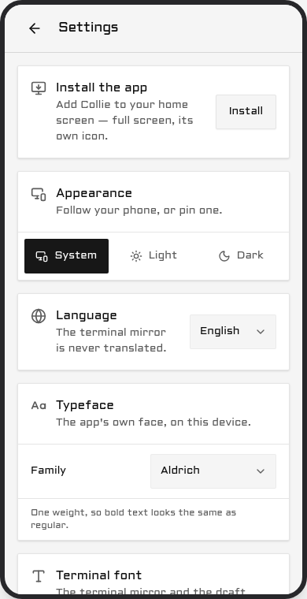
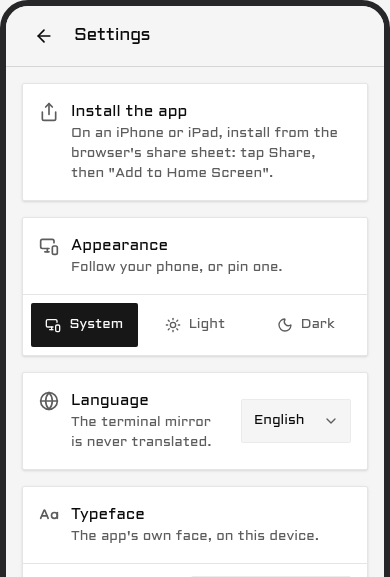

# Install Collie

How to install, update and remove Collie, then the first run. Read [Security](security.md) first:
Collie exposes remote shell access to your machine by design.

## Two ways to run it

Every Collie is one of two kinds, and every command on this page is spelled once for each. Pick
your column and keep it for the rest of the docs.

| | Herdr plugin | Standalone |
| --- | --- | --- |
| **You installed with** | `herdr plugin install AltanS/collie` or `herdr plugin link` | The install script, a source build, or a package |
| **How to tell** | `herdr plugin list` shows `herdr.collie` | `collie` is on your PATH, or lives at `~/.local/share/collie/current/bin/collie` |
| **Verbs are spelled** | `herdr plugin action invoke <verb> --plugin herdr.collie` | `collie <verb>` |
| **Who updates it** | The `update` action | `collie update`, or your package manager |
| **Config `.env`** | `~/.config/herdr/plugins/config/herdr.collie/.env` (`herdr plugin config-dir herdr.collie` prints it) | `~/.config/collie/.env`, or the Herdr path on a host that runs Herdr |
| **State** | `~/.local/state/collie/` | `~/.local/state/collie/` |

`collie doctor` names the config files this install actually reads, under its `config-file` line.

A Herdr plugin is still the same `collie` binary; the actions forward to it
([Herdr actions](commands.md#herdr-actions)). A plugin install has no `collie` on your PATH, so
the verbs that have no action (`pair`, `qr`, `logs`, `link`, `devices`, `stt`, `config`) run from
the plugin's directory as `bin/collie <verb>`.

Herdr is also one of the three multiplexers Collie can mirror. Which one you mirror is a separate
choice ([Name your multiplexer](#name-your-multiplexer)): a standalone Collie can mirror Herdr, and
a Herdr plugin can mirror tmux.

## Requirements

Supported hosts: Linux and macOS. Windows is experimental; see
[Windows](../README.md#windows-experimental).

| Tool | Needed for | Purpose |
| --- | --- | --- |
| `curl`, `tar`, sha256 tool (`sha256sum`/`shasum`) | Binary install script and updates | Download and verify release archives. |
| [Bun](https://bun.sh) | Source builds | Run the bridge and build the web UI. |
| git | Source builds and Herdr routes | Clone and update the repository. |
| Multiplexer: Herdr, [tmux](https://github.com/tmux/tmux), or [zellij](https://zellij.dev) | All installs | Mirrored backend set via `COLLIE_MUX`. tmux and zellij are experimental in 1.0; see [Pointing Collie at a multiplexer](multiplexers.md#pointing-collie-at-a-multiplexer) and [`MUX_CONTRACT.md`](../MUX_CONTRACT.md). |
| [Herdr](https://herdr.dev) ≥ 0.7.0 | Herdr backend only | Required when `COLLIE_MUX=herdr`. Check with `herdr --version`. |
| [Tailscale](https://tailscale.com) | Default access | `tailscale serve` proxies Collie to your tailnet. Optional if using [Variant C](deployment.md#variant-c--reverse-proxy-as-the-only-front-door-no-tailscale). |

> **Note.** No minimum tmux or zellij version is enforced. The adapters were tested against tmux
> 3.4, tmux 3.6b and zellij 0.44.2. One tmux edge case is handled: on a server using
> `window-size manual`, tmux below 3.7 crashes when creating a window, so Collie blocks the request
> and tells you to run `tmux set -g window-size latest`.

Soft dependencies, needed only for the features next to them:

| Tool | Needed for |
| --- | --- |
| Node.js | Formats MagicDNS names in logs. |
| systemd / launchd | Service supervision; falls back to `nohup`. |
| [`web-push`](https://www.npmjs.com/package/web-push) | Optional, see [Web Push](voice-and-push.md#web-push-optional). |

## Install

### Herdr plugin

Start the Herdr server first (`herdr` or `herdr server &`).

**From GitHub:**

```bash
herdr plugin install AltanS/collie
herdr plugin action invoke start --plugin herdr.collie
```

**From local source:**

```bash
git clone https://github.com/AltanS/collie.git && cd collie
herdr plugin link "$(pwd)"
herdr plugin action invoke start --plugin herdr.collie
```

For a prerelease, install the tag with `herdr plugin install AltanS/collie --ref <tag> --yes`,
which is the whole opt-in ([Prereleases](upgrading.md#prereleases)).

### Standalone

The install script downloads the latest release into `~/.local/share/collie` (`COLLIE_DIR`) and links
the binary to `~/.local/bin/collie`:

```bash
curl -fsSL https://colliepwa.dev/install.sh | sh
collie start
```

It takes the newest stable release and refuses to touch an install that is already there — that is
what `collie update` is for. The canonical source is `scripts/install.sh` in the repository: one page
of POSIX `sh`, and it never asks for `sudo`.

```bash
curl -fsSL https://raw.githubusercontent.com/AltanS/collie/main/scripts/install.sh | less
curl -fsSL https://raw.githubusercontent.com/AltanS/collie/main/scripts/install.sh | sh
```

If `~/.local/bin` is not on your PATH, run the binary directly:

```bash
~/.local/share/collie/current/bin/collie version
```

To pin a version or rescue an existing install (see
[When collie will not run](upgrading.md#when-collie-will-not-run)):

```bash
curl -fsSL https://colliepwa.dev/install.sh | COLLIE_TAG=v1.0.0 sh
```

For prereleases, pass `--beta`: it takes the newest prerelease, and the install then tracks that
major's prereleases until the final release ships
([Prereleases](upgrading.md#prereleases)).

#### The same result, from source

```bash
# 1. Clone and checkout latest stable tag
git clone https://github.com/AltanS/collie.git ~/.local/share/collie
cd ~/.local/share/collie
git checkout --detach "$(git tag --list 'v*' | grep -E '^v[0-9]+\.[0-9]+\.[0-9]+$' | sort -V | tail -1)"

# 2. Build runtime and UI
bash scripts/collie-ctl.sh build

# 3. Verify
bin/collie version

# 4. Optional: link to PATH
bin/collie link
```

Then start it. `start` creates `~/.config/collie/` and writes your multiplexer choice into its
`.env`, so there is nothing to seed by hand first:

```bash
bin/collie start
```

### From a package

Where Collie is packaged for your system, install it the way you install anything else. A package
is a standalone install that your package manager owns: it installs, it updates, it removes.

```bash
sudo pacman -S collie-bin                       # Omarchy
paru -S collie-bin                              # Arch, once it is on the AUR; see below
nix profile install github:AltanS/collie#collie # Nix
mise use -g github:AltanS/collie@1.5.6          # mise
collie start
```

Each manager has its own notes, under [Package details](#package-details): where the tree lands,
what the AUR status is, and why mise needs `--bump`.

A package is not a Herdr plugin. To get Collie's buttons inside Herdr, link the installed tree once:

```bash
herdr plugin link /opt/collie
```

Herdr does not scan `/opt`, so it never finds the package on its own. The plugin's `update` and
`update-major` actions then refuse and name your package manager instead. That is correct, not a
fault: this tree is your package manager's to update.

## Update

One command takes the newest release of your current major. It stages the new version beside the
old one, flips, restarts the bridge, and rolls back if the new version does not answer.

```bash
herdr plugin action invoke update --plugin herdr.collie   # Herdr plugin
collie update                                             # standalone
```

A packaged install updates with its package manager, and then needs a restart, because the package
manager swaps the files and restarts nothing:

```bash
sudo pacman -Syu collie-bin                 # Omarchy; on the AUR: paru -S collie-bin
nix profile upgrade collie                  # Nix
mise upgrade --bump github:AltanS/collie    # mise
collie restart
```

`collie update` declines on a packaged install and names that command instead. The phone shows the
same command where the update button would be.

Crossing a major is a separate, consented step:

```bash
herdr plugin action invoke update-major --plugin herdr.collie   # Herdr plugin
collie update --major                                           # standalone
```

The phone can do the routine update too: Settings → Updates, one tap, and on a crew lead one tap
levels every member. For the phone path, the preflight, rollback, crews, and what to do when an
update sticks, see **[Manage & update](upgrading.md)**.

## Uninstall

Three steps, in this order. Each one removes one layer and nothing else.

**1. Remove the service and the port mapping.** This stops the bridge, deletes the `systemd --user`
unit (the launchd agent on macOS) and takes down Collie's own `tailscale serve` mapping. The
program files and your `.env` stay.

```bash
herdr plugin action invoke uninstall --plugin herdr.collie   # Herdr plugin
collie uninstall                                             # standalone
```

**2. Remove the program.**

```bash
herdr plugin uninstall herdr.collie      # Herdr plugin, installed from GitHub
herdr plugin unlink herdr.collie         # Herdr plugin, a linked clone or a linked package

collie unlink                            # standalone: drop the ~/.local/bin/collie symlink
rm -rf ~/.local/share/collie             # standalone: the install script's tree, or $COLLIE_DIR

sudo pacman -Rns collie-bin              # package: Arch and Omarchy
nix profile remove collie                # package: Nix
mise uninstall github:AltanS/collie@1.5.6 && mise unuse github:AltanS/collie   # package: mise
```

A linked clone is your own checkout. `unlink` drops Herdr's registration and leaves the directory
for you to delete or keep.

**3. Remove your own files, if you want them gone.** Nothing above touches these, so a reinstall
finds its pairings and its settings again:

| What | Herdr plugin | Standalone |
| --- | --- | --- |
| Config, holding `.env` | `~/.config/herdr/plugins/config/herdr.collie/` | `~/.config/collie/`, or the Herdr path on a host that runs Herdr |
| State: paired devices, crew files, `stt.json` | `~/.local/state/collie/` (or `$COLLIE_STATE_DIR`) | the same |

To pause without removing anything, `stop` is enough:

```bash
herdr plugin action invoke stop --plugin herdr.collie   # Herdr plugin
collie stop                                             # standalone
```

## Name your multiplexer

```bash
mkdir -p ~/.config/collie
cp .env.example ~/.config/collie/.env
```

Collie mirrors one backend: `COLLIE_MUX=herdr` (default), `tmux`, or `zellij`. Seeding the file
above **before the first start** lets you decide up front; it is `~/.config/collie/.env` standalone,
or the path `herdr plugin config-dir herdr.collie` prints. Then set the backend and its endpoint:

```bash
COLLIE_MUX=tmux                                           # or: zellij
# zellij instead: COLLIE_MUX_ENDPOINT_ZELLIJ=<session>
COLLIE_MUX_ENDPOINT_TMUX=/run/user/1000/collie-tmux.sock
```

> **Note.** You do not have to set it up first. The first `start` looks for a live Herdr socket, a
> running tmux server and zellij sessions, prints what it found, and writes your answer to the
> config `.env`, creating it. With no terminal to ask at, it takes the only backend it found and
> says which; with none, or with several, it refuses to start and names `COLLIE_MUX`.

> **Caution.** Do not run that `cp` after a start: it lands `.env.example` on top of the
> `COLLIE_MUX` the start just wrote.

Afterwards, edit the file. See
[Pointing Collie at a multiplexer](multiplexers.md#pointing-collie-at-a-multiplexer).

## Start it

```bash
herdr plugin action invoke start --plugin herdr.collie   # Herdr plugin
collie start                                             # standalone
```

`start` will:
1. Build `web/dist` if missing.
2. Launch the bridge under `systemd --user` (or launchd/`nohup`).
3. Run `tailscale serve --bg 8787` (HTTPS :443 → 127.0.0.1:8787). Your tailnet needs HTTPS
   enabled for this ([admin console](https://login.tailscale.com/admin/dns) → "Enable HTTPS");
   Collie says so and stops if it isn't.
4. Print the connection banner.

## First run — what you'll see

Output from `collie start` (Herdr runs return JSON; view logs with
`herdr plugin log list --plugin herdr.collie`):

```console
$ collie start
building web UI (first run)…                    # linked clone only; a GitHub install already built
…bun install · typecheck · vite build output…
bridge started (systemd --user: collie)
tailscale serve (https) → tailnet :443 -> 127.0.0.1:8787

  ✓ Collie is running  ·  v1.0.0+b158755
    service   systemd --user (collie) · active
    local     http://127.0.0.1:8787
    tailnet   https://myhost.tail1234.ts.net
```

If the health check fails (`⚠ Collie isn't answering on :8787 yet`), see
[Troubleshooting](troubleshooting.md#troubleshooting).

The bridge runs as a `systemd --user` service, a launchd agent on macOS, that starts at login and
restarts on failure ([`ARCHITECTURE.md`](../ARCHITECTURE.md) §3); on Linux
`loginctl enable-linger $USER` makes it survive a reboot
([Surviving reboots](upgrading.md#surviving-reboots)).

Configure user access in [Configure](configure.md#configure) and device access via
[pairing](security.md#pair-a-device--the-write-credential) (`collie pair`).

### Open it on your phone

Open the `tailnet` URL from the banner (retrieve anytime with `collie url` or generate a QR code
with `collie qr`). Your client must be on the same tailnet.

1. **Pair the device**: Run `collie pair` on the host. Scan the printed QR code to open
   Settings → Paired devices on the client with the code filled in, or open Settings → Paired
   devices on the client and type the code
   ([Pair a device](security.md#pair-a-device--the-write-credential)).
2. **Install the app**: Tap **Install** in Settings if the browser offers it, or use the share
   sheet on iOS/iPadOS.

> **Note.** **On Android or desktop:** Chrome and Edge offer an install button the moment they
> decide the app is installable, and Collie surfaces that offer as an **Install** card at the top
> of Settings.



> **Note.** **On iPhone or iPad:** Safari never makes that offer — installing there always goes
> through the share sheet — so the same card shows those steps instead, exactly while they apply.



Installing the PWA requires HTTPS; `COLLIE_SERVE_MODE=http` disables service workers, so the phone
can only use the browser tab in that mode. A dev build (any checkout not sitting on its release
tag) installs as **Collie (dev)** with an orange icon, so it never sits on your home screen next to
a release install looking the same.

**First launch.** The first time Collie opens on a device and the dashboard loads, one screen says
what Collie does and what this install looks like: the multiplexer and the machine it mirrors, how
many panes are running and how many need you, how many machines are in your crew, and whether this
device may type.

Under that it offers at most two things to do, and only where they apply: pair this phone, start
something, turn notifications on, or keep Collie on your home screen. It closes with the six things
you can do in the app.

The screen is marked seen as soon as it opens, so a tab lost halfway down does not bring it back.
Settings has a **Show the first screen again** row that shows it on demand.

### Is it actually working?

Verify status and logs:

```console
$ collie status

  ✓ Collie is running  ·  v1.0.0+b158755
    service   systemd --user (collie) · active
    local     http://127.0.0.1:8787
    tailnet   https://myhost.tail1234.ts.net

  serve config:
    https://myhost.tail1234.ts.net (tailnet only)
    |-- / proxy http://127.0.0.1:8787
```

```console
$ collie logs        # journal timestamps trimmed here
[push] disabled (no VAPID keys configured)
[bridge] listening on http://127.0.0.1:8787  (poll 1500ms)
[bridge] WARNING: COLLIE_TRUSTED_USER is empty — any tailnet device/user that reaches the bridge gets full write access. Set it to your tailnet login (see README → Variant A).
```

To restrict access, set `COLLIE_TRUSTED_USER=you@example.com` in `.env` and run `collie restart`
([Configure](configure.md#configure)). For missing dashboard content, see
[Troubleshooting](troubleshooting.md#troubleshooting).

## Package details

The `PKGBUILD`, the Nix expression and their notes live in `packaging/` in this repository. Every
package carries the compiled binary the release already publishes, so nothing is built on your
machine: no Bun, no `git`, no compilation. The whole release folder lands under one prefix, with
`collie` on your PATH as a symlink into it. macOS has no package yet; the `aarch64-darwin` flake
output is the closest thing.

#### Arch

`collie-bin` is not on the AUR yet. The AUR has paused new account registration, and the package
will be published from our own account when registration reopens. Until then, build it from a
clone of this repository:

```bash
git clone https://github.com/AltanS/collie.git && cd collie/packaging/aur
makepkg -si
collie start
```

`makepkg` downloads the release tarball for your architecture, checks its sha256 against the
release's integrity manifest, and unpacks it. No Bun, no `git` clone of anything else, no
compilation.

**Once it is on the AUR**, an AUR helper installs the same `PKGBUILD`:

```bash
paru -S collie-bin     # or: yay -S collie-bin
collie start
```

Later updates are `paru -S collie-bin` or `yay -S collie-bin`, the same command you installed
with. `sudo pacman -Syu collie-bin` works only where a repository carries the package, such as
Omarchy's.

The package installs the release tree to `/opt/collie` and `/usr/bin/collie` as a symlink into it.
`README.md`, `CHANGELOG.md` and `docs/` land in `/usr/share/doc/collie-bin/`, and the licence in
`/usr/share/licenses/collie-bin/`. It provides and conflicts with `collie`, so it and a future
source package cannot both be installed. It enables no systemd unit: `collie start` writes your own
`--user` unit, as it does after any install.

> **Note.** Run `collie restart` after every upgrade. `pacman` replaces the files and restarts
> nothing, so the service keeps serving the old build on a deleted binary until you restart it.
> `collie doctor` reports it as `restart-pending`, and the phone shows "Collie was replaced on
> disk. Restart it." with the command to run.

Remove it with the three steps under [Uninstall](#uninstall): `collie uninstall`, then
`herdr plugin unlink herdr.collie` only if you linked it, then `sudo pacman -Rns collie-bin`.
pacman removes `/opt/collie` and `/usr/bin/collie` and nothing else.

#### Omarchy

```bash
sudo pacman -S collie-bin
COLLIE_MUX=herdr collie start
```

Omarchy ships tmux and Herdr both, and Collie mirrors one multiplexer per install, so the first
start has to name the one to drive — it refuses to guess between two it can see. `start` writes
that name into Collie's `.env`, which on a host with Herdr is
`~/.config/herdr/plugins/config/herdr.collie/.env`, and later starts are `collie start`.

That works once `collie-bin` is in Omarchy's own package repository, and the pull request adding it
is not merged yet. Until it is, build the same package from `packaging/aur` with `makepkg -si`, as
on any Arch host above.

Updates then come with `sudo pacman -Syu`, the command you already run to update the machine — an
AUR helper is not involved, because `pkgs.omarchy.org` is a real pacman repository. It is the same
`PKGBUILD` and the same `/opt/collie` layout either way.

> **Note.** Updates come from your package manager, and Collie will not update itself here.
> `collie update` declines instead. The phone's update band reads "Collie x.y.z available via
> pacman.", and the Updates page shows the command to copy in place of an update button, because
> the package manager owns that folder. Collie names the `sudo pacman -Syu collie-bin` form, which
> is the repository spelling; on an AUR install run your helper instead. Run `collie restart`
> after the upgrade, for the reason above: pacman restarts nothing.

In a [crew](crew.md), this machine never takes an update from the phone: the crew lists it as
"waits for the package manager", and it levels only when you run your helper on it.

Remove it with the same three steps as on Arch above.

#### Nix

```bash
nix profile install github:AltanS/collie#collie
collie start
```

The flake exports `packages.<system>.collie` for `x86_64-linux`, `aarch64-linux` and
`aarch64-darwin`. It fetches that platform's release tarball by the sha256 in the release's own
integrity manifest, patches the binary's interpreter on Linux, and installs the release tree to
`<store-path>/lib/collie` with `bin/collie` as a symlink into it. Run it once without installing
with `nix run github:AltanS/collie#collie -- doctor`.

There is no source build, on purpose: installing the dependencies needs the network and a Nix
derivation has none, so the package wraps the binary the release already publishes and checksums.

There is no NixOS module yet, only the flake package, so `nix profile` is the path: install it into
your profile as above, or add the flake output to a `home-manager` or `environment.systemPackages`
list yourself.

> **Note.** Updates come from nix, and Collie will not update itself here. `collie update` declines
> and names `nix profile upgrade collie` instead, and the phone shows the new version with that
> command where the update button would be.

In a [crew](crew.md), this machine never takes an update from the phone: the crew lists it as
"waits for the package manager", and it levels only when you run nix on it.

Remove it with `collie uninstall` first, then:

```bash
nix profile remove collie
```

That drops the store path from your profile and nothing else. Your own files stay, as listed under
[Uninstall](#uninstall).

#### mise

```bash
mise use -g github:AltanS/collie@1.5.6
collie start
```

`mise use -g` writes the tool into `~/.config/mise/config.toml` and puts the release's `bin/` on
your PATH. The `github` backend fetches that platform's release tarball, so this works on Linux and
macOS with no Bun and no compilation. The whole tree lands under
`~/.local/share/mise/installs/github-altan-s-collie/<version>/`, `web/dist` and `herdr-plugin.toml`
included, and `collie` resolves its own root from there.

Take a new version with the same `mise use` line and a newer tag, or let mise pick the latest:

```bash
mise upgrade --bump github:AltanS/collie
collie restart
```

`--bump` is the flag that matters. A pinned `1.5.6` is a range of one, so a plain `mise upgrade`
reports the tool as up to date and moves nothing.

The restart is not optional. Every version gets its own directory, and `collie start` bakes the
directory it ran from into the service definition, so the service keeps serving the old version out
of the old directory until you restart it. `collie restart` rewrites that definition with the new
path: the `systemd --user` unit on Linux, the `~/Library/LaunchAgents` plist on macOS. One command
on both.

> **Note.** A Mac administered only over SSH has no `gui/<uid>` domain to load an agent into. There
> `collie start` says so and runs an unsupervised background bridge instead, with no restart on
> failure and nothing at login. `collie restart` still moves it to the new directory.

> **Note.** `collie update` declines here, and it names no package manager: it says `cannot tell how
> this Collie was installed`. A mise tree sits inside your home directory, carries no `.git` of its
> own and has no `versions/` layout above it, so Collie reads it as neither a checkout nor a
> package. mise owns updates on this install, and the two commands above are what moves it.

Remove it with `collie uninstall` first, then:

```bash
mise uninstall github:AltanS/collie@1.5.6
mise unuse github:AltanS/collie
```

`uninstall` deletes that version's directory, `unuse` drops the line from the config. Spell the tool
with its full `github:` name for both; the short `collie` works for `upgrade` and not for
`uninstall`. Your own files stay, as listed under [Uninstall](#uninstall).

---

[← back to the README](../README.md)
