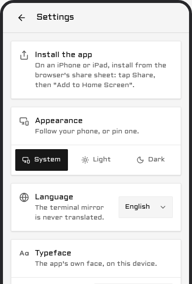
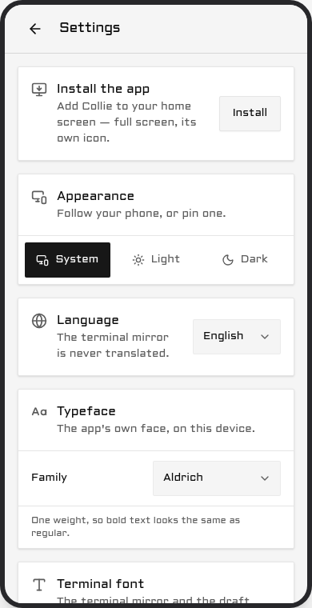

# Install Collie

Install Collie on your system, start it, and put it on your phone. Read
[Security](security.md) first: Collie exposes remote shell access to your machine by design.

## Before you start

Collie needs a front door: something that serves it over HTTPS and restricts access to you.

The default front door is [Tailscale](https://tailscale.com). `collie start` runs
`tailscale serve` for you, and your phone reaches Collie over your tailnet, your private Tailscale
network. The rest of this page assumes Tailscale. For an identity-aware proxy, a reverse proxy,
Cloudflare Tunnel or NetBird instead, see
[Front doors, one product at a time](deployment.md#front-doors-one-product-at-a-time).

With Tailscale, prepare three things:

1. Put the host on your tailnet by installing Tailscale there and running `tailscale up`.
2. Enable HTTPS certificates for the tailnet by opening the
   [admin console](https://login.tailscale.com/admin/dns) and selecting **Enable HTTPS**.
3. Put the phone on the same tailnet by installing the Tailscale app and signing in to the same
   account.

`collie start` exits with an error if HTTPS is off. The phone also requires HTTPS to install
Collie to the home screen and receive Web Push.

## Two ways to run it

Every Collie is one of two kinds, and every command on this page is spelled once for each. Pick
your column and keep it for the rest of the docs.

| | Herdr plugin | Standalone |
| --- | --- | --- |
| **You installed with** | `herdr plugin install AltanS/collie` or `herdr plugin link` | The install script, a source build, or a package |
| **How to tell** | `herdr plugin list` shows `herdr.collie` | `collie` is on your PATH, or lives at `~/.local/share/collie/current/bin/collie` |
| **Verbs are spelled** | `herdr plugin action invoke <verb> --plugin herdr.collie` | `collie <verb>` |
| **Who updates it** | The `update` action | `collie update`, or your package manager |
| **Config `.env`** | `~/.config/herdr/plugins/config/herdr.collie/.env` (`herdr plugin config-dir herdr.collie` prints it) | `~/.config/collie/.env`, or the Herdr path on a host that runs Herdr |
| **State** | `~/.local/state/collie/` | `~/.local/state/collie/` |

`collie doctor` names the config files this install actually reads, under its `config-file` line.

A Herdr plugin is still the same `collie` binary; the actions forward to it
([Herdr actions](commands.md#herdr-actions)). A plugin install has no `collie` on your PATH, so
the verbs that have no action (`pair`, `qr`, `logs`, `link`, `devices`, `stt`, `config`) run from
the plugin's directory as `bin/collie <verb>`.

Herdr is also one of the three multiplexers Collie can mirror. Which one you mirror is a separate
choice ([Name your multiplexer](#name-your-multiplexer)): a standalone Collie can mirror Herdr, and
a Herdr plugin can mirror tmux.

## Requirements

Collie runs on Linux and macOS. Windows 11 on x64 with Herdr is a supported host, still marked
experimental; see [Windows support](#windows-support-experimental).

| Tool | Needed for | Purpose |
| --- | --- | --- |
| `curl`, `tar`, sha256 tool (`sha256sum`/`shasum`) | Binary install script and updates | Download and verify release archives. |
| [Bun](https://bun.sh) | Source builds | Run the bridge and build the web UI. |
| git | Source builds and Herdr routes | Clone and update the repository. |
| Multiplexer: Herdr, [tmux](https://github.com/tmux/tmux), or [zellij](https://zellij.dev) | All installs | Mirrored backend set via `COLLIE_MUX`. tmux and zellij are experimental in 1.0; see [Pointing Collie at a multiplexer](multiplexers.md#pointing-collie-at-a-multiplexer) and [`MUX_CONTRACT.md`](../MUX_CONTRACT.md). |
| [Herdr](https://herdr.dev) ≥ 0.7.0 | Herdr backend only | Required when `COLLIE_MUX=herdr`. Check with `herdr --version`. |
| [Tailscale](https://tailscale.com) | The default front door | `tailscale serve` proxies Collie to your tailnet. Not needed behind [another front door](deployment.md#front-doors-one-product-at-a-time). |

> **Note.** Collie enforces no minimum tmux or zellij version. The adapters were tested against tmux
> 3.4, tmux 3.6b, and zellij 0.44.2. One tmux edge case is handled: on a server using
> `window-size manual`, tmux below 3.7 crashes when creating a window. Collie blocks the request
> and tells you to run `tmux set -g window-size latest`.

Soft dependencies, needed only for these features:

| Tool | Needed for |
| --- | --- |
| Node.js | Formats MagicDNS names in logs. |
| systemd / launchd | Service supervision; falls back to `nohup`. |
| [`web-push`](https://www.npmjs.com/package/web-push) | Optional, see [Web Push](voice-and-push.md#web-push-optional). |

## Install

Find your system below, run its commands, then go on to [Start it](#start-it).

| System | Recommended route |
| --- | --- |
| Linux | [The install script](#linux) |
| Arch Linux, Omarchy | [`collie-bin` package](#arch-linux-and-omarchy) |
| NixOS, or Nix on any system | [Flake package](#nixos-and-nix) |
| macOS on Apple Silicon | [The install script](#macos) |
| macOS on Intel | [Build from source](#the-same-result-from-source) |
| Windows 11 (x64, with Herdr) | [`install.ps1`, experimental](#windows-support-experimental) |
| Any of these, inside Herdr | [Herdr plugin](#herdr-plugin) |

### Linux

```bash
curl -fsSL https://colliepwa.dev/install.sh | sh
collie start
```

The script installs a prebuilt binary for x86_64 or arm64. [Standalone](#standalone) explains what
it does and how to pin a version.

`collie start` runs the bridge as a `systemd --user` service. It stops when you log out. On a
server reached over SSH, keep it running after logout and reboots:

```bash
loginctl enable-linger $USER
```

See [Surviving reboots](upgrading.md#surviving-reboots) for details.

### Arch Linux and Omarchy

```bash
git clone https://github.com/AltanS/collie.git && cd collie/packaging/aur
makepkg -si
collie start
```

`collie-bin` is not on the AUR or in Omarchy's repository yet. Build it from this repository's
`PKGBUILD` for now. It downloads the prebuilt binary without compiling. Once published,
`sudo pacman -S collie-bin` (Omarchy) or `paru -S collie-bin` (AUR) replaces the clone.

Omarchy includes tmux and Herdr. You must name the one to mirror on the first start, for
example `COLLIE_MUX=herdr collie start`. [Arch](#arch) and [Omarchy](#omarchy) under Package
details cover layout, updates, and removal.

### NixOS and Nix

```bash
nix profile install github:AltanS/collie#collie
collie start
```

This works on NixOS and any system with Nix on `x86_64-linux`, `aarch64-linux`, and
`aarch64-darwin`. There is no NixOS module yet. [Nix](#nix) under Package details has the rest.

### macOS

```bash
curl -fsSL https://colliepwa.dev/install.sh | sh
collie start
```

The published Mac binary requires Apple Silicon and **macOS 13 or newer**, the minimum its Bun
build links against. An Intel Mac builds from source
([The same result, from source](#the-same-result-from-source)). `collie update` states this
rather than downloading an unusable binary.

`collie start` registers a launchd agent in `~/Library/LaunchAgents`. It starts Collie at login and
restarts it on failure. It also runs `tailscale serve`, so the `tailscale` command must be on your
PATH. The Tailscale app for Mac can install that command from its settings.

> **Note.** A Mac reached only over SSH has no login session for launchd. `collie start` reports
> this and runs the bridge in the background without supervision: no restart on failure, nothing
> at login.

macOS has no package yet. [mise](#mise) works on a Mac, as does the `aarch64-darwin`
[Nix](#nix) output.

### Windows support (experimental)

> **Experimental.** The install was tested against the public v1.16.0 release on a Windows 11
> virtual machine, and the update was rehearsed against local copies of the release files. Phone
> access over HTTP through Tailscale Serve was run too. An update between two real releases and the
> HTTPS form of phone access are not tested yet. The release check requires the Windows zip from now
> on. Only the maintainer can override that, for a Linux hotfix. "Supported" means the maintainer
> owns the code and tests it; "experimental" stays until the conditions on the Windows page are all
> met.
> [Collie on Windows](windows.md) has the whole page.

Run `install.ps1`. It needs no Bun, Git or `bash`:

```powershell
irm https://colliepwa.dev/install.ps1 | iex
```

To read the script first, save it, open it and run it as a file:

```powershell
Invoke-WebRequest -OutFile install.ps1 https://colliepwa.dev/install.ps1
notepad install.ps1
powershell -ExecutionPolicy Bypass -File .\install.ps1
```

Then open a new terminal and start Herdr. Herdr takes over that terminal, so open a second terminal
or a Herdr pane and run `collie start` there.
[Zero to phone](windows.md#zero-to-phone) has every step, including how to open Collie on your
phone.

What to know before you start:

- **Windows 11 on x64, with Herdr only.** tmux, zellij, Windows 10 and Windows on ARM are not
  covered.
- **The binary is unsigned.** SmartScreen can ask before it runs, and Smart App Control can block it.
  [Windows page](windows.md#unsigned-binary-smartscreen-and-smart-app-control).
- **You publish the address yourself.** On Linux and macOS `collie start` runs `tailscale serve`
  for you. On Windows it does not, so you run it by hand: [Reaching it from your phone](windows.md#reaching-it-from-your-phone) has the
  steps with Tailscale, and
  [Variant C](deployment.md#variant-c--reverse-proxy-as-the-only-front-door-no-tailscale) covers a
  reverse proxy.
- **A Windows machine cannot join a crew in this release.**
- **A build from source needs Git for Windows' `bash`.** The zip needs no toolchain.
- **A source checkout never updates itself on Windows.** Moving to the zip install is a one-time
  manual step: `collie uninstall`, then `install.ps1`. After that `collie update` works.
  [Update](windows.md#update) has the detail.

### Standalone

The install script downloads the latest release into `~/.local/share/collie` (`COLLIE_DIR`) and
links the binary to `~/.local/bin/collie`:

```bash
curl -fsSL https://colliepwa.dev/install.sh | sh
collie start
```

It fetches the newest stable release and leaves an existing install untouched. To update one, use
`collie update`. The canonical source is `scripts/install.sh` in the repository: one page of
POSIX `sh` that never calls `sudo`. Read it before running it:

```bash
curl -fsSL https://raw.githubusercontent.com/AltanS/collie/main/scripts/install.sh | less
curl -fsSL https://raw.githubusercontent.com/AltanS/collie/main/scripts/install.sh | sh
```

If `~/.local/bin` is not on your PATH, run the binary directly:

```bash
~/.local/share/collie/current/bin/collie version
```

To pin a version or fix an existing install (see
[When collie will not run](upgrading.md#when-collie-will-not-run)):

```bash
curl -fsSL https://colliepwa.dev/install.sh | COLLIE_TAG=v1.0.0 sh
```

The script queries the GitHub API for releases, which rate-limits per IP address. If it returns
`HTTP 403`, pin the version as shown above, or set `GH_TOKEN` to a token with no scopes. See
[If GitHub rate-limits the release check](upgrading.md#if-github-rate-limits-the-release-check).

For prereleases, pass `--beta`. It selects the newest prerelease, and the install then tracks
prereleases for that major version until the final release ships
([Prereleases](upgrading.md#prereleases)).

#### The same result, from source

```bash
# 1. Clone and checkout latest stable tag
git clone https://github.com/AltanS/collie.git ~/.local/share/collie
cd ~/.local/share/collie
git checkout --detach "$(git tag --list 'v*' | grep -E '^v[0-9]+\.[0-9]+\.[0-9]+$' | sort -V | tail -1)"

# 2. Build runtime and UI
bash scripts/collie-ctl.sh build

# 3. Verify
bin/collie version

# 4. Optional: link to PATH
bin/collie link
```

A source build requires Bun and git. Start it with `bin/collie start`, or `collie start` after
linking.

### Herdr plugin

```bash
herdr plugin install AltanS/collie
herdr plugin action invoke start --plugin herdr.collie
```

Start the Herdr server first (`herdr` or `herdr server &`). This works on Linux and macOS.

To install from a local clone instead:

```bash
git clone https://github.com/AltanS/collie.git && cd collie
herdr plugin link "$(pwd)"
herdr plugin action invoke start --plugin herdr.collie
```

For a prerelease, install the tag with `herdr plugin install AltanS/collie --ref <tag> --yes`.
That is the whole opt-in ([Prereleases](upgrading.md#prereleases)).

### From a package

A package is a standalone install managed by your package manager: it installs, updates, and
removes. Commands for each manager appear above and under [Package details](#package-details),
along with [mise](#mise) for Linux and macOS.

A package is not a Herdr plugin. To show Collie's buttons in Herdr, link the installed tree once:

```bash
herdr plugin link /opt/collie
```

Herdr does not scan `/opt`, so it never detects the package automatically. The plugin's `update`
and `update-major` actions refuse to run and refer you to your package manager. That is intentional:
your package manager manages this tree.

## Name your multiplexer

Collie mirrors one backend: `COLLIE_MUX=herdr` (default), `tmux`, or `zellij`.

You do not need to set it before the first start. `start` looks for a live Herdr socket, a running
tmux server and zellij sessions, prints what it found, and writes your choice to the config `.env`,
creating the file if needed.

Without a terminal prompt, `start` picks the single backend it found and reports it. If it finds
none, or finds several, it refuses to start and tells you to set `COLLIE_MUX`.

To choose in advance, seed the config before your first start:

```bash
mkdir -p ~/.config/collie
cp ~/.local/share/collie/current/.env.example ~/.config/collie/.env
```

That path is for the install script; a source checkout has `.env.example` at its root. On a Herdr
plugin, the file lives where `herdr plugin config-dir herdr.collie` points. Then set the backend and
its endpoint:

```bash
COLLIE_MUX=tmux                                           # or: zellij
# zellij instead: COLLIE_MUX_ENDPOINT_ZELLIJ=<session>
COLLIE_MUX_ENDPOINT_TMUX=/run/user/1000/collie-tmux.sock
```

> **Caution.** Do not run that `cp` after a start: it overwrites the `COLLIE_MUX` value that
> `start` just wrote.

Edit the file later as your setup changes. See
[Pointing Collie at a multiplexer](multiplexers.md#pointing-collie-at-a-multiplexer).

## Start it

```bash
herdr plugin action invoke start --plugin herdr.collie   # Herdr plugin
collie start                                             # standalone
```

`start` will:
1. Build `web/dist` if missing.
2. Launch the bridge under `systemd --user` (or launchd/`nohup`).
3. Run `tailscale serve --bg 8787` (HTTPS :443 → 127.0.0.1:8787).
4. Print the connection banner.

### First run: what you'll see

Output from `collie start` (Herdr runs return JSON; view logs with
`herdr plugin log list --plugin herdr.collie`):

```console
$ collie start
building web UI (first run)…                    # linked clone only; a GitHub install already built
…bun install · typecheck · vite build output…
bridge started (systemd --user: collie)
tailscale serve (https) → tailnet :443 -> 127.0.0.1:8787

  ✓ Collie is running  ·  v1.0.0+b158755
    service   systemd --user (collie) · active
    local     http://127.0.0.1:8787
    tailnet   https://myhost.tail1234.ts.net
```

If the health check fails (`⚠ Collie isn't answering on :8787 yet`), see
[Troubleshooting](troubleshooting.md#troubleshooting).

The bridge runs as a `systemd --user` service or macOS launchd agent. It starts at login and
restarts on failure ([`ARCHITECTURE.md`](../ARCHITECTURE.md) §3). On Linux,
`loginctl enable-linger $USER` keeps it running across reboots
([Surviving reboots](upgrading.md#surviving-reboots)).

Configure user access in [Configure](configure.md#configure) and device access via
[pairing](security.md#pair-a-device--the-write-credential) (`collie pair`).

### Is it actually working?

Verify status and logs:

```console
$ collie status

  ✓ Collie is running  ·  v1.0.0+b158755
    service   systemd --user (collie) · active
    local     http://127.0.0.1:8787
    tailnet   https://myhost.tail1234.ts.net

  serve config:
    https://myhost.tail1234.ts.net (tailnet only)
    |-- / proxy http://127.0.0.1:8787
```

```console
$ collie logs        # journal timestamps trimmed here
[push] disabled (no VAPID keys configured)
[bridge] listening on http://127.0.0.1:8787  (poll 1500ms)
[bridge] WARNING: COLLIE_TRUSTED_USER is empty — any tailnet device/user that reaches the bridge gets full write access. Set it to your tailnet login (see README → Variant A).
```

To restrict access, set `COLLIE_TRUSTED_USER=you@example.com` in `.env` and run `collie restart`
([Configure](configure.md#configure)). For missing dashboard content, see
[Troubleshooting](troubleshooting.md#troubleshooting).

## Put it on your phone

Open Collie on the phone, pair the phone, and add Collie to the home screen.

1. Confirm that the phone's Tailscale app shares a tailnet with the host.
2. Run `collie qr` on the host and scan its code, or open the URL that `collie url` prints.
3. Run `collie pair` on the host and scan that QR code.

The QR code from `collie pair` opens Settings → System → Paired devices with the code entered. You can also
open Settings → System → Paired devices and enter it manually. Pairing gives this phone write access to your
panes ([Pair a device](security.md#pair-a-device--the-write-credential)).

Collie is a web app. The browser adds it to your home screen without an app store, giving it a
standalone icon and full-screen view.

### iPhone and iPad

1. Open the Collie URL in Safari.
2. Tap **Share**, then tap **Add to Home Screen**.
3. Tap **Add**.

On iOS 16.4 and newer, Chrome, Edge and Firefox also offer **Add to Home Screen** in their share
menus. If you see **Open as Web App**, keep it selected.



Safari does not provide an install button. Collie's Settings shows an Install card with these steps
instead until you complete them.

> **Note.** On iPhone or iPad, Web Push requires iOS 16.4 or newer and works only from the home
> screen icon. Open Collie from that icon, then enable notifications in Settings.

### Android

1. Open the Collie URL in Chrome.
2. Go to Collie's Settings and tap **Install** on the top card.

This card appears once Chrome offers the install. If it does not appear, open Chrome's menu (⋮)
and tap **Add to home screen**, then **Install**. Some Chrome builds label this **Install app**.
Firefox and Samsung Internet use **Add to Home screen** in their main menus.



Android supports Web Push inside standard browser tabs. Installing only adds the home icon and
full-screen mode.

### Desktop

Chrome and Edge show an install icon in the address bar, plus the **Install** card in Settings.
On macOS, Safari 17 and newer uses **File → Add to Dock**.

### Notes for every device

- Installing requires HTTPS. Under `COLLIE_SERVE_MODE=http`, browsers disable service workers,
  limiting Collie to a standard browser tab.
- Dev builds (checkouts off a release tag) install as **Collie (dev)** with an orange icon to avoid
  confusing them with release versions.
- Pairing binds to a single device. Pair every phone, tablet, or browser you plan to type from.
- Push notifications require host keys:
  [Web Push](voice-and-push.md#web-push-optional).

### First launch

When Collie first opens on a device and loads the dashboard, an intro screen outlines your setup.
It lists the active multiplexer, mirrored host, running panes, panes needing input, crew machine
count, and your write access.

Below that, it suggests up to two actions: pairing the device, starting something, enabling
alerts, or saving Collie to your home screen. It ends with six core tasks you can run.

The app marks this screen seen on load, so closing the tab will not show it again. You can view it
later by tapping **Show the first screen again** in Settings.

## Update

One command takes the newest release of your current major.

```bash
herdr plugin action invoke update --plugin herdr.collie   # Herdr plugin
collie update                                             # standalone
```

It stages the new version beside the old one, flips, restarts the bridge, and rolls back if the new
version does not answer.

A packaged install updates with its package manager, and then needs a restart, because the package
manager swaps the files and restarts nothing:

```bash
sudo pacman -Syu collie-bin                 # Omarchy; on the AUR: paru -S collie-bin
nix profile upgrade collie                  # Nix
mise upgrade --bump github:AltanS/collie    # mise
collie restart
```

`collie update` declines on a packaged install and names that command instead. The phone shows the
same command where the update button would be.

Crossing a major is a separate, consented step:

```bash
herdr plugin action invoke update-major --plugin herdr.collie   # Herdr plugin
collie update --major                                           # standalone
```

The phone can do the routine update too: Settings → System → Updates, one tap, and on a crew lead one tap
levels every member. For the phone path, the preflight, rollback, crews, and what to do when an
update sticks, see **[Manage & update](upgrading.md)**.

## Uninstall

Three steps, in this order. Each one removes one layer and nothing else.

**1. Remove the service and the port mapping.** This stops the bridge, deletes the `systemd --user`
unit (the launchd agent on macOS) and takes down Collie's own `tailscale serve` mapping. The
program files and your `.env` stay.

```bash
herdr plugin action invoke uninstall --plugin herdr.collie   # Herdr plugin
collie uninstall                                             # standalone
```

**2. Remove the program.**

```bash
herdr plugin uninstall herdr.collie      # Herdr plugin, installed from GitHub
herdr plugin unlink herdr.collie         # Herdr plugin, a linked clone or a linked package

collie unlink                            # standalone: drop the ~/.local/bin/collie symlink
rm -rf ~/.local/share/collie             # standalone: the install script's tree, or $COLLIE_DIR

sudo pacman -Rns collie-bin              # package: Arch and Omarchy
nix profile remove collie                # package: Nix
mise uninstall github:AltanS/collie@1.14.2  # package: mise, the version
mise unuse github:AltanS/collie             # package: mise, the config line
```

A linked clone is your own checkout. `unlink` drops Herdr's registration and leaves the directory
for you to delete or keep.

**3. Remove your own files, if you want them gone.** Nothing above touches these, so a reinstall
finds its pairings and its settings again:

| What | Herdr plugin | Standalone |
| --- | --- | --- |
| Config, holding `.env` | `~/.config/herdr/plugins/config/herdr.collie/` | `~/.config/collie/`, or the Herdr path on a host that runs Herdr |
| State: paired devices, crew files, `stt.json`, `folders.json` | `~/.local/state/collie/` (or `$COLLIE_STATE_DIR`) | the same |

To pause without removing anything, `stop` is enough:

```bash
herdr plugin action invoke stop --plugin herdr.collie   # Herdr plugin
collie stop                                             # standalone
```

## Package details

The `PKGBUILD`, the Nix expression and their notes live in `packaging/` in this repository. Every
package carries the compiled binary the release already publishes, so nothing is built on your
machine: no Bun, no `git`, no compilation. The whole release folder lands under one prefix, with
`collie` on your PATH as a symlink into it. macOS has no package yet; the `aarch64-darwin` flake
output is the closest thing.

#### Arch

`collie-bin` is not on the AUR yet. The AUR has paused new account registration, and the package
will be published from our own account when registration reopens. Until then, build it from a
clone of this repository:

```bash
git clone https://github.com/AltanS/collie.git && cd collie/packaging/aur
makepkg -si
collie start
```

`makepkg` downloads the release tarball for your architecture, checks its sha256 against the
release's integrity manifest, and unpacks it. No Bun, no `git` clone of anything else, no
compilation.

**Once it is on the AUR**, an AUR helper installs the same `PKGBUILD`:

```bash
paru -S collie-bin     # or: yay -S collie-bin
collie start
```

Later updates are `paru -S collie-bin` or `yay -S collie-bin`, the same command you installed
with. `sudo pacman -Syu collie-bin` works only where a repository carries the package, such as
Omarchy's.

The package installs the release tree to `/opt/collie` and `/usr/bin/collie` as a symlink into it.
`README.md`, `CHANGELOG.md` and `docs/` land in `/usr/share/doc/collie-bin/`, and the licence in
`/usr/share/licenses/collie-bin/`. It provides and conflicts with `collie`, so it and a future
source package cannot both be installed. It enables no systemd unit: `collie start` writes your own
`--user` unit, as it does after any install.

> **Note.** Run `collie restart` after every upgrade. `pacman` replaces the files and restarts
> nothing, so the service keeps serving the old build on a deleted binary until you restart it.
> `collie doctor` reports it as `restart-pending`, and the phone shows "Collie was replaced on
> disk. Restart it." with the command to run.

Remove it with the three steps under [Uninstall](#uninstall): `collie uninstall`, then
`herdr plugin unlink herdr.collie` only if you linked it, then `sudo pacman -Rns collie-bin`.
pacman removes `/opt/collie` and `/usr/bin/collie` and nothing else.

#### Omarchy

```bash
sudo pacman -S collie-bin
COLLIE_MUX=herdr collie start
```

Omarchy ships tmux and Herdr both, and Collie mirrors one multiplexer per install, so the first
start has to name the one to drive: it refuses to guess between two it can see. `start` writes
that name into Collie's `.env`, which on a host with Herdr is
`~/.config/herdr/plugins/config/herdr.collie/.env`, and later starts are `collie start`.

That works once `collie-bin` is in Omarchy's own package repository, and the pull request adding it
is not merged yet. Until it is, build the same package from `packaging/aur` with `makepkg -si`, as
on any Arch host above.

Updates then come with `sudo pacman -Syu`, the command you already run to update the machine. An
AUR helper is not involved, because `pkgs.omarchy.org` is a real pacman repository. It is the same
`PKGBUILD` and the same `/opt/collie` layout either way.

> **Note.** Updates come from your package manager, and Collie will not update itself here.
> `collie update` declines instead. The phone's update band reads "Collie x.y.z available via
> pacman.", and the Updates page shows the command to copy in place of an update button, because
> the package manager owns that folder. Collie names the `sudo pacman -Syu collie-bin` form, which
> is the repository spelling; on an AUR install run your helper instead. Run `collie restart`
> after the upgrade, for the reason above: pacman restarts nothing.

In a [crew](crew.md), this machine never takes an update from the phone: the crew lists it as
"waits for the package manager", and it levels only when you run your helper on it.

Remove it with the same three steps as on Arch above.

#### Nix

```bash
nix profile install github:AltanS/collie#collie
collie start
```

The flake exports `packages.<system>.collie` for `x86_64-linux`, `aarch64-linux` and
`aarch64-darwin`. It fetches that platform's release tarball by the sha256 in the release's own
integrity manifest, patches the binary's interpreter on Linux, and installs the release tree to
`<store-path>/lib/collie` with `bin/collie` as a symlink into it. Run it once without installing
with `nix run github:AltanS/collie#collie -- doctor`.

There is no source build, on purpose: installing the dependencies needs the network and a Nix
derivation has none, so the package wraps the binary the release already publishes and checksums.

There is no NixOS module yet, only the flake package, so `nix profile` is the path: install it into
your profile as above, or add the flake output to a `home-manager` or `environment.systemPackages`
list yourself.

> **Note.** Updates come from nix, and Collie will not update itself here. `collie update` declines
> and names `nix profile upgrade collie` instead, and the phone shows the new version with that
> command where the update button would be.

In a [crew](crew.md), this machine never takes an update from the phone: the crew lists it as
"waits for the package manager", and it levels only when you run nix on it.

Remove it with `collie uninstall` first, then:

```bash
nix profile remove collie
```

That drops the store path from your profile and nothing else. Your own files stay, as listed under
[Uninstall](#uninstall).

##### Home Manager agents on macOS

```bash
collie status
launchctl print "user/$(id -u)/herdr.collie"
```

`collie status` discovers the instance's label in both `gui/<uid>` and `user/<uid>` and
reports its domain and process state. If both domains contain the label, it reports both;
a stopped GUI agent does not hide a running background agent. No environment override is needed.

For an existing Home Manager-managed Collie agent, these settings select the background domain
(Home Manager 26.11 or later):

```nix
launchd.agents.collie = {
  domain = "user";
  config.Label = "herdr.collie";
};
```

This is an addition to your agent definition, not a complete service module. Keep its command,
environment, and log paths configured in Home Manager. Run the bridge with `collie _exec-bridge`,
not `collie start`, so launchd supervises the bridge without Collie rewriting the managed plist.
Keep credentials and pairing state outside the Nix store. Configure the front door separately
with `collie serve`, or use the [external-proxy setup](deployment.md#variant-c--reverse-proxy-as-the-only-front-door-no-tailscale).

For a named instance, use the label `herdr.collie-<name>` and the same `COLLIE_INSTANCE`,
`COLLIE_PORT`, and configuration directory in the agent and your CLI environment
([multiple instances](deployment.md#multiple-collie-instances-on-one-host)).

> **Note.** Home Manager owns the service lifecycle. Update or remove its declaration and
> activate Home Manager rather than running `collie start`, `stop`, `restart`, or `uninstall`.
> Those commands still manage Collie's GUI-domain agent; status discovery does not transfer
> ownership. Continue using `collie pair`, `devices`, `url`, and `logs` normally.

#### mise

```bash
mise use -g github:AltanS/collie@1.14.2
collie start
```

`mise use -g` writes the tool into `~/.config/mise/config.toml` and puts the release's `bin/` on
your PATH. The `github` backend fetches that platform's release tarball, so this works on Linux and
macOS with no Bun and no compilation. The whole tree lands under
`~/.local/share/mise/installs/github-altan-s-collie/<version>/`, `web/dist` and `herdr-plugin.toml`
included, and `collie` resolves its own root from there.

Take a new version with the same `mise use` line and a newer tag, or let mise pick the latest:

```bash
mise upgrade --bump github:AltanS/collie
collie restart
```

`--bump` is the flag that matters. A pinned `1.14.2` is a range of one, so a plain `mise upgrade`
reports the tool as up to date and moves nothing.

The restart is not optional. Every version gets its own directory, and `collie start` bakes the
directory it ran from into the service definition, so the service keeps serving the old version out
of the old directory until you restart it. `collie restart` rewrites that definition with the new
path: the `systemd --user` unit on Linux, the `~/Library/LaunchAgents` plist on macOS. One command
on both.

> **Note.** A Mac administered only over SSH has no `gui/<uid>` domain to load an agent into. There
> `collie start` says so and runs an unsupervised background bridge instead, with no restart on
> failure and nothing at login. `collie restart` still moves it to the new directory.

> **Note.** `collie update` declines here, and it names no package manager: it says `cannot tell how
> this Collie was installed`. A mise tree sits inside your home directory, carries no `.git` of its
> own and has no `versions/` layout above it, so Collie reads it as neither a checkout nor a
> package. mise owns updates on this install, and the two commands above are what moves it.

Remove it with `collie uninstall` first, then:

```bash
mise uninstall github:AltanS/collie@1.14.2
mise unuse github:AltanS/collie
```

`uninstall` deletes that version's directory, `unuse` drops the line from the config. Spell the tool
with its full `github:` name for both; the short `collie` works for `upgrade` and not for
`uninstall`. Your own files stay, as listed under [Uninstall](#uninstall).

---

[← back to the README](../README.md)
