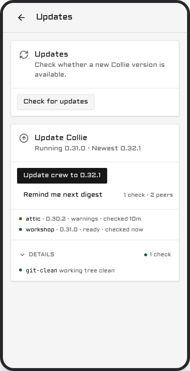

# Manage & update

| You installed with | You are | Verbs are spelled |
| --- | --- | --- |
| `herdr plugin install` or `herdr plugin link` | **Herdr-managed** (`herdr plugin list` shows `herdr.collie`) | `herdr plugin action invoke <verb> --plugin herdr.collie` |
| Install script or source build | **Standalone** | `bin/collie <verb>` from the install dir |

Herdr installs have no `collie` on PATH; use Herdr action IDs
([Herdr actions](commands.md#herdr-actions)). Standalone installs place the binary in
`~/.local/share/collie/current/bin/collie` or `<checkout>/bin/collie`:

```bash
# the install script's layout
cd ~/.local/share/collie/current && bin/collie version
# a source build or a linked clone
cd ~/my/collie-checkout && bin/collie version
```

Run `bin/collie link` to symlink the binary into `~/.local/bin`
([Put `collie` on your PATH](commands.md#put-collie-on-your-path)).

Configuration and state sit outside the checkout and persist across updates
(`bridge/solo-baseline.test.ts`). `.env` and the `tailscale serve` record are in the config dir,
`~/.config/collie` on a binary install or Herdr's plugin config dir on a Herdr install; paired
devices and `stt.json` are in the state dir, `~/.local/state/collie` unless `COLLIE_STATE_DIR`
moves it.

## A packaged install

Where your package manager installed Collie, it updates Collie, and everything below this section
does not apply:

```bash
sudo pacman -Syu collie-bin    # or `nix profile upgrade collie`, or `brew upgrade collie`
```

Collie recognises this install from shapes on disk: no `.git`, no `versions/` layout, the manifest
the release payload carries, and a root that is read-only, outside your home directory, or owned by
root. Any one of the last three is enough. It then refuses to update in place and names the command
where it can tell which manager owns the folder:

```
error: /opt/collie is a packaged install — updates come from your package manager.
       `collie update` will not replace its files.
       Take the new version with: sudo pacman -Syu collie-bin
```

Where the prefix names no manager Collie knows, it prints the first two lines and stops rather than
guessing a command you cannot run.

`collie doctor` reports the same install as healthy, and the phone's update card still shows that a
newer release exists — with the package command in place of the update button.

> **Note.** This is not a limitation to work around. The folder belongs to your package manager, and
> replacing its files out from under it would leave its database lying about what is installed.
> `sudo collie update` refuses the same way.

To take a new version, run your package manager and then restart the service:

```bash
paru -Syu collie-bin                              # Arch, or your AUR helper of choice
nix profile upgrade collie                        # Nix
mise upgrade --bump github:AltanS/collie          # mise
collie restart
```

A mise install is the odd one out: Collie does not read it as packaged, because the tree sits in
your home directory with no `.git` and no `versions/` layout, so `collie update` declines with
`cannot tell how this Collie was installed` and names no manager. mise still owns it. See
[Install](install.md#mise).

The restart is the part Collie cannot do for you, and it is not optional. Your package manager swaps
the files under the running bridge, so that process keeps executing the old code while it already
reports the new version. Collie sees that mismatch and says so: `collie doctor` raises
`restart-pending`, and the phone shows a "Bridge restart needed" banner reading "Collie was replaced
on disk. Restart it." Both clear the moment `collie restart` has run.

In a [crew](crew.md#members-that-were-not-installed-by-installsh), a packaged member never takes an
update from the phone. The crew lists it as "waits for the package manager" and counts the run as
complete without it, so the two commands above are what levels it.

A packaged **lead** declines only its own move. The phone still levels every member to the version
the lead is running, and one confirm covers them. After the two commands above have moved the lead,
nothing levels by itself: tap the Updates page once more and the members follow to the lead's new
version.

## Update, from the phone or the terminal

Two update paths exist, and both run the same steps on each host: stage the new release beside the
active one, flip the symlink, restart, and check that the service answers. On a crew lead, both
paths cover the whole crew. The phone is the short path. The terminal is the fallback for a machine
the phone cannot level.

### From the phone

Open **Settings** and select **Updates**. The card displays the running version, the newest release,
and the intermediate versions included in the update. If the host is on the newest release, the card
says so and offers nothing.


Under that sits the preflight, one line per check: `doctor`, `disk`, `bun`, `tree`, `upstream` and
`service`. On a lead, every crew member is checked too.

- **Green** is clear.
- **Amber** is worth knowing and never blocks: version skew across a crew, an unusual install kind,
  a major that is out but is not being taken. Untracked scratch files in a checkout stay green.
- **Red** blocks the update. The line names the reason, such as a red `collie doctor`, less than
  1 GB free for the staged build, no `bun` on the host, or an upstream that cannot be reached. Where
  one command clears it, the card prints that command as `Fix: <command>`.

Tapping **Update to `<version>`** asks once, and the confirm text is literal: your terminal session
stays alive, and the phone view drops for up to 30 seconds. The restart takes the bridge down, not
your multiplexer, so the agents keep running and the phone comes back on the new version. A major
never rides a routine update: crossing one asks its own confirm, names the version as a new major,
and tells you to read the release notes first.

While it runs, a sheet takes the screen. See
[What the phone shows while an update runs](#what-the-phone-shows-while-an-update-runs) below. The
card on the Updates page carries the same states in more detail:

| State | What it means |
| --- | --- |
| `preflight` | Checking this machine. Nothing has moved. |
| `staging` | Building or downloading the new version beside the old one. |
| `restarting` | The bridge is down on purpose. This is not an outage. |
| `verifying` | Waiting for the new version to answer. |
| `done` | The new version answered. |
| `rolled-back` | The new version did not answer, so the updater put the old one back. |
| `stuck` | Neither version answered. Nothing will restart again on its own. |
| `interrupted` | The run stopped before it finished. Nothing is half installed. |

The first four are progress; the card says so and asks you to keep the screen open. `rolled-back`
names the version you are still on, shows the tail of the service log, and offers **Retry**.
`stuck` prints the one command to run in a terminal. `interrupted` offers **Retry** as well.

**Remind me next digest** dismisses the card's nudge. It is not a mute: the next push waits for both
a newer release and a fresh window.

**How often you are told.** Update pushes are a digest, at most one a day, and never before 09:00
host local time. A delta that is only patch releases waits for a weekly window instead, so a patch
train arrives as one push rather than four; a minor or a major keeps the daily cadence and carries
the waiting patches with it. Held releases are folded, never dropped. A patch can also ask for the
daily cadence: a fix you must take today is marked urgent when it is cut, and the update card then
shows an **Urgent** label with the one sentence saying why. You are told at the release, or at the
next 09:00 after it. One urgent release makes the whole waiting train daily, and the version is still
an ordinary patch. An install that predates this feature keeps the weekly window for an urgent
patch until it has updated once. The card always shows the
current state regardless of the window. The `updates` notification preference, under Settings →
notifications ([Web Push](voice-and-push.md#web-push-optional)), is the single off switch.

On a crew lead, the button shows **Update crew to `<version>`**, and one confirmation applies to
every machine. The lead updates first, under its own health gate. Each peer then levels itself to
the same release, one at a time, using its own preflight, its own health gate and its own rollback.
There is no per-peer button and no second confirmation prompt. For details, the two recovery paths,
and the one case the phone cannot fix, see
[Updating the rest of the crew](#updating-the-rest-of-the-crew).



A band across the top of every screen carries what is standing rather than what is running: the
release on offer, a peer that could not update, and `New version — tap to update` when the app in
your hand is behind the bridge. A running update is the sheet's, not the band's.


### What the phone shows while an update runs

A sheet takes the screen on the device that tapped the confirm, and every other device gets a badge.

The sheet carries one row per machine, the lead first, each with its version and the state it is in.
Under those sits this device's own row, which is about the app in your hand and not about a machine:
once the bridge serves the new version, the phone fetches that app in the background and the row
counts the files as they arrive. The sheet also says once, in small type, that the update runs on the
machines and that closing the app does not stop it.

The device that started the run cannot use the app behind the sheet. Nothing else is blocked: a
second phone or a tablet shows one line it can tap to open, and closes again.

When every machine is done and the phone is running the new app, the sheet closes itself and a short
message names the version. On a crew it reads `Crew updated to <version>`; on one machine it names
that machine instead.

A run that updates only the members, such as **Retry crew update**, takes the screen the same way.
The lead's row reads `already up to date`, because the lead is not part of that run and does not
restart. The end reads `Members updated to <version>`, and a member that could not update leaves the
sheet open on the phone that started the run, with its reason.

Three states can stall, and each one has a way out. None of them cancels the update, and none of them
reloads the app.

| What you see | What it means | What to do |
| --- | --- | --- |
| `last seen <time> ago` on a machine | That machine has stopped answering the lead. | **See Updates** for the reason, or leave it. |
| *Still downloading. Keep using the app you have…* | The phone's own download has made no progress for two minutes. | **Keep using the app.** The download carries on. |
| *Still working. Nothing is wrong yet…* | The run has held one state for three minutes. | **Keep waiting.** The run carries on. |

> **Note.** "Still downloading, keep using the app" is about the app on your phone and never about the
> machine. The machines have finished; only the new app has not arrived yet. The app you are holding
> keeps working, and it switches over on its own the moment the download lands.

### From the terminal

```bash
collie update --check            # read-only preflight, --json for a script
collie update --check --local    # the same, this instance only, no crew members
collie update                    # stage, flip, restart, verify
collie update --status           # what the updater did, or is doing, --json for a script
collie update --rollback         # put the previous version back
collie update --major            # cross one major, see below
```

On a Herdr-managed install the same verbs are Herdr actions:

```bash
herdr plugin action invoke update --plugin herdr.collie      # Herdr-managed
bin/collie update                                            # Standalone
```

`collie update --check` changes nothing. It runs `collie doctor`, reads the free space, the `bun`
version, the working tree, the upstream release list and the service unit, and on a lead it asks
every crew member the same question over your own SSH. It exits 0 unless something is red, and
`--json` prints a versioned report. Add `--local` to check this instance only and skip the crew
members. The phone runs that local check on its own host and reads each peer's line over the crew
link, so its preflight needs no SSH.

`collie update` fetches the newest release of your current major and stages it. The command then
hands the swap to a separate updater and exits, because the restart kills the bridge that asked for
the update. That updater points `current` at the new version, restarts through the new binary, and
polls `GET /api/health` for up to 30 seconds for an answer carrying the version it just installed.
If the answer does not come, or comes from the old version, it flips `current` back and restarts
once more, and records `rolled-back` with a tail of the service log. If that does not come up
either, it records `stuck` with the command to run by hand, and nothing restarts again. It rolls
back once, never twice.

Set `COLLIE_UPDATE_HEALTH_TIMEOUT_MS` if 30 seconds is not enough on your machine. A slow cold start
that runs past the budget is read as a failed update and rolled back.

`collie update --status` prints the record the updater keeps, and the phone reads the same record.
A deputy's standby door serves it at `/standby/update` while the main port is down.

If a new beacon hook event is available, `update` prints a notice to re-run `hooks install claude`.

#### Where the versions live

A binary install and a linked clone share one layout under the install root
(`~/.local/share/collie` or `$COLLIE_DIR` for a binary install, the clone itself for a checkout):

```
current -> versions/v1.3.0
versions/v1.3.0/
versions/v1.2.0/
```

On a checkout each `versions/vX.Y.Z` is a git worktree of the release tag, sharing the one `.git`,
so a version costs a tree and not a second object store. The build runs inside the new directory and
writes a completeness marker last; the flip refuses without that marker, so a killed build leaves
the live version untouched. Going live is one rename of the `current` symlink. Retention keeps
`current` plus the two newest previous versions, and only a successful run prunes, so a run that may
need its rollback target never removes it.

A **Herdr-managed** checkout is the exception and keeps advancing in place
([ADR 0006](../.adr/0006-update-advances-the-checkout-herdr-installed.md), amended 2026-09-03). It
is detached and shallow, and it lives in a directory Herdr owns, so there is no `versions/` layout
beside it, nothing to hand off, and nothing to flip back to. `--rollback` is refused there; the
recovery path is a reinstall of a named tag
(`herdr plugin install AltanS/collie --ref vX.Y.Z --yes`).

**Rolling back from 1.8.0 to 1.7.0 needs two hand edits in the state directory.** 1.8.0 renames the
three state files on its first start, so `~/.local/state/collie/` now holds `crew-trust.json`,
`crew-ops.json` and `crew-runtime.json`, and a 1.7.0 build reads only the old names. Rename all
three back before you start the 1.7.0 build:

```bash
cd ~/.local/state/collie
mv crew-trust.json pack-trust.json
mv crew-ops.json pack-ops.json
mv crew-runtime.json pack-runtime.json
```

Then edit two key names inside `pack-trust.json`. 1.8.0 reads the crew block under either spelling
and writes it back as `"crew"`, with `"crewId"` inside it, where 1.7.0 wrote `"pack"` and
`"packId"`. A 1.7.0 build reads only its own spelling, so once 1.8.0 has written the store — which
it does on any join, rotation, warrant refresh or removal — rename that block back to `"pack"` and
its id field back to `"packId"`. Nothing else inside the three files changed, and `crew-ops.json`
and `crew-runtime.json` need no edit at all. If you would rather not touch the file, put back a copy
of `pack-trust.json` taken before the update, or stay on 1.8.0: a 1.7.0 build that cannot read the
trust store starts solo and enforces no roster.

**Going the other way into 1.9.0 needs the same two edits, by hand.** 1.8.x renamed the three files
for you on its first start; 1.9.0 does not rename anything. So a state directory that never saw 1.8.x
still holds the 1.7.0 names, and a 1.9.0 build reads only the crew names. It says so at start, names
both edits, and stays solo rather than adopting the directory. Do them before you start it:

```bash
cd ~/.local/state/collie
mv pack-trust.json crew-trust.json
mv pack-ops.json crew-ops.json
mv pack-runtime.json crew-runtime.json
```

Then rename two key names inside `crew-trust.json`: the block `"pack"` becomes `"crew"`, and every
`"packId"` inside it becomes `"crewId"`. Nothing else in the three files changes. A file left under
the old name costs no data, it only costs the crew: that collie comes up solo until the rename.

#### Verify

```bash
bin/collie update --status
herdr plugin action invoke version --plugin herdr.collie
bin/collie version
```

Expect the newest tag.

**The phone's own bundle** is a separate thing. The PWA checks for a new build by itself and reloads
within about a minute, and it holds that reload for the length of an update run. If you are mid-task
it shows a "tap to update" banner and waits for your tap.

### If the version did not move

`collie update` asks GitHub directly on every run, `git ls-remote` for a checkout, the GitHub tags
API for a binary install. It does not cache the release list. A release published seconds ago may
still take a minute to show up, because GitHub itself needs a moment to catch up. Run
`collie doctor` next. If that does not explain it, see
[When collie will not run](#when-collie-will-not-run).

### If GitHub rate-limits the release check

`collie update` on a binary install lists the releases through GitHub's API, and so do the phone's
update banner and `install.sh`. GitHub allows an anonymous caller 60 API calls an hour, counted per
network address, so every machine behind one router shares that budget. When it is spent, the check
fails closed and changes nothing:

```text
error: GitHub rate-limited the release check (HTTP 403). Wait an hour, or set GH_TOKEN
       to a GitHub token with no scopes, so the limit is yours (docs/upgrading.md).
       Nothing was changed.
```

A token makes the limit your own. Collie reads one from the environment and never asks for one:

| Name | Who sets it |
| --- | --- |
| `COLLIE_GITHUB_TOKEN` | you, for the service: the instance's `.env`, or `github_token` under `[update]` in `config.toml` |
| `GH_TOKEN` | the `gh` CLI's own name |
| `GITHUB_TOKEN` | GitHub Actions |

The first one set wins. The tag list is public, so the token needs **no permissions at all**: a
fine-grained personal access token with repository access set to *Public repositories (read-only)*
and no permission selected, or a classic token with no scope ticked. Do not use a token that can
write anything.

For one run in a terminal, borrow the `gh` CLI's credential. The value never lands on the command
line or in the shell history:

```bash
GH_TOKEN=$(gh auth token) collie update
```

For the service, put it in the instance `.env`, which Collie holds at mode 600, or in `config.toml`
under `[update]`, and restart: the bridge reads the token when it starts, so the phone's banner uses
a new or changed token only after `collie restart`. `collie config` shows it as `set` or `unset` and
never prints the value. The token goes to `api.github.com` alone: the release download comes from
`github.com`, which has no such limit, and never carries it. A message that mentions the token names
the variable it came from, never the value. A token GitHub refuses fails the check with `HTTP 401`
and that name, so a wrong token is not mistaken for a rate limit. The bridge says the same once in
its log and then keeps the last release it saw, so a banner that stops moving after a token expired
is that log line; `collie update --check` names it any time you ask.

`collie update --check` reports the same three cases under `upstream`. A checkout lists the tags
with `git ls-remote` instead, which the API limit does not count. In a crew, every machine reads its
own token: a member updates by running its own `collie update`, from its own `.env`.

### Cross a major

`update` never crosses a major version automatically.

```bash
herdr plugin action invoke update-major --plugin herdr.collie     # Herdr-managed
bin/collie update --major                                         # Standalone
```

This advances one major version to its newest strict release. It does not target prereleases
([ADR 0020](../.adr/0020-a-major-upgrade-is-consented-by-flag.md)). See also:
[Upgrading from 0.x to 1.0](#upgrading-from-0x-to-10).

### If that fails with *"You are not currently on a branch"*

Installs from GitHub prior to 0.23.1 lack a branch tracking ref
([#63](https://github.com/AltanS/collie/issues/63)). Reinstall to restore update functionality:

```bash
# replaces the checkout, rebuilds the UI
herdr plugin install AltanS/collie --yes
# reinstall doesn't restart the service
herdr plugin action invoke restart --plugin herdr.collie
# expect 0.23.1 or newer
herdr plugin action invoke version --plugin herdr.collie
```

Your config in Herdr's plugin config dir, `~/.config/herdr/plugins/config/herdr.collie` by
convention, is preserved.

### Updating the rest of the crew

```bash
collie crew update <member>…      # on the lead
collie crew update --all
```

That is the terminal path, for a peer the phone cannot level. From the phone, update the whole crew
with one tap and one confirmation: open **Settings → Updates** on the lead and select
**Update crew to `<version>`**. The preflight above the button covers every member, not just the
lead. If a check is red anywhere, the button is disabled and names the failing machine and the
reason.

The lead updates first, under its own health gate. Only once it has settled does the first peer
start. From 1.7.0 that order also matters for the words: a lead older than 1.7.0 reads a member's
status by its first printed line, and a 1.7.0 member prints `crew   …` where a 1.6.0 one printed
`pack   …`, so an un-updated lead cannot read it. A 1.7.0 lead reads both. Each peer then levels
**itself**: it reads the release its lead is running, fetches that exact tag from GitHub, and runs
its own preflight, its own health gate and its own rollback. Peers move one at a time. The Updates
page keeps a line per member: `waiting`, `checking`, `staging`, `restarting`, `verifying`, `updated`,
`rolled back` or `unreachable`.

A member updates itself at most once an hour. A member that updated within the hour, for example
by hand, waits with `rate-limited, retries in about N min` under its line, and the run goes on once
that time passes. If the lead's own update rolls back, the members are not touched, and their lines
say so. A new update waits until the crew run has finished, 2 hours at most.

**1.7.0 to 1.8.0.** Lead first again, for a second reason: 1.8.0 renames the wire paths, the two
environment keys, the three state files and the journal prefix to crew. A 1.8.0 lead answers the old
`/pack/v1/*` paths for one release, so a member still on 1.7.0 follows the roll over the link it
already has. Both old spellings go away in 1.9.0. The names and what each one does on your machine
are in [Updating to 1.9.0 from 1.7.0 or 1.8.x](crew.md#updating-to-190-from-170-or-18x). Bring every member to 1.8.x before you move
the lead to 1.9.0: 1.9.0 answers the old paths with nothing, and a member still on 1.7.0 then shows
red on the lead's preflight, naming both versions and the command to run on that machine. The
`collie-release.json` asset the
release publishes only feeds the wording of that notice on the band, on the Updates card and in the
daily push; it never gates an update and never changes what one does.

Two requirements decide whether a peer can follow at all:

- **A peer needs outbound HTTPS to `github.com`.** That is where its code comes from. Without that
  access, the peer is reported as behind and is levelled from the terminal instead, using the
  command above.
- **A `-dev+` build never follows.** A machine on a development build stays on it, whatever its lead
  is running.

A peer that rolls back says so on the Updates page and does not retry on its own. Two paths give it
another attempt:


- **From the phone.** Once the lead is current and a peer is behind, the button reads
  **Retry crew update**. It starts a new run whose only legs are the peers, and that new run is what
  grants each of them one more attempt.
- **From the terminal, on the lead.** Use this for a peer the phone cannot level at all. The command
  is unchanged:

```bash
collie crew update <member>…      # on the lead
collie crew update --all
```

Running it on the lead is one sequence over your own SSH. It preflights every machine first, and
prints each peer's own report beside the answer it gets over SSH, so a disagreement is explicit
rather than averaged. It asks for one consent. It then updates the lead itself, if the lead is not
yet running the build it is handing out. Next it takes each peer in turn: the peer is pushed the
lead's commit as a git bundle, rebuilt, restarted, and polled until it answers the new build within
the same 30 second budget. A lead with no git checkout, from the standalone install or from a
package, has no commit to push, so it installs the release it runs itself on each peer instead, over
the same ssh and pinned to that tag; a peer running from a git checkout is then skipped, with
`collie update --to-tag v<version>` named on its row.

The first failure stops the run. Every member after it is left untouched and reported as
"not attempted", and the summary names the one command that clears the failure. A lead that cannot
take its own update touches no peer at all. Stopping there is safe, because a crew tolerates version
skew ([CREW_PROTOCOL.md §7.1](../CREW_PROTOCOL.md#71-version-skew-inside-a-protocol-version)), so a
half-updated crew is a supported state and pressing on is not.

**One case the phone cannot fix.** If you roll the lead back by hand after its peers have levelled,
the peers are left ahead of their lead. Nothing steps a peer down: a lead that could move a peer
backwards is a lead that could move it anywhere. The skew is harmless, and the remedy is
`collie crew update <member>` on the lead.

Code reaches a peer over your SSH and never over the crew link
([ADR 0016](../.adr/0016-updates-ride-the-operators-ssh.md), addendum 2026-09-04). When a peer
levels itself, its code comes from GitHub over anonymous HTTPS and the peer decides for itself. The
lead states only the version it is running and which peer may proceed.

### If the updater itself dies

Nothing above helps when the updater is gone. This is the path that assumes only a terminal.

The updater writes one record, `<state dir>/update.json` (by default
`~/.local/state/collie/update.json`, or under `$COLLIE_STATE_DIR`). Read it first: it names the
state, the version the run came from, the version it was going to, the updater's pid, and on a
failure a tail of the service log and the recovery command.

An update the phone started does not print to your terminal at all. It runs under a transient
systemd unit of its own, named `collie-api-update-<stamp>`, and `--collect` removes that unit as
soon as it exits, so its transcript is only in the journal:

```bash
journalctl --user -u 'collie-api-update-*' --since '30 min ago'
```

That is where to look when the phone reported success and something downstream did not happen — a
warning that the run record could not be written, for instance, which is a lead that updated itself
and will not level its crew. The bridge's own journal carries the other half: one
`[crew] update <run id>: levelling peers to <version>` line per run, when the lead picks the record
up. Before 1.8.0 that prefix was `[pack]`. No such line, and the turns never started.

### A pre-1.5.4 update stuck at bunx

Before version 1.5.4, updates started from a phone run in a transient systemd user unit that lacks
your PATH. When Bun lives only in `~/.bun/bin` on a checkout install, the checkout advances, but the
rebuild fails with `bunx: command not found`. Fix this by running `collie update` once from a
terminal where Bun is on PATH, or run the Herdr action, whose shim locates Bun itself. Either method
rebuilds the advanced checkout. Starting in 1.5.4, the updater finds Bun on its own.

Beside it sits `<state dir>/update.lock`, holding a pid and a timestamp. One run at a time. A record
that still reads `preflight`, `staging`, `restarting` or `verifying`, has not moved for 10 minutes,
and whose pid is no longer in the process table, is over: it reads as `interrupted`, and a new run
may take the lock.

To put the previous version back by hand, point `current` at it and restart:

```bash
cd ~/.local/share/collie        # or $COLLIE_DIR, or the checkout root
ls versions/
ln -sfn versions/<previous> current
collie restart
```

Or let the previous version do the same thing for you, which is the command a `stuck` record
carries:

```bash
~/.local/share/collie/versions/<previous>/bin/collie update --rollback
```

Use the full path, not `collie`: the name on your PATH resolves through `current`, and `current` is
the thing that may be wrong.

### What the health gate does not catch

The gate proves one thing: the service came back and answered `/api/health` with the version that
was installed. That is a bounded promise, not "never brick". Four things can be broken while the
gate reports success:

- **A stale web bundle on the phone.** The host is on the new version and the phone is still running
  old JavaScript out of its service worker. The PWA replaces its own bundle on its own schedule; the
  health gate has no view of it.
- **Config or schema migrations.** Collie ships none at this cadence, and the updater runs none. The
  gate checks that the service answers, not that its data is shaped right.
- **A mux driver that breaks only on interaction.** The bridge starts and answers health while the
  adapter fails on the first real attach or send. Health is a liveness probe, not a conformance run.
- **The updater running the old version's code.** The detached updater is launched from the version
  being replaced. It is kept small and stable and its record is versioned, so an old updater and a
  new bridge still understand each other, but that is a mitigation and not a guarantee.

### Resolving the newest release from a script

Query git tags and sort by semver. Avoid `GET /repos/AltanS/collie/releases/latest`, which excludes
prereleases.

```bash
# newest stable release
git ls-remote --tags --refs https://github.com/AltanS/collie | \
  sed 's#.*refs/tags/##' | grep -E '^v[0-9]+\.[0-9]+\.[0-9]+$' | sort -V | tail -1
```

### Prereleases

Stable installs do not receive prereleases. Opting into a prerelease tracks that major's prereleases
until the final release arrives
([ADR 0020](../.adr/0020-a-major-upgrade-is-consented-by-flag.md)):

```bash
# Standalone — the install script's opt-in flag takes the newest prerelease
curl -fsSL https://colliepwa.dev/install.sh | sh -s -- --beta

# Herdr-managed — install the tag; that is the whole opt-in
herdr plugin install AltanS/collie --ref <tag> --yes
# a reinstall does not restart the service
herdr plugin action invoke restart --plugin herdr.collie
```

Resolve `<tag>` using [Resolving the newest release from a script](#resolving-the-newest-release-from-a-script).

To return to stable releases:

```bash
herdr plugin install AltanS/collie --yes
herdr plugin action invoke restart --plugin herdr.collie
```

## Upgrading from 0.x to 1.0

If `BUN_INSTALL` is defined only in `.env`, export it in your shell profile or service environment
instead. Then run:

```bash
# Herdr-managed
herdr plugin action invoke update-major --plugin herdr.collie

# Linked clone
bin/collie update --major
```

Verify with `bin/collie version` or `herdr plugin action invoke version --plugin herdr.collie`.

**For crew setups:** Update the lead first, then run `collie crew update <member>…`
([Updating the rest of the crew](#updating-the-rest-of-the-crew)). Note:
- `join` requires `--insecure` for plain `http://` leads.
- Pre-1.0 invite tokens must be regenerated with `crew invite`.
- Older member records require `reconnect`.
- Unupgraded peers display as `warn:` in `crew status`
  ([CREW_PROTOCOL §7.1](../CREW_PROTOCOL.md#71-version-skew-inside-a-protocol-version)).

### What 1.0 changes for you

Herdr action IDs and `scripts/collie-ctl.sh` routes are unchanged
([ADR 0006](../.adr/0006-update-advances-the-checkout-herdr-installed.md)).

CLI verbs are compiled into `<checkout>/bin/collie` ([Commands](commands.md)). Use
`bin/collie link` to add `collie` to PATH
([Put `collie` on your PATH](commands.md#put-collie-on-your-path),
[ADR 0021](../.adr/0021-the-path-name-is-a-pointer-never-a-copy.md)).

New features:
- **`pair` / `devices`**: Per-device write credentials
  ([Pair a device](security.md#pair-a-device--the-write-credential)).
- **`crew …` / `join` / `promote`**: Multi-host clustering ([Crew commands](crew.md)).
- **`doctor`**: Configuration diagnostics.
- **`stt setup`**: Voice composer configuration
  ([Voice input](voice-and-push.md#voice-input-optional)).
- **`hooks install claude` / `beacon emit`**: Agent activity beacons
  ([Agent beacons](multiplexers.md#agent-beacons-optional-linux)).
- **`COLLIE_MUX`**: Select `herdr` (default), `tmux`, or `zellij`
  ([tmux and zellij](multiplexers.md)).

### Side by side, if the herd is real

Secondary instance configuration is documented in
[Multiple Collie instances on one host](deployment.md#multiple-collie-instances-on-one-host).

### Rolling back

Check out the last 0.x tag and rebuild:

```bash
last0x=$(git ls-remote --tags --refs origin | sed 's#.*refs/tags/##' | \
  grep -E '^v0\.[0-9]+\.[0-9]+$' | sort -V | tail -1)
git fetch --depth 1 origin tag "$last0x"
git checkout --detach --force "$last0x"
rm -f bin/collie    # 1.0's binary otherwise survives the rollback
```

Rebuild with `bash scripts/collie-ctl.sh build` and invoke Herdr's `restart` action. State files
(`crew-trust.json`, `crew-runtime.json`, `paired-devices.json`, `pairing-pending.json`) can remain.
Rollback removes device pairing enforcement; configure `COLLIE_DEVICE_HEADER` if write protection
is required.

### Verify it worked

Check that `version` reports `1.0.0` or higher. An upgraded install pairs no devices automatically:
run `pair` to issue a phone its write credential, and `devices revoke` if that phone is lost
([Pair a device](security.md#pair-a-device--the-write-credential)).

## Stop or uninstall

Pause the service:

```bash
herdr plugin action invoke stop --plugin herdr.collie     # Herdr-managed
bin/collie stop                                           # standalone
```

Remove the service definition and port mappings (`.env` and checkouts are preserved):

```bash
herdr plugin action invoke uninstall --plugin herdr.collie   # Herdr-managed
bin/collie uninstall                                         # standalone
```

To delete the program and your own files too, follow the three steps under
[Install → Uninstall](install.md#uninstall), which spells them out per install kind, packages
included.

## When collie will not run

For binary installs (`~/.local/share/collie` or `$COLLIE_DIR`), execute an older binary directly:

```bash
ls ~/.local/share/collie/versions/
~/.local/share/collie/versions/<previous>/bin/collie update --rollback
```

To install a specific version directly:

```bash
curl -fsSL https://colliepwa.dev/install.sh | COLLIE_TAG=v1.0.0 sh
```

For checkouts or Herdr installs, run `git checkout <tag>` or
`herdr plugin install AltanS/collie --ref vX.Y.Z --yes`.

## You run a fork

`collie update` checks `origin` against `COLLIE_UPDATE_REPO` (default `AltanS/collie`) and aborts if
they differ. Set `COLLIE_UPDATE_REPO=you/collie` if your fork releases its own tags.

To merge upstream updates into your fork manually:

```bash
git remote add upstream https://github.com/AltanS/collie.git
git fetch upstream --tags
git merge v1.0.0                                            # the tag you decided to take
# resolve the conflicts, commit the merge, then rebuild and restart:
bash scripts/collie-ctl.sh build
# Herdr-managed: invoke the `restart` action instead
bin/collie restart
```

Do not use `update --major` on a fork; merge the `v1.*` tag manually. Run `collie doctor` to check
the active `COLLIE_UPDATE_REPO`.

## Surviving reboots

On Linux, enable lingering for unattended user services:

```bash
loginctl enable-linger $USER
```

Verify status with `systemctl --user status collie`.

On macOS, `start` manages `~/Library/LaunchAgents/herdr.collie.plist` automatically. It runs at user
login. Check status with `launchctl print gui/$(id -u)/herdr.collie`.

---

[← back to the README](../README.md)