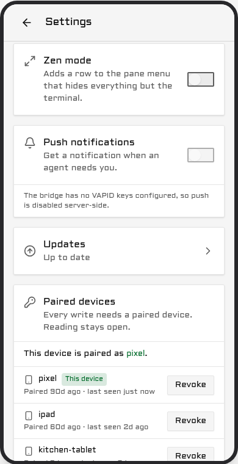
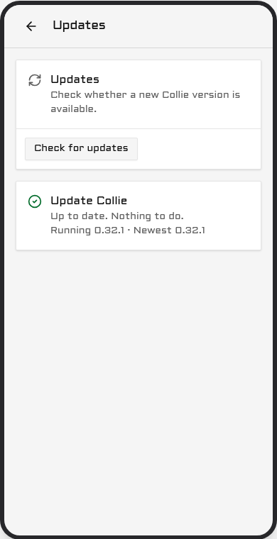
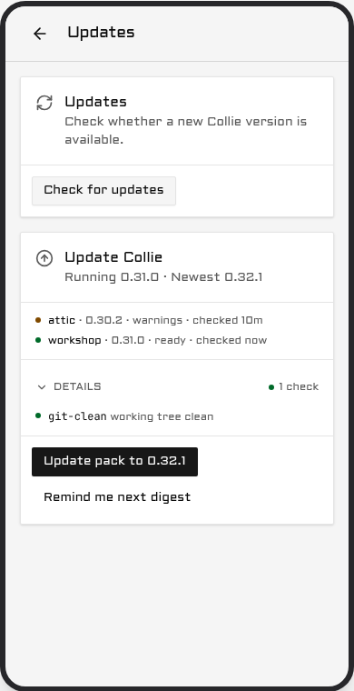
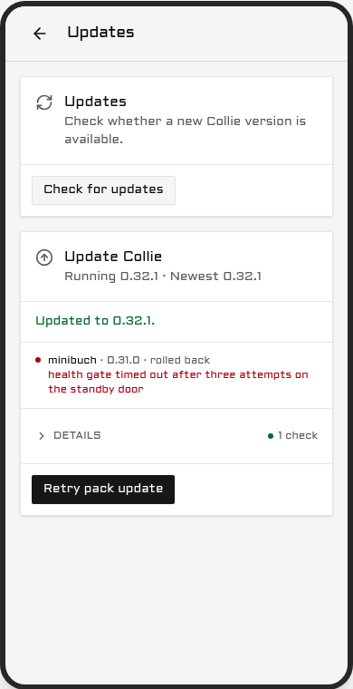

# Manage & update

| You installed with | You are | Verbs are spelled |
| --- | --- | --- |
| `herdr plugin install` or `herdr plugin link` | **Herdr-managed** (`herdr plugin list` shows `herdr.collie`) | `herdr plugin action invoke <verb> --plugin herdr.collie` |
| Install script or source build | **Standalone** | `bin/collie <verb>` from the install dir |

Herdr installs have no `collie` on PATH; use Herdr action IDs
([Herdr actions](commands.md#herdr-actions)). Standalone installs place the binary in
`~/.local/share/collie/current/bin/collie` or `<checkout>/bin/collie`:

```bash
# the install script's layout
cd ~/.local/share/collie/current && bin/collie version
# a source build or a linked clone
cd ~/my/collie-checkout && bin/collie version
```

Run `bin/collie link` to symlink the binary into `~/.local/bin`
([Put `collie` on your PATH](commands.md#put-collie-on-your-path)).

Configuration and state sit outside the checkout and persist across updates
(`bridge/solo-baseline.test.ts`). `.env` and the `tailscale serve` record are in the config dir,
`~/.config/collie` on a binary install or Herdr's plugin config dir on a Herdr install; paired
devices and `stt.json` are in the state dir, `~/.local/state/collie` unless `COLLIE_STATE_DIR`
moves it.

## Update, from the phone or the terminal

Two update paths exist, and both run the same steps on each host: stage the new release beside the
active one, flip the symlink, restart, and check that the service answers. On a pack lead, both
paths cover the whole pack. The phone is the short path. The terminal is the fallback for a machine
the phone cannot level.

### From the phone

Open **Settings** and select **Updates**. The card displays the running version, the newest release,
and the intermediate versions included in the update. If the host is on the newest release, the card
says so and offers nothing.





Under that sits the preflight, one line per check: `doctor`, `disk`, `bun`, `tree`, `upstream` and
`service`. On a lead, every pack member is checked too.

- **Green** is clear.
- **Amber** is worth knowing and never blocks: version skew across a pack, an unusual install kind,
  a major that is out but is not being taken. Untracked scratch files in a checkout stay green.
- **Red** blocks the update. The line names the reason, such as a red `collie doctor`, less than
  1 GB free for the staged build, no `bun` on the host, or an upstream that cannot be reached. Where
  one command clears it, the card prints that command as `Fix: <command>`.

Tapping **Update to `<version>`** asks once, and the confirm text is literal: your terminal session
stays alive, and the phone view drops for up to 30 seconds. The restart takes the bridge down, not
your multiplexer, so the agents keep running and the phone comes back on the new version. A major
never rides a routine update: crossing one asks its own confirm, names the version as a new major,
and tells you to read the release notes first.

While it runs, the card shows the state it is in:

| State | What it means |
| --- | --- |
| `preflight` | Checking this machine. Nothing has moved. |
| `staging` | Building or downloading the new version beside the old one. |
| `restarting` | The bridge is down on purpose. This is not an outage. |
| `verifying` | Waiting for the new version to answer. |
| `done` | The new version answered. |
| `rolled-back` | The new version did not answer, so the updater put the old one back. |
| `stuck` | Neither version answered. Nothing will restart again on its own. |
| `interrupted` | The run stopped before it finished. Nothing is half installed. |

The first four are progress; the card says so and asks you to keep the screen open. `rolled-back`
names the version you are still on, shows the tail of the service log, and offers **Retry**.
`stuck` prints the one command to run in a terminal. `interrupted` offers **Retry** as well.

**Remind me next digest** dismisses the card's nudge. It is not a mute: the next push waits for both
a newer release and a fresh window.

**How often you are told.** Update pushes are a digest, at most one a day, and never before 09:00
host local time. A delta that is only patch releases waits for a weekly window instead, so a patch
train arrives as one push rather than four; a minor or a major keeps the daily cadence and carries
the waiting patches with it. Held releases are folded, never dropped. The card always shows the
current state regardless of the window. The `updates` notification preference, under Settings →
notifications ([Web Push](voice-and-push.md#web-push-optional)), is the single off switch.

On a pack lead, the button shows **Update pack to `<version>`**, and one confirmation applies to
every machine. The lead updates first, under its own health gate. Each peer then levels itself to
the same release, one at a time, using its own preflight, its own health gate and its own rollback.
There is no per-peer button and no second confirmation prompt. For details, the two recovery paths,
and the one case the phone cannot fix, see
[Updating the rest of the pack](#updating-the-rest-of-the-pack).



A band across the top of every screen carries the run: the release on offer, then
`Starting update…`, `Updating to <version>`, `Updated to <version>. Tap to reload.`, and finally
`Updating <n> peers: <names>` as the peers follow. A peer that rolled back is named there too, with
**See Updates.** as the way back to the page. The band appears in this sequence:


### From the terminal

```bash
collie update --check            # read-only preflight, --json for a script
collie update --check --local    # the same, this instance only, no pack members
collie update                    # stage, flip, restart, verify
collie update --status           # what the updater did, or is doing, --json for a script
collie update --rollback         # put the previous version back
collie update --major            # cross one major, see below
```

On a Herdr-managed install the same verbs are Herdr actions:

```bash
herdr plugin action invoke update --plugin herdr.collie      # Herdr-managed
bin/collie update                                            # Standalone
```

`collie update --check` changes nothing. It runs `collie doctor`, reads the free space, the `bun`
version, the working tree, the upstream release list and the service unit, and on a lead it asks
every pack member the same question over your own SSH. It exits 0 unless something is red, and
`--json` prints a versioned report. Add `--local` to check this instance only and skip the pack
members. The phone runs that local check on its own host and reads each peer's line over the pack
link, so its preflight needs no SSH.

`collie update` fetches the newest release of your current major and stages it. The command then
hands the swap to a separate updater and exits, because the restart kills the bridge that asked for
the update. That updater points `current` at the new version, restarts through the new binary, and
polls `GET /api/health` for up to 30 seconds for an answer carrying the version it just installed.
If the answer does not come, or comes from the old version, it flips `current` back and restarts
once more, and records `rolled-back` with a tail of the service log. If that does not come up
either, it records `stuck` with the command to run by hand, and nothing restarts again. It rolls
back once, never twice.

Set `COLLIE_UPDATE_HEALTH_TIMEOUT_MS` if 30 seconds is not enough on your machine. A slow cold start
that runs past the budget is read as a failed update and rolled back.

`collie update --status` prints the record the updater keeps, and the phone reads the same record.
A deputy's standby door serves it at `/standby/update` while the main port is down.

If a new beacon hook event is available, `update` prints a notice to re-run `hooks install claude`.

#### Where the versions live

A binary install and a linked clone share one layout under the install root
(`~/.local/share/collie` or `$COLLIE_DIR` for a binary install, the clone itself for a checkout):

```
current -> versions/v1.3.0
versions/v1.3.0/
versions/v1.2.0/
```

On a checkout each `versions/vX.Y.Z` is a git worktree of the release tag, sharing the one `.git`,
so a version costs a tree and not a second object store. The build runs inside the new directory and
writes a completeness marker last; the flip refuses without that marker, so a killed build leaves
the live version untouched. Going live is one rename of the `current` symlink. Retention keeps
`current` plus the two newest previous versions, and only a successful run prunes, so a run that may
need its rollback target never removes it.

A **Herdr-managed** checkout is the exception and keeps advancing in place
([ADR 0006](../.adr/0006-update-advances-the-checkout-herdr-installed.md), amended 2026-09-03). It
is detached and shallow, and it lives in a directory Herdr owns, so there is no `versions/` layout
beside it, nothing to hand off, and nothing to flip back to. `--rollback` is refused there; the
recovery path is a reinstall of a named tag
(`herdr plugin install AltanS/collie --ref vX.Y.Z --yes`).

#### Verify

```bash
bin/collie update --status
herdr plugin action invoke version --plugin herdr.collie
bin/collie version
```

Expect the newest tag.

**The phone's own bundle** is a separate thing. The PWA checks for a new build by itself and reloads
within about a minute, and it holds that reload for the length of an update run. If you are mid-task
it shows a "tap to update" banner and waits for your tap.

### If the version did not move

`collie update` asks GitHub directly on every run, `git ls-remote` for a checkout, the GitHub tags
API for a binary install. It does not cache the release list. A release published seconds ago may
still take a minute to show up, because GitHub itself needs a moment to catch up. Run
`collie doctor` next. If that does not explain it, see
[When collie will not run](#when-collie-will-not-run).

### Cross a major

`update` never crosses a major version automatically.

```bash
herdr plugin action invoke update-major --plugin herdr.collie     # Herdr-managed
bin/collie update --major                                         # Standalone
```

This advances one major version to its newest strict release. It does not target prereleases
([ADR 0020](../.adr/0020-a-major-upgrade-is-consented-by-flag.md)). See also:
[Upgrading from 0.x to 1.0](#upgrading-from-0x-to-10).

### If that fails with *"You are not currently on a branch"*

Installs from GitHub prior to 0.23.1 lack a branch tracking ref
([#63](https://github.com/AltanS/collie/issues/63)). Reinstall to restore update functionality:

```bash
# replaces the checkout, rebuilds the UI
herdr plugin install AltanS/collie --yes
# reinstall doesn't restart the service
herdr plugin action invoke restart --plugin herdr.collie
# expect 0.23.1 or newer
herdr plugin action invoke version --plugin herdr.collie
```

Your config in Herdr's plugin config dir, `~/.config/herdr/plugins/config/herdr.collie` by
convention, is preserved.

### Updating the rest of the pack

Update a pack from the phone, with one tap and one confirmation. Open **Settings → Updates** on the
lead and select **Update pack to `<version>`**. The preflight above the button covers every member,
not just the lead. If a check is red anywhere, the button is disabled and names the failing machine
and the reason.

The lead updates first, under its own health gate. Only once it has settled does the first peer
start. Each peer then levels **itself**: it reads the release its lead is running, fetches that
exact tag from GitHub, and runs its own preflight, its own health gate and its own rollback. Peers
move one at a time. The Updates page keeps a line per member: `waiting`, `checking`, `staging`,
`restarting`, `verifying`, `updated`, `rolled back` or `unreachable`.

Two requirements decide whether a peer can follow at all:

- **A peer needs outbound HTTPS to `github.com`.** That is where its code comes from. Without that
  access, the peer is reported as behind and is levelled from the terminal instead, below.
- **A `-dev+` build never follows.** A machine on a development build stays on it, whatever its lead
  is running.

A peer that rolls back says so on the Updates page and does not retry on its own. Two paths give it
another attempt:



- **From the phone.** Once the lead is current and a peer is behind, the button reads
  **Retry pack update**. It starts a new run whose only legs are the peers, and that new run is what
  grants each of them one more attempt.
- **From the terminal, on the lead.** Use this for a peer the phone cannot level at all. The command
  is unchanged:

```bash
collie pack update <member>…      # on the lead
collie pack update --all
```

It runs as one sequence over your own SSH. It preflights every machine first, and prints each peer's
own report beside the answer it gets over SSH, so a disagreement is explicit rather than averaged.
It asks for one consent. It then updates the lead itself, if the lead is not yet running the build
it is handing out. Next it takes each peer in turn: the peer is pushed the lead's commit as a git
bundle, rebuilt, restarted, and polled until it answers the new build within the same 30 second
budget.

The first failure stops the run. Every member after it is left untouched and reported as
"not attempted", and the summary names the one command that clears the failure. A lead that cannot
take its own update touches no peer at all. Stopping there is safe, because a pack tolerates version
skew ([PACK_PROTOCOL.md §7.1](../PACK_PROTOCOL.md#71-version-skew-inside-a-protocol-version)), so a
half-updated pack is a supported state and pressing on is not.

**One case the phone cannot fix.** If you roll the lead back by hand after its peers have levelled,
the peers are left ahead of their lead. Nothing steps a peer down: a lead that could move a peer
backwards is a lead that could move it anywhere. The skew is harmless, and the remedy is
`collie pack update <member>` on the lead.

Code reaches a peer over your SSH and never over the pack link
([ADR 0016](../.adr/0016-updates-ride-the-operators-ssh.md), addendum 2026-09-04). When a peer
levels itself, its code comes from GitHub over anonymous HTTPS and the peer decides for itself. The
lead states only the version it is running and which peer may proceed.

### If the updater itself dies

Nothing above helps when the updater is gone. This is the path that assumes only a terminal.

The updater writes one record, `<state dir>/update.json` (by default
`~/.local/state/collie/update.json`, or under `$COLLIE_STATE_DIR`). Read it first: it names the
state, the version the run came from, the version it was going to, the updater's pid, and on a
failure a tail of the service log and the recovery command.

Beside it sits `<state dir>/update.lock`, holding a pid and a timestamp. One run at a time. A record
that still reads `preflight`, `staging`, `restarting` or `verifying`, has not moved for 10 minutes,
and whose pid is no longer in the process table, is over: it reads as `interrupted`, and a new run
may take the lock.

To put the previous version back by hand, point `current` at it and restart:

```bash
cd ~/.local/share/collie        # or $COLLIE_DIR, or the checkout root
ls versions/
ln -sfn versions/<previous> current
collie restart
```

Or let the previous version do the same thing for you, which is the command a `stuck` record
carries:

```bash
~/.local/share/collie/versions/<previous>/bin/collie update --rollback
```

Use the full path, not `collie`: the name on your PATH resolves through `current`, and `current` is
the thing that may be wrong.

### What the health gate does not catch

The gate proves one thing: the service came back and answered `/api/health` with the version that
was installed. That is a bounded promise, not "never brick". Four things can be broken while the
gate reports success:

- **A stale web bundle on the phone.** The host is on the new version and the phone is still running
  old JavaScript out of its service worker. The PWA replaces its own bundle on its own schedule; the
  health gate has no view of it.
- **Config or schema migrations.** Collie ships none at this cadence, and the updater runs none. The
  gate checks that the service answers, not that its data is shaped right.
- **A mux driver that breaks only on interaction.** The bridge starts and answers health while the
  adapter fails on the first real attach or send. Health is a liveness probe, not a conformance run.
- **The updater running the old version's code.** The detached updater is launched from the version
  being replaced. It is kept small and stable and its record is versioned, so an old updater and a
  new bridge still understand each other, but that is a mitigation and not a guarantee.

### Resolving the newest release from a script

Query git tags and sort by semver. Avoid `GET /repos/AltanS/collie/releases/latest`, which excludes
prereleases.

```bash
# newest stable release
git ls-remote --tags --refs https://github.com/AltanS/collie | \
  sed 's#.*refs/tags/##' | grep -E '^v[0-9]+\.[0-9]+\.[0-9]+$' | sort -V | tail -1
```

### Prereleases

Stable installs do not receive prereleases. Opting into a prerelease tracks that major's prereleases
until the final release arrives
([ADR 0020](../.adr/0020-a-major-upgrade-is-consented-by-flag.md)):

```bash
# Standalone — the install script's opt-in flag takes the newest prerelease
curl -fsSL https://colliepwa.dev/install.sh | sh -s -- --beta

# Herdr-managed — install the tag; that is the whole opt-in
herdr plugin install AltanS/collie --ref <tag> --yes
# a reinstall does not restart the service
herdr plugin action invoke restart --plugin herdr.collie
```

Resolve `<tag>` using [Resolving the newest release from a script](#resolving-the-newest-release-from-a-script).

To return to stable releases:

```bash
herdr plugin install AltanS/collie --yes
herdr plugin action invoke restart --plugin herdr.collie
```

## Upgrading from 0.x to 1.0

If `BUN_INSTALL` is defined only in `.env`, export it in your shell profile or service environment
instead. Then run:

```bash
# Herdr-managed
herdr plugin action invoke update-major --plugin herdr.collie

# Linked clone
bin/collie update --major
```

Verify with `bin/collie version` or `herdr plugin action invoke version --plugin herdr.collie`.

**For pack setups:** Update the lead first, then run `collie pack update <member>…`
([Updating the rest of the pack](#updating-the-rest-of-the-pack)). Note:
- `join` requires `--insecure` for plain `http://` leads.
- Pre-1.0 invite tokens must be regenerated with `pack invite`.
- Older member records require `reconnect`.
- Unupgraded peers display as `warn:` in `pack status`
  ([PACK_PROTOCOL §7.1](../PACK_PROTOCOL.md#71-version-skew-inside-a-protocol-version)).

### What 1.0 changes for you

Herdr action IDs and `scripts/collie-ctl.sh` routes are unchanged
([ADR 0006](../.adr/0006-update-advances-the-checkout-herdr-installed.md)).

CLI verbs are compiled into `<checkout>/bin/collie` ([Commands](commands.md)). Use
`bin/collie link` to add `collie` to PATH
([Put `collie` on your PATH](commands.md#put-collie-on-your-path),
[ADR 0021](../.adr/0021-the-path-name-is-a-pointer-never-a-copy.md)).

New features:
- **`pair` / `devices`**: Per-device write credentials
  ([Pair a device](security.md#pair-a-device--the-write-credential)).
- **`pack …` / `join` / `promote`**: Multi-host clustering ([Pack commands](pack.md)).
- **`doctor`**: Configuration diagnostics.
- **`stt setup`**: Voice composer configuration
  ([Voice input](voice-and-push.md#voice-input-optional)).
- **`hooks install claude` / `beacon emit`**: Agent activity beacons
  ([Agent beacons](multiplexers.md#agent-beacons-optional-linux)).
- **`COLLIE_MUX`**: Select `herdr` (default), `tmux`, or `zellij`
  ([tmux and zellij](multiplexers.md)).

### Side by side, if the herd is real

Secondary instance configuration is documented in
[Multiple Collie instances on one host](deployment.md#multiple-collie-instances-on-one-host).

### Rolling back

Check out the last 0.x tag and rebuild:

```bash
last0x=$(git ls-remote --tags --refs origin | sed 's#.*refs/tags/##' | \
  grep -E '^v0\.[0-9]+\.[0-9]+$' | sort -V | tail -1)
git fetch --depth 1 origin tag "$last0x"
git checkout --detach --force "$last0x"
rm -f bin/collie    # 1.0's binary otherwise survives the rollback
```

Rebuild with `bash scripts/collie-ctl.sh build` and invoke Herdr's `restart` action. State files
(`pack-trust.json`, `pack-runtime.json`, `paired-devices.json`, `pairing-pending.json`) can remain.
Rollback removes device pairing enforcement; configure `COLLIE_DEVICE_HEADER` if write protection
is required.

### Verify it worked

Check that `version` reports `1.0.0` or higher. An upgraded install pairs no devices automatically:
run `pair` to issue a phone its write credential, and `devices revoke` if that phone is lost
([Pair a device](security.md#pair-a-device--the-write-credential)).

## Stop or uninstall

Pause the service:

```bash
herdr plugin action invoke stop --plugin herdr.collie     # Herdr-managed
bin/collie stop                                           # standalone
```

Remove the service definition and port mappings (`.env` and checkouts are preserved):

```bash
herdr plugin action invoke uninstall --plugin herdr.collie   # Herdr-managed
bin/collie uninstall                                         # standalone
```

To delete remaining files: run `herdr plugin uninstall herdr.collie` (Herdr-managed), or run
`bin/collie unlink` and delete `~/.local/share/collie` / `$COLLIE_DIR` (standalone).

## When collie will not run

For binary installs (`~/.local/share/collie` or `$COLLIE_DIR`), execute an older binary directly:

```bash
ls ~/.local/share/collie/versions/
~/.local/share/collie/versions/<previous>/bin/collie update --rollback
```

To install a specific version directly:

```bash
COLLIE_TAG=v1.0.0 curl -fsSL https://colliepwa.dev/install.sh | sh
```

For checkouts or Herdr installs, run `git checkout <tag>` or
`herdr plugin install AltanS/collie --ref vX.Y.Z --yes`.

## You run a fork

`collie update` checks `origin` against `COLLIE_UPDATE_REPO` (default `AltanS/collie`) and aborts if
they differ. Set `COLLIE_UPDATE_REPO=you/collie` if your fork releases its own tags.

To merge upstream updates into your fork manually:

```bash
git remote add upstream https://github.com/AltanS/collie.git
git fetch upstream --tags
git merge v1.0.0                                            # the tag you decided to take
# resolve the conflicts, commit the merge, then rebuild and restart:
bash scripts/collie-ctl.sh build
# Herdr-managed: invoke the `restart` action instead
bin/collie restart
```

Do not use `update --major` on a fork; merge the `v1.*` tag manually. Run `collie doctor` to check
the active `COLLIE_UPDATE_REPO`.

## Surviving reboots

On Linux, enable lingering for unattended user services:

```bash
loginctl enable-linger $USER
```

Verify status with `systemctl --user status collie`.

On macOS, `start` manages `~/Library/LaunchAgents/herdr.collie.plist` automatically. It runs at user
login. Check status with `launchctl print gui/$(id -u)/herdr.collie`.

---

[← back to the README](../README.md)